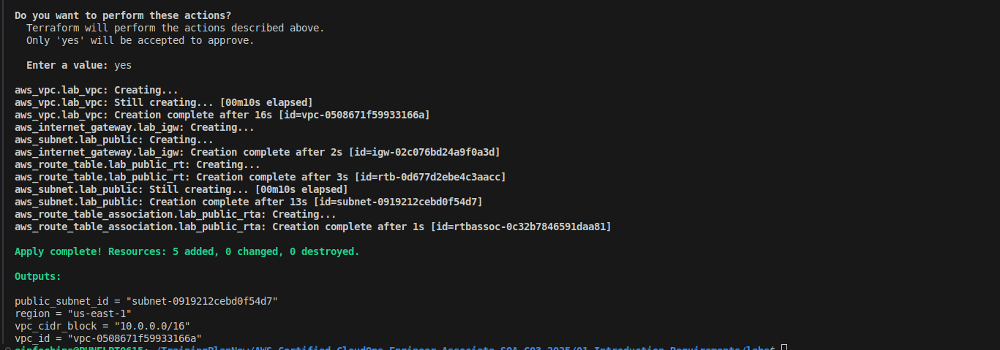
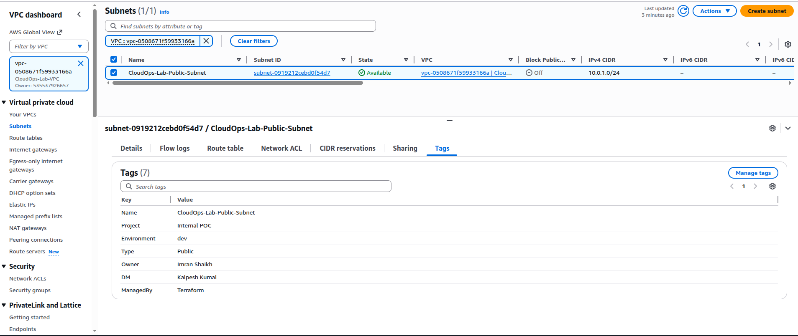

# 01. Introduction & Requirements - AWS Certified CloudOps Engineer Associate

## AWS Certified CloudOps Engineer Associate Overview

**Exam Details:**
- **Exam Code:** SOA-C03
- **Duration:** 130 minutes
- **Format:** Multiple choice and multiple response
- **Passing Score:** 720/1000
- **Cost:** $150 USD

## Prerequisites Setup

### Install AWS CLI
```bash
# Linux/macOS
curl "https://awscli.amazonaws.com/awscli-exe-linux-x86_64.zip" -o "awscliv2.zip"
unzip awscliv2.zip
sudo ./aws/install

# Verify installation
aws --version
```

### Install Terraform
```bash
# Download and install Terraform
wget https://releases.hashicorp.com/terraform/1.6.0/terraform_1.6.0_linux_amd64.zip
unzip terraform_1.6.0_linux_amd64.zip
sudo mv terraform /usr/local/bin/

# Verify installation
terraform --version
```

### Configure AWS CLI
```bash
# Configure AWS credentials
aws configure

# Test configuration
aws sts get-caller-identity
```

## Terraform Setup

### Provider Configuration
```hcl
# provider.tf
terraform {
  required_providers {
    aws = {
      source  = "hashicorp/aws"
      version = "~> 5.0"
    }
  }
}

provider "aws" {
  region = var.aws_region
}

variable "aws_region" {
  description = "AWS region"
  type        = string
  default     = "us-east-1"
}
```

### Variables Configuration
```hcl
# variables.tf
variable "environment" {
  description = "Environment name"
  type        = string
  default     = "dev"
}

variable "project_name" {
  description = "Project name"
  type        = string
  default     = "cloudops"
}
```

## Exam Domains

1. **Monitoring, Logging, and Remediation** (20%)
2. **Reliability and Business Continuity** (16%)
3. **Deployment, Provisioning, and Automation** (18%)
4. **Security and Compliance** (16%)
5. **Networking and Content Delivery** (18%)
6. **Cost and Performance Optimization** (12%)

## Lab Environment Setup

### Create Lab VPC
```bash
# Create VPC
aws ec2 create-vpc \
  --cidr-block 10.0.0.0/16 \
  --tag-specifications 'ResourceType=vpc,Tags=[{Key=Name,Value=CloudOps-Lab-VPC}]'
```

### Terraform Lab Setup
```hcl
# lab-setup.tf
resource "aws_vpc" "lab_vpc" {
  cidr_block           = "10.0.0.0/16"
  enable_dns_hostnames = true
  enable_dns_support   = true
  
  tags = {
    Name        = "CloudOps-Lab-VPC"
    Environment = var.environment
  }
}

resource "aws_subnet" "lab_public" {
  vpc_id                  = aws_vpc.lab_vpc.id
  cidr_block              = "10.0.1.0/24"
  availability_zone       = "${var.aws_region}a"
  map_public_ip_on_launch = true
  
  tags = {
    Name = "CloudOps-Lab-Public-Subnet"
  }
}
```
### Screenshot:



## Study Resources

- [AWS CloudOps Documentation](https://docs.aws.amazon.com/systems-manager/)
- [AWS Well-Architected Framework](https://aws.amazon.com/architecture/well-architected/)
- [AWS CLI Reference](https://docs.aws.amazon.com/cli/latest/reference/)
- [Terraform AWS Provider](https://registry.terraform.io/providers/hashicorp/aws/latest/docs)