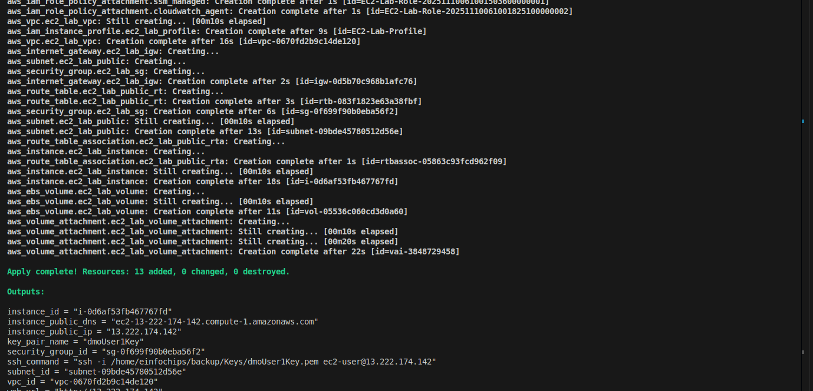
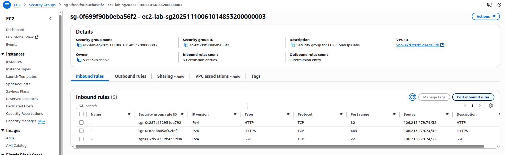
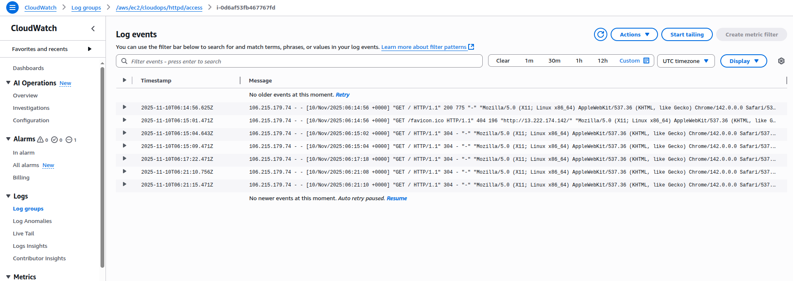
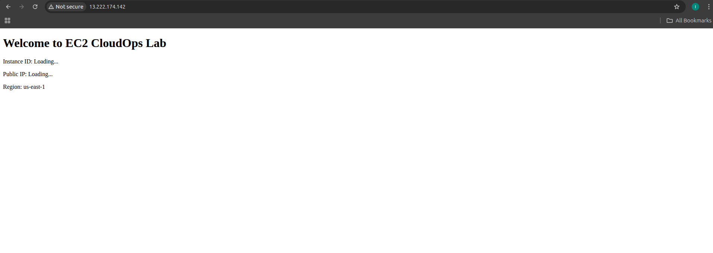

# 02. EC2 for CloudOps

## Lab 1: EC2 Instance Management

### Launch EC2 Instance
```bash
# Launch EC2 instance
aws ec2 run-instances \
  --image-id ami-0c02fb55956c7d316 \
  --instance-type t3.micro \
  --key-name my-key-pair \
  --security-group-ids sg-xxxxxxxxx \
  --subnet-id subnet-xxxxxxxxx \
  --tag-specifications 'ResourceType=instance,Tags=[{Key=Name,Value=CloudOps-Instance}]'

# Get instance details
aws ec2 describe-instances \
  --instance-ids i-xxxxxxxxx \
  --query 'Reservations[*].Instances[*].[InstanceId,State.Name,PublicIpAddress]'
```

### Instance Lifecycle Management
```bash
# Start instance
aws ec2 start-instances --instance-ids i-xxxxxxxxx

# Stop instance
aws ec2 stop-instances --instance-ids i-xxxxxxxxx

# Reboot instance
aws ec2 reboot-instances --instance-ids i-xxxxxxxxx

# Terminate instance
aws ec2 terminate-instances --instance-ids i-xxxxxxxxx
```

### Modify Instance Attributes
```bash
# Change instance type (requires stop)
aws ec2 modify-instance-attribute \
  --instance-id i-xxxxxxxxx \
  --instance-type Value=t3.small

# Enable detailed monitoring
aws ec2 monitor-instances --instance-ids i-xxxxxxxxx

# Disable detailed monitoring
aws ec2 unmonitor-instances --instance-ids i-xxxxxxxxx
```

## Terraform Configuration

### Basic EC2 Instance
```hcl
# ec2.tf
resource "aws_instance" "cloudops_instance" {
  ami           = "ami-0c02fb55956c7d316"
  instance_type = "t3.micro"
  key_name      = aws_key_pair.cloudops_key.key_name
  
  vpc_security_group_ids = [aws_security_group.cloudops_sg.id]
  subnet_id              = aws_subnet.public.id
  
  user_data = base64encode(<<-EOF
    #!/bin/bash
    yum update -y
    yum install -y amazon-cloudwatch-agent
    systemctl enable amazon-cloudwatch-agent
    systemctl start amazon-cloudwatch-agent
    EOF
  )
  
  tags = {
    Name        = "CloudOps-Instance"
    Environment = "Lab"
  }
}

resource "aws_key_pair" "cloudops_key" {
  key_name   = "cloudops-key"
  public_key = file("~/.ssh/id_rsa.pub")
}

resource "aws_security_group" "cloudops_sg" {
  name_prefix = "cloudops-sg"
  vpc_id      = aws_vpc.lab_vpc.id
  
  ingress {
    from_port   = 22
    to_port     = 22
    protocol    = "tcp"
    cidr_blocks = ["0.0.0.0/0"]
  }
  
  ingress {
    from_port   = 80
    to_port     = 80
    protocol    = "tcp"
    cidr_blocks = ["0.0.0.0/0"]
  }
  
  egress {
    from_port   = 0
    to_port     = 0
    protocol    = "-1"
    cidr_blocks = ["0.0.0.0/0"]
  }
}
```

## Lab 2: Instance Metadata and User Data

### Access Instance Metadata
```bash
# From within EC2 instance
curl http://169.254.169.254/latest/meta-data/
curl http://169.254.169.254/latest/meta-data/instance-id
curl http://169.254.169.254/latest/meta-data/public-ipv4
curl http://169.254.169.254/latest/user-data
```

### User Data Script
```bash
#!/bin/bash
yum update -y
yum install -y httpd
systemctl start httpd
systemctl enable httpd
echo "<h1>CloudOps Web Server</h1>" > /var/www/html/index.html
```

## Lab 3: EC2 Instance Connect

### Setup EC2 Instance Connect
```bash
# Install EC2 Instance Connect
aws ec2-instance-connect send-ssh-public-key \
  --instance-id i-xxxxxxxxx \
  --availability-zone us-east-1a \
  --instance-os-user ec2-user \
  --ssh-public-key file://~/.ssh/id_rsa.pub

# Connect using EC2 Instance Connect
aws ec2-instance-connect ssh \
  --instance-id i-xxxxxxxxx \
  --os-user ec2-user
```

## Monitoring and Troubleshooting

### CloudWatch Metrics
```bash
# Get CPU utilization
aws cloudwatch get-metric-statistics \
  --namespace AWS/EC2 \
  --metric-name CPUUtilization \
  --dimensions Name=InstanceId,Value=i-xxxxxxxxx \
  --start-time 2024-01-01T00:00:00Z \
  --end-time 2024-01-01T23:59:59Z \
  --period 3600 \
  --statistics Average
```

### Instance Status Checks
```bash
# Check instance status
aws ec2 describe-instance-status \
  --instance-ids i-xxxxxxxxx

# Get system log
aws ec2 get-console-output \
  --instance-id i-xxxxxxxxx
```

## Best Practices

1. **Use IAM roles** instead of access keys
2. **Enable detailed monitoring** for production instances
3. **Use security groups** as virtual firewalls
4. **Tag resources** for better management
5. **Use latest AMIs** for security patches
6. **Implement backup strategies**

## Cleanup

```bash
# Terminate instances
aws ec2 terminate-instances --instance-ids i-xxxxxxxxx

# Delete key pair
aws ec2 delete-key-pair --key-name cloudops-key

# Delete security group
aws ec2 delete-security-group --group-id sg-xxxxxxxxx
```
### Screenshot:
Terraform Outut:

SG of Instance: 

Instance and Add. Volume attached to Instance

CloudWatch Log group:

Httpd Intsall of Instance output:
