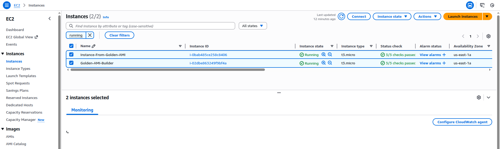
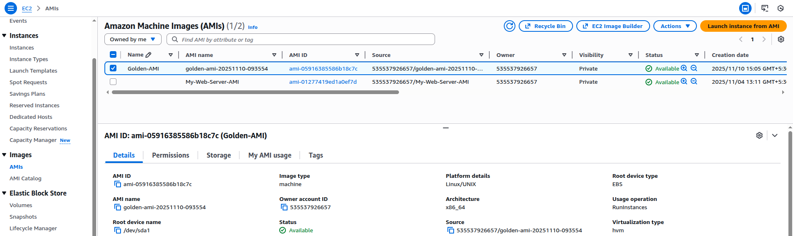
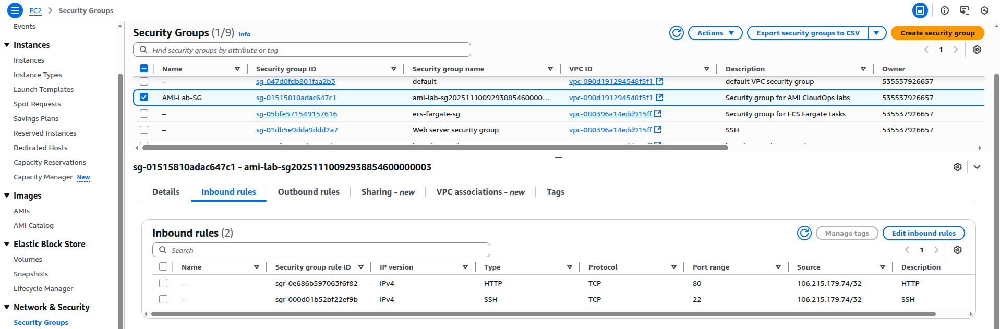
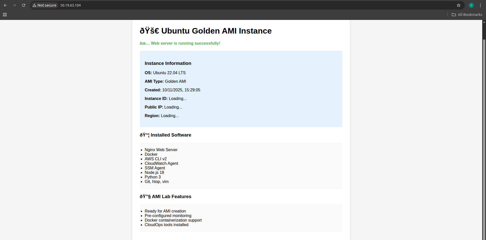
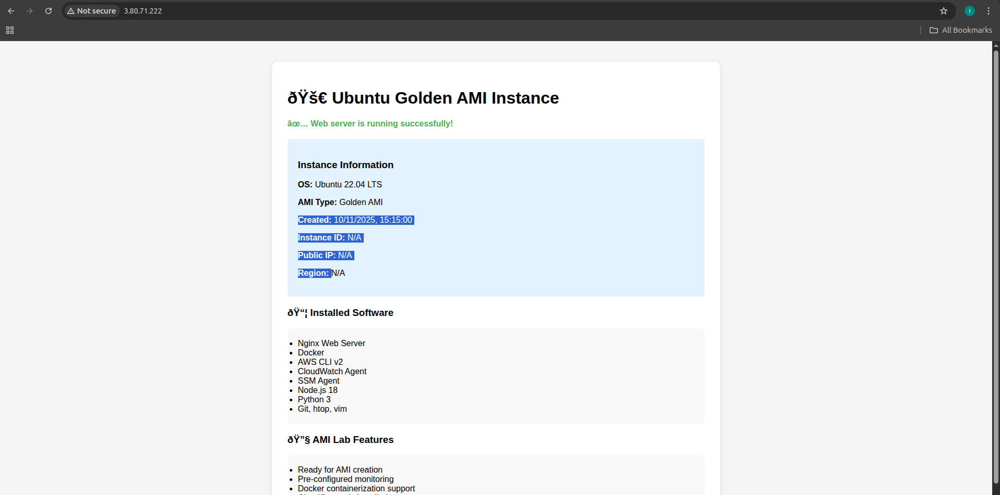
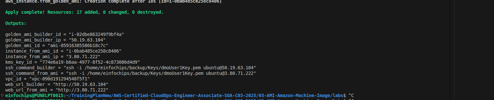

# 03. AMI - Amazon Machine Image

## Lab 1: Custom AMI Creation

### Create AMI from Instance
```bash
# Create AMI from running instance
aws ec2 create-image \
  --instance-id i-xxxxxxxxx \
  --name "CloudOps-Custom-AMI-$(date +%Y%m%d)" \
  --description "Custom AMI for CloudOps with pre-configured software"

# Check AMI creation status
aws ec2 describe-images \
  --owners self \
  --query 'Images[*].[ImageId,Name,State]'
```

### Copy AMI to Another Region
```bash
# Copy AMI to different region
aws ec2 copy-image \
  --source-region us-east-1 \
  --source-image-id ami-xxxxxxxxx \
  --name "CloudOps-Custom-AMI-Copy" \
  --description "Copied AMI for DR" \
  --region us-west-2

# Check copy status
aws ec2 describe-images \
  --image-ids ami-yyyyyyyyy \
  --region us-west-2
```

### Share AMI with Another Account
```bash
# Share AMI with specific account
aws ec2 modify-image-attribute \
  --image-id ami-xxxxxxxxx \
  --launch-permission "Add=[{UserId=123456789012}]"

# Make AMI public (use with caution)
aws ec2 modify-image-attribute \
  --image-id ami-xxxxxxxxx \
  --launch-permission "Add=[{Group=all}]"

# Remove sharing permissions
aws ec2 modify-image-attribute \
  --image-id ami-xxxxxxxxx \
  --launch-permission "Remove=[{UserId=123456789012}]"
```

## Terraform Configuration

### Create AMI from Instance
```hcl
# ami.tf
resource "aws_ami_from_instance" "cloudops_ami" {
  name               = "cloudops-custom-ami-${formatdate("YYYYMMDD", timestamp())}"
  source_instance_id = aws_instance.cloudops_instance.id
  description        = "Custom AMI for CloudOps"
  
  tags = {
    Name        = "CloudOps Custom AMI"
    Environment = "Production"
    CreatedBy   = "Terraform"
  }
}

resource "aws_ami_copy" "cloudops_ami_copy" {
  name              = "cloudops-ami-copy"
  source_ami_id     = aws_ami_from_instance.cloudops_ami.id
  source_ami_region = "us-east-1"
  description       = "Copied AMI for disaster recovery"
  
  tags = {
    Name = "CloudOps AMI Copy"
  }
}
```

### Launch Instance from Custom AMI
```hcl
resource "aws_instance" "from_custom_ami" {
  ami           = aws_ami_from_instance.cloudops_ami.id
  instance_type = "t3.micro"
  key_name      = aws_key_pair.cloudops_key.key_name
  
  vpc_security_group_ids = [aws_security_group.cloudops_sg.id]
  subnet_id              = aws_subnet.public.id
  
  tags = {
    Name = "Instance-From-Custom-AMI"
  }
}
```

## Lab 2: AMI Lifecycle Management

### Deregister AMI
```bash
# Deregister AMI
aws ec2 deregister-image --image-id ami-xxxxxxxxx

# Delete associated snapshots
aws ec2 describe-images \
  --image-ids ami-xxxxxxxxx \
  --query 'Images[*].BlockDeviceMappings[*].Ebs.SnapshotId' \
  --output text | xargs -I {} aws ec2 delete-snapshot --snapshot-id {}
```

### AMI Backup Strategy
```bash
# Create automated AMI backup script
#!/bin/bash
INSTANCE_ID="i-xxxxxxxxx"
AMI_NAME="backup-$(date +%Y%m%d-%H%M%S)"

# Create AMI
AMI_ID=$(aws ec2 create-image \
  --instance-id $INSTANCE_ID \
  --name $AMI_NAME \
  --no-reboot \
  --query 'ImageId' \
  --output text)

echo "Created AMI: $AMI_ID"

# Tag the AMI
aws ec2 create-tags \
  --resources $AMI_ID \
  --tags Key=Type,Value=Backup Key=CreatedDate,Value=$(date +%Y-%m-%d)
```

## Lab 3: Golden AMI Creation

### Prepare Golden AMI
```bash
# Install common software
#!/bin/bash
yum update -y
yum install -y \
  htop \
  git \
  docker \
  amazon-cloudwatch-agent \
  amazon-ssm-agent

# Configure CloudWatch agent
cat > /opt/aws/amazon-cloudwatch-agent/etc/amazon-cloudwatch-agent.json << EOF
{
  "metrics": {
    "namespace": "CWAgent",
    "metrics_collected": {
      "cpu": {
        "measurement": ["cpu_usage_idle", "cpu_usage_iowait"],
        "metrics_collection_interval": 60
      },
      "disk": {
        "measurement": ["used_percent"],
        "metrics_collection_interval": 60,
        "resources": ["*"]
      },
      "mem": {
        "measurement": ["mem_used_percent"],
        "metrics_collection_interval": 60
      }
    }
  }
}
EOF

# Start services
systemctl enable docker
systemctl enable amazon-cloudwatch-agent
systemctl enable amazon-ssm-agent

# Clean up before AMI creation
yum clean all
rm -rf /var/log/*
rm -rf /tmp/*
history -c
```

### Terraform Golden AMI
```hcl
# golden-ami.tf
resource "aws_instance" "golden_ami_builder" {
  ami           = "ami-0c02fb55956c7d316"
  instance_type = "t3.micro"
  key_name      = aws_key_pair.cloudops_key.key_name
  
  vpc_security_group_ids = [aws_security_group.cloudops_sg.id]
  subnet_id              = aws_subnet.public.id
  
  user_data = base64encode(file("golden-ami-setup.sh"))
  
  tags = {
    Name = "Golden-AMI-Builder"
  }
}

resource "aws_ami_from_instance" "golden_ami" {
  name               = "golden-ami-${formatdate("YYYYMMDD", timestamp())}"
  source_instance_id = aws_instance.golden_ami_builder.id
  description        = "Golden AMI with pre-configured software"
  
  depends_on = [aws_instance.golden_ami_builder]
  
  tags = {
    Name = "Golden AMI"
    Type = "Base"
  }
}
```

## Lab 4: AMI Encryption

### Create Encrypted AMI
```bash
# Copy AMI with encryption
aws ec2 copy-image \
  --source-region us-east-1 \
  --source-image-id ami-xxxxxxxxx \
  --name "Encrypted-CloudOps-AMI" \
  --encrypted \
  --kms-key-id arn:aws:kms:us-east-1:123456789012:key/12345678-1234-1234-1234-123456789012
```

### Terraform Encrypted AMI
```hcl
resource "aws_ami_copy" "encrypted_ami" {
  name              = "encrypted-cloudops-ami"
  source_ami_id     = aws_ami_from_instance.cloudops_ami.id
  source_ami_region = "us-east-1"
  encrypted         = true
  kms_key_id        = aws_kms_key.ami_key.arn
  
  tags = {
    Name = "Encrypted CloudOps AMI"
  }
}

resource "aws_kms_key" "ami_key" {
  description = "KMS key for AMI encryption"
  
  tags = {
    Name = "AMI Encryption Key"
  }
}
```

## Best Practices

1. **Use no-reboot option** for production instances
2. **Tag AMIs** with creation date and purpose
3. **Implement AMI lifecycle** management
4. **Encrypt sensitive AMIs**
5. **Test AMIs** before production use
6. **Document AMI contents** and configurations
7. **Regular cleanup** of unused AMIs

## Monitoring AMI Usage

```bash
# Find instances using specific AMI
aws ec2 describe-instances \
  --filters "Name=image-id,Values=ami-xxxxxxxxx" \
  --query 'Reservations[*].Instances[*].[InstanceId,State.Name]'

# List all custom AMIs
aws ec2 describe-images \
  --owners self \
  --query 'Images[*].[ImageId,Name,CreationDate]' \
  --output table
```

## Cleanup

```bash
# Deregister AMI
aws ec2 deregister-image --image-id ami-xxxxxxxxx

# Delete associated snapshots
aws ec2 delete-snapshot --snapshot-id snap-xxxxxxxxx

```
### Screenshot:
Instances:

AMI:

SG:

AMI Builder Result:

Instance from AMI Result:

Terraform Result:
