# 04. Managing EC2 at Scale - Systems Manager (SSM)

## Lab 1: SSM Agent Setup and Configuration

### Install SSM Agent
```bash
# Install SSM agent (Amazon Linux 2 has it pre-installed)
sudo yum install -y amazon-ssm-agent
sudo systemctl enable amazon-ssm-agent
sudo systemctl start amazon-ssm-agent

# Check SSM agent status
sudo systemctl status amazon-ssm-agent

# Update SSM agent via command
aws ssm send-command \
  --document-name "AWS-UpdateSSMAgent" \
  --targets "Key=tag:Environment,Values=Lab"
```

### Create IAM Role for SSM
```bash
# Create trust policy
cat > ssm-trust-policy.json << EOF
{
  "Version": "2012-10-17",
  "Statement": [
    {
      "Effect": "Allow",
      "Principal": {
        "Service": "ec2.amazonaws.com"
      },
      "Action": "sts:AssumeRole"
    }
  ]
}
EOF

# Create IAM role
aws iam create-role \
  --role-name SSMRole \
  --assume-role-policy-document file://ssm-trust-policy.json

# Attach managed policy
aws iam attach-role-policy \
  --role-name SSMRole \
  --policy-arn arn:aws:iam::aws:policy/AmazonSSMManagedInstanceCore

# Create instance profile
aws iam create-instance-profile --instance-profile-name SSMInstanceProfile
aws iam add-role-to-instance-profile \
  --instance-profile-name SSMInstanceProfile \
  --role-name SSMRole
```

## Terraform SSM Configuration

```hcl
# ssm.tf
resource "aws_iam_role" "ssm_role" {
  name = "SSMRole"
  
  assume_role_policy = jsonencode({
    Version = "2012-10-17"
    Statement = [
      {
        Action = "sts:AssumeRole"
        Effect = "Allow"
        Principal = {
          Service = "ec2.amazonaws.com"
        }
      }
    ]
  })
}

resource "aws_iam_role_policy_attachment" "ssm_policy" {
  role       = aws_iam_role.ssm_role.name
  policy_arn = "arn:aws:iam::aws:policy/AmazonSSMManagedInstanceCore"
}

resource "aws_iam_instance_profile" "ssm_profile" {
  name = "SSMInstanceProfile"
  role = aws_iam_role.ssm_role.name
}

resource "aws_instance" "ssm_managed" {
  ami                    = "ami-0c02fb55956c7d316"
  instance_type          = "t3.micro"
  iam_instance_profile   = aws_iam_instance_profile.ssm_profile.name
  vpc_security_group_ids = [aws_security_group.ssm_sg.id]
  subnet_id              = aws_subnet.private.id
  
  tags = {
    Name        = "SSM-Managed-Instance"
    Environment = "Lab"
  }
}
```

## Lab 2: Run Command

### Execute Commands on Multiple Instances
```bash
# Run shell script on instances
aws ssm send-command \
  --document-name "AWS-RunShellScript" \
  --parameters 'commands=["yum update -y","systemctl status amazon-ssm-agent"]' \
  --targets "Key=tag:Environment,Values=Lab"

# Run PowerShell on Windows instances
aws ssm send-command \
  --document-name "AWS-RunPowerShellScript" \
  --parameters 'commands=["Get-Service","Get-Process"]' \
  --targets "Key=tag:OS,Values=Windows"

# Check command execution status
aws ssm list-command-invocations \
  --command-id "command-id-here" \
  --details
```

### Custom SSM Document
```bash
# Create custom document
cat > custom-document.json << EOF
{
  "schemaVersion": "2.2",
  "description": "Custom CloudOps maintenance script",
  "parameters": {
    "action": {
      "type": "String",
      "description": "Action to perform",
      "allowedValues": ["update", "restart", "status"]
    }
  },
  "mainSteps": [
    {
      "action": "aws:runShellScript",
      "name": "performAction",
      "inputs": {
        "runCommand": [
          "#!/bin/bash",
          "case {{action}} in",
          "  update) yum update -y ;;",
          "  restart) systemctl restart httpd ;;",
          "  status) systemctl status httpd ;;",
          "esac"
        ]
      }
    }
  ]
}
EOF

# Create the document
aws ssm create-document \
  --content file://custom-document.json \
  --name "CloudOps-Maintenance" \
  --document-type "Command"
```

## Lab 3: Session Manager

### Start Session Manager Session
```bash
# Start session with instance
aws ssm start-session --target i-xxxxxxxxx

# Start session with port forwarding
aws ssm start-session \
  --target i-xxxxxxxxx \
  --document-name AWS-StartPortForwardingSession \
  --parameters '{"portNumber":["80"],"localPortNumber":["8080"]}'
```

### Configure Session Manager Preferences
```bash
# Create session preferences
cat > session-preferences.json << EOF
{
  "sessionType": "Standard_Stream",
  "properties": {
    "maxSessionDuration": "60",
    "allowedUsers": ["arn:aws:iam::123456789012:user/admin"],
    "idleSessionTimeout": "20",
    "cloudWatchLogGroupName": "/aws/ssm/sessions",
    "cloudWatchEncryptionEnabled": true,
    "s3BucketName": "session-logs-bucket",
    "s3EncryptionEnabled": true
  }
}
EOF

# Update session preferences
aws ssm update-document \
  --name "SSM-SessionManagerRunShell" \
  --content file://session-preferences.json \
  --document-version "\$LATEST"
```

## Lab 4: Patch Manager

### Create Patch Baseline
```bash
# Create custom patch baseline
aws ssm create-patch-baseline \
  --name "CloudOps-Patch-Baseline" \
  --operating-system "AMAZON_LINUX_2" \
  --approval-rules '{
    "PatchRules": [
      {
        "PatchFilterGroup": {
          "PatchFilters": [
            {
              "Key": "CLASSIFICATION",
              "Values": ["Security", "Bugfix", "Critical"]
            }
          ]
        },
        "ApproveAfterDays": 7,
        "EnableNonSecurity": false
      }
    ]
  }'

# Register patch baseline with instances
aws ssm register-patch-baseline-for-patch-group \
  --baseline-id pb-xxxxxxxxx \
  --patch-group "Production"
```

### Terraform Patch Management
```hcl
# patch-management.tf
resource "aws_ssm_patch_baseline" "cloudops_baseline" {
  name             = "CloudOps-Patch-Baseline"
  description      = "Patch baseline for CloudOps instances"
  operating_system = "AMAZON_LINUX_2"
  
  approval_rule {
    approve_after_days = 7
    enable_non_security = false
    
    patch_filter {
      key    = "CLASSIFICATION"
      values = ["Security", "Bugfix", "Critical"]
    }
  }
  
  tags = {
    Name = "CloudOps Patch Baseline"
  }
}

resource "aws_ssm_patch_group" "cloudops_group" {
  baseline_id = aws_ssm_patch_baseline.cloudops_baseline.id
  patch_group = "Production"
}
```

## Lab 5: Maintenance Windows

### Create Maintenance Window
```bash
# Create maintenance window
aws ssm create-maintenance-window \
  --name "CloudOps-Maintenance" \
  --description "Weekly maintenance window" \
  --schedule "cron(0 2 ? * SUN *)" \
  --duration 4 \
  --cutoff 1 \
  --allow-unassociated-targets

# Register targets
aws ssm register-target-with-maintenance-window \
  --window-id mw-xxxxxxxxx \
  --target-type "Instance" \
  --targets "Key=tag:Environment,Values=Production"

# Register task
aws ssm register-task-with-maintenance-window \
  --window-id mw-xxxxxxxxx \
  --targets "Key=WindowTargetIds,Values=target-id" \
  --task-arn "AWS-RunPatchBaseline" \
  --task-type "RUN_COMMAND" \
  --priority 1
```

### Terraform Maintenance Window
```hcl
# maintenance-window.tf
resource "aws_ssm_maintenance_window" "cloudops_window" {
  name     = "CloudOps-Maintenance"
  schedule = "cron(0 2 ? * SUN *)"
  duration = 4
  cutoff   = 1
  
  tags = {
    Name = "CloudOps Maintenance Window"
  }
}

resource "aws_ssm_maintenance_window_target" "cloudops_target" {
  window_id     = aws_ssm_maintenance_window.cloudops_window.id
  name          = "CloudOps-Targets"
  description   = "Production instances"
  resource_type = "INSTANCE"
  
  targets {
    key    = "tag:Environment"
    values = ["Production"]
  }
}

resource "aws_ssm_maintenance_window_task" "patch_task" {
  window_id        = aws_ssm_maintenance_window.cloudops_window.id
  name             = "Patch-Task"
  description      = "Apply patches to instances"
  task_type        = "RUN_COMMAND"
  task_arn         = "AWS-RunPatchBaseline"
  priority         = 1
  service_role_arn = aws_iam_role.maintenance_role.arn
  max_concurrency  = "2"
  max_errors       = "1"
  
  targets {
    key    = "WindowTargetIds"
    values = [aws_ssm_maintenance_window_target.cloudops_target.id]
  }
}
```

## Lab 6: Parameter Store

### Store and Retrieve Parameters
```bash
# Store string parameter
aws ssm put-parameter \
  --name "/cloudops/database/host" \
  --value "db.example.com" \
  --type "String" \
  --description "Database host"

# Store secure string
aws ssm put-parameter \
  --name "/cloudops/database/password" \
  --value "MySecurePassword123!" \
  --type "SecureString" \
  --description "Database password"

# Retrieve parameter
aws ssm get-parameter \
  --name "/cloudops/database/host"

# Retrieve secure parameter with decryption
aws ssm get-parameter \
  --name "/cloudops/database/password" \
  --with-decryption

# Get parameters by path
aws ssm get-parameters-by-path \
  --path "/cloudops/database" \
  --recursive
```

### Terraform Parameter Store
```hcl
# parameter-store.tf
resource "aws_ssm_parameter" "db_host" {
  name        = "/cloudops/database/host"
  type        = "String"
  value       = "db.example.com"
  description = "Database host"
  
  tags = {
    Environment = "Production"
  }
}

resource "aws_ssm_parameter" "db_password" {
  name        = "/cloudops/database/password"
  type        = "SecureString"
  value       = var.db_password
  description = "Database password"
  
  tags = {
    Environment = "Production"
  }
}
```

## Lab 7: Inventory and Compliance

### Configure Inventory Collection
```bash
# Create inventory association
aws ssm create-association \
  --name "AWS-GatherSoftwareInventory" \
  --targets "Key=tag:Environment,Values=Production" \
  --schedule-expression "rate(1 day)"

# Query inventory data
aws ssm get-inventory \
  --filters "Key=AWS:InstanceInformation.InstanceStatus,Values=Active,Type=Equal"
```

### Compliance Monitoring
```bash
# Create compliance association
aws ssm create-association \
  --name "AWS-RunPatchBaseline" \
  --targets "Key=tag:Environment,Values=Production" \
  --compliance-severity "CRITICAL"

# Check compliance status
aws ssm list-compliance-items \
  --resource-ids "i-xxxxxxxxx" \
  --resource-types "ManagedInstance"
```

## Best Practices

1. **Use IAM roles** instead of access keys
2. **Implement least privilege** access
3. **Use Parameter Store** for configuration
4. **Schedule maintenance windows** appropriately
5. **Monitor compliance** regularly
6. **Use Session Manager** instead of SSH
7. **Implement proper logging** and auditing

## Monitoring SSM

```bash
# Check managed instances
aws ssm describe-instance-information

# View command history
aws ssm list-commands

# Check association status
aws ssm list-associations
```

## Cleanup

```bash
# Delete maintenance window
aws ssm delete-maintenance-window --window-id mw-xxxxxxxxx

# Delete parameters
aws ssm delete-parameter --name "/cloudops/database/host"

# Delete associations
aws ssm delete-association --association-id association-id
```
### Screenshot:
Instances:
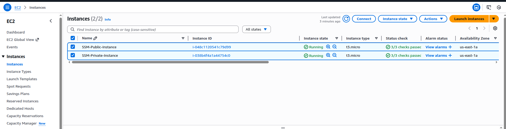
SG Public:
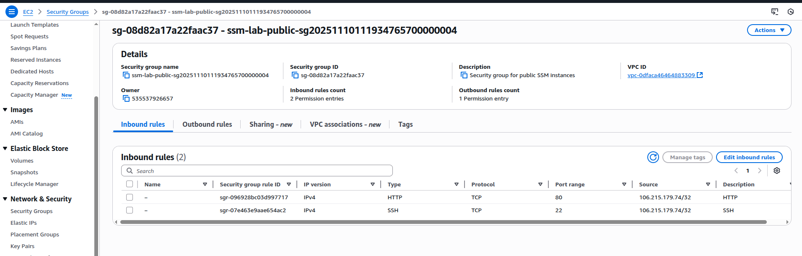
SG Private:
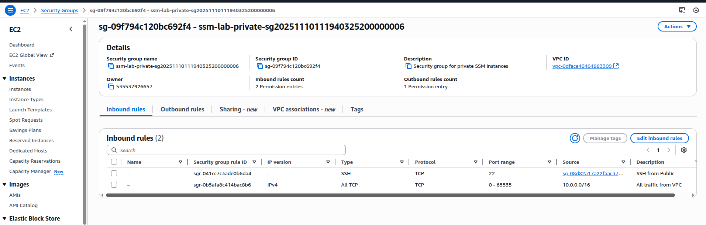
SSM Fleet Manager:
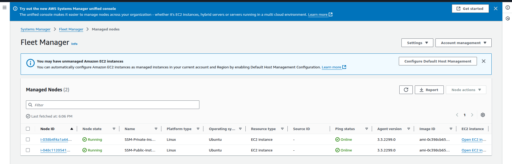
Private Instance details Fleet Manager:

SSM Session:
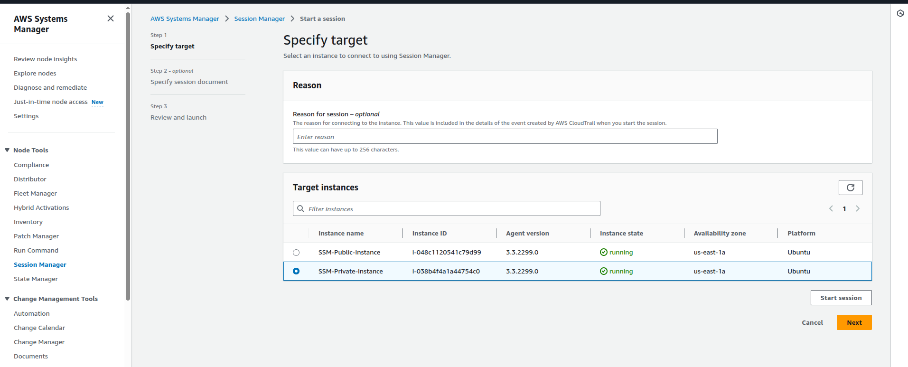
SSM Session of Private Instance:
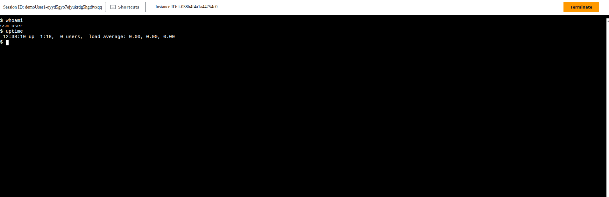
CloudWatch Log Groups: /aws/ssm/cloudops/setup

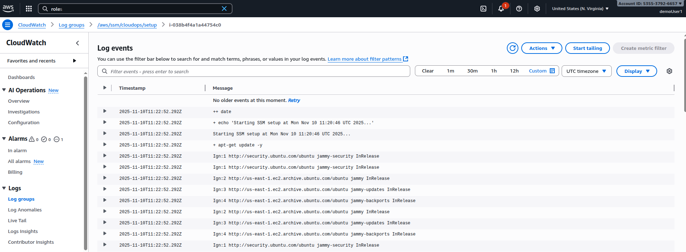
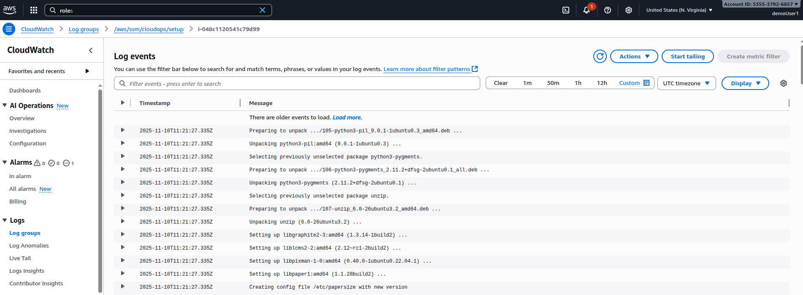
Cloudwatch log Groups: /aws/ssm/cloudops/syslog
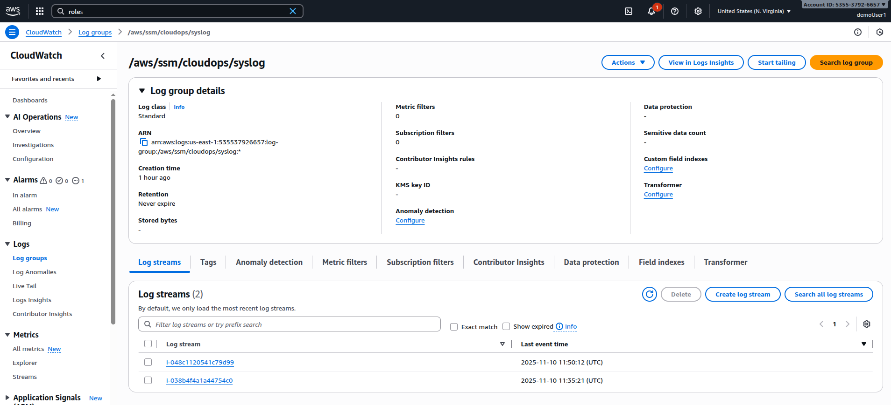
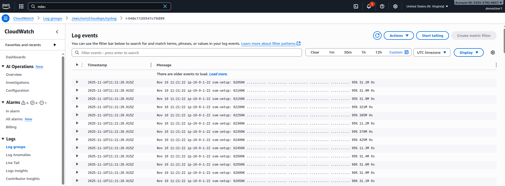
Terraform Output:
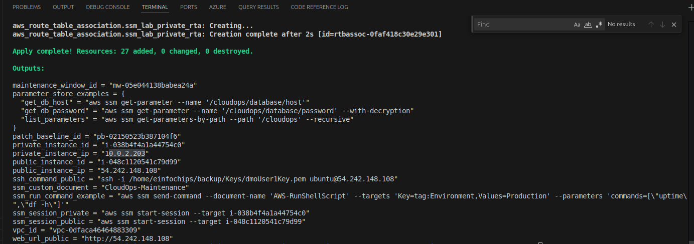