# 🖥️ CloudOps Section 5: EC2 High Availability & Scalability - Manual Console Steps

## **Lab 1: Create Launch Template (Console)**

### **Step 1: Create Launch Template**
1. **Go to EC2 Console** → **Launch Templates**
2. **Click "Create launch template"**
3. **Configure Template:**
   - **Name**: `cloudops-template`
   - **Description**: `CloudOps web server template`
   - **AMI**: Ubuntu Server 22.04 LTS (latest)
   - **Instance type**: t3.micro
   - **Key pair**: demouserNvirginia
   - **Security groups**: Select existing web server security group
   - **Advanced details** → **User data**:
   ```bash
   #!/bin/bash
   apt update -y
   apt install -y apache2
   systemctl start apache2
   systemctl enable apache2
   echo "<h1>CloudOps Web Server - $(hostname)</h1>" > /var/www/html/index.html
   echo "<p>Instance ID: $(curl -s http://169.254.169.254/latest/meta-data/instance-id)</p>" >> /var/www/html/index.html
   chown -R www-data:www-data /var/www/html
   ```
4. **Click "Create launch template"**

---

## **Lab 2: Create Auto Scaling Group (Console)**

### **Step 1: Create Auto Scaling Group**
1. **Go to EC2 Console** → **Auto Scaling Groups**
2. **Click "Create Auto Scaling group"**
3. **Choose launch template:**
   - **Name**: `cloudops-asg`
   - **Launch template**: Select `cloudops-template`
   - **Version**: Latest
   - **Click "Next"**

### **Step 2: Configure Network**
1. **VPC**: Select default VPC
2. **Availability Zones and subnets**: Select 2-3 public subnets in different AZs
3. **Click "Next"**

### **Step 3: Configure Advanced Options**
1. **Load balancing**: Enable Application Load Balancer
2. **Target groups**: Create new target group
   - **Name**: `cloudops-tg`
   - **Protocol**: HTTP
   - **Port**: 80
3. **Health checks**: 
   - **Type**: ELB
   - **Grace period**: 300 seconds
4. **Click "Next"**

### **Step 4: Configure Group Size**
1. **Desired capacity**: 2
2. **Minimum capacity**: 1
3. **Maximum capacity**: 6
4. **Scaling policies**: Target tracking scaling policy
   - **Metric type**: Average CPU Utilization
   - **Target value**: 70%
5. **Click "Next"**

### **Step 5: Add Tags**
1. **Add tag**: 
   - **Key**: Name
   - **Value**: CloudOps-ASG-Instance
2. **Click "Next"** → **Create Auto Scaling group**

---

## **Lab 3: Create Application Load Balancer (Console)**

### **Step 1: Create Load Balancer**
1. **Go to EC2 Console** → **Load Balancers**
2. **Click "Create Load Balancer"**
3. **Select "Application Load Balancer"**

### **Step 2: Configure Load Balancer**
1. **Basic configuration:**
   - **Name**: `cloudops-alb`
   - **Scheme**: Internet-facing
   - **IP address type**: IPv4
2. **Network mapping:**
   - **VPC**: Default VPC
   - **Mappings**: Select 2-3 availability zones
3. **Security groups**: Create or select web security group (HTTP/HTTPS)

### **Step 3: Configure Listeners and Routing**
1. **Listeners:**
   - **Protocol**: HTTP
   - **Port**: 80
2. **Default action**: Forward to target group
3. **Target group**: Select `cloudops-tg` (created with ASG)

### **Step 4: Review and Create**
1. **Review configuration**
2. **Click "Create load balancer"**

### Screenshot:
Launch Template:
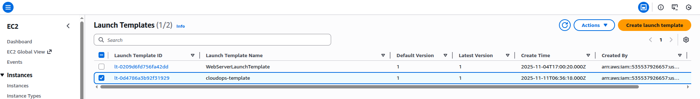
Instances:
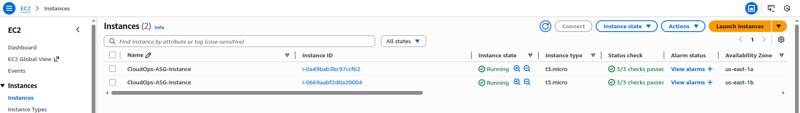
Launched Apache webserver:
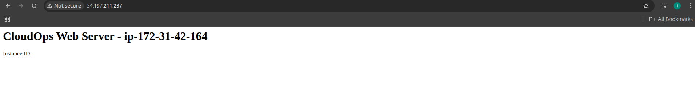
ASG:
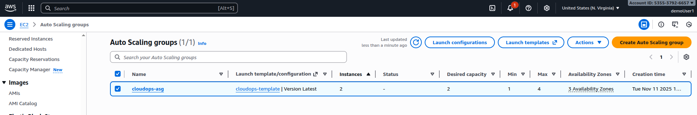
Target Group:
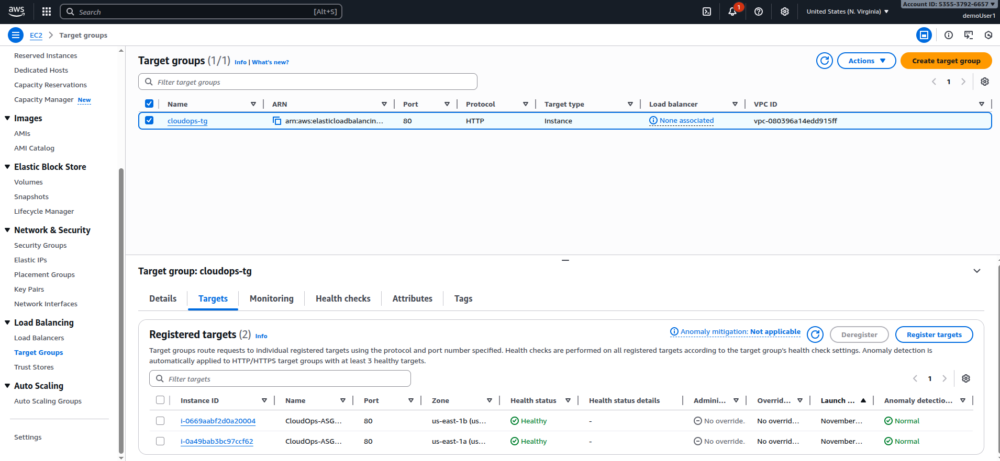
ALB:
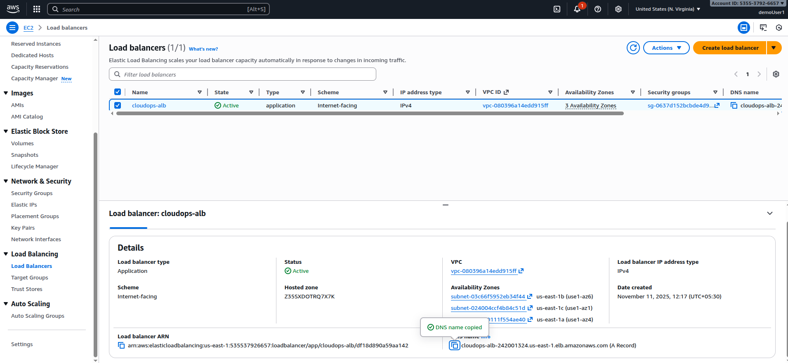
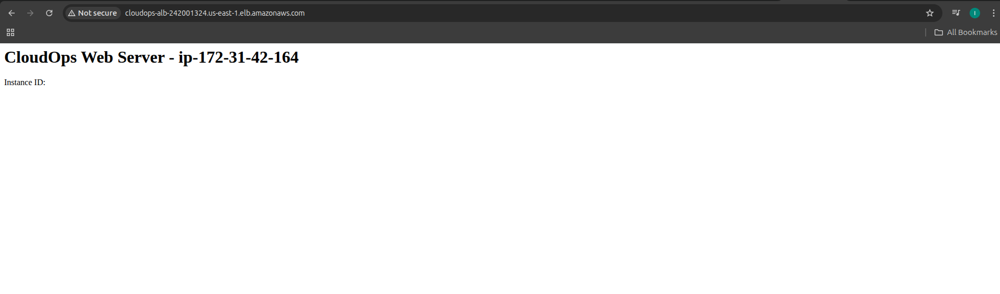

---

## **Lab 4: Configure Scaling Policies (Console)**

### **Step 1: Add Scaling Policies**
1. **Go to Auto Scaling Groups** → Select `cloudops-asg`
2. **Automatic scaling tab** → **Create dynamic scaling policy**

### **Step 2: Target Tracking Policy**
1. **Policy type**: Target tracking scaling
2. **Scaling policy name**: `cpu-target-tracking`
3. **Metric type**: Average CPU Utilization
4. **Target value**: 70
5. **Instance warmup**: 300 seconds
6. **Click "Create"**

### **Step 3: Step Scaling Policy (Optional)**
1. **Create dynamic scaling policy**
2. **Policy type**: Step scaling
3. **Scaling policy name**: `cpu-step-scaling`
4. **CloudWatch alarm**: Create new alarm
   - **Metric**: EC2 → By Auto Scaling Group → CPUUtilization
   - **Threshold**: Greater than 80%
5. **Take the action**: Add 2 capacity units
6. **Click "Create"**

---

## **Lab 5: Test Auto Scaling (Console)**

### **Step 1: Generate Load**
1. **SSH to one of the instances**
2. **Install stress tool:**
   ```bash
   sudo apt update
   sudo apt install -y stress
   ```
3. **Generate CPU load:**
   ```bash
   stress --cpu 2 --timeout 600s
   ```
### Screenshot:
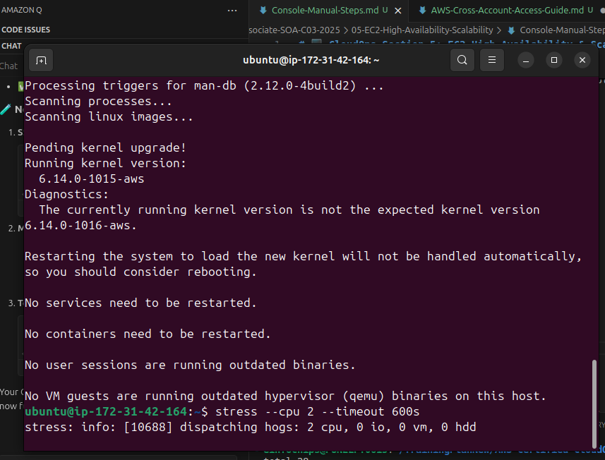
It was not scalling up due to min size was 1, so it can't scale up from 1 to 2.
so it can't scale up from 1 to 2.
after changing ASG:
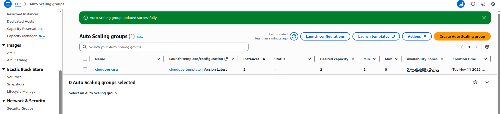
Cloud Watch ALarm:
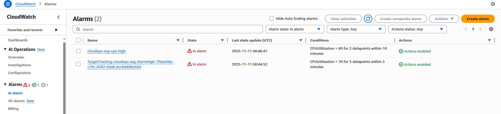
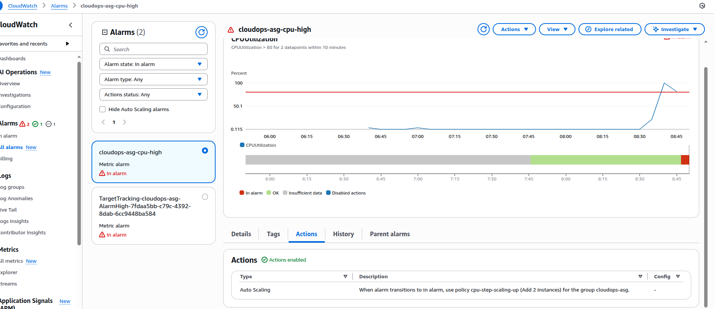
### **Step 2: Monitor Scaling**
1. **Go to Auto Scaling Groups** → `cloudops-asg`
2. **Activity tab**: Watch scaling activities
3. **Monitoring tab**: View CloudWatch metrics
4. **Instance management tab**: See new instances launching

### **Step 3: Test Load Balancer**
1. **Go to Load Balancers** → `cloudops-alb`
2. **Copy DNS name**
3. **Test in browser**: `http://your-alb-dns-name`
4. **Refresh multiple times** to see different servers

---

## **Lab 6: Configure Health Checks (Console)**

### **Step 1: Modify Target Group Health Check**
1. **Go to Target Groups** → Select `cloudops-tg`
2. **Health checks tab** → **Edit**
3. **Configure:**
   - **Health check path**: `/index.html`
   - **Healthy threshold**: 2
   - **Unhealthy threshold**: 3
   - **Timeout**: 5 seconds
   - **Interval**: 30 seconds
4. **Save changes**

### **Step 2: Test Health Check**
1. **Targets tab**: View target health status
2. **SSH to instance** and stop httpd:
   ```bash
   sudo systemctl stop apache2
   ```
3. **Watch target become unhealthy**
4. **Start httpd** and watch it become healthy again:
   ```bash
   sudo systemctl start apache2
   ```

---

## **Lab 7: Multi-AZ Deployment (Console)**

### **Step 1: Verify Multi-AZ Setup**
1. **Go to Auto Scaling Groups** → `cloudops-asg`
2. **Details tab**: Check availability zones
3. **Instance management tab**: Verify instances in different AZs

### **Step 2: Test AZ Failure Simulation**
1. **Terminate instance** in one AZ
2. **Watch ASG launch replacement** in same or different AZ
3. **Monitor load balancer** continues serving traffic

---

## **Lab 8: Scheduled Scaling (Console)**

### **Step 1: Create Scheduled Action**
1. **Go to Auto Scaling Groups** → `cloudops-asg`
2. **Automatic scaling tab** → **Scheduled actions**
3. **Create scheduled action:**
   - **Name**: `morning-scale-out`
   - **Recurrence**: Daily
   - **Start time**: 09:00 AM
   - **Desired capacity**: 4
4. **Create another for evening scale-in**

---

## **Lab 9: Network Load Balancer (Console)**

### **Step 1: Create Network Load Balancer**
1. **Go to EC2 Console** → **Load Balancers**
2. **Click "Create Load Balancer"**
3. **Select "Network Load Balancer"**

### **Step 2: Configure NLB**
1. **Basic configuration:**
   - **Name**: `cloudops-nlb`
   - **Scheme**: Internet-facing
   - **IP address type**: IPv4
2. **Network mapping:**
   - **VPC**: Default VPC
   - **Mappings**: Select 2-3 availability zones
   - **Enable static IP** for each AZ

### **Step 3: Configure Listeners**
1. **Protocol**: TCP
2. **Port**: 80
3. **Default action**: Forward to new target group
   - **Name**: `cloudops-nlb-tg`
   - **Protocol**: TCP
   - **Port**: 80

---

## **Lab 10: SSL/TLS Configuration (Console)**

### **Step 1: Request SSL Certificate**
1. **Go to Certificate Manager**
2. **Request certificate**
3. **Domain name**: `cloudops.example.com`
4. **Validation method**: DNS validation

### **Step 2: Add HTTPS Listener**
1. **Go to Load Balancers** → `cloudops-alb`
2. **Listeners tab** → **Add listener**
3. **Protocol**: HTTPS
4. **Port**: 443
5. **SSL certificate**: Select from ACM
6. **Default action**: Forward to `cloudops-tg`

---

## **🔍 Monitoring and Verification Steps**

### **Check ASG Status:**
1. **Auto Scaling Groups** → Activity history
2. **CloudWatch** → Metrics → EC2 → By Auto Scaling Group

### **Check Load Balancer Health:**
1. **Target Groups** → Targets tab
2. **Load Balancers** → Monitoring tab

### **Test Failover:**
1. **Terminate instances** manually
2. **Watch automatic replacement**
3. **Verify continuous service availability**

### **Monitor CloudWatch Metrics:**
1. **CloudWatch Console** → **Metrics**
2. **EC2** → **By Auto Scaling Group**
3. **ApplicationELB** → **Per Target Group**

---

## **🧹 Cleanup Steps (Console)**

### **Step 1: Delete Auto Scaling Group**
1. **Auto Scaling Groups** → Select `cloudops-asg`
2. **Actions** → **Delete**
3. **Type "delete"** to confirm

### **Step 2: Delete Load Balancer**
1. **Load Balancers** → Select `cloudops-alb`
2. **Actions** → **Delete**

### **Step 3: Delete Target Group**
1. **Target Groups** → Select `cloudops-tg`
2. **Actions** → **Delete**

### **Step 4: Delete Launch Template**
1. **Launch Templates** → Select `cloudops-template`
2. **Actions** → **Delete template**

### **Step 5: Delete CloudWatch Alarms**
1. **CloudWatch** → **Alarms**
2. **Select scaling alarms** → **Delete**

---

## **📊 Key Concepts Covered**

### **High Availability:**
- Multi-AZ deployment
- Health checks and automatic replacement
- Load balancer distribution
- Fault tolerance

### **Scalability:**
- Horizontal scaling with ASG
- Dynamic scaling policies
- Scheduled scaling
- Target tracking scaling

### **Load Balancing:**
- Application Load Balancer (Layer 7)
- Network Load Balancer (Layer 4)
- Health checks and routing
- SSL/TLS termination

### **Monitoring:**
- CloudWatch metrics
- Auto Scaling activities
- Target group health
- Performance monitoring

---

## **🎯 Best Practices**

1. **Use multiple AZs** for high availability
2. **Configure proper health checks**
3. **Set appropriate scaling policies**
4. **Monitor performance metrics**
5. **Use SSL/TLS** for secure communication
6. **Implement proper security groups**
7. **Regular testing** of failover scenarios
8. **Cost optimization** with scheduled scaling

This document provides complete manual console steps for implementing EC2 High Availability and Scalability in the CloudOps course!