# 06. CloudFormation for CloudOps

## Lab 1: Basic CloudFormation Stack

### Create Simple Stack
```bash
# Deploy CloudFormation stack
aws cloudformation create-stack \
  --stack-name cloudops-infrastructure \
  --template-body file://cloudops-template.yaml \
  --parameters ParameterKey=InstanceType,ParameterValue=t3.micro \
  --capabilities CAPABILITY_IAM

# Check stack status
aws cloudformation describe-stacks \
  --stack-name cloudops-infrastructure \
  --query 'Stacks[0].StackStatus'

# Get stack outputs
aws cloudformation describe-stacks \
  --stack-name cloudops-infrastructure \
  --query 'Stacks[0].Outputs'
```

### Basic CloudFormation Template
```yaml
# cloudops-template.yaml
AWSTemplateFormatVersion: '2010-09-09'
Description: 'CloudOps Infrastructure Stack'

Parameters:
  InstanceType:
    Type: String
    Default: t3.micro
    AllowedValues: [t3.micro, t3.small, t3.medium]
    Description: EC2 instance type
  
  KeyName:
    Type: AWS::EC2::KeyPair::KeyName
    Description: EC2 Key Pair for SSH access

Resources:
  CloudOpsVPC:
    Type: AWS::EC2::VPC
    Properties:
      CidrBlock: 10.0.0.0/16
      EnableDnsHostnames: true
      EnableDnsSupport: true
      Tags:
        - Key: Name
          Value: CloudOps-VPC

  PublicSubnet:
    Type: AWS::EC2::Subnet
    Properties:
      VpcId: !Ref CloudOpsVPC
      CidrBlock: 10.0.1.0/24
      AvailabilityZone: !Select [0, !GetAZs '']
      MapPublicIpOnLaunch: true
      Tags:
        - Key: Name
          Value: Public-Subnet

  InternetGateway:
    Type: AWS::EC2::InternetGateway
    Properties:
      Tags:
        - Key: Name
          Value: CloudOps-IGW

  AttachGateway:
    Type: AWS::EC2::VPCGatewayAttachment
    Properties:
      VpcId: !Ref CloudOpsVPC
      InternetGatewayId: !Ref InternetGateway

  PublicRouteTable:
    Type: AWS::EC2::RouteTable
    Properties:
      VpcId: !Ref CloudOpsVPC
      Tags:
        - Key: Name
          Value: Public-Route-Table

  PublicRoute:
    Type: AWS::EC2::Route
    DependsOn: AttachGateway
    Properties:
      RouteTableId: !Ref PublicRouteTable
      DestinationCidrBlock: 0.0.0.0/0
      GatewayId: !Ref InternetGateway

  SubnetRouteTableAssociation:
    Type: AWS::EC2::SubnetRouteTableAssociation
    Properties:
      SubnetId: !Ref PublicSubnet
      RouteTableId: !Ref PublicRouteTable

  SecurityGroup:
    Type: AWS::EC2::SecurityGroup
    Properties:
      GroupDescription: Security group for CloudOps instance
      VpcId: !Ref CloudOpsVPC
      SecurityGroupIngress:
        - IpProtocol: tcp
          FromPort: 22
          ToPort: 22
          CidrIp: 0.0.0.0/0
        - IpProtocol: tcp
          FromPort: 80
          ToPort: 80
          CidrIp: 0.0.0.0/0
      Tags:
        - Key: Name
          Value: CloudOps-SG

  CloudOpsInstance:
    Type: AWS::EC2::Instance
    Properties:
      ImageId: ami-0c02fb55956c7d316
      InstanceType: !Ref InstanceType
      KeyName: !Ref KeyName
      SubnetId: !Ref PublicSubnet
      SecurityGroupIds:
        - !Ref SecurityGroup
      UserData:
        Fn::Base64: !Sub |
          #!/bin/bash
          yum update -y
          yum install -y httpd
          systemctl start httpd
          systemctl enable httpd
          echo "<h1>CloudOps Web Server</h1>" > /var/www/html/index.html
      Tags:
        - Key: Name
          Value: CloudOps-Instance

Outputs:
  InstanceId:
    Description: Instance ID
    Value: !Ref CloudOpsInstance
    Export:
      Name: !Sub "${AWS::StackName}-InstanceId"
  
  PublicIP:
    Description: Public IP address
    Value: !GetAtt CloudOpsInstance.PublicIp
    Export:
      Name: !Sub "${AWS::StackName}-PublicIP"
  
  VPCId:
    Description: VPC ID
    Value: !Ref CloudOpsVPC
    Export:
      Name: !Sub "${AWS::StackName}-VPCId"
```
### Screenshot:
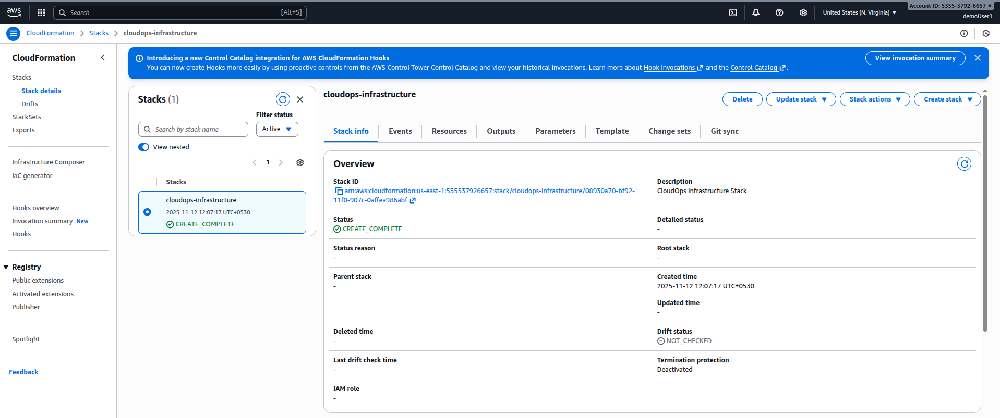
Resources Created:
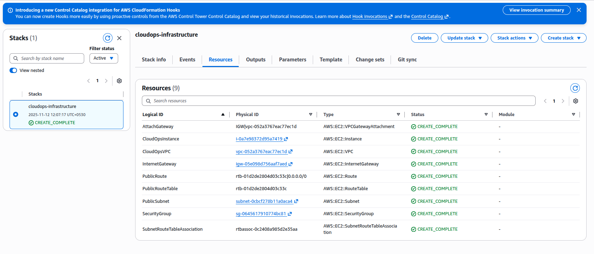
Output:
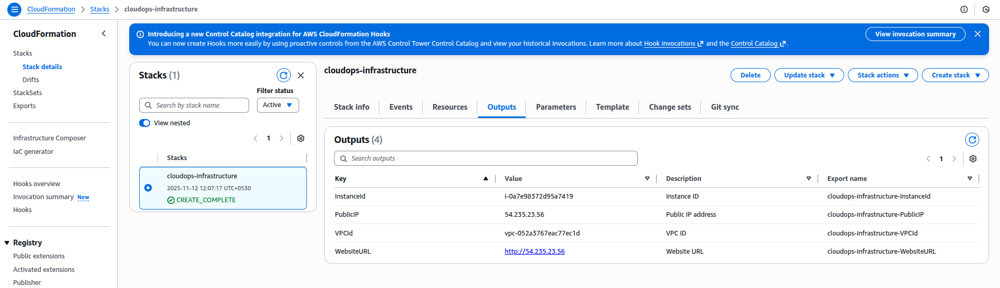

## Lab 2: Advanced CloudFormation Features

### Stack with Nested Templates
```yaml
# master-template.yaml
AWSTemplateFormatVersion: '2010-09-09'
Description: 'Master CloudOps Stack'

Parameters:
  Environment:
    Type: String
    Default: dev
    AllowedValues: [dev, staging, prod]

Resources:
  NetworkStack:
    Type: AWS::CloudFormation::Stack
    Properties:
      TemplateURL: https://s3.amazonaws.com/cloudops-templates/network-template.yaml
      Parameters:
        Environment: !Ref Environment
      Tags:
        - Key: Environment
          Value: !Ref Environment

  ComputeStack:
    Type: AWS::CloudFormation::Stack
    DependsOn: NetworkStack
    Properties:
      TemplateURL: https://s3.amazonaws.com/cloudops-templates/compute-template.yaml
      Parameters:
        VPCId: !GetAtt NetworkStack.Outputs.VPCId
        SubnetId: !GetAtt NetworkStack.Outputs.PublicSubnetId
        Environment: !Ref Environment
```

### Template with Conditions
```yaml
# conditional-template.yaml
AWSTemplateFormatVersion: '2010-09-09'
Description: 'CloudOps Stack with Conditions'

Parameters:
  Environment:
    Type: String
    Default: dev
    AllowedValues: [dev, staging, prod]

Conditions:
  IsProduction: !Equals [!Ref Environment, prod]
  IsNotProduction: !Not [!Equals [!Ref Environment, prod]]

Resources:
  CloudOpsInstance:
    Type: AWS::EC2::Instance
    Properties:
      ImageId: ami-0c02fb55956c7d316
      InstanceType: !If [IsProduction, t3.medium, t3.micro]
      Monitoring: !If [IsProduction, true, false]
      Tags:
        - Key: Name
          Value: !Sub "CloudOps-${Environment}"
        - Key: Environment
          Value: !Ref Environment

  ProductionAlarm:
    Type: AWS::CloudWatch::Alarm
    Condition: IsProduction
    Properties:
      AlarmName: !Sub "${Environment}-HighCPU"
      AlarmDescription: High CPU utilization
      MetricName: CPUUtilization
      Namespace: AWS/EC2
      Statistic: Average
      Period: 300
      EvaluationPeriods: 2
      Threshold: 80
      ComparisonOperator: GreaterThanThreshold
      Dimensions:
        - Name: InstanceId
          Value: !Ref CloudOpsInstance
```
### Screenshot:
Created Resources:

Output:
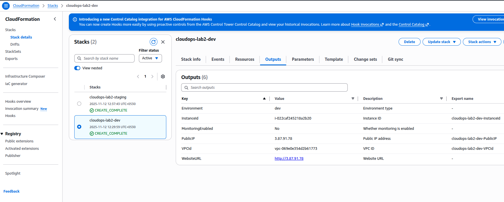
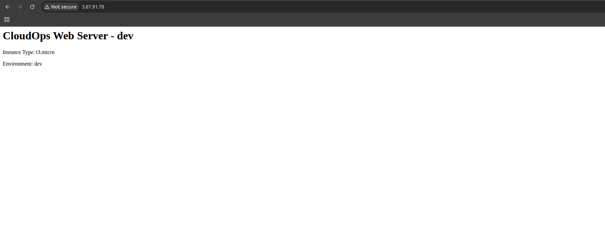

## Lab 3: CloudFormation with CLI Operations

### Stack Management Commands
```bash
# Update stack
aws cloudformation update-stack \
  --stack-name cloudops-infrastructure \
  --template-body file://updated-template.yaml \
  --parameters ParameterKey=InstanceType,ParameterValue=t3.small

# Create change set
aws cloudformation create-change-set \
  --stack-name cloudops-infrastructure \
  --change-set-name update-instance-type \
  --template-body file://updated-template.yaml \
  --parameters ParameterKey=InstanceType,ParameterValue=t3.small

# Execute change set
aws cloudformation execute-change-set \
  --change-set-name update-instance-type \
  --stack-name cloudops-infrastructure

# Delete stack
aws cloudformation delete-stack \
  --stack-name cloudops-infrastructure

# Wait for stack completion
aws cloudformation wait stack-create-complete \
  --stack-name cloudops-infrastructure
```

### Stack Drift Detection
```bash
# Detect stack drift
aws cloudformation detect-stack-drift \
  --stack-name cloudops-infrastructure

# Get drift detection results
aws cloudformation describe-stack-drift-detection-status \
  --stack-drift-detection-id drift-detection-id

# Describe stack resource drifts
aws cloudformation describe-stack-resource-drifts \
  --stack-name cloudops-infrastructure
```
1st deployed:
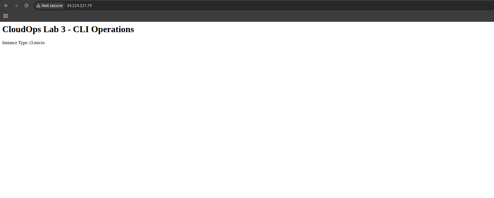
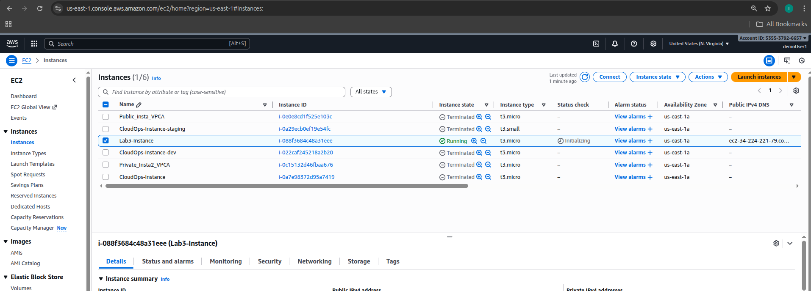
After Changed:
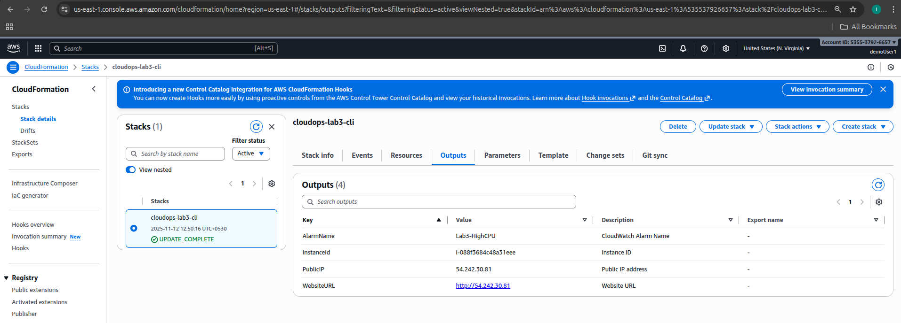
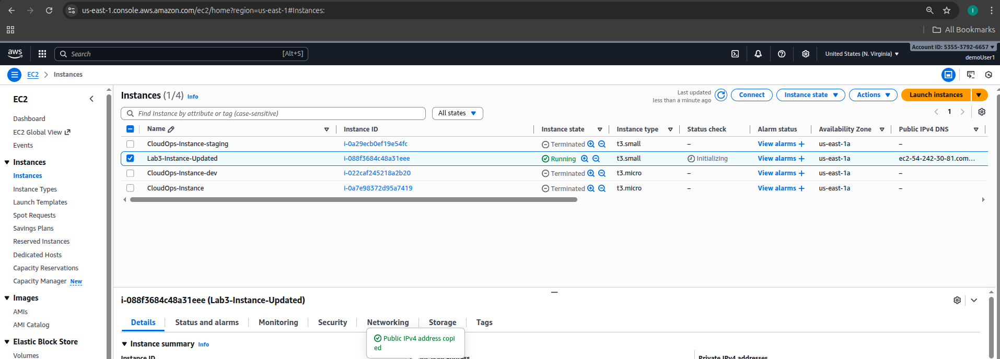
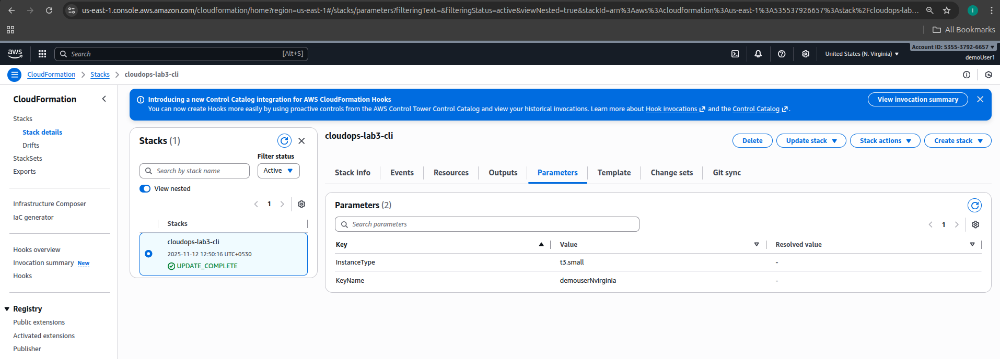
Drift Status:
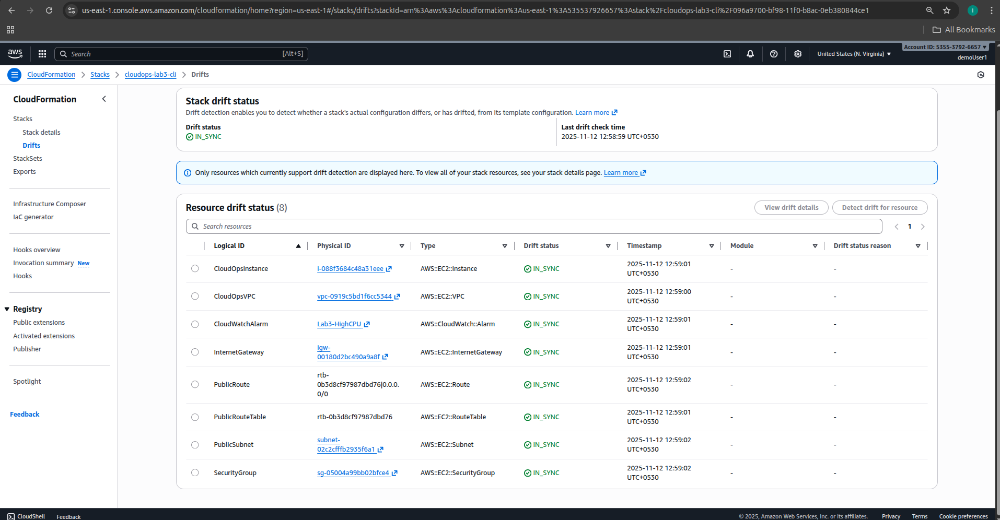


## Best Practices

1. **Use parameters** for reusability
2. **Implement proper tagging** strategy
3. **Use outputs** for cross-stack references
4. **Validate templates** before deployment
5. **Use change sets** for updates
6. **Implement rollback** strategies
7. **Monitor stack events**

## Troubleshooting

```bash
# View stack events
aws cloudformation describe-stack-events \
  --stack-name cloudops-infrastructure

# Get stack resources
aws cloudformation describe-stack-resources \
  --stack-name cloudops-infrastructure

# Validate template
aws cloudformation validate-template \
  --template-body file://template.yaml

# Estimate template cost
aws cloudformation estimate-template-cost \
  --template-body file://template.yaml
```

## Cleanup

```bash
# Delete stack
aws cloudformation delete-stack \
  --stack-name cloudops-infrastructure

# Wait for deletion
aws cloudformation wait stack-delete-complete \
  --stack-name cloudops-infrastructure
```