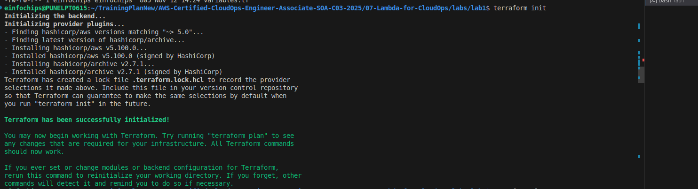
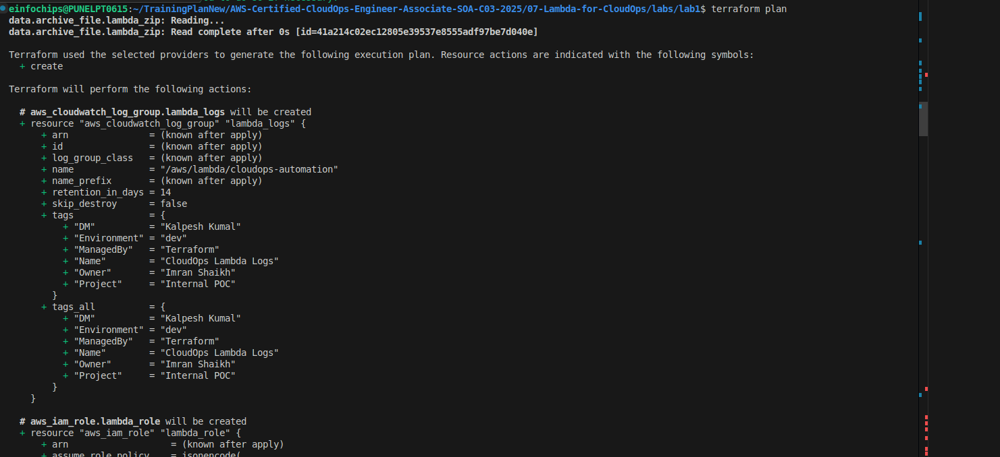
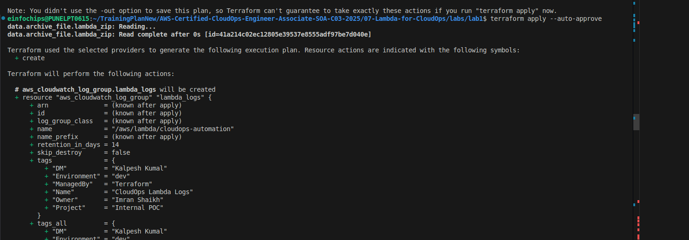
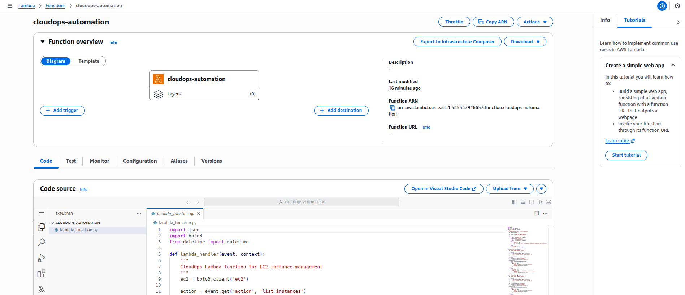
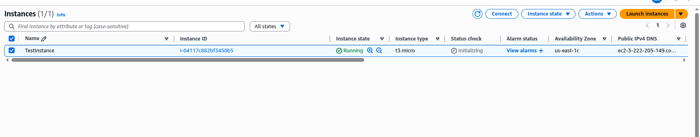
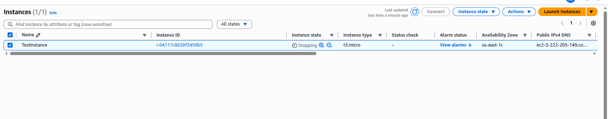
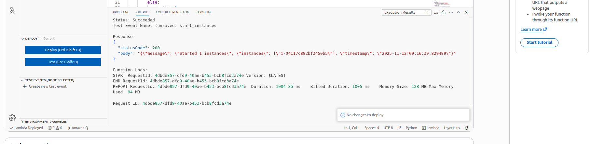
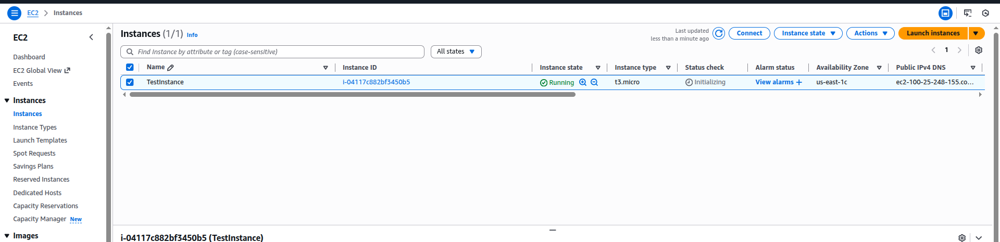

# Lab 1: Basic Lambda Function for CloudOps

## Overview
This lab creates a Lambda function using Terraform that can start, stop, and list EC2 instances based on tags. This is a common CloudOps automation task for cost optimization and resource management.

## Architecture


## Terraform Code Structure

### 1. Variables Configuration (`variables.tf`)
```hcl
variable "aws_region" {
  description = "AWS region"
  type        = string
  default     = "us-east-1"
}

variable "environment" {
  description = "Environment name"
  type        = string
  default     = "dev"
}

variable "project_name" {
  description = "Project name"
  type        = string
  default     = "cloudops"
}

# Standard Tags
locals {
  common_tags = {
    Owner       = "Imran Shaikh"
    Project     = "Internal POC"
    DM          = "Kalpesh Kumal"
    Environment = var.environment
    ManagedBy   = "Terraform"
  }
}
```

### 2. Main Infrastructure (`main.tf`)
- **Lambda Function**: Python 3.9 runtime with EC2 automation code
- **IAM Role**: Execution role with EC2 and CloudWatch permissions
- **CloudWatch Log Group**: For function logging

### 3. Lambda Function Code (`lambda_function.py`)
**Capabilities:**
- **List Instances**: Find EC2 instances by tag
- **Stop Instances**: Stop running instances with specific tags
- **Start Instances**: Start stopped instances with specific tags

## Deployment Steps

### Step 1: Initialize Terraform
```bash
terraform init
```
![Terraform Init]


### Step 2: Plan Deployment
```bash
terraform plan
```


### Step 3: Apply Configuration
```bash
terraform apply
```


## Testing the Lambda Function

### Method 1: AWS Console Testing
1. Go to Lambda Console
2. Find function: `cloudops-automation`
3. Create test events with JSON payloads



### Test Event Examples:

#### List Instances Test
```json
{
  "action": "list_instances",
  "tag": "Environment=Dev"
}
```


#### Stop Instances Test
```json
{
  "action": "stop_instances",
  "tag": "Environment=Dev"
}
```
Running Instance:

After Test Run


#### Start Instances Test
```json
{
  "action": "start_instances",
  "tag": "Environment=Dev"
}
```
Test Result:

After the Stopped The Instance is under Running State:



## Resources Created

### AWS Resources:
- **Lambda Function**: `cloudops-automation`
- **IAM Role**: `cloudops-lambda-role`
- **IAM Policy**: EC2 and CloudWatch permissions
- **CloudWatch Log Group**: `/aws/lambda/cloudops-automation`

## Use Cases
1. **Cost Optimization**: Auto-stop dev/test instances after hours
2. **Scheduled Operations**: Start instances before business hours
3. **Incident Response**: Stop problematic instances automatically
4. **Resource Management**: Bulk operations on tagged instances

## Key Features Achieved
 **Infrastructure as Code**: Complete Terraform deployment  
 **Standardized Tagging**: Common tags across all resources  
 **Error Handling**: Robust Python error handling  
 **Logging**: CloudWatch integration for monitoring  
 **Security**: Least privilege IAM permissions  
 **Flexibility**: Tag-based instance filtering  

## Cleanup
```bash
terraform destroy
```

