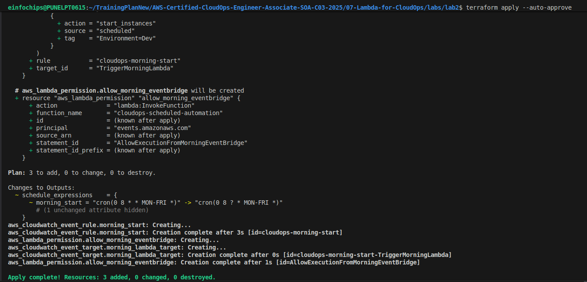
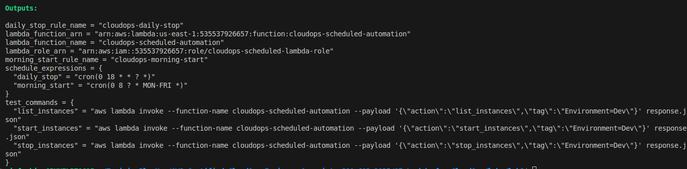
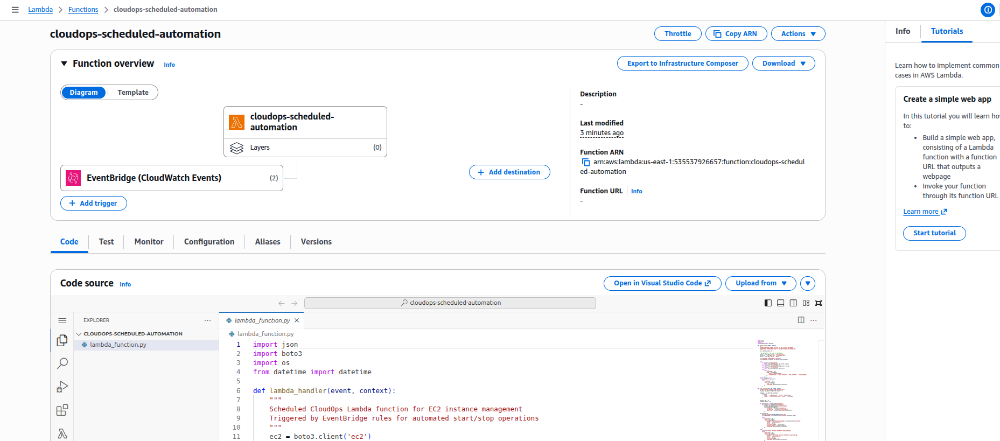
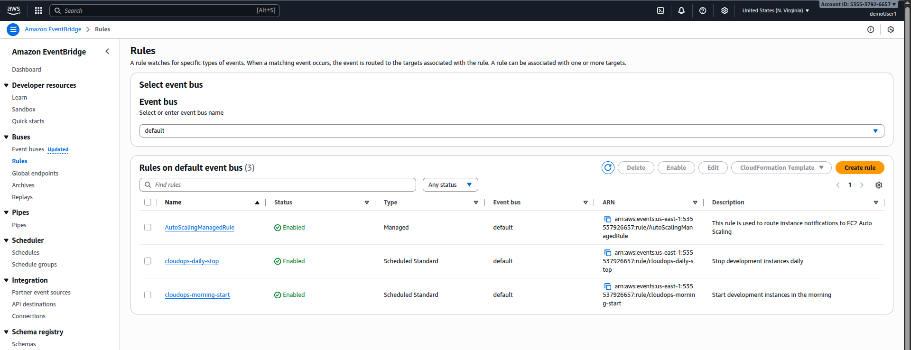
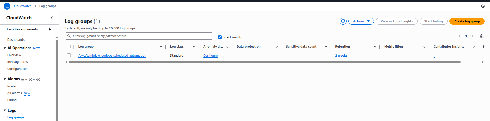
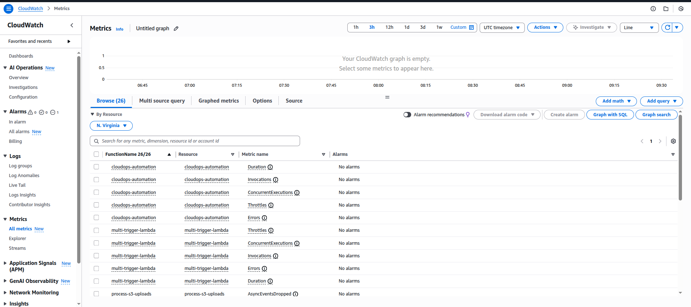
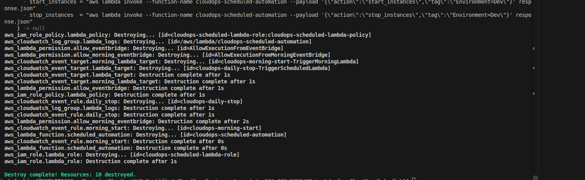

# Lab 2: Scheduled Lambda Functions with EventBridge

## Overview
This lab extends Lab 1 by adding EventBridge (CloudWatch Events) scheduling to automatically start and stop EC2 instances based on cron expressions. This is essential for cost optimization in development environments.

## Architecture


## What We're Building
- **Scheduled Lambda Function**: Enhanced version with scheduling support
- **Daily Stop Rule**: Stops dev instances at 6 PM UTC daily
- **Morning Start Rule**: Starts dev instances at 8 AM UTC on weekdays
- **EventBridge Integration**: Automated triggering based on cron schedules

## Key Features
✅ **Cost Optimization**: Automatic stop/start scheduling  
✅ **Flexible Scheduling**: Configurable cron expressions  
✅ **Enhanced Logging**: Source tracking (manual vs scheduled)  
✅ **Dual Schedules**: Separate rules for start and stop operations  
✅ **Error Handling**: Robust exception management  

## Terraform Resources

### 1. Lambda Function
- **Name**: `cloudops-scheduled-automation`
- **Runtime**: Python 3.9
- **Timeout**: 60 seconds
- **Enhanced logging with source tracking**

### 2. EventBridge Rules
- **Daily Stop**: `cron(0 18 * * ? *)` - 6 PM UTC daily
- **Morning Start**: `cron(0 8 * * MON-FRI *)` - 8 AM UTC weekdays

### 3. IAM Permissions
- EC2 operations (describe, start, stop)
- CloudWatch Logs access
- EventBridge invoke permissions

## Deployment

### Step 1: Initialize and Deploy
```bash
cd labs/lab2
terraform init
terraform plan
terraform apply
```


### Step 2: Verify Resources
```bash
terraform output
```


## Testing

### Manual Testing
```bash
# Test list instances
aws lambda invoke --function-name cloudops-scheduled-automation --payload '{"action":"list_instances","tag":"Environment=Dev"}' response.json

# Test stop instances
aws lambda invoke --function-name cloudops-scheduled-automation --payload '{"action":"stop_instances","tag":"Environment=Dev","source":"manual"}' response.json

# Test start instances  
aws lambda invoke --function-name cloudops-scheduled-automation --payload '{"action":"start_instances","tag":"Environment=Dev","source":"manual"}' response.json
```

### Console Testing


### EventBridge Rules Verification


## Schedule Configuration

### Current Schedules
- **Daily Stop**: Every day at 6 PM UTC
- **Morning Start**: Weekdays at 8 AM UTC

### Custom Schedule Examples
```hcl
# Every 2 hours
schedule_expression = "cron(0 */2 * * ? *)"

# Business hours only (9 AM - 5 PM weekdays)
schedule_expression = "cron(0 9-17 ? * MON-FRI *)"

# Weekend maintenance (Saturday 2 AM)
schedule_expression = "cron(0 2 ? * SAT *)"
```

## Monitoring

### CloudWatch Logs


### Lambda Metrics



## Cost Savings Calculation

### Example Scenario
- **10 t3.medium instances** in dev environment
- **Running 24/7**: $0.0416/hour × 24 × 30 × 10 = $299.52/month
- **With scheduling (12 hours/day)**: $0.0416/hour × 12 × 30 × 10 = $149.76/month
- **Monthly Savings**: $149.76 (50% reduction)


## Enhanced Features

### Source Tracking
The Lambda function now tracks whether it was triggered manually or by schedule:
```python
source = event.get('source', 'manual')
print(f"Lambda triggered by: {source}")
```

### Detailed Logging
```json
{
  "message": "Successfully stopped 3 instances",
  "action": "stop_instances",
  "source": "scheduled",
  "instances_stopped": ["i-1234567890abcdef0", "i-0987654321fedcba0"],
  "timestamp": "2024-01-15T18:00:00.000Z"
}
```

## Troubleshooting

### Common Issues
1. **No instances found**: Check tag filters and instance states
2. **Permission denied**: Verify IAM role permissions
3. **Schedule not triggering**: Check EventBridge rule status

### Debug Commands
```bash
# Check EventBridge rule status
aws events describe-rule --name cloudops-daily-stop

# View recent Lambda invocations
aws logs describe-log-streams --log-group-name /aws/lambda/cloudops-scheduled-automation

# Test EventBridge rule manually
aws events put-events --entries Source=test,DetailType=test,Detail='{}'
```

## Security Best Practices
✅ **Least Privilege IAM**: Only necessary EC2 permissions  
✅ **Resource Tagging**: Proper tag-based filtering  
✅ **Logging**: Comprehensive audit trail  
✅ **Error Handling**: Graceful failure management  

## Next Steps
- **Lab 3**: SNS Integration for Alerts
- **Lab 4**: Lambda Layers for Code Reuse
- **Lab 5**: Error Handling and Monitoring

## Cleanup
```bash
terraform destroy
```
