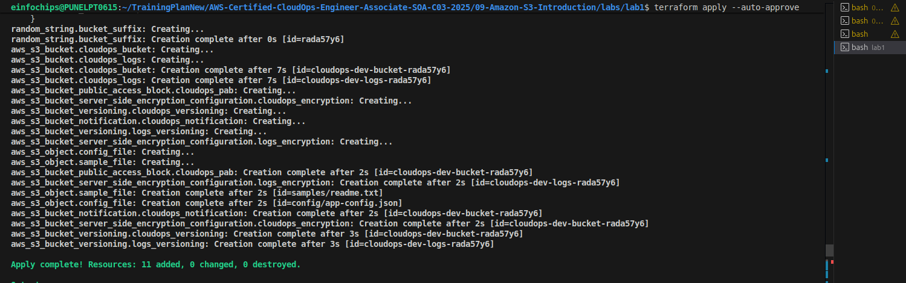
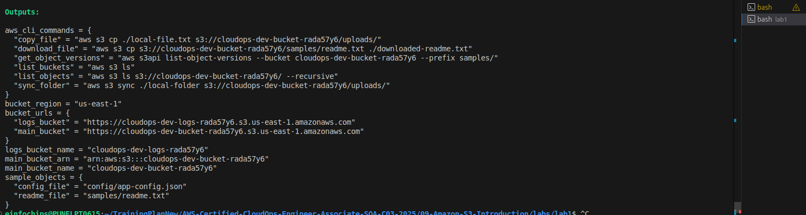
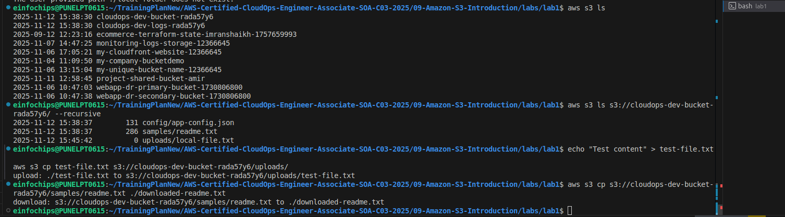
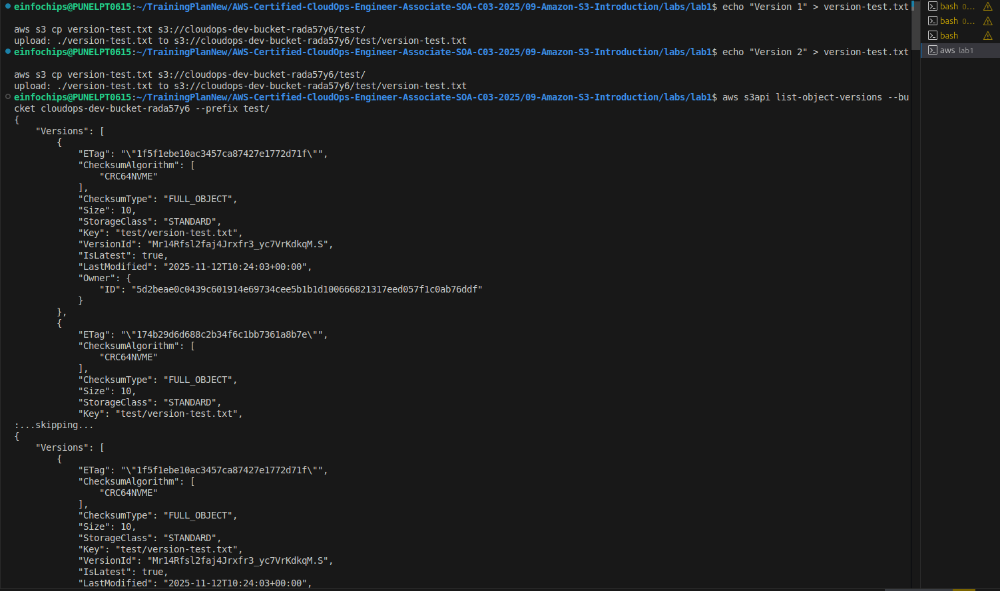
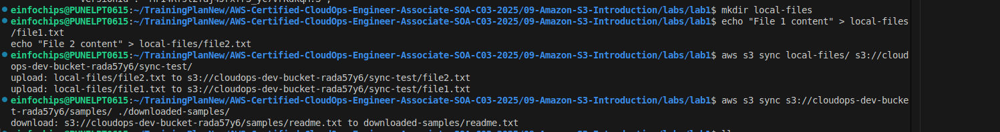
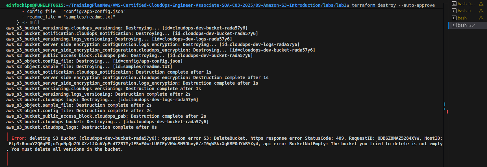

# Lab 1: Basic S3 Operations

## Overview
This lab introduces Amazon S3 fundamentals including bucket creation, object management, versioning, encryption, and lifecycle policies. Essential for CloudOps data storage and management.

## Architecture


## What We're Building
- **Main S3 Bucket**: General purpose storage with versioning
- **Logs S3 Bucket**: Dedicated log storage
- **Encryption**: Server-side encryption (SSE-S3)
- **Lifecycle Policies**: Automatic data tiering
- **Sample Objects**: Test files for operations

## Key Features
✅ **Bucket Management**: Create and configure S3 buckets  
✅ **Versioning**: Enable object versioning for data protection  
✅ **Encryption**: Server-side encryption by default  
✅ **Lifecycle Policies**: Automatic data tiering to reduce costs  
✅ **Public Access Block**: Security best practices  

## Terraform Resources

### 1. S3 Buckets
- **Main Bucket**: General storage with unique naming
- **Logs Bucket**: Dedicated for application logs
- **Random Suffix**: Ensures globally unique bucket names

### 2. Security Configuration
- **Public Access Block**: Prevents accidental public access
- **Server-Side Encryption**: AES256 encryption by default
- **Versioning**: Enabled for data protection

### 3. Lifecycle Management
- **30 days**: Transition to Standard-IA
- **90 days**: Transition to Glacier
- **365 days**: Transition to Deep Archive
- **7 years**: Object expiration

## Deployment

### Step 1: Deploy Infrastructure
```bash
cd labs/lab1
terraform init
terraform plan
terraform apply
```


### Step 2: Verify Buckets
```bash
terraform output
```


## Testing S3 Operations

### Basic Operations
```bash
# List all buckets
aws s3 ls


# List objects in bucket
aws s3 ls s3://cloudops-dev-bucket-rada57y6/ --recursive

# Upload a file
echo "Test content" > test-file.txt
aws s3 cp test-file.txt s3://cloudops-dev-bucket-rada57y6/uploads/

# Download a file
aws s3 cp s3://cloudops-dev-bucket-rada57y6/samples/readme.txt ./downloaded-readme.txt
```


### Versioning Operations
```bash
# Upload multiple versions of the same file
echo "Version 1" > version-test.txt
aws s3 cp version-test.txt s3://cloudops-dev-bucket-rada57y6/test/

echo "Version 2" > version-test.txt
aws s3 cp version-test.txt s3://cloudops-dev-bucket-rada57y6/test/

# List object versions
aws s3api list-object-versions --bucket cloudops-dev-bucket-rada57y6 --prefix test/
```


### Sync Operations
```bash
# Create local directory with files
mkdir local-files
echo "File 1 content" > local-files/file1.txt
echo "File 2 content" > local-files/file2.txt

# Sync directory to S3
aws s3 sync local-files/ s3://cloudops-dev-bucket-rada57y6/sync-test/

# Sync from S3 to local
aws s3 sync s3://cloudops-dev-bucket-rada57y6/samples/ ./downloaded-samples/
```


## S3 Storage Classes

### Standard Storage
- **Use Case**: Frequently accessed data
- **Durability**: 99.999999999% (11 9's)
- **Availability**: 99.99%

### Standard-IA (Infrequent Access)
- **Use Case**: Less frequently accessed data
- **Cost**: Lower storage cost, retrieval fee
- **Minimum**: 30 days storage

### Glacier
- **Use Case**: Archive data with retrieval times
- **Retrieval**: Minutes to hours
- **Cost**: Very low storage cost

### Deep Archive
- **Use Case**: Long-term archive
- **Retrieval**: 12+ hours
- **Cost**: Lowest storage cost


## Lifecycle Policy Details

### Current Configuration
```json
{
  "Rules": [
    {
      "ID": "transition_to_ia",
      "Status": "Enabled",
      "Transitions": [
        {
          "Days": 30,
          "StorageClass": "STANDARD_IA"
        },
        {
          "Days": 90,
          "StorageClass": "GLACIER"
        },
        {
          "Days": 365,
          "StorageClass": "DEEP_ARCHIVE"
        }
      ],
      "Expiration": {
        "Days": 2555
      }
    }
  ]
}
```

### Cost Optimization
- **30 days**: 20% cost reduction (Standard-IA)
- **90 days**: 68% cost reduction (Glacier)
- **365 days**: 75% cost reduction (Deep Archive)


## Monitoring and Metrics

### CloudWatch Metrics
```bash
# Get bucket size metrics
aws cloudwatch get-metric-statistics \
  --namespace AWS/S3 \
  --metric-name BucketSizeBytes \
  --dimensions Name=BucketName,Value=cloudops-dev-bucket-rada57y6 Name=StorageType,Value=StandardStorage \
  --start-time 2024-01-01T00:00:00Z \
  --end-time 2024-01-02T00:00:00Z \
  --period 86400 \
  --statistics Average
```

### S3 Inventory
```bash
# Configure S3 inventory for bucket analysis
aws s3api put-bucket-inventory-configuration \
  --bucket cloudops-dev-bucket-rada57y6 \
  --id DailyInventory \
  --inventory-configuration file://inventory-config.json
```


## Security Best Practices

### Public Access Block
```hcl
resource "aws_s3_bucket_public_access_block" "cloudops_pab" {
  bucket = aws_s3_bucket.cloudops_bucket.id

  block_public_acls       = true
  block_public_policy     = true
  ignore_public_acls      = true
  restrict_public_buckets = true
}
```

### Encryption Configuration
```hcl
resource "aws_s3_bucket_server_side_encryption_configuration" "cloudops_encryption" {
  bucket = aws_s3_bucket.cloudops_bucket.id

  rule {
    apply_server_side_encryption_by_default {
      sse_algorithm = "AES256"
    }
  }
}
```

## Advanced Operations

### Cross-Region Replication Setup
```bash
# Create replication configuration
aws s3api put-bucket-replication \
  --bucket cloudops-dev-bucket-rada57y6 \
  --replication-configuration file://replication-config.json
```

### Event Notifications
```bash
# Configure bucket notifications
aws s3api put-bucket-notification-configuration \
  --bucket cloudops-dev-bucket-rada57y6 \
  --notification-configuration file://notification-config.json
```

## Troubleshooting

### Common Issues
1. **Bucket name conflicts**: Use random suffixes
2. **Access denied**: Check IAM permissions
3. **Lifecycle not working**: Verify policy syntax

### Debug Commands
```bash
# Check bucket policy
aws s3api get-bucket-policy --bucket cloudops-dev-bucket-rada57y6

# Check bucket versioning
aws s3api get-bucket-versioning --bucket cloudops-dev-bucket-rada57y6

# Check lifecycle configuration
aws s3api get-bucket-lifecycle-configuration --bucket cloudops-dev-bucket-rada57y6
```

## Cost Analysis

### Monthly Cost Estimate (1TB data)
- **Standard**: $23/month
- **Standard-IA**: $12.50/month (after 30 days)
- **Glacier**: $4/month (after 90 days)
- **Deep Archive**: $1/month (after 365 days)

### With Lifecycle Policy
- **Year 1**: Average $15/month
- **Year 2+**: Average $8/month
- **Annual Savings**: ~60%


## Use Cases

### 1. Application Data Storage
- User uploads and media files
- Configuration files
- Application logs

### 2. Backup and Archive
- Database backups
- Log archives
- Compliance data retention

### 3. Data Lake Storage
- Raw data ingestion
- Analytics datasets
- Machine learning data

## Next Steps
- **Lab 2**: S3 Static Website Hosting
- **Lab 3**: S3 Cross-Region Replication
- **Lab 4**: S3 Event Notifications

## Cleanup
```bash
# Empty buckets first
aws s3 rm s3://cloudops-dev-bucket-rada57y6 --recursive
aws s3 rm s3://cloudops-dev-bucket-rada57y6 --recursive

# Then destroy infrastructure
terraform destroy
```
