# Cross-Account Transit Gateway Setup - Manual Steps

## Overview
This guide demonstrates how to set up a cross-account Transit Gateway connection between two AWS accounts using the AWS Console.

**Accounts:**
- Account A (Owner): `535537926657`
- Account B (Peer): `375039967967`

---

## **Step 1: Create Transit Gateway (Your Account - Console)**

### **Create Transit Gateway**
1. **Go to VPC Console** → **Transit Gateways**
2. **Click "Create Transit Gateway"**
3. **Configure:**
   - **Name**: `CrossAccount-TGW`
   - **Description**: `Cross-account Transit Gateway`
   - **Amazon side ASN**: 64512 (default)
   - **Default route table association**: Enable
   - **Default route table propagation**: Enable
   - **DNS support**: Enable
   - **Multicast support**: Disable
4. **Click "Create Transit Gateway"**
5. **Note the Transit Gateway ID** (e.g., `tgw-xxxxxxxxx`)

### Screenshot:
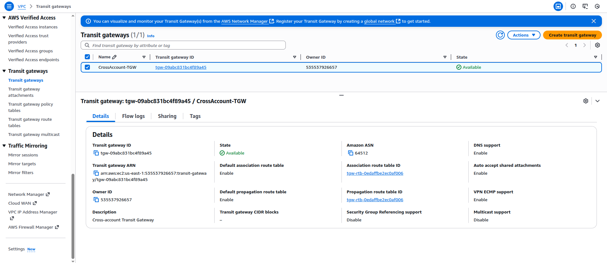

### **Create VPC and Subnet**
1. **Go to VPC Console** → **Your VPCs**
2. **Click "Create VPC"**
3. **Configure:**
   - **Name**: `TGW-VPC`
   - **IPv4 CIDR**: `10.0.0.0/16`
4. **Click "Create VPC"**

5. **Create Subnet:**
   - **Go to Subnets** → **Create subnet**
   - **VPC**: Select `TGW-VPC`
   - **Subnet name**: `TGW-Subnet`
   - **IPv4 CIDR**: `10.0.1.0/24`
   - **Click "Create subnet"**

### Screenshot VPC
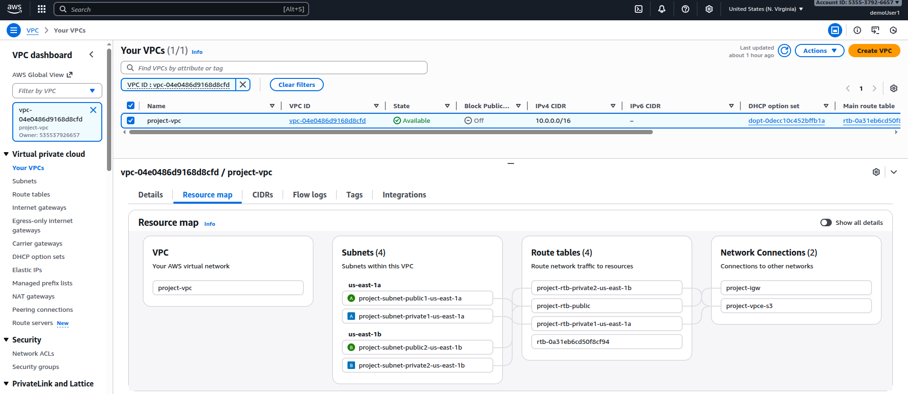   

### **Attach VPC to Transit Gateway**
1. **Go to Transit Gateway Attachments**
2. **Click "Create Transit Gateway Attachment"**
3. **Configure:**
   - **Transit Gateway ID**: Select your TGW
   - **Attachment type**: VPC
   - **VPC ID**: Select `TGW-VPC`
   - **Subnet IDs**: Select `TGW-Subnet`
4. **Click "Create attachment"**

### Screenshot
Transit Gateway Attachment:
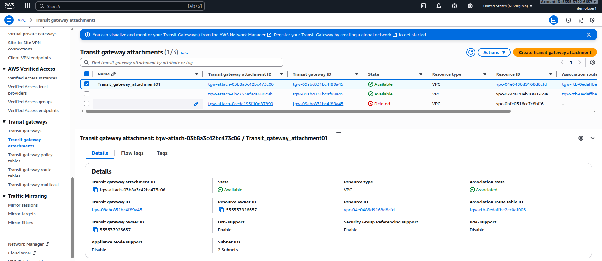

---

## **Step 2: Share Transit Gateway (Your Account - Console)**

### **Create Resource Share**
1. **Go to Resource Access Manager (RAM) Console**
2. **Click "Create resource share"**
3. **Configure:**
   - **Name**: `TGW-CrossAccount-Share`
   - **Description**: `Share TGW with friend account`
4. **Select Resources:**
   - **Resource type**: Transit Gateways
   - **Select your Transit Gateway**
5. **Associate with principals:**
   - **Principal type**: AWS account
   - **Principal**: `375039967967`
6. **Click "Create resource share"**

### Screenshot
Resource Access manager:
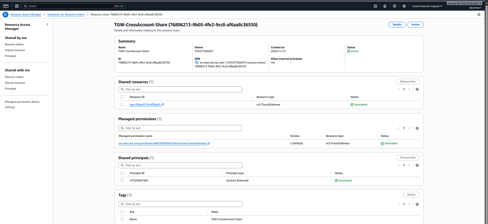

---

## **Step 3: Accept Share (Friend's Account - Console)**

### **Accept Resource Share Invitation**
1. **Login to Friend's Account** (`375039967967`)
2. **Go to Resource Access Manager Console**
3. **Click "Shared with me"** → **Resource shares**
4. **Find pending invitation** from your account
5. **Click "Accept"**
6. **Confirm acceptance**

Accept Connect:
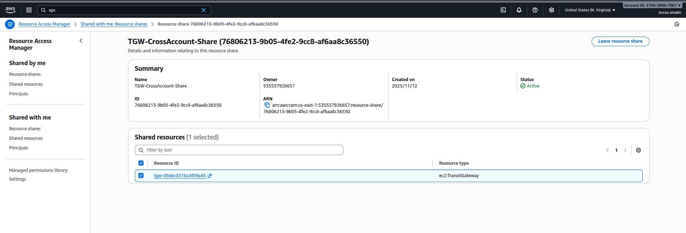

---

## **Step 4: Create VPC in Friend's Account (Console)**

### **Create VPC and Subnet**
1. **Go to VPC Console** (in friend's account)
2. **Click "Create VPC"**
3. **Configure:**
   - **Name**: `Peer-TGW-VPC`
   - **IPv4 CIDR**: `10.1.0.0/16`
4. **Click "Create VPC"**

5. **Create Subnet:**
   - **Go to Subnets** → **Create subnet**
   - **VPC**: Select `Peer-TGW-VPC`
   - **Subnet name**: `Peer-TGW-Subnet`
   - **IPv4 CIDR**: `10.1.1.0/24`
   - **Click "Create subnet"**
VPC:
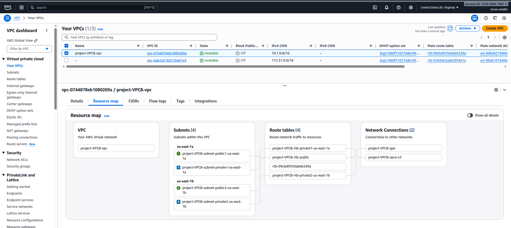

### **Attach VPC to Shared Transit Gateway**
1. **Go to Transit Gateway Attachments**
2. **Click "Create Transit Gateway Attachment"**
3. **Configure:**
   - **Transit Gateway ID**: Select the shared TGW
   - **Attachment type**: VPC
   - **VPC ID**: Select `Peer-TGW-VPC`
   - **Subnet IDs**: Select `Peer-TGW-Subnet`
4. **Click "Create attachment"**
### Screenshot
VPC Attachement in Account B
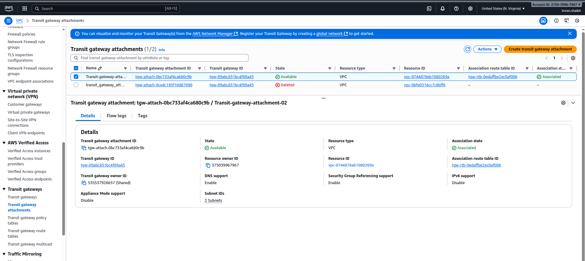

---

## **Step 5: Configure Route Tables (Both Accounts)**

### **In Your Account (535537926657):**

#### **Update VPC Route Table**
1. **Go to Route Tables**
2. **Select route table** associated with `TGW-VPC`
3. **Routes tab** → **Edit routes**
4. **Add route:**
   - **Destination**: `10.1.0.0/16`
   - **Target**: Transit Gateway → Select your TGW
5. **Save changes**

 Added Entry in Private Route Table of VPC B TGW in both RT
 

### **In Friend's Account (375039967967):**

#### **Update VPC Route Table**
1. **Go to Route Tables**
2. **Select route table** associated with `Peer-TGW-VPC`
3. **Routes tab** → **Edit routes**
4. **Add route:**
   - **Destination**: `10.0.0.0/16`
   - **Target**: Transit Gateway → Select shared TGW
5. **Save changes**

 Added Entry in Private Route Table of VPC A TGW in both RT  
 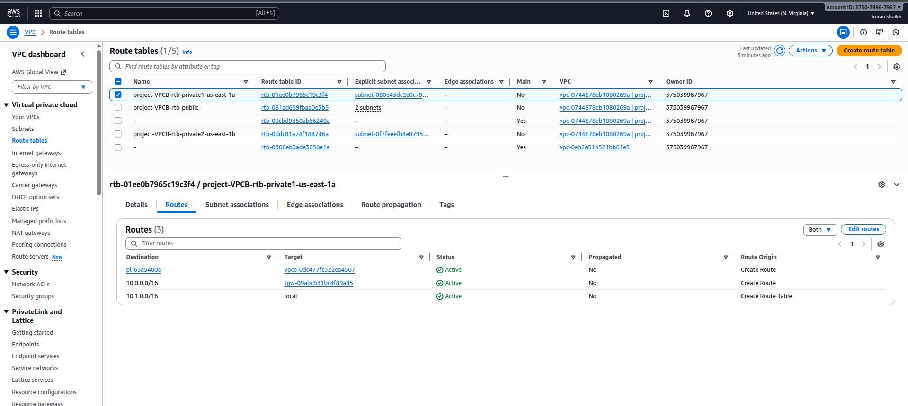
---

## **Step 6: Configure Security Groups (Both Accounts)**

### **Create Security Group for Testing**
1. **Go to Security Groups**
2. **Create security group:**
   - **Name**: `TGW-Test-SG`
   - **Description**: `Allow cross-account communication`
   - **VPC**: Select respective VPC
3. **Inbound rules:**
   - **Type**: All ICMP - IPv4
   - **Source**: `10.0.0.0/8` (or specific CIDR)
   - **Type**: SSH
   - **Source**: Your IP
4. **Create security group**

   Security Group
   
  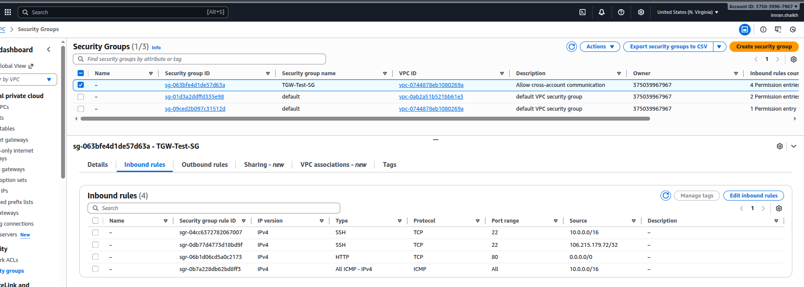   

---

## **Step 7: Launch Test Instances (Both Accounts)**

### **Launch EC2 Instance**
1. **Go to EC2 Console** → **Launch Instance**
2. **Configure:**
   - **Name**: `TGW-Test-Instance`
   - **AMI**: Amazon Linux 2
   - **Instance type**: t2.micro
   - **Key pair**: Select existing key pair
   - **Network**: Select respective VPC
   - **Subnet**: Select respective subnet
   - **Security group**: Select `TGW-Test-SG`
3. **Launch instance**

---

## **Step 8: Test Connectivity**

### **Test Cross-Account Communication**
1. **SSH to instance** in your account
2. **Ping instance** in friend's account:
   ```bash
   ping 10.1.1.x
   ```
3. **SSH to instance** in friend's account
4. **Ping instance** in your account:
   ```bash
   ping 10.0.1.x
   ```

### Screenshot
IN VPC A
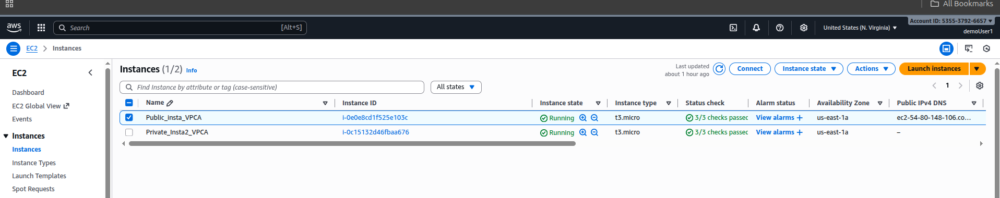
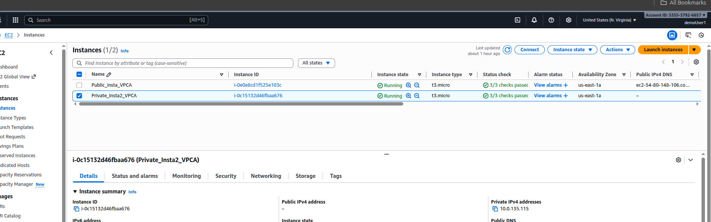
In VPC_B
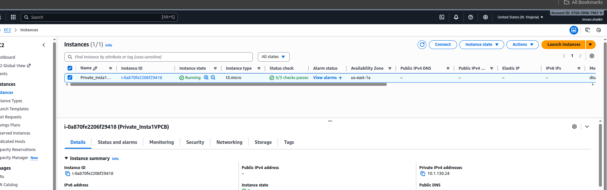
Connected to Public Instance in VPC_A:
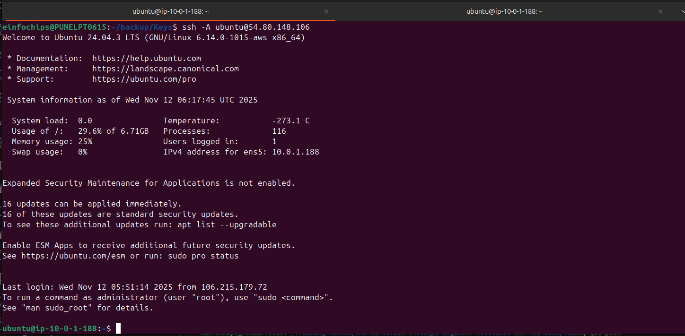
From Public Instance Connected to Private_Instance ip adrress of Private Instance: 10.0.135.115
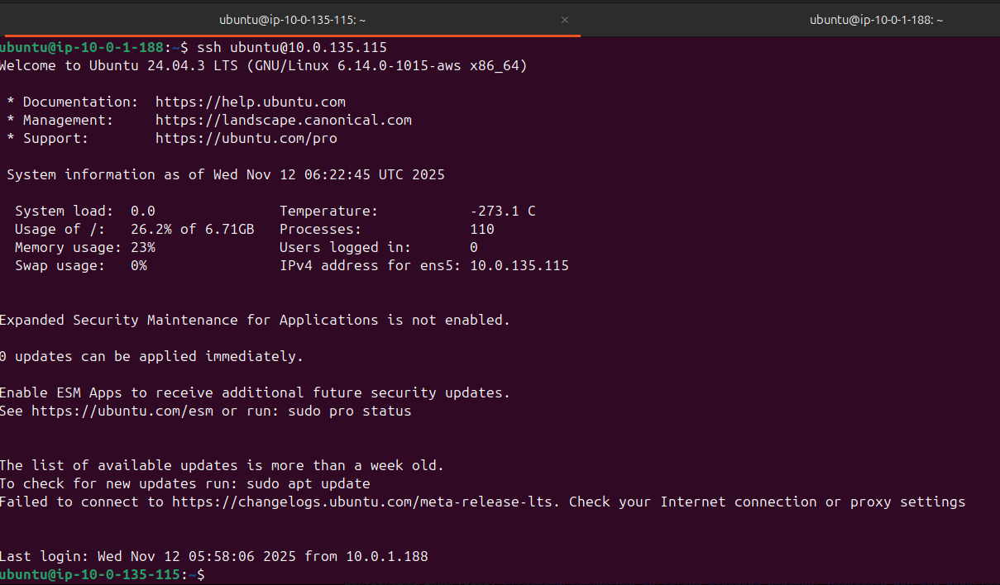
From Private Instance Ping to Private Instance private ip 10.1.130.24
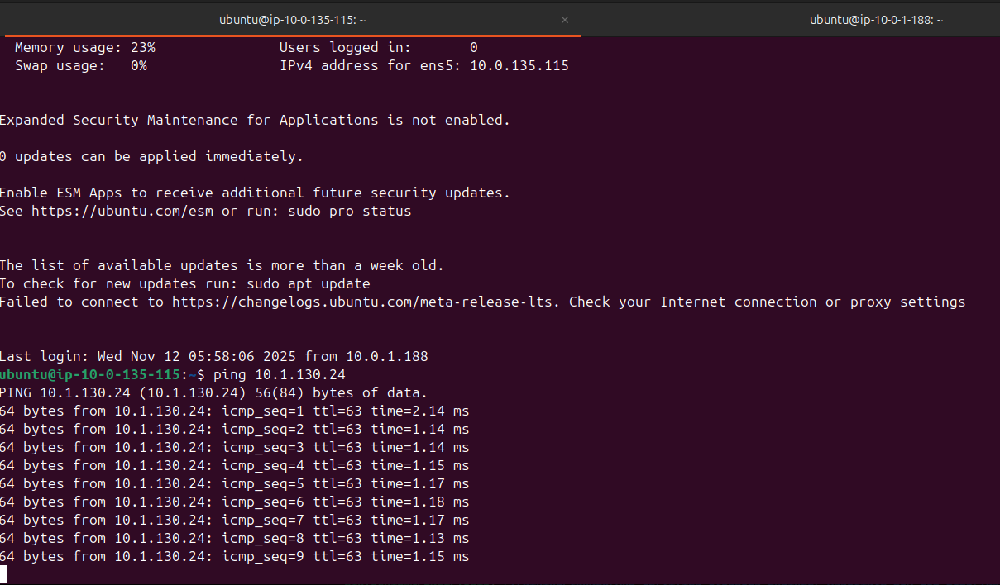
---

## **Verification Steps (Console)**

### **Check Transit Gateway Status**
1. **Go to Transit Gateways**
2. **Select your TGW**
3. **Details tab**: Verify state is "Available"
4. **Attachments tab**: Check all attachments are "Available"

### **Check Resource Shares**
1. **Go to RAM Console**
2. **Resource shares** → **Owned by me**
3. **Verify share status** is "Active"

### **Check Route Propagation**
1. **Go to Transit Gateway Route Tables**
2. **Select default route table**
3. **Routes tab**: Verify routes are propagated
4. **Associations tab**: Check VPC attachments

---

## **Network Architecture**

```
Account 535537926657          Account 375039967967
┌─────────────────┐          ┌─────────────────┐
│   TGW-VPC       │          │   Peer-TGW-VPC  │
│   10.0.0.0/16   │          │   10.1.0.0/16   │
│                 │          │                 │
│   ┌─────────┐   │          │   ┌─────────┐   │
│   │TGW-     │   │          │   │Peer-TGW-│   │
│   │Subnet   │   │          │   │Subnet   │   │
│   │10.0.1.0/│   │          │   │10.1.1.0/│   │
│   │24       │   │          │   │24       │   │
│   └─────────┘   │          │   └─────────┘   │
└─────────────────┘          └─────────────────┘
         │                            │
         └──────────┬───────────────────┘
                    │
            ┌───────────────┐
            │ Transit       │
            │ Gateway       │
            │ (Shared via   │
            │ RAM)          │
            └───────────────┘
```

---

## **Troubleshooting**

### **Common Issues:**
1. **Route table not updated** - Check VPC route tables
2. **Security groups blocking traffic** - Allow ICMP/SSH
3. **Attachment pending** - Wait for attachment to be available
4. **Resource share not accepted** - Check RAM console in peer account

### **Verification Commands:**
```bash
# Check connectivity
ping 10.1.1.x

# Check routing
ip route

# Check security groups
aws ec2 describe-security-groups
```

---

## **Cleanup Steps (Console)**

### **Delete in Reverse Order:**

#### **Step 1: Terminate Instances**
1. **EC2 Console** → **Instances**
2. **Select instances** → **Terminate**

#### **Step 2: Delete Attachments**
1. **Transit Gateway Attachments**
2. **Select attachment** → **Delete**

#### **Step 3: Delete Resource Share**
1. **RAM Console** → **Resource shares**
2. **Select share** → **Delete**

#### **Step 4: Delete VPCs**
1. **VPC Console** → **Your VPCs**
2. **Select VPC** → **Delete VPC**

#### **Step 5: Delete Transit Gateway**
1. **Transit Gateways**
2. **Select TGW** → **Delete Transit Gateway**
---
## **SSH Agent Forwarding Setup**

### **Start the SSH Agent**
On your local machine terminal, start the SSH agent:
```bash
eval "$(ssh-agent -s)"
```

✅ Output should look like:
```
Agent pid 12345
```

### **Add Your Private Key to the Agent**
Add your EC2 private key:
```bash
ssh-add mykey.pem
```

✅ If successful, you'll see:
```
Identity added: mykey.pem (ubuntu@your-machine)
```

Verify it's added:
```bash
ssh-add -l
```

### **Connect with Agent Forwarding Enabled**
Use the -A flag to forward your SSH credentials:
```bash
ssh -A ubuntu@54.80.148.106
```

---

## **Summary**

This guide covered:
1. Creating a Transit Gateway in the owner account
2. Sharing the TGW via Resource Access Manager (RAM)
3. Accepting the share in the peer account
4. Creating VPCs and attachments in both accounts
5. Configuring routing and security groups
6. Testing cross-account connectivity
7. SSH agent forwarding for secure connections

**Key Benefits:**
- Centralized network hub for multiple VPCs
- Cross-account connectivity without VPC peering
- Simplified routing and management
- Scalable architecture for enterprise networks