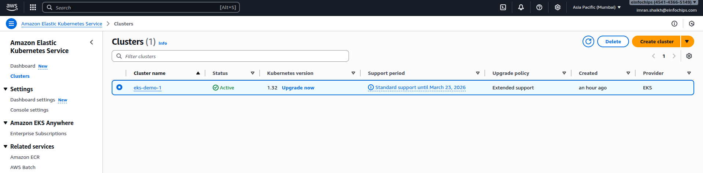
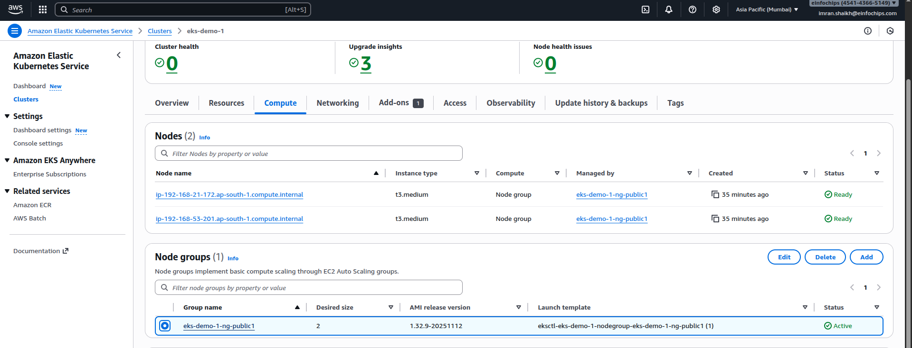
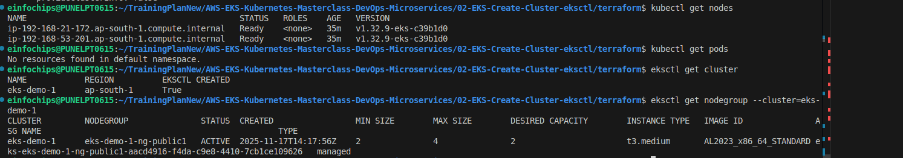

# 02. EKS - Create Cluster using eksctl

## What is EKS?
Amazon Elastic Kubernetes Service (EKS) is a managed Kubernetes service that makes it easy to run Kubernetes on AWS without needing to install and operate your own Kubernetes control plane.

## What is eksctl?
eksctl is a simple CLI tool for creating and managing EKS clusters. It automates many manual steps required to create an EKS cluster.

## Prerequisites
- AWS Account with appropriate permissions
- AWS CLI configured
- kubectl installed
- eksctl installed

## Installation

### Install eksctl (Linux/macOS)
```bash
# Download and install
curl --silent --location "https://github.com/weaveworks/eksctl/releases/latest/download/eksctl_$(uname -s)_amd64.tar.gz" | tar xz -C /tmp
sudo mv /tmp/eksctl /usr/local/bin

# Verify installation
eksctl version
```

### Install kubectl
```bash
# Linux
curl -LO "https://dl.k8s.io/release/$(curl -L -s https://dl.k8s.io/release/stable.txt)/bin/linux/amd64/kubectl"
sudo install -o root -g root -m 0755 kubectl /usr/local/bin/kubectl

# Verify
kubectl version --client
```

## Lab Structure

### Basic Lab
- **Purpose**: Create a simple EKS cluster
- **What we're doing**: Setting up a basic 2-node cluster
- **What we'll achieve**: Working EKS cluster with kubectl access

### Intermediate Lab
- **Purpose**: Create production-ready cluster with custom configuration
- **What we're doing**: Multi-AZ cluster with managed node groups
- **What we'll achieve**: Highly available EKS cluster

### Advanced Lab
- **Purpose**: Create enterprise-grade cluster with Terraform
- **What we're doing**: Infrastructure as Code with advanced networking
- **What we'll achieve**: Fully automated, production-ready EKS infrastructure

## Key Concepts

### EKS Components
1. **Control Plane**: Managed by AWS (API server, etcd, scheduler)
2. **Worker Nodes**: EC2 instances running your containers
3. **Node Groups**: Managed groups of worker nodes
4. **VPC**: Network isolation for your cluster
5. **IAM Roles**: Permissions for cluster and nodes

### Cluster Architecture
```
┌─────────────────────────────────────┐
│     EKS Control Plane (AWS Managed) │
│  - API Server                       │
│  - etcd                             │
│  - Scheduler                        │
└─────────────────────────────────────┘
              │
    ┌─────────┴─────────┐
    │                   │
┌───▼────┐         ┌───▼────┐
│ Node 1 │         │ Node 2 │
│ (EC2)  │         │ (EC2)  │
└────────┘         └────────┘
```

## Create EKS Cluster & Node Groups

### Step-01: Create EKS Cluster using eksctl
It will take 15 to 20 minutes to create the Cluster Control Plane

```bash
# Create Cluster
eksctl create cluster --name=eks-demo-1 \
                      --region=ap-south-1 \
                      --zones=ap-south-1a,ap-south-1b \
                      --without-nodegroup \
                      --tags Owner=imran.shaikh@einfochips.com,Project="Internal POC",DM="Shahid Raza",Department=PES-Digital,Environment=dev,ENDDate=30-11-2025,ManagedBy=eksctl


# Get List of clusters
eksctl get cluster
```

### Step-02: Create & Associate IAM OIDC Provider
To enable AWS IAM roles for Kubernetes service accounts:

```bash
# Associate OIDC provider
eksctl utils associate-iam-oidc-provider \
    --region ap-south-1 \
    --cluster eks-demo-1 \
    --approve
```

### Step-03: Create EC2 Keypair
Create a new EC2 Keypair with name `eks-demo-1_keyIMR` in ap-south-1 region.

### Step-04: Create Node Group
```bash
# Create Public Node Group   
eksctl create nodegroup --cluster=eks-demo-1 \
                       --region=ap-south-1 \
                       --name=eks-demo-1-ng-public1 \
                       --node-type=t3.medium \
                       --nodes=2 \
                       --nodes-min=2 \
                       --nodes-max=4 \
                       --node-volume-size=20 \
                       --ssh-access \
                       --ssh-public-key=eks-demo-1_keyIMR \
                       --managed \
                       --asg-access \
                       --external-dns-access \
                       --full-ecr-access \
                       --appmesh-access \
                       --alb-ingress-access \
                       --tags Owner=imran.shaikh@einfochips.com,Project="Internal POC",DM="Shahid Raza",Department=PES-Digital,Environment=dev,ENDDate=30-11-2025
```

### Step-05: Verify Cluster & Nodes
```bash
# List EKS clusters
eksctl get cluster

# List NodeGroups in a cluster
eksctl get nodegroup --cluster=eks-demo-1

# List Nodes in current kubernetes cluster
kubectl get nodes -o wide

# Check kubectl context
kubectl config view --minify
```

### Step-06: Cleanup
```bash
# Delete node group first
eksctl delete nodegroup --cluster=eks-demo-1 --name=eks-demo-1-ng-public1 --region=ap-south-1

# Delete cluster
eksctl delete cluster --region=ap-south-1 --name=eks-demo-1
```

## Screenshots

,,,)

