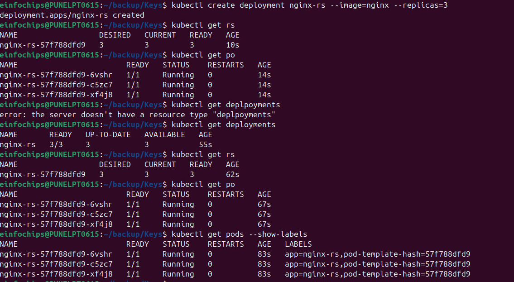
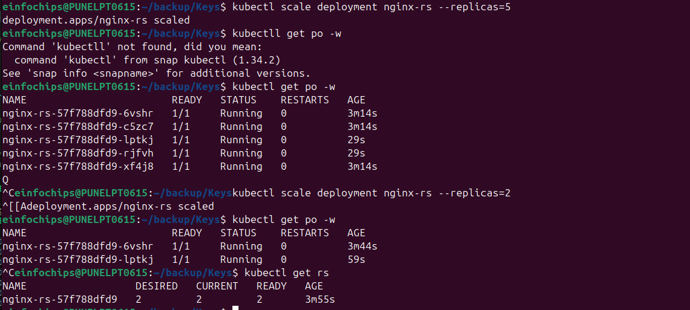
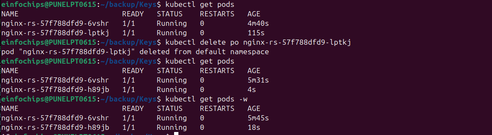
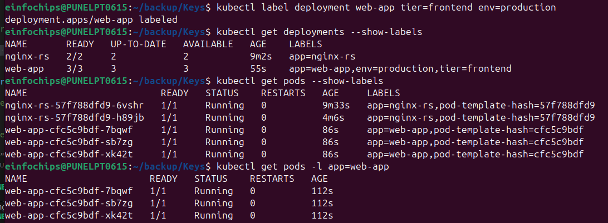
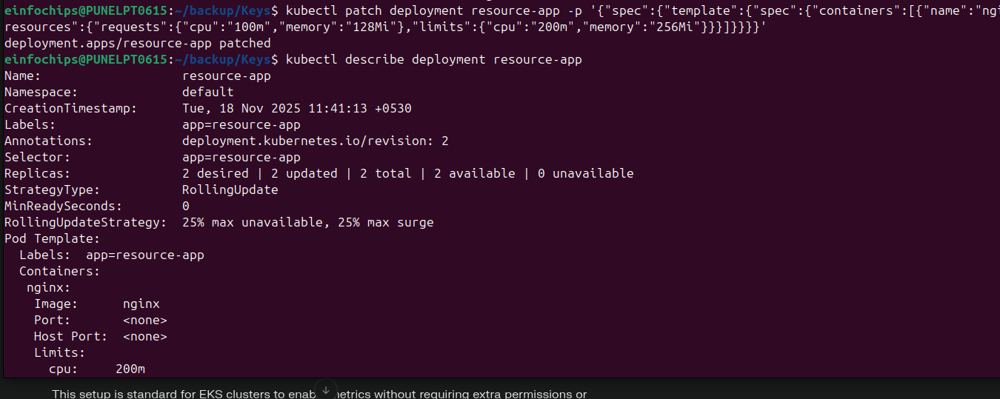
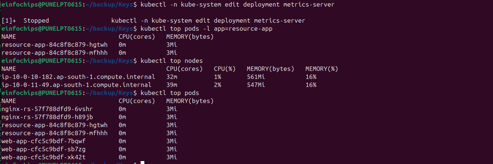
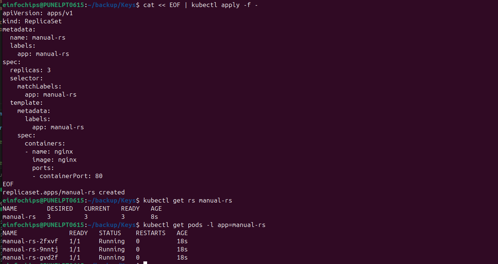

# Lab 2: ReplicaSets and Scaling

## What We're Achieving
Master ReplicaSets for ensuring desired number of pod replicas are running. Learn scaling, self-healing, and pod management at scale.

## What We're Doing
- Creating and managing ReplicaSets
- Understanding pod replication and scaling
- Implementing self-healing mechanisms
- Managing pod templates and selectors
- Scaling applications up and down

## Prerequisites
- Completed Lab 1 (Pods)
- EKS cluster running
- kubectl configured

## Definitions

### ReplicaSet
A ReplicaSet ensures that a specified number of pod replicas are running at any given time. It's a higher-level abstraction that manages pods.

### Key Components
- **Replica Count**: Desired number of pods
- **Pod Template**: Template for creating new pods
- **Selector**: Labels to identify which pods to manage

### Self-Healing
If a pod fails or is deleted, ReplicaSet automatically creates a new pod to maintain the desired count.

## Lab Exercises

### Exercise 1: Create ReplicaSet via Deployment
```bash
# Create deployment (which creates ReplicaSet)
kubectl create deployment nginx-rs --image=nginx --replicas=3

# Check deployment, replicaset, and pods
kubectl get deployments
kubectl get replicasets
kubectl get pods

# See the relationship
kubectl get pods --show-labels
```

**Expected Output:**
```
NAME                        READY   UP-TO-DATE   AVAILABLE   AGE
deployment.apps/nginx-rs    3/3     3            3           30s

NAME                                   DESIRED   CURRENT   READY   AGE
replicaset.apps/nginx-rs-7d4b7b8c5d   3         3         3       30s
```
### Screenshot


### Exercise 2: Scaling Operations
```bash
# Scale up to 5 replicas
kubectl scale deployment nginx-rs --replicas=5

# Watch pods being created
kubectl get pods -w
# Press Ctrl+C to stop watching

# Scale down to 2 replicas
kubectl scale deployment nginx-rs --replicas=2

# Verify scaling
kubectl get pods
kubectl get rs
```
### Screenshot:


### Exercise 3: Self-Healing Demonstration
```bash
# Get current pods
kubectl get pods

# Delete one pod manually
POD_NAME=$(kubectl get pods -l app=nginx-rs -o jsonpath='{.items[0].metadata.name}')
kubectl delete pod $POD_NAME

# Watch ReplicaSet create new pod
kubectl get pods -w
# You'll see the deleted pod terminating and new pod creating
```
### Screenshot


### Exercise 4: ReplicaSet with Labels
```bash
# Create deployment with custom labels
kubectl create deployment web-app --image=nginx --replicas=3
kubectl label deployment web-app tier=frontend env=production

# Check labels
kubectl get deployments --show-labels
kubectl get pods --show-labels

# Filter by labels
kubectl get pods -l app=web-app
kubectl get pods -l tier=frontend
```
### Screenshot:


### Exercise 5: Resource Management with ReplicaSets
```bash
# Create deployment with resource limits
kubectl create deployment resource-app --image=nginx --replicas=2

# Add resource limits (patch the deployment)
kubectl patch deployment resource-app -p '{"spec":{"template":{"spec":{"containers":[{"name":"nginx","resources":{"requests":{"cpu":"100m","memory":"128Mi"},"limits":{"cpu":"200m","memory":"256Mi"}}}]}}}}'

# Check resource allocation
kubectl describe deployment resource-app
kubectl top pods -l app=resource-app
```
### Screenshot:



### Exercise 6: Rolling Updates with ReplicaSets
```bash
# Create deployment with specific image version
kubectl create deployment rolling-app --image=nginx:1.20 --replicas=4

# Update to new image version
kubectl set image deployment/rolling-app nginx=nginx:1.21

# Watch the rolling update
kubectl rollout status deployment/rolling-app

# Check ReplicaSet history
kubectl get rs
# You'll see old and new ReplicaSets
```
### Screenshot:


### Exercise 7: Manual ReplicaSet Creation (YAML)
```bash
# Create ReplicaSet directly (not recommended in production)
cat << EOF | kubectl apply -f -
apiVersion: apps/v1
kind: ReplicaSet
metadata:
  name: manual-rs
  labels:
    app: manual-rs
spec:
  replicas: 3
  selector:
    matchLabels:
      app: manual-rs
  template:
    metadata:
      labels:
        app: manual-rs
    spec:
      containers:
      - name: nginx
        image: nginx
        ports:
        - containerPort: 80
EOF

# Check the ReplicaSet
kubectl get rs manual-rs
kubectl get pods -l app=manual-rs
```
### Screenshot:


## Advanced Exercises

### Exercise 8: Horizontal Pod Autoscaling (HPA)
```bash
# Create deployment for autoscaling
kubectl create deployment hpa-demo --image=nginx --replicas=2

# Create HPA (requires metrics-server)
kubectl autoscale deployment hpa-demo --cpu-percent=50% --min=2 --max=10

# Check HPA status
kubectl get hpa
kubectl describe hpa hpa-demo
```

### Exercise 9: ReplicaSet Troubleshooting
```bash
# Create a problematic ReplicaSet
cat << EOF | kubectl apply -f -
apiVersion: apps/v1
kind: ReplicaSet
metadata:
  name: problem-rs
spec:
  replicas: 3
  selector:
    matchLabels:
      app: problem-app
  template:
    metadata:
      labels:
        app: different-label  # Mismatch!
    spec:
      containers:
      - name: nginx
        image: nginx:invalid-tag
EOF

# Troubleshoot the issues
kubectl get rs problem-rs
kubectl describe rs problem-rs
kubectl get events --sort-by=.metadata.creationTimestamp
```

## Monitoring and Observability

### Useful Commands
```bash
# Monitor ReplicaSet status
kubectl get rs -w

# Check pod distribution across nodes
kubectl get pods -o wide

# View ReplicaSet events
kubectl describe rs <replicaset-name>

# Check resource usage
kubectl top pods
kubectl top nodes
```

## Cleanup
```bash
# Delete all deployments and ReplicaSets
kubectl delete deployment nginx-rs web-app resource-app rolling-app hpa-demo
kubectl delete rs manual-rs problem-rs
kubectl delete hpa hpa-demo

# Verify cleanup
kubectl get deployments
kubectl get rs
kubectl get pods
```

## Cost Considerations
- More replicas = more resource usage
- Use appropriate replica counts for your needs
- Consider using HPA for automatic scaling
- Monitor resource utilization to optimize costs

## Troubleshooting Guide

### Common Issues
1. **Pods not starting**: Check image name, resource limits
2. **Scaling not working**: Verify ReplicaSet controller is running
3. **Label mismatch**: Ensure selector matches pod template labels
4. **Resource constraints**: Check node capacity and resource requests

### Debug Commands
```bash
# Check ReplicaSet controller
kubectl get pods -n kube-system | grep replicaset

# View detailed ReplicaSet info
kubectl describe rs <name>

# Check events
kubectl get events --field-selector involvedObject.kind=ReplicaSet
```

## Key Takeaways
1. ReplicaSets ensure desired number of pods are running
2. Self-healing automatically replaces failed pods
3. Scaling can be done manually or automatically (HPA)
4. Labels and selectors are crucial for ReplicaSet management
5. Deployments are preferred over direct ReplicaSet creation
6. Rolling updates create new ReplicaSets while maintaining availability

## Next Steps
- Move to Lab 3: Deployments and Updates
- Practice scaling scenarios
- Understand the relationship between Deployments and ReplicaSets