# Lab 3: Deployments and Updates

## What We're Achieving
Master Kubernetes Deployments for declarative application updates, rollbacks, and advanced deployment strategies. Learn production-ready application management.

## What We're Doing
- Creating and managing Deployments
- Performing rolling updates and rollbacks
- Understanding deployment strategies
- Managing application versions and history
- Implementing zero-downtime deployments

## Prerequisites
- Completed Lab 1 (Pods) and Lab 2 (ReplicaSets)
- EKS cluster running
- kubectl configured

## Definitions

### Deployment
A Deployment provides declarative updates for Pods and ReplicaSets. It manages the desired state and handles updates automatically.

### Rolling Update
Default strategy that gradually replaces old pods with new ones, ensuring zero downtime.

### Rollback
Process of reverting to a previous deployment version when issues occur.

### Deployment Strategies
- **Rolling Update**: Gradual replacement (default)
- **Recreate**: Delete all pods, then create new ones
- **Blue-Green**: Switch traffic between two identical environments
- **Canary**: Gradual traffic shift to new version

## Lab Exercises

### Exercise 1: Basic Deployment Creation
```bash
# Create a deployment
kubectl create deployment web-app --image=nginx:1.20 --replicas=3

# Check deployment status
kubectl get deployments
kubectl get rs
kubectl get pods

# View deployment details
kubectl describe deployment web-app

# Check rollout status
kubectl rollout status deployment/web-app
```

**Expected Output:**
```
NAME      READY   UP-TO-DATE   AVAILABLE   AGE
web-app   3/3     3            3           30s
```

### Exercise 2: Rolling Update
```bash
# Update the image version
kubectl set image deployment/web-app nginx=nginx:1.21

# Watch the rolling update
kubectl rollout status deployment/web-app

# Monitor pods during update
kubectl get pods -w
# You'll see old pods terminating and new pods creating

# Check ReplicaSets
kubectl get rs
# You'll see old RS scaled down and new RS scaled up
```
### Screenshot:
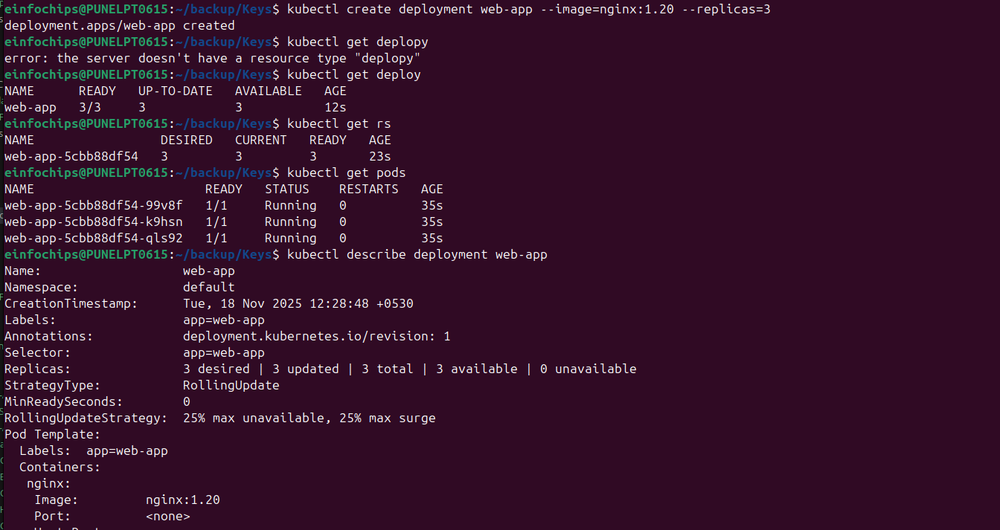
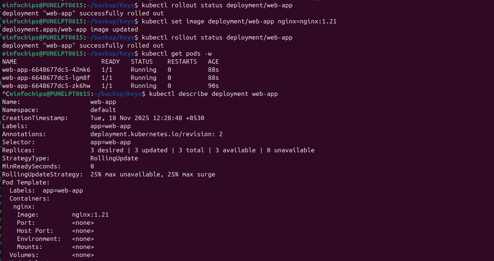
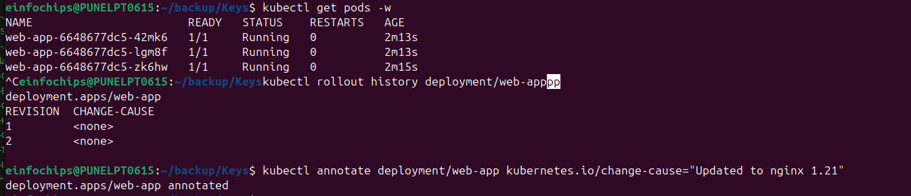

### Exercise 3: Rollout History and Rollback
```bash
# View rollout history
kubectl rollout history deployment/web-app

# Add annotation for better tracking
kubectl annotate deployment/web-app kubernetes.io/change-cause="Updated to nginx 1.21"

# Perform another update
kubectl set image deployment/web-app nginx=nginx:1.22
kubectl annotate deployment/web-app kubernetes.io/change-cause="Updated to nginx 1.22"

# Check history again
kubectl rollout history deployment/web-app

# Rollback to previous version
kubectl rollout undo deployment/web-app

# Rollback to specific revision
kubectl rollout undo deployment/web-app --to-revision=1

# Check rollback status
kubectl rollout status deployment/web-app
```
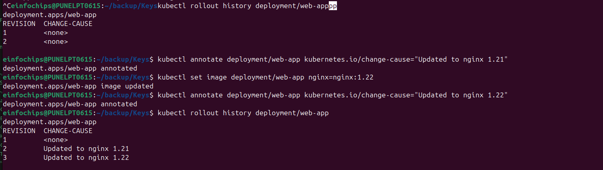
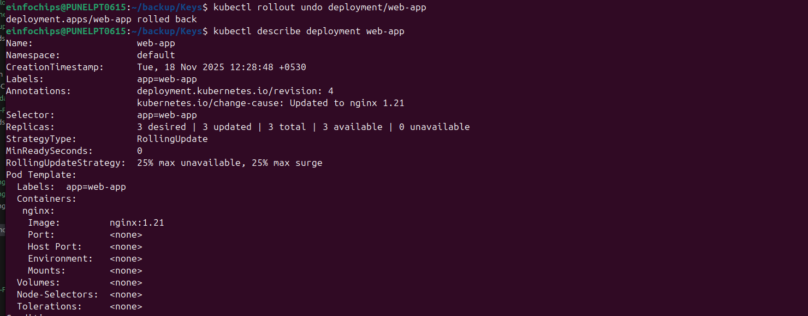
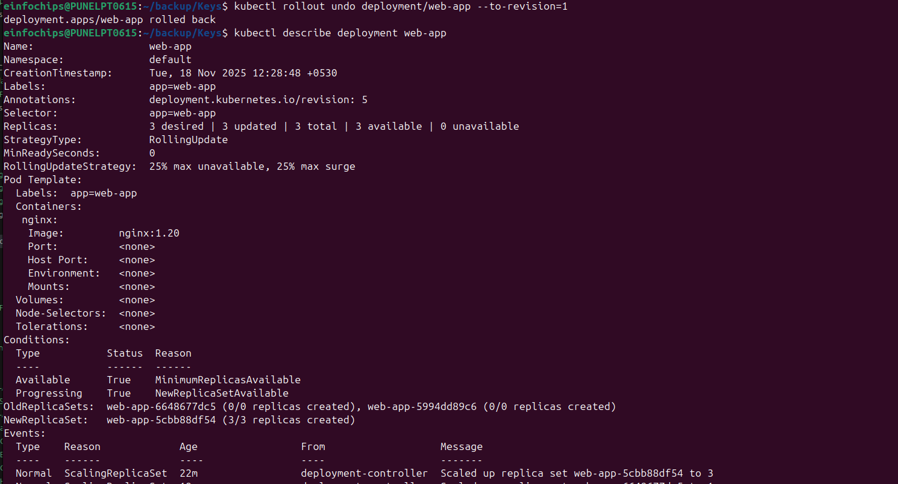
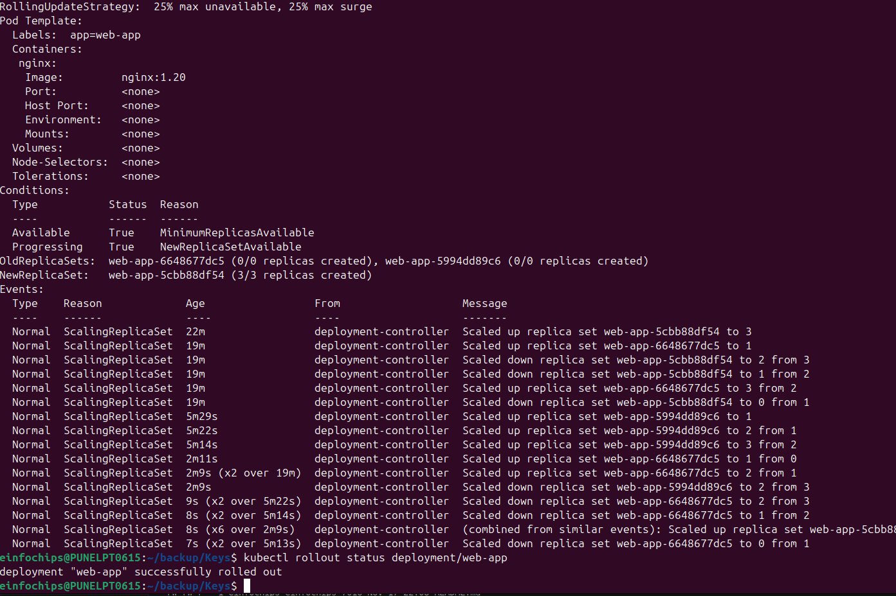

### Exercise 4: Deployment with Resource Management
```bash
# Create deployment with resource specifications
kubectl create deployment resource-app --image=nginx --replicas=3

# Update with resource limits
kubectl patch deployment resource-app -p '{
  "spec": {
    "template": {
      "spec": {
        "containers": [{
          "name": "nginx",
          "resources": {
            "requests": {"cpu": "100m", "memory": "128Mi"},
            "limits": {"cpu": "200m", "memory": "256Mi"}
          }
        }]
      }
    }
  }
}'

# Verify resource allocation
kubectl describe deployment resource-app
kubectl top pods -l app=resource-app
```
### Screenshot:
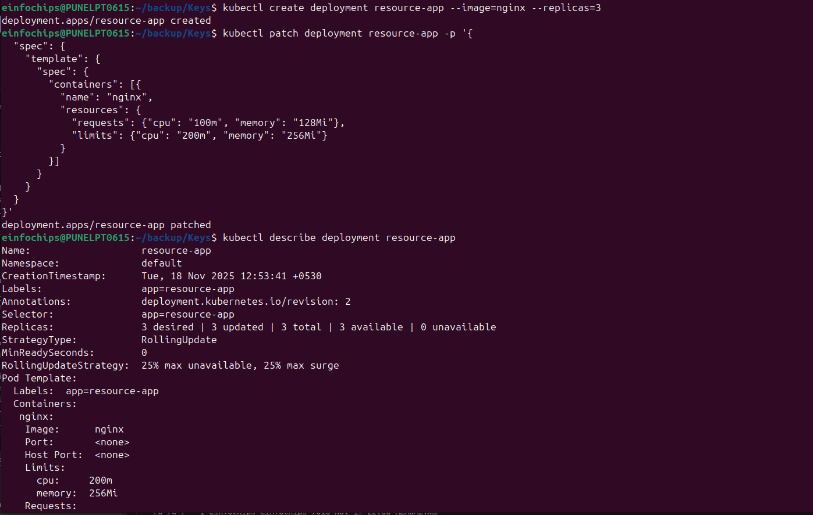
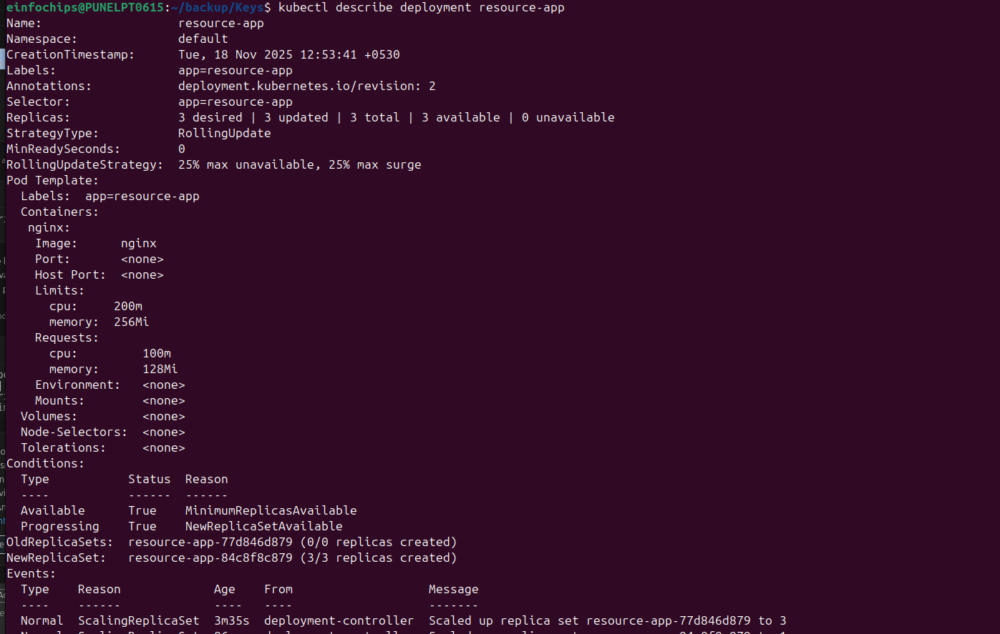

### Exercise 5: Deployment Strategies
```bash
# Create deployment with rolling update strategy
cat << EOF | kubectl apply -f -
apiVersion: apps/v1
kind: Deployment
metadata:
  name: rolling-app
spec:
  replicas: 6
  strategy:
    type: RollingUpdate
    rollingUpdate:
      maxUnavailable: 1
      maxSurge: 1
  selector:
    matchLabels:
      app: rolling-app
  template:
    metadata:
      labels:
        app: rolling-app
    spec:
      containers:
      - name: nginx
        image: nginx:1.20
        ports:
        - containerPort: 80
EOF

# Update the image and watch the strategy
kubectl set image deployment/rolling-app nginx=nginx:1.21
kubectl get pods -w
```

### Exercise 6: Recreate Strategy
```bash
# Create deployment with recreate strategy
cat << EOF | kubectl apply -f -
apiVersion: apps/v1
kind: Deployment
metadata:
  name: recreate-app
spec:
  replicas: 3
  strategy:
    type: Recreate
  selector:
    matchLabels:
      app: recreate-app
  template:
    metadata:
      labels:
        app: recreate-app
    spec:
      containers:
      - name: nginx
        image: nginx:1.20
        ports:
        - containerPort: 80
EOF

# Update and observe recreate behavior
kubectl set image deployment/recreate-app nginx=nginx:1.21
kubectl get pods -w
# All pods will terminate before new ones start
```
### Screenshot:
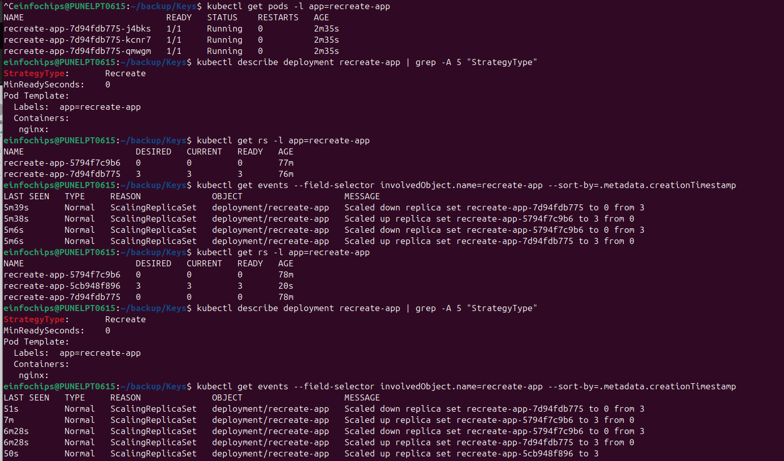

### Exercise 7: Deployment Scaling
```bash
# Scale deployment up
kubectl scale deployment web-app --replicas=5

# Scale deployment down
kubectl scale deployment web-app --replicas=2

# Auto-scaling with HPA
kubectl autoscale deployment web-app --cpu-percent=70 --min=2 --max=8

# Check HPA status
kubectl get hpa
```
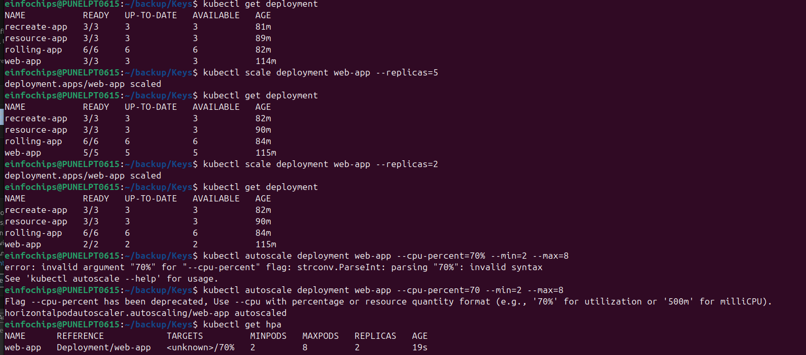

### Exercise 8: Deployment with Health Checks
```bash
# Create deployment with readiness and liveness probes
cat << EOF | kubectl apply -f -
apiVersion: apps/v1
kind: Deployment
metadata:
  name: health-app
spec:
  replicas: 3
  selector:
    matchLabels:
      app: health-app
  template:
    metadata:
      labels:
        app: health-app
    spec:
      containers:
      - name: nginx
        image: nginx
        ports:
        - containerPort: 80
        readinessProbe:
          httpGet:
            path: /
            port: 80
          initialDelaySeconds: 5
          periodSeconds: 10
        livenessProbe:
          httpGet:
            path: /
            port: 80
          initialDelaySeconds: 15
          periodSeconds: 20
EOF

# Check pod health status
kubectl get pods
kubectl describe pod <pod-name>
```

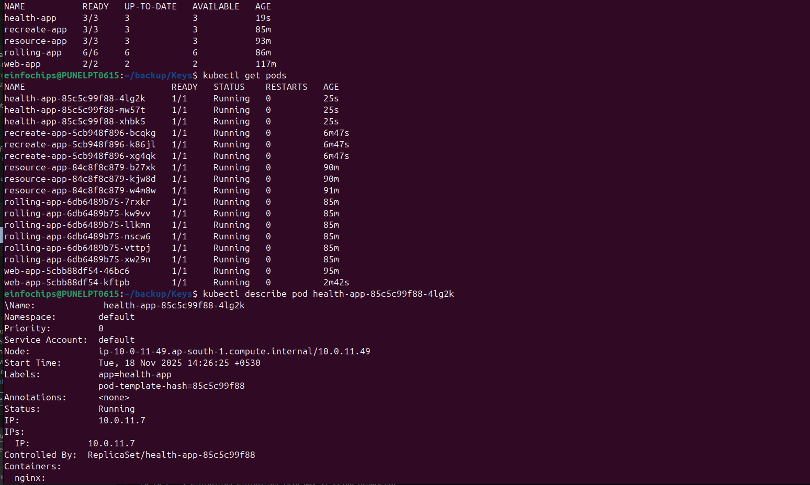
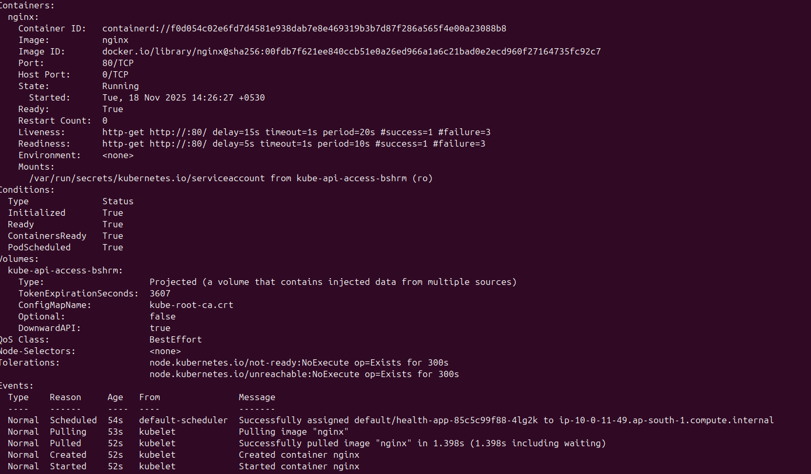

## Advanced Exercises

### Exercise 9: Blue-Green Deployment Simulation
```bash
# Create "blue" deployment
kubectl create deployment blue-app --image=nginx:1.20 --replicas=3
kubectl label deployment blue-app version=blue

# Create service pointing to blue
kubectl expose deployment blue-app --port=80 --target-port=80 --name=app-service

# Create "green" deployment
kubectl create deployment green-app --image=nginx:1.21 --replicas=3
kubectl label deployment green-app version=green

# Switch service to green (simulate traffic switch)
kubectl patch service app-service -p '{"spec":{"selector":{"app":"green-app"}}}'

# Verify switch
kubectl describe service app-service
```
### Screenshot:
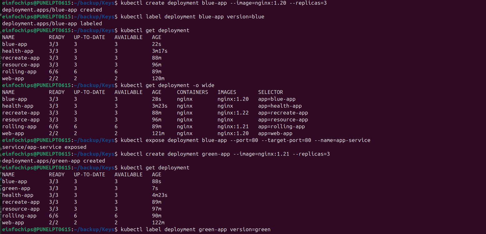
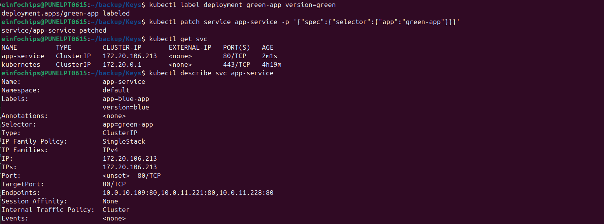

### Exercise 10: Canary Deployment
```bash
# Create main deployment
kubectl create deployment main-app --image=nginx:1.20 --replicas=9

# Create canary deployment (10% traffic)
kubectl create deployment canary-app --image=nginx:1.21 --replicas=1

# Label both for service selection
kubectl label deployment main-app app=web version=stable --overwrite
kubectl label deployment canary-app app=web version=canary --overwrite
kubectl label deployment main-app app=web version=stable
kubectl label deployment canary-app app=web version=canary

# Create service for both
kubectl expose deployment main-app --port=80 --name=web-service --selector=app=web

# Check traffic distribution
kubectl get pods -l app=web --show-labels

here Main app: 9 replicas (90% of traffic)

Canary app: 1 replica (10% of traffic)

Service: Routes traffic to both based on app=web label
```
### Screenshot:

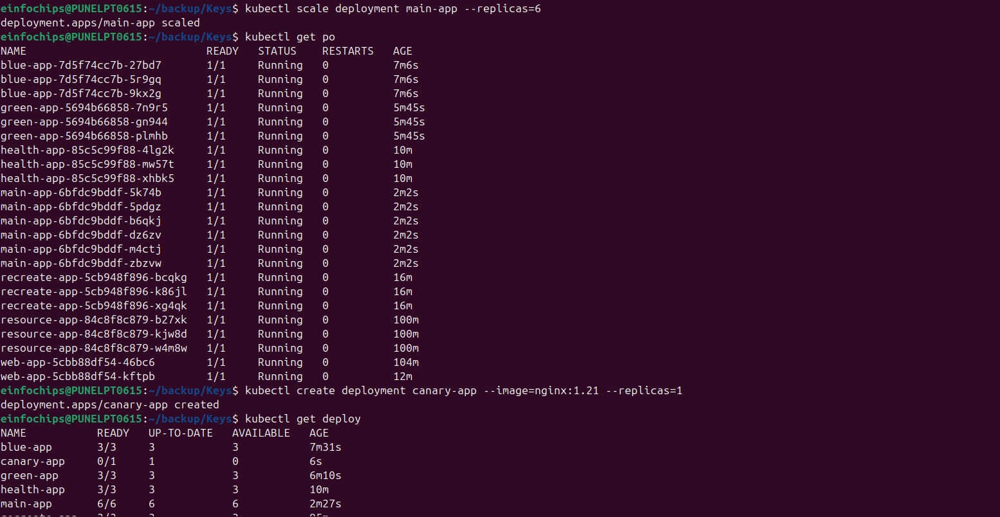
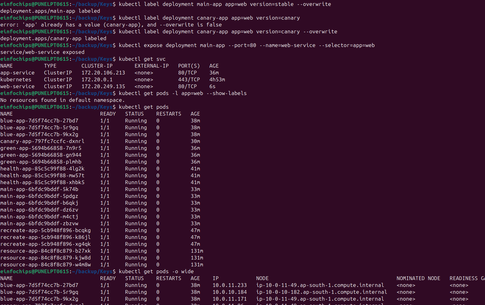
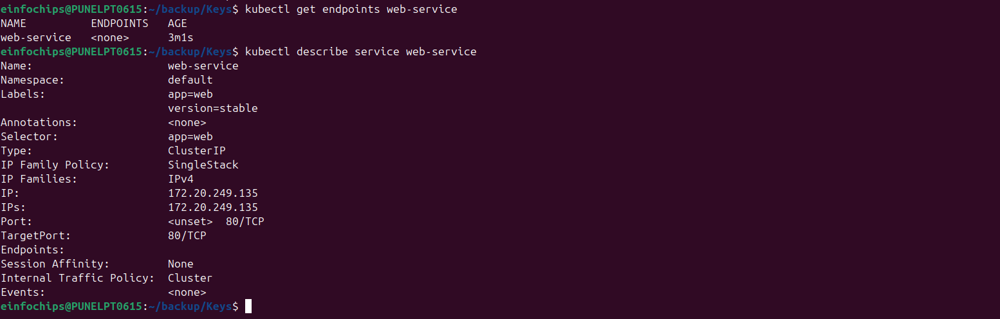

## Monitoring and Troubleshooting

### Useful Commands
```bash
# Monitor deployment progress
kubectl get deployments -w

# Check deployment events
kubectl describe deployment <name>

# View rollout status
kubectl rollout status deployment/<name>

# Pause/Resume rollout
kubectl rollout pause deployment/<name>
kubectl rollout resume deployment/<name>

# Check resource usage
kubectl top pods -l app=<app-name>
```

### Troubleshooting Failed Deployments
```bash
# Check deployment status
kubectl get deployments
kubectl describe deployment <name>

# Check ReplicaSet issues
kubectl get rs
kubectl describe rs <replicaset-name>

# Check pod issues
kubectl get pods
kubectl describe pod <pod-name>
kubectl logs <pod-name>

# Check events
kubectl get events --sort-by=.metadata.creationTimestamp
```

## Cleanup
```bash
# Delete all deployments
kubectl delete deployment web-app resource-app rolling-app recreate-app health-app blue-app green-app main-app canary-app

# Delete services and HPA
kubectl delete service app-service web-service
kubectl delete hpa web-app

# Verify cleanup
kubectl get deployments
kubectl get services
kubectl get hpa
```

## Cost Considerations
- Rolling updates temporarily increase resource usage (old + new pods)
- Use appropriate `maxSurge` and `maxUnavailable` settings
- Monitor resource utilization during deployments
- Consider using Spot instances for non-critical workloads

## Best Practices
1. Always use Deployments instead of direct ReplicaSets
2. Set resource requests and limits
3. Implement health checks (readiness/liveness probes)
4. Use meaningful change-cause annotations
5. Test rollbacks in non-production environments
6. Monitor deployment progress and set timeouts
7. Use appropriate deployment strategies for your use case

## Key Takeaways
1. Deployments provide declarative updates for applications
2. Rolling updates ensure zero-downtime deployments
3. Rollbacks allow quick recovery from issues
4. Different strategies suit different application needs
5. Health checks are crucial for reliable deployments
6. Resource management prevents deployment failures
7. Monitoring and observability are essential

## Next Steps
- Move to Lab 4: Services and Networking
- Practice different deployment strategies
- Implement CI/CD pipelines with deployments
- Learn about advanced deployment patterns