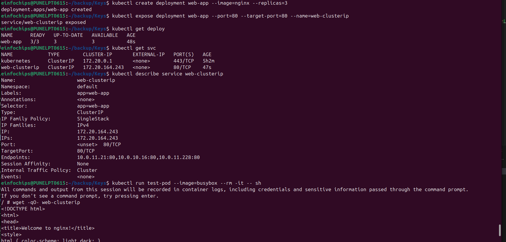
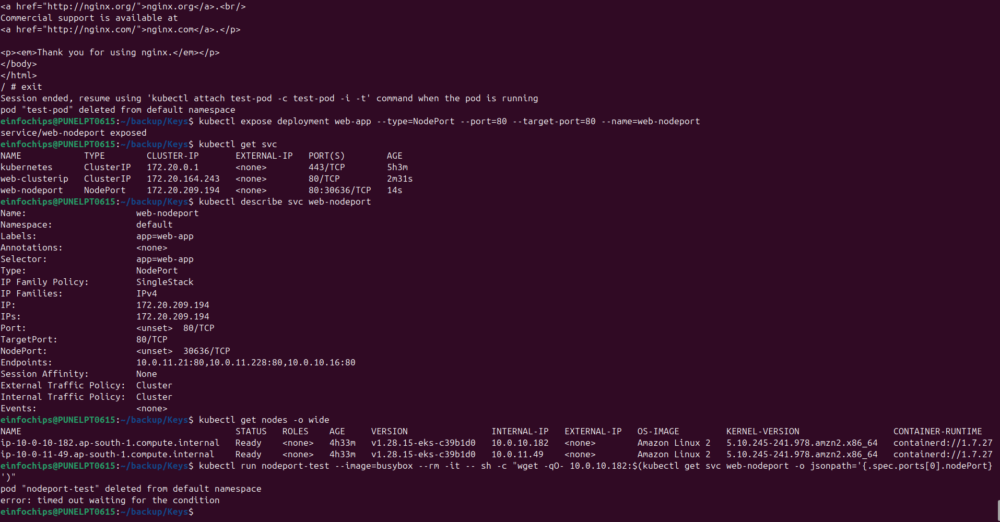
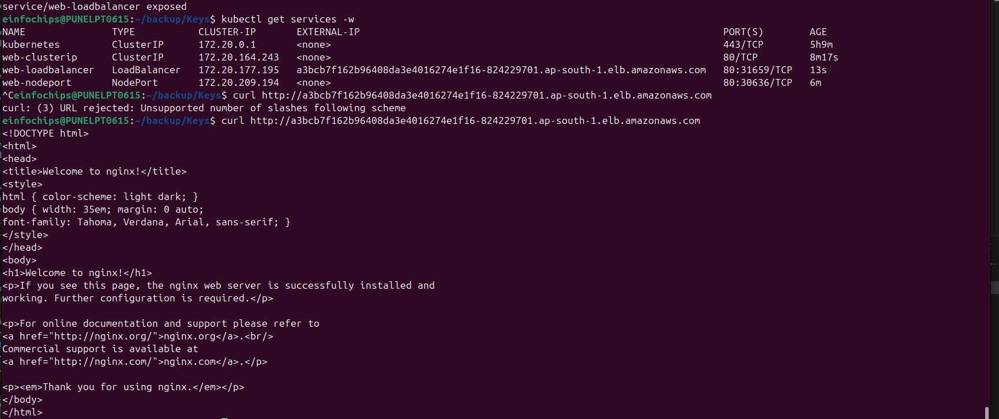
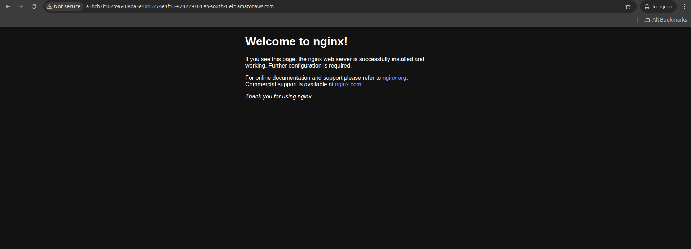
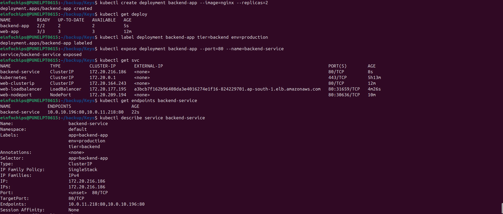
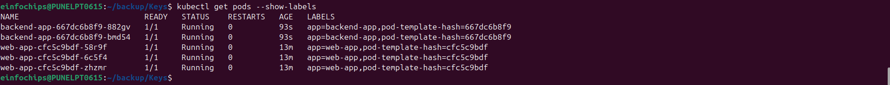
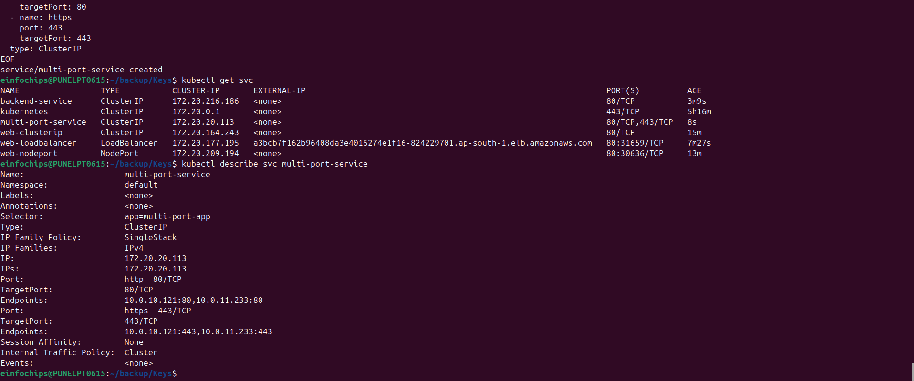
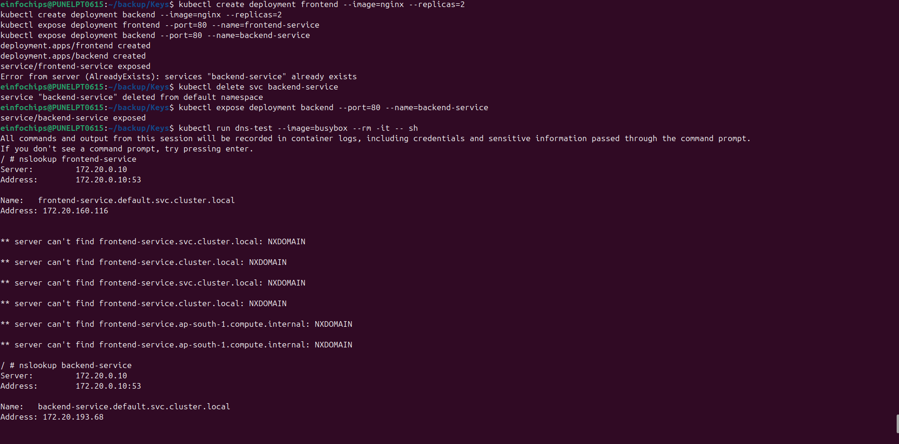
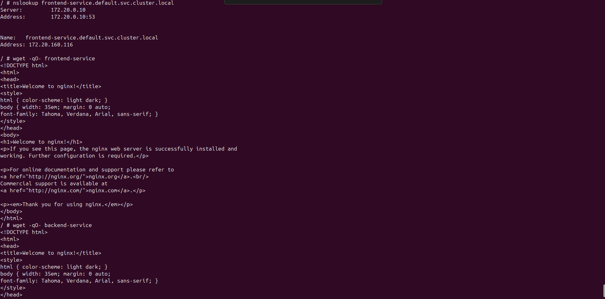
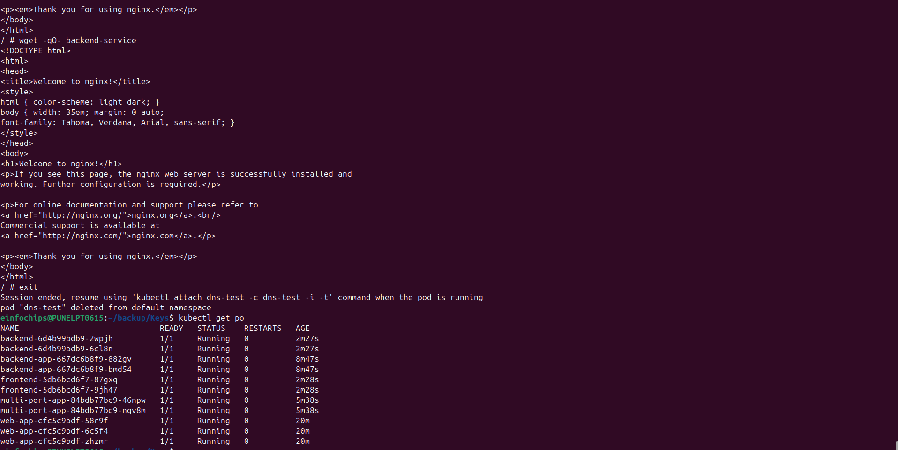

# Lab 4: Services and Networking

## What We're Achieving
Master Kubernetes Services for network access to applications. Learn service types, service discovery, load balancing, and networking fundamentals.

## What We're Doing
- Creating different types of Services
- Understanding service discovery and DNS
- Implementing load balancing strategies
- Managing network access and security
- Connecting applications within the cluster

## Prerequisites
- Completed Labs 1-3 (Pods, ReplicaSets, Deployments)
- EKS cluster running
- kubectl configured

## Definitions

### Service
A Service is an abstraction that defines a logical set of Pods and a policy to access them. Services enable loose coupling between dependent Pods.

### Service Types
- **ClusterIP**: Internal cluster access only (default)
- **NodePort**: Exposes service on each node's IP at a static port
- **LoadBalancer**: Exposes service externally using cloud provider's load balancer
- **ExternalName**: Maps service to external DNS name

### Service Discovery
Kubernetes provides DNS-based service discovery. Services get DNS names in the format: `<service-name>.<namespace>.svc.cluster.local`

## Lab Exercises

### Exercise 1: ClusterIP Service (Internal Access)
```bash
# Create a deployment
kubectl create deployment web-app --image=nginx --replicas=3

# Expose as ClusterIP service (default)
kubectl expose deployment web-app --port=80 --target-port=80 --name=web-clusterip

# Check service details
kubectl get services
kubectl describe service web-clusterip

# Test internal access
kubectl run test-pod --image=busybox --rm -it -- sh
# Inside the pod:
# wget -qO- web-clusterip
# wget -qO- web-clusterip.default.svc.cluster.local
# exit
```

**Expected Output:**
```
NAME            TYPE        CLUSTER-IP      EXTERNAL-IP   PORT(S)   AGE
web-clusterip   ClusterIP   10.100.200.10   <none>        80/TCP    30s
```

### Exercise 2: NodePort Service (External Access)
```bash
# Create NodePort service
kubectl expose deployment web-app --type=NodePort --port=80 --target-port=80 --name=web-nodeport

# Check service details
kubectl get services
kubectl describe service web-nodeport

# Get node external IP
kubectl get nodes -o wide

# Test external access (replace with actual node IP)
# curl http://<NODE-EXTERNAL-IP>:<NODE-PORT>
Since your nodes are in private subnets without external IPs, you can test the NodePort service from within the cluster:
kubectl run nodeport-test --image=busybox --rm -it -- sh -c "wget -qO- 10.0.10.182:$(kubectl get svc web-nodeport -o jsonpath='{.spec.ports[0].nodePort}
')"
kubectl get svc web-nodeport -o jsonpath='{.spec.ports[0].nodePort}'
The NodePort service demonstrates external access capability. In a production environment with public nodes or a load balancer, you'd access it via http://<NODE-EXTERNAL-IP>:<NODE-PORT>
```
### Screenshot:



### Exercise 3: LoadBalancer Service (Cloud Load Balancer)
```bash
# Create LoadBalancer service
kubectl expose deployment web-app --type=LoadBalancer --port=80 --target-port=80 --name=web-loadbalancer

# Check service (may take a few minutes for external IP)
kubectl get services -w
# Wait for EXTERNAL-IP to be assigned

# Test external access
# curl http://<EXTERNAL-IP>
```
### Screenshot:



### Exercise 4: Service with Selectors and Labels
```bash
# Create deployment with custom labels
kubectl create deployment backend-app --image=nginx --replicas=2
kubectl label deployment backend-app tier=backend env=production

# Create service with specific selector
kubectl expose deployment backend-app --port=80 --name=backend-service

# Check service endpoints
kubectl get endpoints backend-service
kubectl describe service backend-service

# Test label-based selection
kubectl get pods --show-labels
```
### Screenshot:



### Exercise 5: Multi-Port Service
```bash
# Create deployment with multiple ports
cat << EOF | kubectl apply -f -
apiVersion: apps/v1
kind: Deployment
metadata:
  name: multi-port-app
spec:
  replicas: 2
  selector:
    matchLabels:
      app: multi-port-app
  template:
    metadata:
      labels:
        app: multi-port-app
    spec:
      containers:
      - name: nginx
        image: nginx
        ports:
        - containerPort: 80
          name: http
        - containerPort: 443
          name: https
EOF

# Create multi-port service
cat << EOF | kubectl apply -f -
apiVersion: v1
kind: Service
metadata:
  name: multi-port-service
spec:
  selector:
    app: multi-port-app
  ports:
  - name: http
    port: 80
    targetPort: 80
  - name: https
    port: 443
    targetPort: 443
  type: ClusterIP
EOF

# Check service
kubectl describe service multi-port-service
```
### Screenshot



### Exercise 6: Service Discovery and DNS
```bash
# Create multiple services
kubectl create deployment frontend --image=nginx --replicas=2
kubectl create deployment backend --image=nginx --replicas=2
kubectl expose deployment frontend --port=80 --name=frontend-service
kubectl expose deployment backend --port=80 --name=backend-service

# Test service discovery
kubectl run dns-test --image=busybox --rm -it -- sh
# Inside the pod, test DNS resolution:
# nslookup frontend-service
# nslookup backend-service
# nslookup frontend-service.default.svc.cluster.local
# wget -qO- frontend-service
# wget -qO- backend-service
# exit
```
### Screenshot




### Exercise 7: Headless Service
```bash
# Create headless service (ClusterIP: None)
cat << EOF | kubectl apply -f -
apiVersion: v1
kind: Service
metadata:
  name: headless-service
spec:
  clusterIP: None
  selector:
    app: web-app
  ports:
  - port: 80
    targetPort: 80
EOF

# Check headless service
kubectl describe service headless-service

# Test DNS resolution (returns individual pod IPs)
kubectl run dns-test --image=busybox --rm -it -- nslookup headless-service
```

### Exercise 8: ExternalName Service
```bash
# Create ExternalName service
cat << EOF | kubectl apply -f -
apiVersion: v1
kind: Service
metadata:
  name: external-service
spec:
  type: ExternalName
  externalName: google.com
EOF

# Test external service
kubectl run external-test --image=busybox --rm -it -- nslookup external-service
```

## Advanced Exercises

### Exercise 9: Service with Session Affinity
```bash
# Create service with session affinity
cat << EOF | kubectl apply -f -
apiVersion: v1
kind: Service
metadata:
  name: sticky-service
spec:
  selector:
    app: web-app
  ports:
  - port: 80
    targetPort: 80
  sessionAffinity: ClientIP
  sessionAffinityConfig:
    clientIP:
      timeoutSeconds: 300
EOF

# Test session affinity
kubectl describe service sticky-service
```

### Exercise 10: Service Mesh Preparation
```bash
# Create services for microservices architecture
kubectl create deployment user-service --image=nginx --replicas=2
kubectl create deployment order-service --image=nginx --replicas=2
kubectl create deployment payment-service --image=nginx --replicas=2

# Expose all services
kubectl expose deployment user-service --port=80 --name=user-svc
kubectl expose deployment order-service --port=80 --name=order-svc
kubectl expose deployment payment-service --port=80 --name=payment-svc

# Test inter-service communication
kubectl run microservice-test --image=busybox --rm -it -- sh
# Inside pod:
# wget -qO- user-svc
# wget -qO- order-svc
# wget -qO- payment-svc
# exit
```

## Network Troubleshooting

### Exercise 11: Network Debugging
```bash
# Create problematic service
kubectl create deployment debug-app --image=nginx --replicas=2
kubectl expose deployment debug-app --port=8080 --target-port=80 --name=debug-service

# Debug connectivity issues
kubectl get services
kubectl get endpoints debug-service
kubectl describe service debug-service

# Test connectivity
kubectl run debug-pod --image=busybox --rm -it -- sh
# Inside pod:
# wget -qO- debug-service:8080
# telnet debug-service 8080
# exit
```

### Useful Debugging Commands
```bash
# Check service endpoints
kubectl get endpoints

# View service details
kubectl describe service <service-name>

# Check DNS resolution
kubectl run dns-debug --image=busybox --rm -it -- nslookup <service-name>

# Test connectivity
kubectl run net-debug --image=nicolaka/netshoot --rm -it -- bash

# Check iptables rules (on nodes)
# sudo iptables -t nat -L | grep <service-name>
```

## Service Monitoring

### Exercise 12: Service Metrics and Monitoring
```bash
# Check service resource usage
kubectl top pods -l app=web-app

# Monitor service endpoints
kubectl get endpoints -w

# Check service events
kubectl get events --field-selector involvedObject.kind=Service

# View service logs (through pods)
kubectl logs -l app=web-app
```

## Cleanup
```bash
# Delete all services
kubectl delete service web-clusterip web-nodeport web-loadbalancer backend-service multi-port-service headless-service external-service sticky-service user-svc order-svc payment-svc debug-service

# Delete deployments
kubectl delete deployment web-app backend-app multi-port-app frontend backend user-service order-service payment-service debug-app

# Verify cleanup
kubectl get services
kubectl get deployments
```

## Cost Considerations
- **LoadBalancer services** create AWS ELB/ALB (~$18/month each)
- **NodePort services** use existing nodes (no additional cost)
- **ClusterIP services** are free (internal only)
- Monitor and delete unused LoadBalancer services

## Network Security Best Practices
1. Use ClusterIP for internal services
2. Implement Network Policies for traffic control
3. Use TLS/SSL for external services
4. Limit NodePort range and access
5. Monitor service access patterns
6. Use service mesh for advanced networking

## Key Takeaways
1. Services provide stable network endpoints for pods
2. Different service types serve different use cases
3. DNS-based service discovery simplifies inter-service communication
4. Labels and selectors determine service endpoints
5. LoadBalancer services integrate with cloud providers
6. Headless services provide direct pod access
7. Service troubleshooting requires understanding endpoints and DNS

## Next Steps
- Move to Lab 5: Troubleshooting and Best Practices
- Learn about Ingress controllers
- Implement Network Policies
- Explore service mesh technologies (Istio, Linkerd)