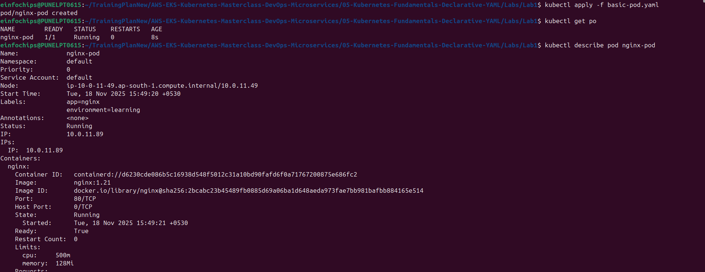
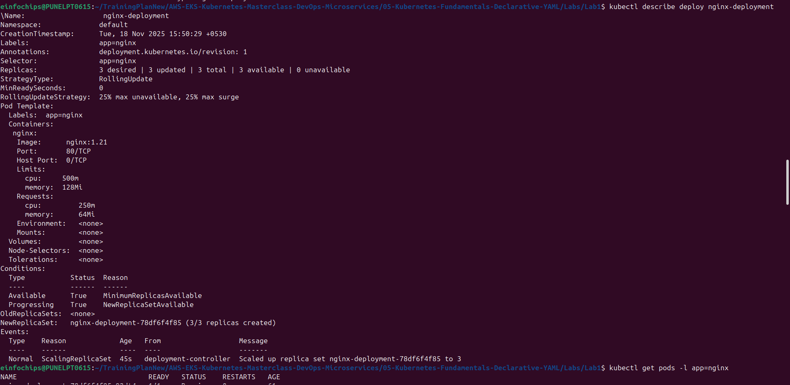
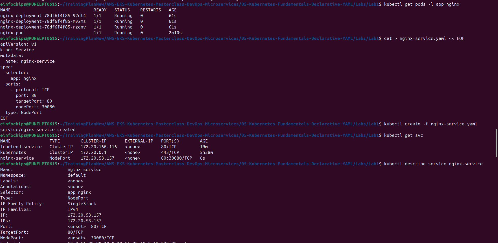
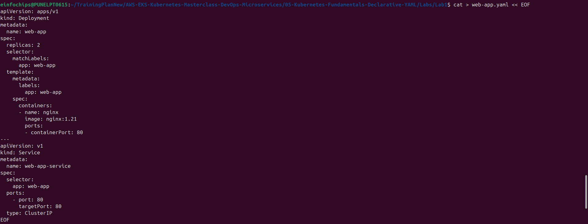

# Lab 1: Basic YAML Manifests

## What We're Achieving
Master creating and managing basic Kubernetes resources using YAML manifests - the foundation of declarative infrastructure.

## What We're Doing
- Creating Pod, Deployment, and Service YAML manifests
- Understanding YAML structure and syntax
- Applying and managing resources declaratively
- Comparing imperative vs declarative approaches

## Prerequisites
- EKS cluster running
- kubectl configured
- Completed imperative fundamentals

## Lab Exercises

### Exercise 1: Basic Pod YAML
```bash
# Create pod manifest
cat > basic-pod.yaml << EOF
apiVersion: v1
kind: Pod
metadata:
  name: nginx-pod
  labels:
    app: nginx
    environment: learning
spec:
  containers:
  - name: nginx
    image: nginx:1.21
    ports:
    - containerPort: 80
    resources:
      requests:
        memory: "64Mi"
        cpu: "250m"
      limits:
        memory: "128Mi"
        cpu: "500m"
EOF

# Apply the manifest
kubectl apply -f basic-pod.yaml

# Verify creation
kubectl get pods
kubectl describe pod nginx-pod
```

### Exercise 2: Deployment YAML
```bash
# Create deployment manifest
cat > nginx-deployment.yaml << EOF
apiVersion: apps/v1
kind: Deployment
metadata:
  name: nginx-deployment
  labels:
    app: nginx
spec:
  replicas: 3
  selector:
    matchLabels:
      app: nginx
  template:
    metadata:
      labels:
        app: nginx
    spec:
      containers:
      - name: nginx
        image: nginx:1.21
        ports:
        - containerPort: 80
        resources:
          requests:
            memory: "64Mi"
            cpu: "250m"
          limits:
            memory: "128Mi"
            cpu: "500m"
EOF

# Apply deployment
kubectl apply -f nginx-deployment.yaml

# Check deployment status
kubectl get deployments
kubectl get pods -l app=nginx
```

### Exercise 3: Service YAML
```bash
# Create service manifest
cat > nginx-service.yaml << EOF
apiVersion: v1
kind: Service
metadata:
  name: nginx-service
spec:
  selector:
    app: nginx
  ports:
    - protocol: TCP
      port: 80
      targetPort: 80
      nodePort: 30080
  type: NodePort
EOF

# Apply service
kubectl apply -f nginx-service.yaml

# Verify service
kubectl get services
kubectl describe service nginx-service
```

### Exercise 4: Multi-Resource YAML
```bash
# Create combined manifest
cat > web-app.yaml << EOF
apiVersion: apps/v1
kind: Deployment
metadata:
  name: web-app
spec:
  replicas: 2
  selector:
    matchLabels:
      app: web-app
  template:
    metadata:
      labels:
        app: web-app
    spec:
      containers:
      - name: nginx
        image: nginx:1.21
        ports:
        - containerPort: 80
---
apiVersion: v1
kind: Service
metadata:
  name: web-app-service
spec:
  selector:
    app: web-app
  ports:
    - port: 80
      targetPort: 80
  type: ClusterIP
EOF

# Apply multi-resource file
kubectl apply -f web-app.yaml

# Verify both resources
kubectl get deployments,services -l app=web-app
```

## Cleanup
```bash
# Delete individual resources
kubectl delete -f basic-pod.yaml
kubectl delete -f nginx-deployment.yaml
kubectl delete -f nginx-service.yaml
kubectl delete -f web-app.yaml

# Verify cleanup
kubectl get all
```
### Screenshot:






## Key Takeaways
1. YAML manifests provide declarative resource definitions
2. `kubectl apply` creates or updates resources
3. Multi-resource files use `---` separator
4. Labels and selectors connect related resources
5. Resource specifications ensure consistent deployments

## Next Steps
- Move to Lab 2: Multi-Resource Applications
- Practice YAML syntax and validation
- Learn about resource relationships