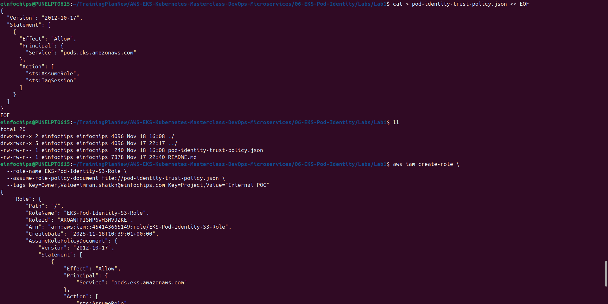
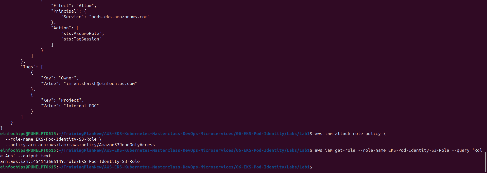
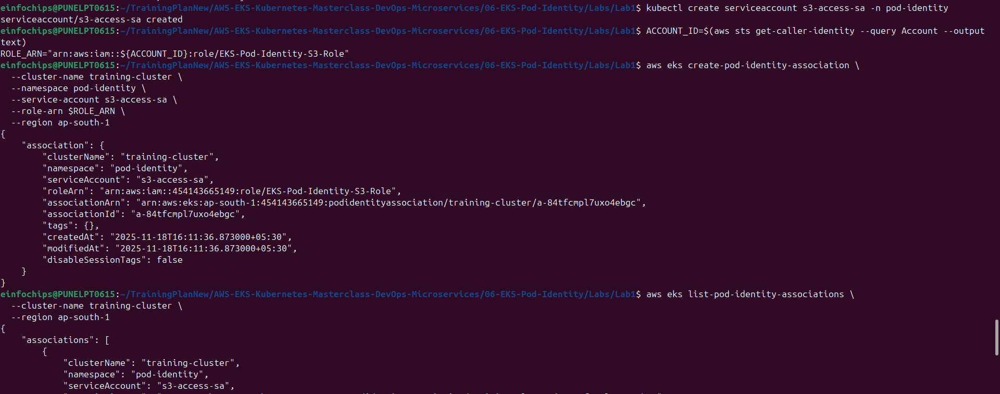
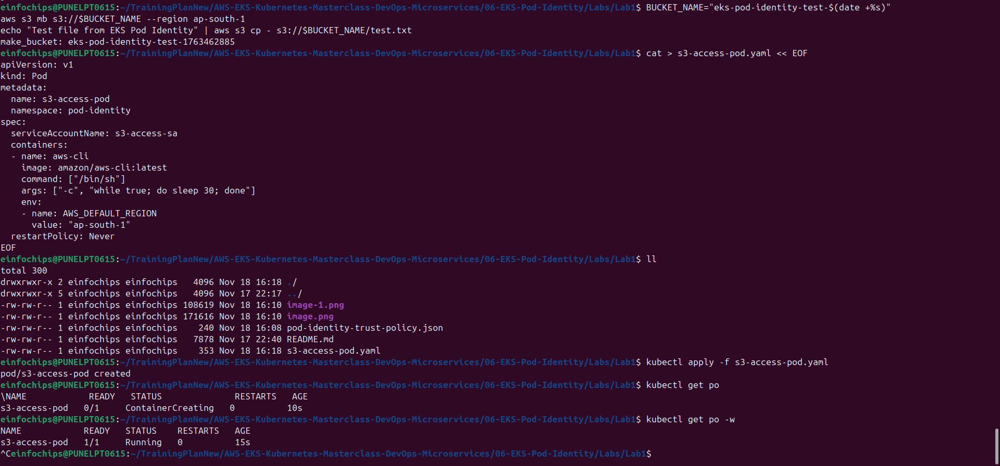
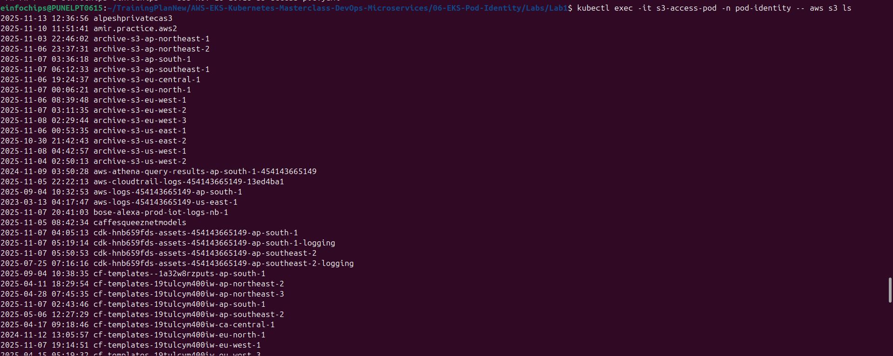
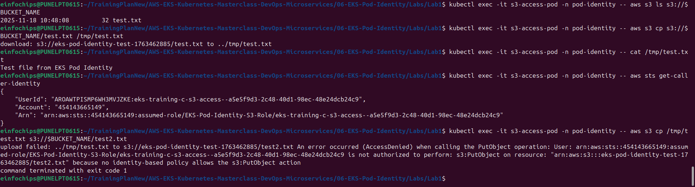

# Lab 1: EKS Pod Identity Setup and Basic Usage

## What We're Achieving
Set up EKS Pod Identity to enable secure AWS service access from Kubernetes pods without managing long-lived credentials.

## What We're Doing
- Configure EKS Pod Identity for the cluster
- Create IAM roles for pod access
- Deploy applications that access AWS services
- Test secure service integration

## Prerequisites
- Shared training cluster running
- AWS CLI configured with admin permissions
- kubectl configured

## Lab Exercises

### Exercise 1: Enable Pod Identity on Cluster
```bash
# Switch to pod identity namespace
kubectl config set-context --current --namespace=pod-identity

# Check if Pod Identity is already enabled
aws eks describe-cluster --name training-cluster --region ap-south-1 --query 'cluster.accessConfig'

# Enable Pod Identity (if not already enabled)
aws eks update-cluster-config \
  --name training-cluster \
  --region ap-south-1 \
  --access-config authenticationMode=API_AND_CONFIG_MAP

# Install Pod Identity Agent (if not present)
kubectl get daemonset -n kube-system | grep eks-pod-identity-agent
```

### Exercise 2: Create IAM Role for S3 Access
```bash
# Create trust policy for Pod Identity
cat > pod-identity-trust-policy.json << EOF
{
  "Version": "2012-10-17",
  "Statement": [
    {
      "Effect": "Allow",
      "Principal": {
        "Service": "pods.eks.amazonaws.com"
      },
      "Action": [
        "sts:AssumeRole",
        "sts:TagSession"
      ]
    }
  ]
}
EOF

# Create IAM role
aws iam create-role \
  --role-name EKS-Pod-Identity-S3-Role \
  --assume-role-policy-document file://pod-identity-trust-policy.json \
  --tags Key=Owner,Value=imran.shaikh@einfochips.com Key=Project,Value="Internal POC"

# Attach S3 read policy
aws iam attach-role-policy \
  --role-name EKS-Pod-Identity-S3-Role \
  --policy-arn arn:aws:iam::aws:policy/AmazonS3ReadOnlyAccess

# Get role ARN
aws iam get-role --role-name EKS-Pod-Identity-S3-Role --query 'Role.Arn' --output text
```



### Exercise 3: Create Service Account and Pod Identity Association
```bash
# Create service account
kubectl create serviceaccount s3-access-sa -n pod-identity

# Create Pod Identity Association
ACCOUNT_ID=$(aws sts get-caller-identity --query Account --output text)
ROLE_ARN="arn:aws:iam::${ACCOUNT_ID}:role/EKS-Pod-Identity-S3-Role"

aws eks create-pod-identity-association \
  --cluster-name training-cluster \
  --namespace pod-identity \
  --service-account s3-access-sa \
  --role-arn $ROLE_ARN \
  --region ap-south-1

# Verify association
aws eks list-pod-identity-associations \
  --cluster-name training-cluster \
  --region ap-south-1
```
### Screenshot:



### Exercise 4: Deploy Application with S3 Access
```bash
# Create test S3 bucket (optional)
BUCKET_NAME="eks-pod-identity-test-$(date +%s)"
aws s3 mb s3://$BUCKET_NAME --region ap-south-1
echo "Test file from EKS Pod Identity" | aws s3 cp - s3://$BUCKET_NAME/test.txt

# Create pod that accesses S3
cat > s3-access-pod.yaml << EOF
apiVersion: v1
kind: Pod
metadata:
  name: s3-access-pod
  namespace: pod-identity
spec:
  serviceAccountName: s3-access-sa
  containers:
  - name: aws-cli
    image: amazon/aws-cli:latest
    command: ["/bin/sh"]
    args: ["-c", "while true; do sleep 30; done"]
    env:
    - name: AWS_DEFAULT_REGION
      value: "ap-south-1"
  restartPolicy: Never
EOF

# Apply the pod
kubectl apply -f s3-access-pod.yaml

# Wait for pod to be ready
kubectl wait --for=condition=Ready pod/s3-access-pod -n pod-identity --timeout=60s
```
### Screenshot:


### Exercise 5: Test AWS Service Access
```bash
# Test S3 access from pod
kubectl exec -it s3-access-pod -n pod-identity -- aws s3 ls

# Test specific bucket access (if created)
kubectl exec -it s3-access-pod -n pod-identity -- aws s3 ls s3://$BUCKET_NAME

# Download test file
kubectl exec -it s3-access-pod -n pod-identity -- aws s3 cp s3://$BUCKET_NAME/test.txt /tmp/test.txt
kubectl exec -it s3-access-pod -n pod-identity -- cat /tmp/test.txt

# Check AWS identity
kubectl exec -it s3-access-pod -n pod-identity -- aws sts get-caller-identity

# Test permissions (should fail for write operations if using ReadOnly policy)
kubectl exec -it s3-access-pod -n pod-identity -- aws s3 cp /tmp/test.txt s3://$BUCKET_NAME/test2.txt
```
### Screenshot:



### Exercise 6: Multiple Service Accounts with Different Permissions
```bash
# Create DynamoDB access role
cat > dynamodb-policy.json << EOF
{
  "Version": "2012-10-17",
  "Statement": [
    {
      "Effect": "Allow",
      "Action": [
        "dynamodb:GetItem",
        "dynamodb:PutItem",
        "dynamodb:Query",
        "dynamodb:Scan"
      ],
      "Resource": "*"
    }
  ]
}
EOF

# Create DynamoDB role
aws iam create-role \
  --role-name EKS-Pod-Identity-DynamoDB-Role \
  --assume-role-policy-document file://pod-identity-trust-policy.json

aws iam put-role-policy \
  --role-name EKS-Pod-Identity-DynamoDB-Role \
  --policy-name DynamoDBAccess \
  --policy-document file://dynamodb-policy.json

# Create second service account
kubectl create serviceaccount dynamodb-access-sa -n pod-identity

# Create second Pod Identity Association
DYNAMODB_ROLE_ARN="arn:aws:iam::${ACCOUNT_ID}:role/EKS-Pod-Identity-DynamoDB-Role"

aws eks create-pod-identity-association \
  --cluster-name training-cluster \
  --namespace pod-identity \
  --service-account dynamodb-access-sa \
  --role-arn $DYNAMODB_ROLE_ARN \
  --region ap-south-1

# Deploy pod with DynamoDB access
cat > dynamodb-access-pod.yaml << EOF
apiVersion: v1
kind: Pod
metadata:
  name: dynamodb-access-pod
  namespace: pod-identity
spec:
  serviceAccountName: dynamodb-access-sa
  containers:
  - name: aws-cli
    image: amazon/aws-cli:latest
    command: ["/bin/sh"]
    args: ["-c", "while true; do sleep 30; done"]
    env:
    - name: AWS_DEFAULT_REGION
      value: "ap-south-1"
  restartPolicy: Never
EOF

kubectl apply -f dynamodb-access-pod.yaml

# Test DynamoDB access
kubectl exec -it dynamodb-access-pod -n pod-identity -- aws dynamodb list-tables
```

## Cleanup
```bash
# Delete pods
kubectl delete pod s3-access-pod dynamodb-access-pod -n pod-identity

# Delete Pod Identity Associations
aws eks delete-pod-identity-association \
  --cluster-name training-cluster \
  --association-id $(aws eks list-pod-identity-associations --cluster-name training-cluster --region ap-south-1 --query 'associations[?serviceAccount==`s3-access-sa`].associationId' --output text) \
  --region ap-south-1

aws eks delete-pod-identity-association \
  --cluster-name training-cluster \
  --association-id $(aws eks list-pod-identity-associations --cluster-name training-cluster --region ap-south-1 --query 'associations[?serviceAccount==`dynamodb-access-sa`].associationId' --output text) \
  --region ap-south-1

# Delete service accounts
kubectl delete serviceaccount s3-access-sa dynamodb-access-sa -n pod-identity

# Delete IAM roles
aws iam detach-role-policy --role-name EKS-Pod-Identity-S3-Role --policy-arn arn:aws:iam::aws:policy/AmazonS3ReadOnlyAccess
aws iam delete-role --role-name EKS-Pod-Identity-S3-Role
aws iam delete-role-policy --role-name EKS-Pod-Identity-DynamoDB-Role --policy-name DynamoDBAccess
aws iam delete-role --role-name EKS-Pod-Identity-DynamoDB-Role

# Delete test bucket (if created)
aws s3 rm s3://$BUCKET_NAME --recursive
aws s3 rb s3://$BUCKET_NAME

# Clean up files
rm -f pod-identity-trust-policy.json dynamodb-policy.json s3-access-pod.yaml dynamodb-access-pod.yaml
```

## Key Takeaways
1. Pod Identity eliminates need for long-lived AWS credentials
2. Each service account can have different AWS permissions
3. IAM roles are assumed automatically by pods
4. Fine-grained access control per application/service
5. Secure and auditable AWS service access
6. No credential rotation required

## Next Steps
- Move to Lab 2: Advanced Pod Identity Scenarios
- Practice with different AWS services
- Learn about cross-account access patterns