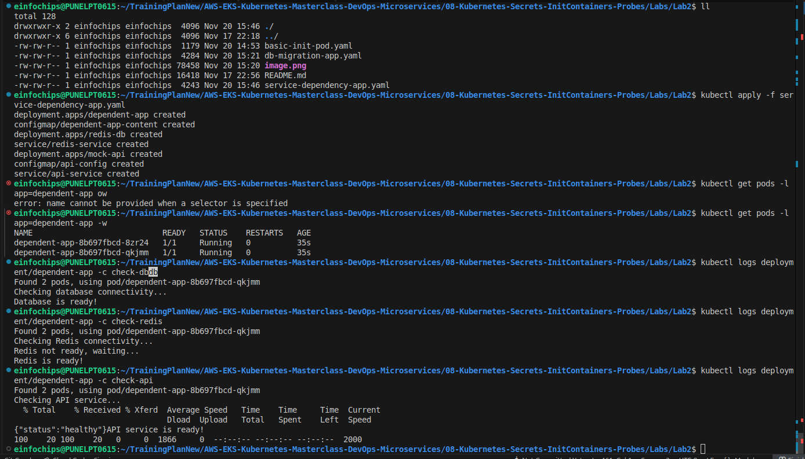
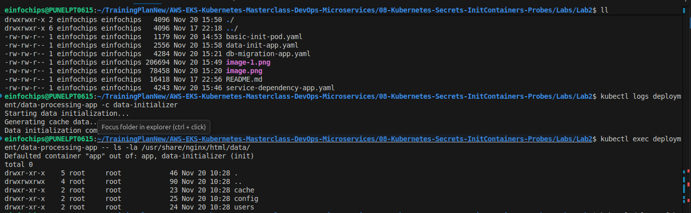

# Lab 2: InitContainers and Startup Patterns

## What We're Achieving
Master InitContainers for application initialization, dependency management, and setup tasks before main containers start.

## What We're Doing
- Implement InitContainers for database migrations
- Set up dependency checking and service discovery
- Configure data initialization and preprocessing
- Create multi-stage application startup patterns

## Prerequisites
- Completed Lab 1 (Secrets and ConfigMaps)
- Understanding of application dependencies
- kubectl configured

## Lab Exercises

### Exercise 1: Basic InitContainer Pattern
```bash
# Switch to secrets namespace
kubectl config set-context --current --namespace=secrets-probes

# Create pod with InitContainer
cat > basic-init-pod.yaml << EOF
apiVersion: v1
kind: Pod
metadata:
  name: basic-init-pod
  namespace: secrets-probes
spec:
  initContainers:
  - name: init-setup
    image: busybox:1.35
    command: ['sh', '-c']
    args:
    - |
      echo "Starting initialization..."
      echo "Checking system requirements..."
      sleep 5
      echo "Creating required directories..."
      mkdir -p /shared-data/config
      mkdir -p /shared-data/logs
      echo "Writing initial configuration..."
      echo "app.initialized=true" > /shared-data/config/app.properties
      echo "init.timestamp=$(date)" >> /shared-data/config/app.properties
      echo "Initialization completed successfully!"
    volumeMounts:
    - name: shared-data
      mountPath: /shared-data
  containers:
  - name: main-app
    image: nginx:alpine
    command: ['sh', '-c']
    args:
    - |
      echo "Main application starting..."
      echo "Checking initialization status..."
      cat /shared-data/config/app.properties
      echo "Starting nginx..."
      nginx -g 'daemon off;'
    volumeMounts:
    - name: shared-data
      mountPath: /shared-data
    ports:
    - containerPort: 80
  volumes:
  - name: shared-data
    emptyDir: {}
EOF

kubectl apply -f basic-init-pod.yaml

# Monitor initialization process
kubectl get pods -w
kubectl logs basic-init-pod -c init-setup
kubectl logs basic-init-pod -c main-app
```


### Exercise 2: Database Migration InitContainer
```bash
# Create database migration InitContainer
cat > db-migration-app.yaml << EOF
apiVersion: v1
kind: ConfigMap
metadata:
  name: migration-scripts
  namespace: secrets-probes
data:
  001-create-tables.sql: |
    CREATE TABLE IF NOT EXISTS users (
        id INT AUTO_INCREMENT PRIMARY KEY,
        username VARCHAR(50) NOT NULL,
        email VARCHAR(100) NOT NULL,
        created_at TIMESTAMP DEFAULT CURRENT_TIMESTAMP
    );
    
    CREATE TABLE IF NOT EXISTS products (
        id INT AUTO_INCREMENT PRIMARY KEY,
        name VARCHAR(100) NOT NULL,
        price DECIMAL(10,2) NOT NULL,
        created_at TIMESTAMP DEFAULT CURRENT_TIMESTAMP
    );
  002-seed-data.sql: |
    INSERT IGNORE INTO users (username, email) VALUES 
    ('admin', 'admin@example.com'),
    ('user1', 'user1@example.com');
    
    INSERT IGNORE INTO products (name, price) VALUES 
    ('Product A', 29.99),
    ('Product B', 49.99);
---
apiVersion: apps/v1
kind: Deployment
metadata:
  name: web-app-with-migration
  namespace: secrets-probes
spec:
  replicas: 1
  selector:
    matchLabels:
      app: web-app-with-migration
  template:
    metadata:
      labels:
        app: web-app-with-migration
    spec:
      initContainers:
      - name: db-migration
        image: mysql:8.0
        env:
        - name: MYSQL_HOST
          value: "mysql-service.secrets-probes.svc.cluster.local"
        - name: MYSQL_USER
          value: "root"
        - name: MYSQL_PASSWORD
          value: "rootpassword"
        - name: MYSQL_DATABASE
          value: "webapp"
        command: ['sh', '-c']
        args:
        - |
          echo "Starting database migration..."
          
          # Wait for database to be ready
          until mysql -h$MYSQL_HOST -u$MYSQL_USER -p$MYSQL_PASSWORD -e "SELECT 1"; do
            echo "Waiting for database connection..."
            sleep 5
          done
          
          echo "Database connected. Running migrations..."
          
          # Run migration scripts
          for script in /migrations/*.sql; do
            echo "Executing $script..."
            mysql -h$MYSQL_HOST -u$MYSQL_USER -p$MYSQL_PASSWORD $MYSQL_DATABASE < $script
          done
          
          echo "Database migration completed successfully!"
        volumeMounts:
        - name: migration-scripts
          mountPath: /migrations
      containers:
      - name: web-app
        image: nginx:alpine
        ports:
        - containerPort: 80
        volumeMounts:
        - name: app-content
          mountPath: /usr/share/nginx/html
      volumes:
      - name: migration-scripts
        configMap:
          name: migration-scripts
      - name: app-content
        configMap:
          name: web-app-content
---
apiVersion: v1
kind: ConfigMap
metadata:
  name: web-app-content
  namespace: secrets-probes
data:
  index.html: |
    <!DOCTYPE html>
    <html>
    <head>
        <title>App with Database Migration</title>
        <style>
            body { font-family: Arial, sans-serif; margin: 40px; }
            .success { background-color: #d4edda; padding: 20px; margin: 20px 0; border-radius: 5px; }
        </style>
    </head>
    <body>
        <h1>🚀 Application with Database Migration</h1>
        <div class="success">
            <h3>✅ Database Migration Completed</h3>
            <p>The application started successfully after running database migrations.</p>
            <ul>
                <li>Tables created: users, products</li>
                <li>Seed data inserted</li>
                <li>Application ready to serve requests</li>
            </ul>
        </div>
    </body>
    </html>
---
# MySQL database for testing
apiVersion: apps/v1
kind: Deployment
metadata:
  name: mysql-db
  namespace: secrets-probes
spec:
  replicas: 1
  selector:
    matchLabels:
      app: mysql-db
  template:
    metadata:
      labels:
        app: mysql-db
    spec:
      containers:
      - name: mysql
        image: mysql:8.0
        env:
        - name: MYSQL_ROOT_PASSWORD
          value: "rootpassword"
        - name: MYSQL_DATABASE
          value: "webapp"
        ports:
        - containerPort: 3306
        volumeMounts:
        - name: mysql-data
          mountPath: /var/lib/mysql
      volumes:
      - name: mysql-data
        emptyDir: {}
---
apiVersion: v1
kind: Service
metadata:
  name: mysql-service
  namespace: secrets-probes
spec:
  selector:
    app: mysql-db
  ports:
    - port: 3306
      targetPort: 3306
EOF

kubectl apply -f db-migration-app.yaml

# Wait for MySQL to be ready
kubectl wait --for=condition=Available deployment/mysql-db -n secrets-probes --timeout=120s

# Monitor migration process
kubectl get pods -l app=web-app-with-migration -w
kubectl logs deployment/web-app-with-migration -c db-migration
```

### Exercise 3: Service Dependency Checking
```bash
# Create application with service dependency checks
cat > service-dependency-app.yaml << EOF
apiVersion: apps/v1
kind: Deployment
metadata:
  name: dependent-app
  namespace: secrets-probes
spec:
  replicas: 2
  selector:
    matchLabels:
      app: dependent-app
  template:
    metadata:
      labels:
        app: dependent-app
    spec:
      initContainers:
      - name: check-db
        image: busybox:1.35
        command: ['sh', '-c']
        args:
        - |
          echo "Checking database connectivity..."
          until nc -z mysql-service.secrets-probes.svc.cluster.local 3306; do
            echo "Database not ready, waiting..."
            sleep 5
          done
          echo "Database is ready!"
      - name: check-redis
        image: busybox:1.35
        command: ['sh', '-c']
        args:
        - |
          echo "Checking Redis connectivity..."
          until nc -z redis-service.secrets-probes.svc.cluster.local 6379; do
            echo "Redis not ready, waiting..."
            sleep 5
          done
          echo "Redis is ready!"
      - name: check-api
        image: curlimages/curl:latest
        command: ['sh', '-c']
        args:
        - |
          echo "Checking API service..."
          until curl -f http://api-service.secrets-probes.svc.cluster.local:8080/health; do
            echo "API service not ready, waiting..."
            sleep 10
          done
          echo "API service is ready!"
      containers:
      - name: app
        image: nginx:alpine
        ports:
        - containerPort: 80
        volumeMounts:
        - name: app-content
          mountPath: /usr/share/nginx/html
      volumes:
      - name: app-content
        configMap:
          name: dependent-app-content
---
apiVersion: v1
kind: ConfigMap
metadata:
  name: dependent-app-content
  namespace: secrets-probes
data:
  index.html: |
    <!DOCTYPE html>
    <html>
    <head>
        <title>Service Dependency App</title>
        <style>
            body { font-family: Arial, sans-serif; margin: 40px; }
            .dependency { background-color: #e8f4fd; padding: 15px; margin: 10px 0; border-radius: 5px; }
        </style>
    </head>
    <body>
        <h1>🔗 Service Dependency Application</h1>
        <p>This application started only after all dependencies were ready:</p>
        <div class="dependency">✅ Database (MySQL) - Ready</div>
        <div class="dependency">✅ Cache (Redis) - Ready</div>
        <div class="dependency">✅ API Service - Ready</div>
        <p>All services are now available and the application is ready to serve requests.</p>
    </body>
    </html>
---
# Redis for dependency testing
apiVersion: apps/v1
kind: Deployment
metadata:
  name: redis-db
  namespace: secrets-probes
spec:
  replicas: 1
  selector:
    matchLabels:
      app: redis-db
  template:
    metadata:
      labels:
        app: redis-db
    spec:
      containers:
      - name: redis
        image: redis:alpine
        ports:
        - containerPort: 6379
---
apiVersion: v1
kind: Service
metadata:
  name: redis-service
  namespace: secrets-probes
spec:
  selector:
    app: redis-db
  ports:
    - port: 6379
      targetPort: 6379
---
# Mock API service
apiVersion: apps/v1
kind: Deployment
metadata:
  name: mock-api
  namespace: secrets-probes
spec:
  replicas: 1
  selector:
    matchLabels:
      app: mock-api
  template:
    metadata:
      labels:
        app: mock-api
    spec:
      containers:
      - name: api
        image: nginx:alpine
        ports:
        - containerPort: 80
        volumeMounts:
        - name: api-config
          mountPath: /etc/nginx/conf.d
      volumes:
      - name: api-config
        configMap:
          name: api-config
---
apiVersion: v1
kind: ConfigMap
metadata:
  name: api-config
  namespace: secrets-probes
data:
  default.conf: |
    server {
        listen 80;
        location /health {
            return 200 '{"status":"healthy"}';
            add_header Content-Type application/json;
        }
        location / {
            return 200 '{"message":"Mock API Service"}';
            add_header Content-Type application/json;
        }
    }
---
apiVersion: v1
kind: Service
metadata:
  name: api-service
  namespace: secrets-probes
spec:
  selector:
    app: mock-api
  ports:
    - port: 8080
      targetPort: 80
EOF

kubectl apply -f service-dependency-app.yaml

# Monitor dependency checking
kubectl get pods -l app=dependent-app -w
kubectl logs deployment/dependent-app -c check-db
kubectl logs deployment/dependent-app -c check-redis
kubectl logs deployment/dependent-app -c check-api
```


### Exercise 4: Data Initialization InitContainer
```bash
# Create application with data initialization
cat > data-init-app.yaml << EOF
apiVersion: v1
kind: ConfigMap
metadata:
  name: init-data
  namespace: secrets-probes
data:
  users.json: |
    [
      {"id": 1, "name": "John Doe", "role": "admin"},
      {"id": 2, "name": "Jane Smith", "role": "user"},
      {"id": 3, "name": "Bob Johnson", "role": "user"}
    ]
  config.yaml: |
    app:
      name: "Data Processing App"
      version: "1.0.0"
      features:
        - data-processing
        - user-management
        - reporting
    database:
      host: "mysql-service"
      port: 3306
      name: "webapp"
---
apiVersion: apps/v1
kind: Deployment
metadata:
  name: data-processing-app
  namespace: secrets-probes
spec:
  replicas: 1
  selector:
    matchLabels:
      app: data-processing-app
  template:
    metadata:
      labels:
        app: data-processing-app
    spec:
      initContainers:
      - name: data-initializer
        image: busybox:1.35
        command: ['sh', '-c']
        args:
        - |
          echo "Starting data initialization..."
          mkdir -p /app-data/users /app-data/config /app-data/cache
          cp /init-data/users.json /app-data/users/
          cp /init-data/config.yaml /app-data/config/
          echo "Generating cache data..."
          i=1; while [ $i -le 100 ]; do echo "cache-entry-$i:value-$i" >> /app-data/cache/cache.txt; i=$((i+1)); done
          chmod -R 755 /app-data
          echo "Data initialization completed!"
        volumeMounts:
        - name: init-data
          mountPath: /init-data
        - name: app-data
          mountPath: /app-data
      containers:
      - name: app
        image: nginx:alpine
        ports:
        - containerPort: 80
        volumeMounts:
        - name: app-data
          mountPath: /usr/share/nginx/html/data
        - name: app-content
          mountPath: /usr/share/nginx/html
      volumes:
      - name: init-data
        configMap:
          name: init-data
      - name: app-data
        emptyDir: {}
      - name: app-content
        configMap:
          name: data-app-content
---
apiVersion: v1
kind: ConfigMap
metadata:
  name: data-app-content
  namespace: secrets-probes
data:
  index.html: |
    <!DOCTYPE html>
    <html>
    <head>
        <title>Data Processing App</title>
    </head>
    <body>
        <h1>Data Processing Application</h1>
        <ul>
            <li><a href="/data/users/users.json">User Data</a></li>
            <li><a href="/data/config/config.yaml">Configuration</a></li>
            <li><a href="/data/cache/cache.txt">Cache Data</a></li>
        </ul>
    </body>
    </html>
EOF

kubectl apply -f data-init-app.yaml

# Monitor data initialization
kubectl logs deployment/data-processing-app -c data-initializer
kubectl exec deployment/data-processing-app -- ls -la /usr/share/nginx/html/data/
```

## Cleanup
```bash
# Delete all applications
kubectl delete -f basic-init-pod.yaml
kubectl delete -f db-migration-app.yaml
kubectl delete -f service-dependency-app.yaml
kubectl delete -f data-init-app.yaml

# Clean up files
rm -f basic-init-pod.yaml db-migration-app.yaml service-dependency-app.yaml data-init-app.yaml
```


## Key Takeaways
1. InitContainers run before main containers and must complete successfully
2. They share volumes with main containers for data exchange
3. Perfect for database migrations and dependency checking
4. Can be used for data initialization and preprocessing
5. Multiple InitContainers run sequentially in order
6. Failure in InitContainer prevents main container from starting
7. Essential for implementing proper startup sequences

## Next Steps
- Move to Lab 3: Health Probes and Monitoring
- Practice with complex initialization scenarios
- Learn about startup probe configurations