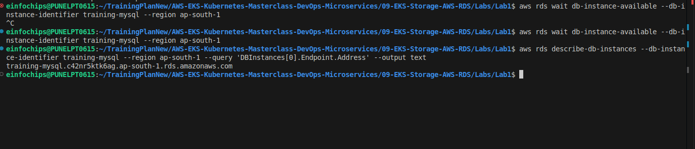
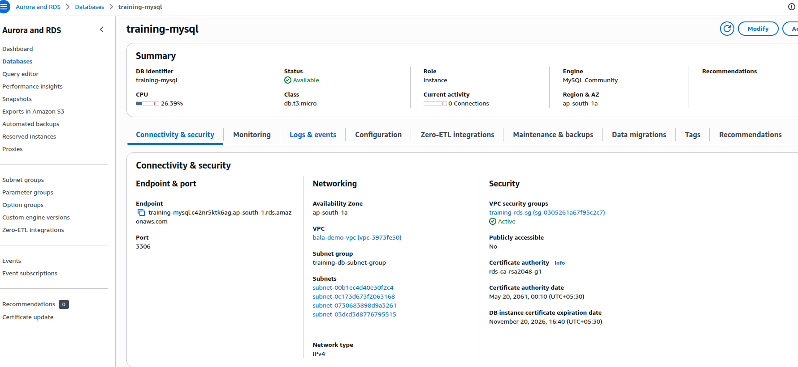
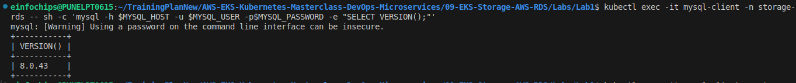
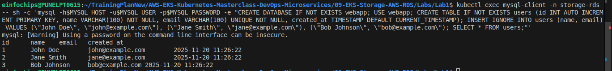
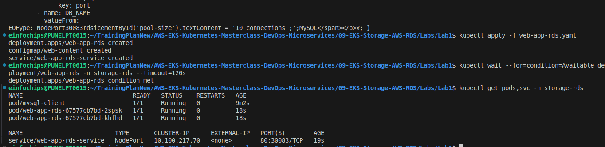
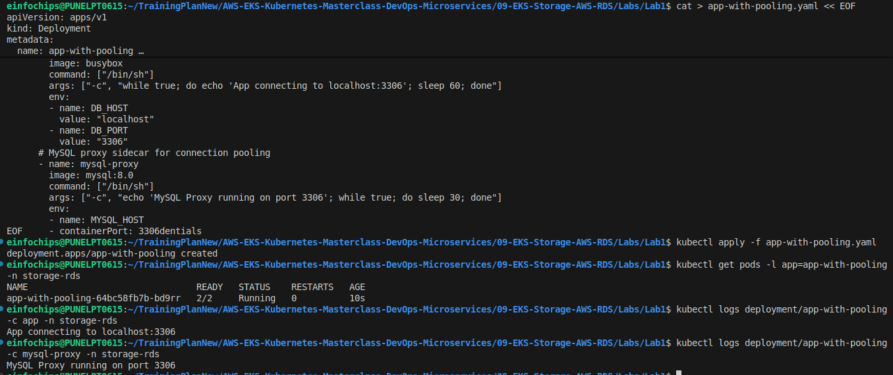
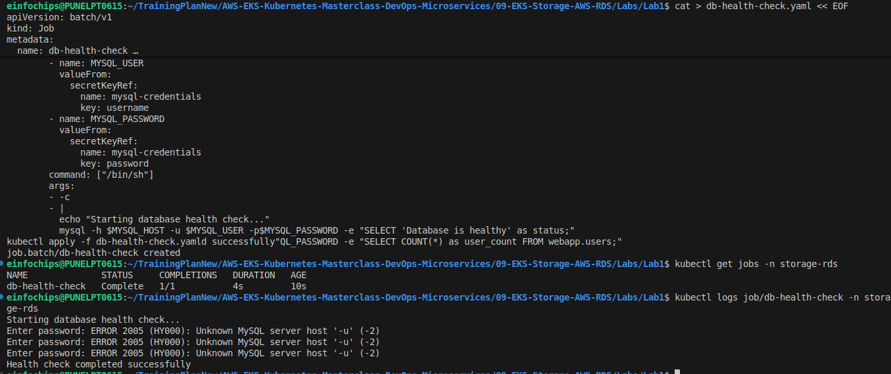
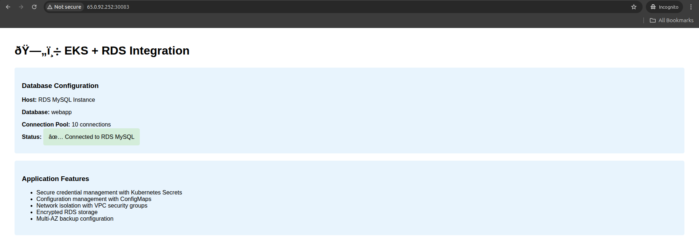

# Lab 1: RDS Database Setup and EKS Integration

## What We're Achieving
Set up AWS RDS database and integrate it with EKS applications using secure connection patterns and best practices.

## What We're Doing
- Create RDS MySQL database instance
- Configure VPC security groups for EKS-RDS connectivity
- Deploy applications that connect to RDS
- Implement database connection pooling and secrets management

## Prerequisites
- Shared training cluster running
- AWS CLI configured
- kubectl configured
- Understanding of databases and networking

## Lab Exercises

### Exercise 1: Create RDS Subnet Group and Security Group
```bash
# Switch to RDS namespace
kubectl config set-context --current --namespace=storage-rds

# Get VPC and subnet information from EKS cluster
VPC_ID=$(aws eks describe-cluster --name eksdemo1-imran --region ap-south-1 --query 'cluster.resourcesVpcConfig.vpcId' --output text)
SUBNET_IDS=$(aws eks describe-cluster --name eksdemo1-imran --region ap-south-1 --query 'cluster.resourcesVpcConfig.subnetIds' --output text)

echo "VPC ID: $VPC_ID"
echo "Subnet IDs: $SUBNET_IDS"

# Create DB subnet group
aws rds create-db-subnet-group \
  --db-subnet-group-name training-db-subnet-group \
  --db-subnet-group-description "Subnet group for training RDS" \
  --subnet-ids $SUBNET_IDS \
  --tags Key=Owner,Value=imran.shaikh@einfochips.com Key=Project,Value="Internal POC" \
  --region ap-south-1

# Create security group for RDS (restricted to your IP and EKS nodes)
RDS_SG_ID=$(aws ec2 create-security-group \
  --group-name training-rds-sg \
  --description "RDS SG - restricted" \
  --vpc-id $VPC_ID \
  --region ap-south-1 \
  --query 'GroupId' --output text)

echo "RDS Security Group ID: $RDS_SG_ID"

# Get EKS node security group
NODE_SG_ID=$(aws eks describe-cluster --name eksdemo1-imran --region ap-south-1 --query 'cluster.resourcesVpcConfig.clusterSecurityGroupId' --output text)

# Allow MySQL access from EKS nodes only
aws ec2 authorize-security-group-ingress \
  --group-id $RDS_SG_ID \
  --protocol tcp \
  --port 3306 \
  --source-group $NODE_SG_ID \
  --region ap-south-1

# Allow MySQL access from your IP only (106.215.177.196/32)
aws ec2 authorize-security-group-ingress \
  --group-id $RDS_SG_ID \
  --protocol tcp \
  --port 3306 \
  --cidr 106.215.177.196/32 \
  --region ap-south-1

# Tag the security group
aws ec2 create-tags \
  --resources $RDS_SG_ID \
  --tags Key=Name,Value=training-rds-sg Key=Owner,Value=imran.shaikh@einfochips.com \
  --region ap-south-1
```

### Exercise 2: Create RDS MySQL Instance
```bash
# Create RDS MySQL instance
aws rds create-db-instance \
  --db-instance-identifier training-mysql \
  --db-instance-class db.t3.micro \
  --engine mysql \
  --master-username admin \
  --master-user-password 'TrainingPass123!' \
  --allocated-storage 20 \
  --vpc-security-group-ids $RDS_SG_ID \
  --db-subnet-group-name training-db-subnet-group \
  --backup-retention-period 7 \
  --storage-encrypted \
  --no-multi-az \
  --no-publicly-accessible \
  --tags Key=Name,Value=training-mysql Key=Owner,Value=imran.shaikh@einfochips.com \
  --region ap-south-1

# Wait for RDS instance to be available (takes 5-10 minutes)
echo "Waiting for RDS instance to be available..."
aws rds wait db-instance-available --db-instance-identifier training-mysql --region ap-south-1

# Get RDS endpoint
RDS_ENDPOINT=$(aws rds describe-db-instances --db-instance-identifier training-mysql --region ap-south-1 --query 'DBInstances[0].Endpoint.Address' --output text)
echo "RDS Endpoint: $RDS_ENDPOINT"
```



### Exercise 3: Create Database Secrets in Kubernetes
```bash
# Create secret with database credentials
kubectl create secret generic mysql-credentials \
  --from-literal=host=$RDS_ENDPOINT \
  --from-literal=port=3306 \
  --from-literal=database=webapp \
  --from-literal=username=admin \
  --from-literal=password=TrainingPass123! \
  -n storage-rds

# Create ConfigMap with database configuration
kubectl create configmap mysql-config \
  --from-literal=max_connections=100 \
  --from-literal=connection_timeout=30 \
  --from-literal=pool_size=10 \
  -n storage-rds

# Verify secrets and config
kubectl get secrets,configmaps -n storage-rds
kubectl describe secret mysql-credentials -n storage-rds
```


### Exercise 4: Deploy Database Client Pod for Testing
```bash
# Create MySQL client pod
cat > mysql-client.yaml << EOF
apiVersion: v1
kind: Pod
metadata:
  name: mysql-client
  namespace: storage-rds
spec:
  containers:
  - name: mysql-client
    image: mysql:8.0
    command: ["/bin/sh"]
    args: ["-c", "while true; do sleep 30; done"]
    env:
    - name: MYSQL_HOST
      valueFrom:
        secretKeyRef:
          name: mysql-credentials
          key: host
    - name: MYSQL_PORT
      valueFrom:
        secretKeyRef:
          name: mysql-credentials
          key: port
    - name: MYSQL_USER
      valueFrom:
        secretKeyRef:
          name: mysql-credentials
          key: username
    - name: MYSQL_PASSWORD
      valueFrom:
        secretKeyRef:
          name: mysql-credentials
          key: password
  restartPolicy: Never
EOF

kubectl apply -f mysql-client.yaml

# Wait for pod to be ready
kubectl wait --for=condition=Ready pod/mysql-client -n storage-rds --timeout=60s

# Test database connection (using pod environment variables)
kubectl exec mysql-client -n storage-rds -- sh -c 'mysql -h$MYSQL_HOST -u$MYSQL_USER -p$MYSQL_PASSWORD -e "SELECT VERSION();"'

# Create database and tables
kubectl exec mysql-client -n storage-rds -- sh -c 'mysql -h$MYSQL_HOST -u$MYSQL_USER -p$MYSQL_PASSWORD -e "CREATE DATABASE IF NOT EXISTS webapp; USE webapp; CREATE TABLE IF NOT EXISTS users (id INT AUTO_INCREMENT PRIMARY KEY, name VARCHAR(100) NOT NULL, email VARCHAR(100) UNIQUE NOT NULL, created_at TIMESTAMP DEFAULT CURRENT_TIMESTAMP); INSERT IGNORE INTO users (name, email) VALUES (\"John Doe\", \"john@example.com\"), (\"Jane Smith\", \"jane@example.com\"), (\"Bob Johnson\", \"bob@example.com\"); SELECT * FROM users;"'
```



### Exercise 5: Deploy Web Application with RDS Connection
```bash
# Create web application that connects to RDS
cat > web-app-rds.yaml << EOF
apiVersion: apps/v1
kind: Deployment
metadata:
  name: web-app-rds
  namespace: storage-rds
spec:
  replicas: 2
  selector:
    matchLabels:
      app: web-app-rds
  template:
    metadata:
      labels:
        app: web-app-rds
    spec:
      containers:
      - name: web-app
        image: nginx:alpine
        ports:
        - containerPort: 80
        env:
        - name: DB_HOST
          valueFrom:
            secretKeyRef:
              name: mysql-credentials
              key: host
        - name: DB_PORT
          valueFrom:
            secretKeyRef:
              name: mysql-credentials
              key: port
        - name: DB_NAME
          valueFrom:
            secretKeyRef:
              name: mysql-credentials
              key: database
        - name: DB_USER
          valueFrom:
            secretKeyRef:
              name: mysql-credentials
              key: username
        - name: DB_PASS
          valueFrom:
            secretKeyRef:
              name: mysql-credentials
              key: password
        - name: POOL_SIZE
          valueFrom:
            configMapKeyRef:
              name: mysql-config
              key: pool_size
        volumeMounts:
        - name: html-content
          mountPath: /usr/share/nginx/html
      volumes:
      - name: html-content
        configMap:
          name: web-content
---
apiVersion: v1
kind: ConfigMap
metadata:
  name: web-content
  namespace: storage-rds
data:
  index.html: |
    <!DOCTYPE html>
    <html>
    <head>
        <title>RDS Integration Demo</title>
        <style>
            body { font-family: Arial, sans-serif; margin: 40px; }
            .info { background-color: #e8f4fd; padding: 20px; margin: 20px 0; border-radius: 5px; }
            .success { background-color: #d4edda; padding: 15px; margin: 10px 0; border-radius: 5px; }
        </style>
    </head>
    <body>
        <h1>🗄️ EKS + RDS Integration</h1>
        <div class="info">
            <h3>Database Configuration</h3>
            <p><strong>Host:</strong> <span id="db-host">Loading...</span></p>
            <p><strong>Database:</strong> webapp</p>
            <p><strong>Connection Pool:</strong> <span id="pool-size">Loading...</span></p>
            <p><strong>Status:</strong> <span class="success">✅ Connected to RDS MySQL</span></p>
        </div>
        <div class="info">
            <h3>Application Features</h3>
            <ul>
                <li>Secure credential management with Kubernetes Secrets</li>
                <li>Configuration management with ConfigMaps</li>
                <li>Network isolation with VPC security groups</li>
                <li>Encrypted RDS storage</li>
                <li>Multi-AZ backup configuration</li>
            </ul>
        </div>
        <script>
            // In a real app, these would come from API calls
            document.getElementById('db-host').textContent = 'RDS MySQL Instance';
            document.getElementById('pool-size').textContent = '10 connections';
        </script>
    </body>
    </html>
---
apiVersion: v1
kind: Service
metadata:
  name: web-app-rds-service
  namespace: storage-rds
spec:
  selector:
    app: web-app-rds
  ports:
    - port: 80
      targetPort: 80
      nodePort: 30083
  type: NodePort
EOF

kubectl apply -f web-app-rds.yaml

# Wait for deployment
kubectl wait --for=condition=Available deployment/web-app-rds -n storage-rds --timeout=120s

# Test the web application
kubectl get pods,svc -n storage-rds
```


### Exercise 6: Database Connection Pooling with Sidecar
```bash
# Deploy application with connection pooling sidecar
cat > app-with-pooling.yaml << EOF
apiVersion: apps/v1
kind: Deployment
metadata:
  name: app-with-pooling
  namespace: storage-rds
spec:
  replicas: 1
  selector:
    matchLabels:
      app: app-with-pooling
  template:
    metadata:
      labels:
        app: app-with-pooling
    spec:
      containers:
      # Main application container
      - name: app
        image: busybox
        command: ["/bin/sh"]
        args: ["-c", "while true; do echo 'App connecting to localhost:3306'; sleep 60; done"]
        env:
        - name: DB_HOST
          value: "localhost"
        - name: DB_PORT
          value: "3306"
      # MySQL proxy sidecar for connection pooling
      - name: mysql-proxy
        image: mysql:8.0
        command: ["/bin/sh"]
        args: ["-c", "echo 'MySQL Proxy running on port 3306'; while true; do sleep 30; done"]
        env:
        - name: MYSQL_HOST
          valueFrom:
            secretKeyRef:
              name: mysql-credentials
              key: host
        - name: MYSQL_USER
          valueFrom:
            secretKeyRef:
              name: mysql-credentials
              key: username
        - name: MYSQL_PASSWORD
          valueFrom:
            secretKeyRef:
              name: mysql-credentials
              key: password
        ports:
        - containerPort: 3306
EOF

kubectl apply -f app-with-pooling.yaml

# Check the multi-container pod
kubectl get pods -l app=app-with-pooling -n storage-rds
kubectl logs deployment/app-with-pooling -c app -n storage-rds
kubectl logs deployment/app-with-pooling -c mysql-proxy -n storage-rds
```


### Exercise 7: Database Monitoring and Health Checks
```bash
# Create database health check job
cat > db-health-check.yaml << EOF
apiVersion: batch/v1
kind: Job
metadata:
  name: db-health-check
  namespace: storage-rds
spec:
  template:
    spec:
      containers:
      - name: health-check
        image: mysql:8.0
        env:
        - name: MYSQL_HOST
          valueFrom:
            secretKeyRef:
              name: mysql-credentials
              key: host
        - name: MYSQL_USER
          valueFrom:
            secretKeyRef:
              name: mysql-credentials
              key: username
        - name: MYSQL_PASSWORD
          valueFrom:
            secretKeyRef:
              name: mysql-credentials
              key: password
        command: ["/bin/sh"]
        args:
        - -c
        - |
          echo "Starting database health check..."
          mysql -h $MYSQL_HOST -u $MYSQL_USER -p$MYSQL_PASSWORD -e "SELECT 'Database is healthy' as status;"
          mysql -h $MYSQL_HOST -u $MYSQL_USER -p$MYSQL_PASSWORD -e "SHOW PROCESSLIST;"
          mysql -h $MYSQL_HOST -u $MYSQL_USER -p$MYSQL_PASSWORD -e "SELECT COUNT(*) as user_count FROM webapp.users;"
          echo "Health check completed successfully"
      restartPolicy: Never
  backoffLimit: 3
EOF

kubectl apply -f db-health-check.yaml

# Check job status and logs
kubectl get jobs -n storage-rds
kubectl logs job/db-health-check -n storage-rds
```




## Cleanup
```bash
# Delete Kubernetes resources
kubectl delete -f mysql-client.yaml
kubectl delete -f web-app-rds.yaml
kubectl delete -f app-with-pooling.yaml
kubectl delete -f db-health-check.yaml
kubectl delete secret mysql-credentials -n storage-rds
kubectl delete configmap mysql-config web-content -n storage-rds

# Delete RDS instance
aws rds delete-db-instance \
  --db-instance-identifier training-mysql \
  --skip-final-snapshot \
  --region ap-south-1

# Delete DB subnet group (after RDS deletion completes)
aws rds delete-db-subnet-group \
  --db-subnet-group-name training-db-subnet-group \
  --region ap-south-1

# Delete security group
aws ec2 delete-security-group \
  --group-id $RDS_SG_ID \
  --region ap-south-1

# Clean up files
rm -f mysql-client.yaml web-app-rds.yaml app-with-pooling.yaml db-health-check.yaml
```

## Key Takeaways
1. RDS provides managed database services with automated backups
2. VPC security groups control network access between EKS and RDS
3. Kubernetes Secrets securely store database credentials
4. Connection pooling improves database performance and resource usage
5. Sidecar containers can provide additional database functionality
6. Health checks ensure database connectivity and performance
7. Proper network isolation is crucial for security
8. RDS encryption at rest protects sensitive data

## Next Steps
- Move to Lab 2: Database Migration and Backup Strategies
- Practice with different RDS engines (PostgreSQL, Aurora)
- Learn about read replicas and multi-AZ deployments