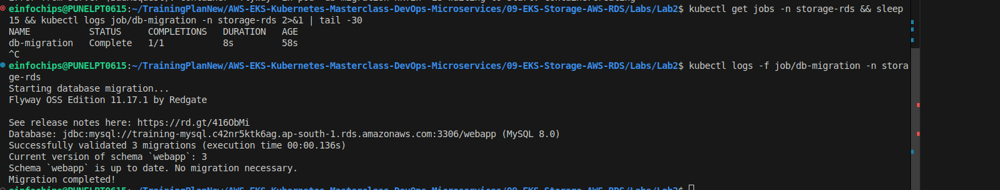
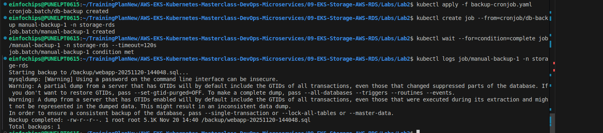

# Lab 2: Database Migration and Backup Strategies

## What We're Achieving
Implement database migration workflows and backup strategies for RDS databases in EKS environments.

## What We're Doing
- Perform database schema migrations using Kubernetes Jobs
- Create automated backup jobs with CronJobs
- Implement database restore procedures
- Test disaster recovery scenarios

## Prerequisites
- Completed Lab 1 (RDS Setup)
- RDS instance running (training-mysql)
- kubectl configured
- Understanding of database operations

## Lab Exercises

### Exercise 1: Database Schema Migration with Flyway
```bash
# Create migration scripts ConfigMap
cat > migration-scripts.yaml << EOF
apiVersion: v1
kind: ConfigMap
metadata:
  name: flyway-migrations
  namespace: storage-rds
data:
  V1__initial_schema.sql: |
    CREATE TABLE IF NOT EXISTS products (
        id INT AUTO_INCREMENT PRIMARY KEY,
        name VARCHAR(200) NOT NULL,
        description TEXT,
        price DECIMAL(10,2) NOT NULL,
        stock INT DEFAULT 0,
        created_at TIMESTAMP DEFAULT CURRENT_TIMESTAMP,
        updated_at TIMESTAMP DEFAULT CURRENT_TIMESTAMP ON UPDATE CURRENT_TIMESTAMP
    );
  V2__add_categories.sql: |
    CREATE TABLE IF NOT EXISTS categories (
        id INT AUTO_INCREMENT PRIMARY KEY,
        name VARCHAR(100) NOT NULL UNIQUE,
        description TEXT
    );
    ALTER TABLE products ADD COLUMN category_id INT;
    ALTER TABLE products ADD FOREIGN KEY (category_id) REFERENCES categories(id);
  V3__seed_data.sql: |
    INSERT IGNORE INTO categories (name, description) VALUES
    ('Electronics', 'Electronic devices and accessories'),
    ('Clothing', 'Apparel and fashion items'),
    ('Books', 'Books and publications');
    
    INSERT IGNORE INTO products (name, description, price, stock, category_id) VALUES
    ('Laptop', 'High-performance laptop', 999.99, 50, 1),
    ('T-Shirt', 'Cotton t-shirt', 19.99, 200, 2),
    ('Novel', 'Bestselling novel', 14.99, 100, 3);
EOF

kubectl apply -f migration-scripts.yaml

# Run migration job
cat > migration-job.yaml << EOF
apiVersion: batch/v1
kind: Job
metadata:
  name: db-migration
  namespace: storage-rds
spec:
  template:
    spec:
      containers:
      - name: flyway
        image: flyway/flyway:latest
        command: ["/bin/sh", "-c"]
        args:
        - |
          echo "Creating database if not exists..."
          mysql -h$MYSQL_HOST -u$MYSQL_USER -p$MYSQL_PASSWORD -e "CREATE DATABASE IF NOT EXISTS webapp;"
          echo "Starting database migration..."
          flyway -url=jdbc:mysql://\$MYSQL_HOST:3306/webapp -user=\$MYSQL_USER -password=\$MYSQL_PASSWORD -locations=filesystem:/flyway/sql migrate
          echo "Migration completed!"
        env:
        - name: MYSQL_HOST
          valueFrom:
            secretKeyRef:
              name: mysql-credentials
              key: host
        - name: MYSQL_USER
          valueFrom:
            secretKeyRef:
              name: mysql-credentials
              key: username
        - name: MYSQL_PASSWORD
          valueFrom:
            secretKeyRef:
              name: mysql-credentials
              key: password
        volumeMounts:
        - name: migrations
          mountPath: /flyway/sql
      volumes:
      - name: migrations
        configMap:
          name: flyway-migrations
      restartPolicy: Never
  backoffLimit: 3
EOF

kubectl apply -f migration-job.yaml
kubectl wait --for=condition=complete job/db-migration -n storage-rds --timeout=120s
kubectl logs job/db-migration -n storage-rds
```


### Exercise 2: Automated Database Backup with CronJob
```bash
# Create backup CronJob (runs daily at 2 AM)
cat > backup-cronjob.yaml << EOF
apiVersion: batch/v1
kind: CronJob
metadata:
  name: db-backup
  namespace: storage-rds
spec:
  schedule: "0 2 * * *"  # Daily at 2 AM
  jobTemplate:
    spec:
      template:
        spec:
          containers:
          - name: backup
            image: mysql:8.0
            command: ["/bin/sh", "-c"]
            args:
            - |
              BACKUP_FILE="/backup/webapp-\$(date +%Y%m%d-%H%M%S).sql"
              echo "Starting backup to \$BACKUP_FILE..."
              mysqldump -h\$MYSQL_HOST -u\$MYSQL_USER -p\$MYSQL_PASSWORD webapp > \$BACKUP_FILE
              echo "Backup completed: \$(ls -lh \$BACKUP_FILE)"
              echo "Total backups: \$(ls -1 /backup | wc -l)"
            env:
            - name: MYSQL_HOST
              valueFrom:
                secretKeyRef:
                  name: mysql-credentials
                  key: host
            - name: MYSQL_USER
              valueFrom:
                secretKeyRef:
                  name: mysql-credentials
                  key: username
            - name: MYSQL_PASSWORD
              valueFrom:
                secretKeyRef:
                  name: mysql-credentials
                  key: password
            volumeMounts:
            - name: backup-storage
              mountPath: /backup
          volumes:
          - name: backup-storage
            emptyDir: {}
          restartPolicy: OnFailure
EOF

kubectl apply -f backup-cronjob.yaml

# Trigger manual backup
kubectl create job --from=cronjob/db-backup manual-backup-1 -n storage-rds
kubectl wait --for=condition=complete job/manual-backup-1 -n storage-rds --timeout=120s
kubectl logs job/manual-backup-1 -n storage-rds
```


### Exercise 3: Database Restore Procedure
```bash
# Create restore job
cat > restore-job.yaml << EOF
apiVersion: batch/v1
kind: Job
metadata:
  name: db-restore
  namespace: storage-rds
spec:
  template:
    spec:
      containers:
      - name: restore
        image: mysql:8.0
        command: ["/bin/sh", "-c"]
        args:
        - |
          echo "Creating restore test database..."
          mysql -h\$MYSQL_HOST -u\$MYSQL_USER -p\$MYSQL_PASSWORD -e "CREATE DATABASE IF NOT EXISTS webapp_restore;"
          echo "Restoring from backup..."
          mysql -h\$MYSQL_HOST -u\$MYSQL_USER -p\$MYSQL_PASSWORD webapp_restore < /backup/latest-backup.sql
          echo "Verifying restore..."
          mysql -h\$MYSQL_HOST -u\$MYSQL_USER -p\$MYSQL_PASSWORD webapp_restore -e "SHOW TABLES; SELECT COUNT(*) FROM users;"
          echo "Restore completed successfully!"
        env:
        - name: MYSQL_HOST
          valueFrom:
            secretKeyRef:
              name: mysql-credentials
              key: host
        - name: MYSQL_USER
          valueFrom:
            secretKeyRef:
              name: mysql-credentials
              key: username
        - name: MYSQL_PASSWORD
          valueFrom:
            secretKeyRef:
              name: mysql-credentials
              key: password
        volumeMounts:
        - name: backup-storage
          mountPath: /backup
      volumes:
      - name: backup-storage
        emptyDir: {}
      restartPolicy: Never
  backoffLimit: 3
EOF

kubectl apply -f restore-job.yaml
```

## Cleanup
```bash
kubectl delete -f migration-scripts.yaml
kubectl delete -f migration-job.yaml
kubectl delete -f backup-cronjob.yaml
kubectl delete -f restore-job.yaml
kubectl delete job manual-backup-1 -n storage-rds
rm -f migration-scripts.yaml migration-job.yaml backup-cronjob.yaml restore-job.yaml
```

## Key Takeaways
1. Kubernetes Jobs handle one-time database operations
2. CronJobs automate recurring backup tasks
3. ConfigMaps store migration scripts
4. Always test restore procedures
5. Implement backup retention policies
6. Use versioned migration scripts

## Next Steps
- Move to Lab 3: Performance and Security
- Implement backup to S3
- Set up point-in-time recovery
