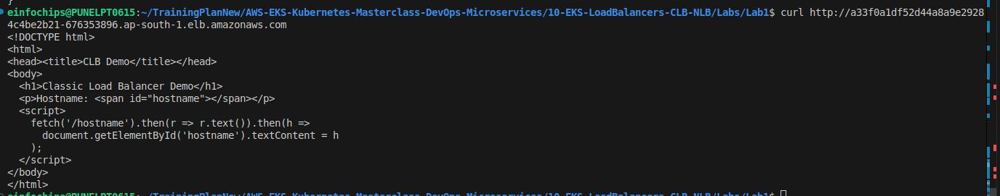
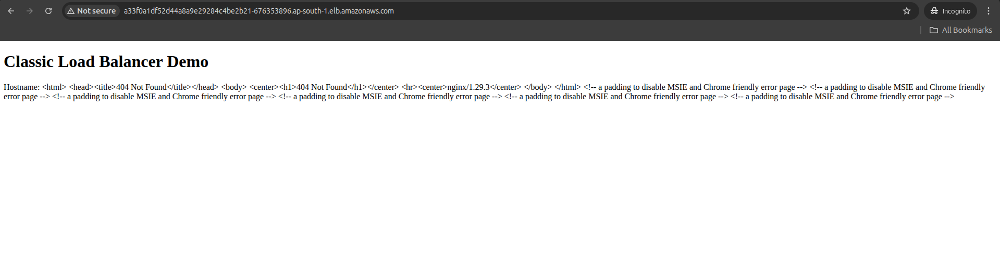
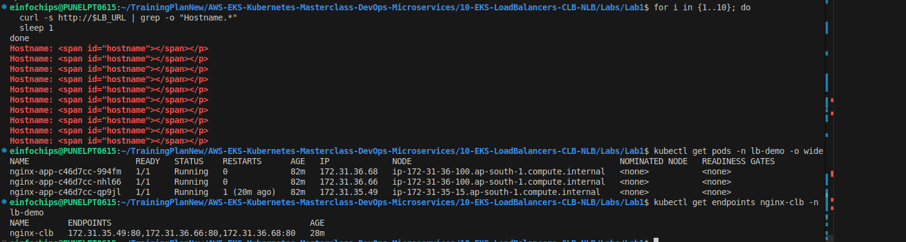

# Lab 1: Classic Load Balancer (CLB) with EKS

## What We're Achieving
Deploy applications with AWS Classic Load Balancer for external access using Kubernetes LoadBalancer service type.

## What We're Doing
- Create LoadBalancer service with CLB
- Configure health checks and target groups
- Test external access and load distribution
- Implement SSL/TLS termination

## Prerequisites
- EKS cluster running (eksdemo1-imran)
- kubectl configured
- Understanding of Kubernetes Services

## Lab Exercises

### Exercise 1: Deploy Application with CLB
```bash
# Create namespace
kubectl create namespace lb-demo

# Deploy sample application
cat > app-deployment.yaml << EOF
apiVersion: apps/v1
kind: Deployment
metadata:
  name: nginx-app
  namespace: lb-demo
spec:
  replicas: 3
  selector:
    matchLabels:
      app: nginx
  template:
    metadata:
      labels:
        app: nginx
    spec:
      containers:
      - name: nginx
        image: nginx:alpine
        ports:
        - containerPort: 80
        volumeMounts:
        - name: html
          mountPath: /usr/share/nginx/html
      volumes:
      - name: html
        configMap:
          name: nginx-content
---
apiVersion: v1
kind: ConfigMap
metadata:
  name: nginx-content
  namespace: lb-demo
data:
  index.html: |
    <!DOCTYPE html>
    <html>
    <head><title>CLB Demo</title></head>
    <body>
      <h1>Classic Load Balancer Demo</h1>
      <p>Hostname: <span id="hostname"></span></p>
      <script>
        fetch('/hostname').then(r => r.text()).then(h => 
          document.getElementById('hostname').textContent = h
        );
      </script>
    </body>
    </html>
EOF

kubectl apply -f app-deployment.yaml
kubectl wait --for=condition=Available deployment/nginx-app -n lb-demo --timeout=120s
```

### Exercise 2: Create CLB LoadBalancer Service
```bash
# Create LoadBalancer service (creates CLB by default)
cat > clb-service.yaml << EOF
apiVersion: v1
kind: Service
metadata:
  name: nginx-clb
  namespace: lb-demo
  annotations:
    service.beta.kubernetes.io/aws-load-balancer-type: "classic"
    service.beta.kubernetes.io/aws-load-balancer-cross-zone-load-balancing-enabled: "true"
    service.beta.kubernetes.io/aws-load-balancer-connection-idle-timeout: "60"
    service.beta.kubernetes.io/aws-load-balancer-source-ranges: "106.215.177.196/32"
spec:
  type: LoadBalancer
  selector:
    app: nginx
  ports:
  - port: 80
    targetPort: 80
    protocol: TCP
EOF

kubectl apply -f clb-service.yaml

# Wait for LoadBalancer to be provisioned
echo "Waiting for LoadBalancer..."
kubectl wait --for=jsonpath='{.status.loadBalancer.ingress}' service/nginx-clb -n lb-demo --timeout=300s

# Get LoadBalancer URL
LB_URL=$(kubectl get svc nginx-clb -n lb-demo -o jsonpath='{.status.loadBalancer.ingress[0].hostname}')
echo "LoadBalancer URL: http://$LB_URL"

# Test access
curl http://$LB_URL
```

### Exercise 3: Configure Health Checks
```bash
# Update service with custom health check annotations
cat > clb-healthcheck.yaml << EOF
apiVersion: v1
kind: Service
metadata:
  name: nginx-clb
  namespace: lb-demo
  annotations:
    service.beta.kubernetes.io/aws-load-balancer-type: "classic"
    service.beta.kubernetes.io/aws-load-balancer-healthcheck-healthy-threshold: "2"
    service.beta.kubernetes.io/aws-load-balancer-healthcheck-unhealthy-threshold: "2"
    service.beta.kubernetes.io/aws-load-balancer-healthcheck-interval: "10"
    service.beta.kubernetes.io/aws-load-balancer-healthcheck-timeout: "5"
    service.beta.kubernetes.io/aws-load-balancer-source-ranges: "106.215.177.196/32"
spec:
  type: LoadBalancer
  selector:
    app: nginx
  ports:
  - port: 80
    targetPort: 80
    protocol: TCP
EOF

kubectl apply -f clb-healthcheck.yaml

# Verify health check configuration
aws elb describe-load-balancers --region ap-south-1 --query "LoadBalancerDescriptions[?contains(LoadBalancerName, 'nginx-clb')].HealthCheck" --output table
```



### Exercise 4: Test Load Distribution
```bash
# Test load balancing across pods
for i in {1..10}; do
  curl -s http://$LB_URL | grep -o "Hostname.*"
  sleep 1
done

# Check pod distribution
kubectl get pods -n lb-demo -o wide

# View service endpoints
kubectl get endpoints nginx-clb -n lb-demo
```


### Exercise 5: Add SSL/TLS Support
```bash
# Create self-signed certificate (for demo)
openssl req -x509 -nodes -days 365 -newkey rsa:2048 \
  -keyout tls.key -out tls.crt \
  -subj "/CN=demo.example.com/O=demo"

# Upload to ACM (or use existing certificate)
# For production, use ACM certificate ARN

# Update service with HTTPS
cat > clb-https.yaml << EOF
apiVersion: v1
kind: Service
metadata:
  name: nginx-clb-https
  namespace: lb-demo
  annotations:
    service.beta.kubernetes.io/aws-load-balancer-type: "classic"
    service.beta.kubernetes.io/aws-load-balancer-ssl-cert: "arn:aws:acm:ap-south-1:ACCOUNT_ID:certificate/CERT_ID"
    service.beta.kubernetes.io/aws-load-balancer-backend-protocol: "http"
    service.beta.kubernetes.io/aws-load-balancer-ssl-ports: "443"
spec:
  type: LoadBalancer
  selector:
    app: nginx
  ports:
  - name: http
    port: 80
    targetPort: 80
  - name: https
    port: 443
    targetPort: 80
EOF

# Note: Replace ACCOUNT_ID and CERT_ID with actual values
# kubectl apply -f clb-https.yaml
```


### Exercise 6: Monitor and Troubleshoot
```bash
# Check service status
kubectl describe svc nginx-clb -n lb-demo

# View CLB details
aws elb describe-load-balancers --region ap-south-1 \
  --query "LoadBalancerDescriptions[?contains(LoadBalancerName, 'nginx-clb')]" \
  --output table

# Check target health
aws elb describe-instance-health --load-balancer-name <LB_NAME> --region ap-south-1

# View CloudWatch metrics
aws cloudwatch get-metric-statistics \
  --namespace AWS/ELB \
  --metric-name RequestCount \
  --dimensions Name=LoadBalancerName,Value=<LB_NAME> \
  --start-time $(date -u -d '1 hour ago' +%Y-%m-%dT%H:%M:%S) \
  --end-time $(date -u +%Y-%m-%dT%H:%M:%S) \
  --period 300 \
  --statistics Sum \
  --region ap-south-1
```

## Cleanup
```bash
kubectl delete -f app-deployment.yaml
kubectl delete -f clb-service.yaml
kubectl delete namespace lb-demo
rm -f app-deployment.yaml clb-service.yaml clb-healthcheck.yaml clb-https.yaml tls.key tls.crt
```

## Key Takeaways
1. CLB automatically created with LoadBalancer service type
2. Annotations control CLB behavior and configuration
3. Health checks ensure traffic only to healthy pods
4. CLB supports both HTTP and HTTPS
5. Cross-zone load balancing distributes traffic evenly
6. Connection idle timeout prevents premature disconnections
7. CloudWatch provides monitoring and metrics

## Next Steps
- Move to Lab 2: Network Load Balancer (NLB)
- Explore advanced CLB configurations
- Implement custom health check endpoints
