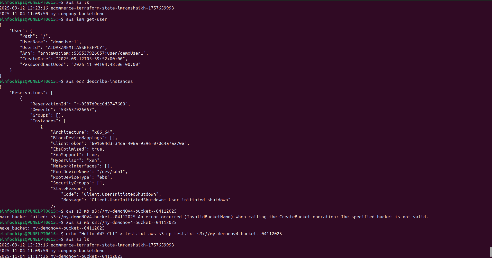
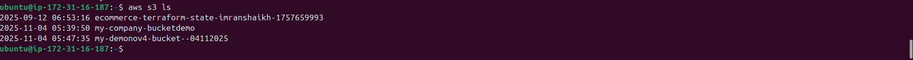

# Section 3: IAM and AWS CLI

## 📋 Overview
This section covers AWS Identity and Access Management (IAM) and the AWS Command Line Interface (CLI). You'll learn how to secure your AWS account, manage users and permissions, and interact with AWS services programmatically.

## 🔐 What is AWS IAM?
AWS Identity and Access Management (IAM) is a web service that helps you securely control access to AWS resources. IAM enables you to:
- Manage users, groups, and roles
- Control access to AWS services and resources
- Implement security best practices
- Enable multi-factor authentication (MFA)

## 🏗️ IAM Components

### 1. Users
- **Individual people or applications**
- Have permanent long-term credentials
- Can have console access and/or programmatic access
- Should follow principle of least privilege

### 2. Groups
- **Collection of users**
- Easier permission management
- Users inherit group permissions
- Cannot be nested (groups within groups)

### 3. Roles
- **Temporary credentials**
- Can be assumed by users, applications, or services
- Cross-account access
- Service-to-service communication

### 4. Policies
- **JSON documents**
- Define permissions (allow/deny)
- Can be attached to users, groups, or roles
- Two types: AWS managed and customer managed

## 📜 IAM Policies

### Policy Structure
```json
{
  "Version": "2012-10-17",
  "Statement": [
    {
      "Effect": "Allow",
      "Action": "s3:GetObject",
      "Resource": "arn:aws:s3:::my-bucket/*",
      "Condition": {
        "StringEquals": {
          "s3:ExistingObjectTag/Department": "Finance"
        }
      }
    }
  ]
}
```

### Policy Elements
- **Version**: Policy language version
- **Statement**: Main policy element
- **Effect**: Allow or Deny
- **Action**: What actions are allowed/denied
- **Resource**: Which resources the actions apply to
- **Condition**: When the policy is in effect (optional)

### Policy Types
1. **AWS Managed Policies**: Created and maintained by AWS
2. **Customer Managed Policies**: Created and maintained by you
3. **Inline Policies**: Directly attached to a single user, group, or role

## 🛠️ AWS CLI (Command Line Interface)

### What is AWS CLI?
- **Command-line tool** for interacting with AWS services
- **Cross-platform**: Windows, macOS, Linux
- **Automation**: Script AWS operations
- **Programmatic access**: Alternative to web console

### AWS CLI Versions
- **AWS CLI v1**: Python-based, legacy version
- **AWS CLI v2**: Improved performance, new features (recommended)

### Authentication Methods
1. **Access Keys**: Long-term credentials
2. **IAM Roles**: Temporary credentials (recommended)
3. **AWS SSO**: Single sign-on integration
4. **Environment Variables**: For automation

## 🛠️ Hands-On Practice

### Practice 1: Create IAM Users and Groups
**Objective**: Set up proper user management structure

**Steps**:
1. **Create IAM Group**:
   - Go to IAM Console
   - Click "Groups" → "Create New Group"
   - Name: "Developers"
   - Attach policy: "PowerUserAccess"
   - Create group

2. **Create IAM User**:
   - Click "Users" → "Add User"
   - Username: "john-developer"
   - Access type: Both console and programmatic
   - Add to "Developers" group
   - Download credentials

**Screenshot Placeholder**:

*Caption: Creating IAM user with appropriate permissions*

### Practice 2: Configure Multi-Factor Authentication (MFA)
**Objective**: Enhance account security with MFA

**Steps**:
1. **For Root Account**:
   - Go to "My Security Credentials"
   - Click "Activate MFA"
   - Choose "Virtual MFA device"
   - Use Google Authenticator or similar app
   - Scan QR code and enter two consecutive codes

2. **For IAM User**:
   - Select user in IAM console
   - Go to "Security credentials" tab
   - Click "Manage" next to "Assigned MFA device"
   - Follow same process as root account


### Practice 3: Install and Configure AWS CLI
**Objective**: Set up command-line access to AWS

**Steps**:
1. **Install AWS CLI v2**:
   ```bash
   # Windows
   msiexec.exe /i https://awscli.amazonaws.com/AWSCLIV2.msi
   
   # macOS
   curl "https://awscli.amazonaws.com/AWSCLIV2.pkg" -o "AWSCLIV2.pkg"
   sudo installer -pkg AWSCLIV2.pkg -target /
   
   # Linux
   curl "https://awscli.amazonaws.com/awscli-exe-linux-x86_64.zip" -o "awscliv2.zip"
   unzip awscliv2.zip
   sudo ./aws/install
   ```

2. **Verify Installation**:
   ```bash
   aws --version
   ```

3. **Configure AWS CLI**:
   ```bash
   aws configure
   # Enter Access Key ID
   # Enter Secret Access Key
   # Enter Default region (e.g., us-east-1)
   # Enter Default output format (json)
   ```

**Screenshot Placeholder**:
)
*Caption: AWS CLI installation and configuration*

### Practice 4: Create Custom IAM Policy
**Objective**: Create granular permissions for specific use cases

**Steps**:
1. **Create S3 Read-Only Policy**:
   - Go to IAM → Policies → Create Policy
   - Use JSON editor
   - Enter policy:
   ```json
   {
     "Version": "2012-10-17",
     "Statement": [
       {
         "Effect": "Allow",
         "Action": [
           "s3:GetObject",
           "s3:ListBucket"
         ],
         "Resource": [
           "arn:aws:s3:::my-company-bucket",
           "arn:aws:s3:::my-company-bucket/*"
         ]
       }
     ]
   }
   ```
   - Name: "S3ReadOnlySpecificBucket"
   - Create policy

2. **Attach to User**:
   - Select user
   - Add permissions
   - Attach existing policy
   - Select your custom policy

**Screenshot Placeholder**:
)
*Caption: Creating custom IAM policy with specific permissions*

### Practice 5: Test AWS CLI Commands
**Objective**: Verify CLI functionality and permissions

**Steps**:
1. **List S3 Buckets**:
   ```bash
   aws s3 ls
   ```

2. **Get IAM User Information**:
   ```bash
   aws iam get-user
   ```

3. **List EC2 Instances**:
   ```bash
   aws ec2 describe-instances
   ```

4. **Create S3 Bucket**:
   ```bash
   aws s3 mb s3://my-unique-bucket-name-12345
   ```

5. **Upload File to S3**:
   ```bash
   echo "Hello AWS CLI" > test.txt
   aws s3 cp test.txt s3://my-unique-bucket-name-12345/
   ```

**Screenshot Placeholder**:
![AWS CLI Commands]
*Caption: Testing various AWS CLI commands*

### Practice 6: IAM Roles for EC2
**Objective**: Create and use IAM roles for service-to-service access

**Steps**:
1. **Create IAM Role**:
   - Go to IAM → Roles → Create Role
   - Select "AWS Service" → "EC2"
   - Attach policy: "AmazonS3ReadOnlyAccess"
   - Role name: "EC2-S3-ReadOnly-Role"
   - Create role

2. **Launch EC2 Instance with Role**:
   - Go to EC2 Console
   - Launch instance
   - In "Configure Instance Details"
   - Select IAM role: "EC2-S3-ReadOnly-Role"
   - Complete instance launch

**Screenshot Placeholder**:
![IAM Role Creation]
*Caption: Creating IAM role for EC2 service*

## 🔒 IAM Security Best Practices

### 1. Root Account Security
- **Enable MFA** on root account
- **Don't use root** for daily tasks
- **Strong password** and secure storage
- **Regular monitoring** of root account usage

### 2. User Management
- **Individual users** for each person
- **Strong passwords** and MFA
- **Regular access reviews**
- **Remove unused accounts**

### 3. Permission Management
- **Principle of least privilege**
- **Use groups** for permission management
- **Regular permission audits**
- **Temporary credentials** when possible

### 4. Monitoring and Auditing
- **Enable CloudTrail** for API logging
- **Regular access reviews**
- **Monitor failed login attempts**
- **Use AWS Config** for compliance

## 📊 IAM Policy Evaluation Logic

### Policy Evaluation Flow
1. **Default Deny**: All requests are denied by default
2. **Explicit Allow**: Check for explicit allow statements
3. **Explicit Deny**: Check for explicit deny statements (overrides allow)
4. **Final Decision**: Allow only if explicitly allowed and not explicitly denied

### Policy Types Priority
1. **Explicit Deny** (highest priority)
2. **Explicit Allow**
3. **Default Deny** (lowest priority)

## 🔧 AWS CLI Advanced Features

### 1. Profiles
```bash
# Configure multiple profiles
aws configure --profile production
aws configure --profile development

# Use specific profile
aws s3 ls --profile production
```

### 2. Output Formats
```bash
# JSON (default)
aws ec2 describe-instances --output json

# Table format
aws ec2 describe-instances --output table

# Text format
aws ec2 describe-instances --output text
```

### 3. Filtering and Querying
```bash
# Filter results
aws ec2 describe-instances --filters "Name=instance-state-name,Values=running"

# Query specific fields
aws ec2 describe-instances --query 'Reservations[*].Instances[*].[InstanceId,State.Name]'
```

### 4. Pagination
```bash
# Handle large result sets
aws s3api list-objects-v2 --bucket my-bucket --max-items 100
```

## 🚨 Common IAM Mistakes to Avoid

1. **Using root account** for daily operations
2. **Overly permissive policies** (using wildcards unnecessarily)
3. **Not enabling MFA** on privileged accounts
4. **Hardcoding credentials** in applications
5. **Not rotating access keys** regularly
6. **Ignoring unused permissions**
7. **Not monitoring IAM activities**

## 🔗 Additional Resources

- [IAM Best Practices](https://docs.aws.amazon.com/IAM/latest/UserGuide/best-practices.html)
- [AWS CLI User Guide](https://docs.aws.amazon.com/cli/latest/userguide/)
- [IAM Policy Simulator](https://policysim.aws.amazon.com/)
- [AWS Security Blog](https://aws.amazon.com/blogs/security/)


---

## ✅ Section Completion Checklist
- [ ] Understood IAM concepts (users, groups, roles, policies)
- [ ] Created IAM users and groups
- [ ] Configured MFA for root and IAM users
- [ ] Installed and configured AWS CLI
- [ ] Created custom IAM policies
- [ ] Tested CLI commands and permissions
- [ ] Created IAM roles for services
- [ ] Implemented security best practices

## 🎯 Next Steps
Move to **Section 4: EC2 Fundamentals** to learn about Amazon's virtual servers and compute services.

---
