# Section 4: EC2 Fundamentals

## 📋 Overview
This section covers Amazon Elastic Compute Cloud (EC2), AWS's foundational compute service. You'll learn how to launch, configure, and manage virtual servers in the cloud.

## 🖥️ What is Amazon EC2?
Amazon Elastic Compute Cloud (EC2) provides:
- **Virtual servers** in the cloud
- **Scalable computing capacity**
- **Complete control** over computing resources
- **Integration** with other AWS services
- **Pay-as-you-go** pricing model

## 🏗️ EC2 Instance Types

### General Purpose
- **T3/T4g**: Burstable performance (web servers, small databases)
- **M5/M6i**: Balanced compute, memory, networking (web applications)
- **A1**: ARM-based processors (scale-out workloads)

### Compute Optimized
- **C5/C6i**: High-performance processors (scientific computing, gaming)
- **C6g**: ARM-based compute optimization

### Memory Optimized
- **R5/R6i**: Memory-intensive applications (in-memory databases)
- **X1e/X1**: High memory-to-vCPU ratio (Apache Spark, SAP HANA)
- **z1d**: High frequency and NVMe SSD storage

### Storage Optimized
- **I3/I3en**: NVMe SSD-backed instance storage (NoSQL databases)
- **D2/D3**: Dense HDD storage (distributed file systems)
- **H1**: High disk throughput (MapReduce workloads)

### Accelerated Computing
- **P3/P4**: GPU instances for machine learning
- **G4**: GPU instances for graphics workloads
- **F1**: FPGA instances for hardware acceleration

## 💾 EC2 Storage Options

### 1. Amazon EBS (Elastic Block Store)
- **Persistent storage** that survives instance termination
- **High availability** and durability
- **Snapshot capability** for backups
- **Multiple volume types** for different performance needs

#### EBS Volume Types
- **gp3/gp2**: General Purpose SSD (balanced price/performance)
- **io2/io1**: Provisioned IOPS SSD (high IOPS requirements)
- **st1**: Throughput Optimized HDD (big data, data warehouses)
- **sc1**: Cold HDD (infrequent access)

### 2. Instance Store
- **Temporary storage** physically attached to host
- **High performance** but data lost on stop/termination
- **No additional cost**
- **Good for**: Temporary storage, caches, buffers

### 3. Amazon EFS (Elastic File System)
- **Network file system** for Linux instances
- **Shared storage** across multiple instances
- **Automatically scales** storage capacity

## 🔧 EC2 Pricing Models

### 1. On-Demand Instances
- **Pay by the hour/second**
- **No long-term commitments**
- **Good for**: Unpredictable workloads, testing

### 2. Reserved Instances
- **1 or 3-year commitment**
- **Up to 75% discount** compared to On-Demand
- **Good for**: Steady-state workloads

#### Reserved Instance Types
- **Standard**: Up to 75% discount, can't change instance attributes
- **Convertible**: Up to 54% discount, can change instance family
- **Scheduled**: Launch within time windows you reserve

### 3. Spot Instances
- **Up to 90% discount** compared to On-Demand
- **Can be interrupted** by AWS with 2-minute notice
- **Good for**: Fault-tolerant, flexible workloads

### 4. Dedicated Hosts
- **Physical server** dedicated to your use
- **Compliance requirements** or licensing
- **Most expensive** option

### 5. Dedicated Instances
- **Instances run on dedicated hardware**
- **Isolated at hardware level**
- **Less expensive** than Dedicated Hosts

## 🛠️ Hands-On Practice

### Practice 1: Launch Your First EC2 Instance
**Objective**: Create and configure a basic EC2 instance

**Steps**:
1. **Navigate to EC2 Console**:
   - Go to AWS Console
   - Search for "EC2"
   - Click on EC2 service

2. **Launch Instance**:
   - Click "Launch Instance"
   - Name: "My-First-EC2-Instance"
   - Choose AMI: Amazon Linux 2023
   - Instance type: t2.micro (free tier)
   - Key pair: Create new key pair "my-ec2-key"
   - Security group: Create new (allow SSH from your IP)
   - Storage: 8 GB gp3 (default)
   - Launch instance

3. **Download Key Pair**:
   - Save the .pem file securely
   - Set proper permissions (chmod 400 on Linux/Mac)

**Screenshot Placeholder**:
![EC2 Launch Process]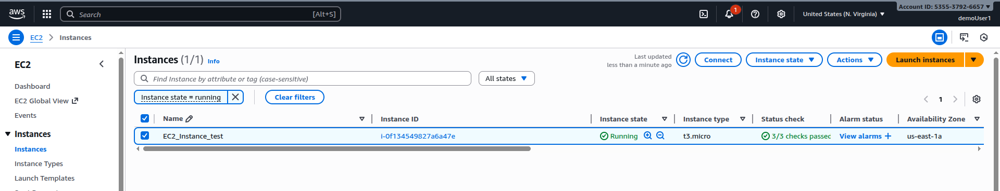
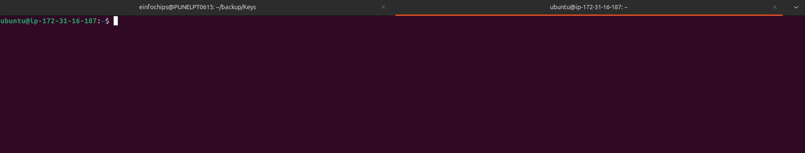
*Caption: EC2 instance launch configuration*

### Practice 2: Connect to EC2 Instance
**Objective**: Access your EC2 instance via SSH

**Steps**:
1. **Get Instance Details**:
   - Note the public IP address
   - Ensure instance state is "running"

2. **Connect via SSH** (Linux/Mac):
   ```bash
   chmod 400 my-ec2-key.pem
   ssh -i my-ec2-key.pem ec2-user@<public-ip-address>
   ```

3. **Connect via PuTTY** (Windows):
   - Convert .pem to .ppk using PuTTYgen
   - Use PuTTY with the .ppk file
   - Username: ec2-user

4. **Verify Connection**:
   ```bash
   whoami
   pwd
   ls -la
   sudo yum update -y
   ```

**Screenshot Placeholder**:
![SSH Connection]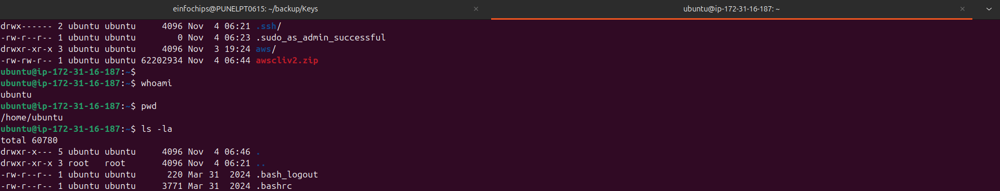
*Caption: Successfully connected to EC2 instance via SSH*

### Practice 3: Install and Configure Web Server
**Objective**: Set up a basic web server on EC2

**Steps**:
1. **Install Apache**:
   ```bash
   sudo apt update -y
   sudo apt install -y apache2
   sudo systemctl start apache2
   sudo systemctl enable apache2
   ```

2. **Create Web Page**:
   ```bash
   TOKEN=$(curl -X PUT "http://169.254.169.254/latest/api/token" -H "X-aws-ec2-metadata-token-ttl-seconds: 21600")
   sudo tee /var/www/html/index.html <<EOF
   <h1>Hello from EC2!</h1>
   <p>Instance ID: $(curl -H "X-aws-ec2-metadata-token: $TOKEN" -s http://169.254.169.254/latest/meta-data/instance-id)</p>
   <p>Availability Zone: $(curl -H "X-aws-ec2-metadata-token: $TOKEN" -s http://169.254.169.254/latest/meta-data/placement/availability-zone)</p>
   EOF
   ```

3. **Update Security Group**:
   - Go to EC2 Console → Security Groups
   - Select your instance's security group
   - Add inbound rule: HTTP (port 80) from anywhere (0.0.0.0/0)

4. **Test Web Server**:
   - Open browser
   - Navigate to http://your-instance-public-ip
   - Verify web page loads

**Screenshot Placeholder**:
![Web Server Setup]
*Caption: Web server running on EC2 instance*

### Practice 4: Work with EBS Volumes
**Objective**: Attach additional storage to EC2 instance

**Steps**:
1. **Create EBS Volume**:
   - Go to EC2 → Volumes
   - Create Volume
   - Size: 10 GB
   - Type: gp3
   - Same AZ as your instance
   - Create volume

2. **Attach Volume**:
   - Select the volume
   - Actions → Attach Volume
   - Select your instance
   - Device: /dev/sdf

3. **Format and Mount** (on EC2 instance):
   ```bash
   # List block devices
   lsblk
   
   # Format the volume
   sudo mkfs -t ext4 /dev/nvme1n1

   
   # Create mount point
   sudo mkdir /mnt/data
   
   # Mount the volume
   sudo mount /dev/nvme1n1 /mnt/data
   
   # Verify mount
   df -h
   
   # Create test file
   sudo touch /data/test-file.txt
   echo "Hello EBS!" | sudo tee /data/test-file.txt
   ls -la /mnt/data/
   ```

4. **Persistent Mount**:
   ```bash
   # Get UUID
   sudo blkid /dev/nvme0n1
   
   # Edit fstab
   sudo cp /etc/fstab /etc/fstab.backup
   sudo nano /etc/fstab
   # UUID=B801982f-6ad4-451d-8934-af60da3fbfe5 /mnt/data ext4 defaults,nofail 0 2

   # Make sure the mount point exists:
   sudo mkdir -p /mnt/data

   # Mount all filesystems listed in fstab to check:
   sudo mount -a
   df -h
   ```

**Screenshot Placeholder**:
![EBS Volume Management]
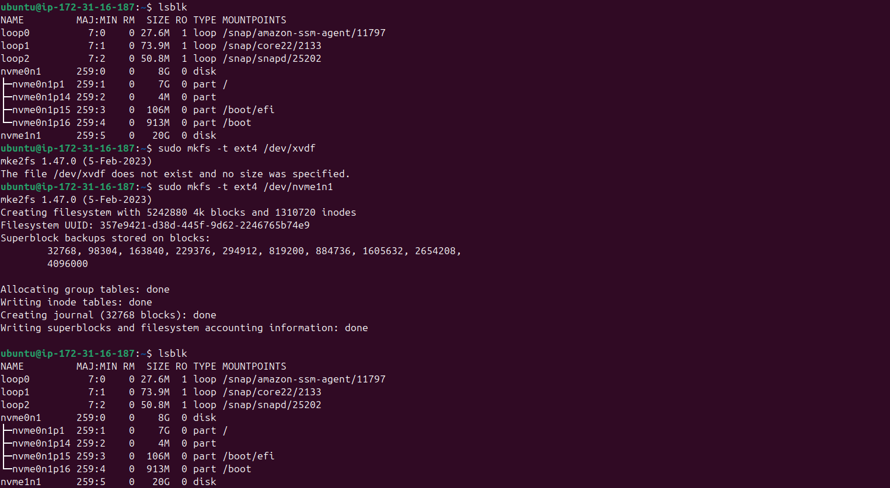 


*Caption: EBS volume attached and mounted to EC2 instance*

### Practice 5: Create AMI (Amazon Machine Image)
**Objective**: Create a custom image from your configured instance

**Steps**:
1. **Prepare Instance**:
   - Stop any running applications
   - Clear temporary files
   - Remove sensitive data

2. **Create AMI**:
   - Select your instance in EC2 console
   - Actions → Image and templates → Create image
   - Image name: "My-Web-Server-AMI"
   - Description: "Amazon Linux with Apache web server"
   - Create image

3. **Launch from AMI**:
   - Go to AMIs section
   - Select your AMI
   - Launch instance from AMI
   - Verify web server is pre-configured

**Screenshot Placeholder**:
![AMI Creation] 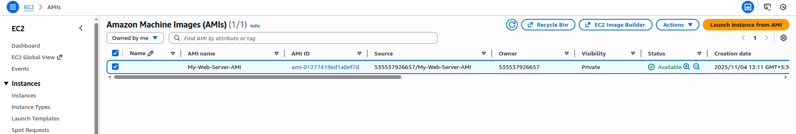

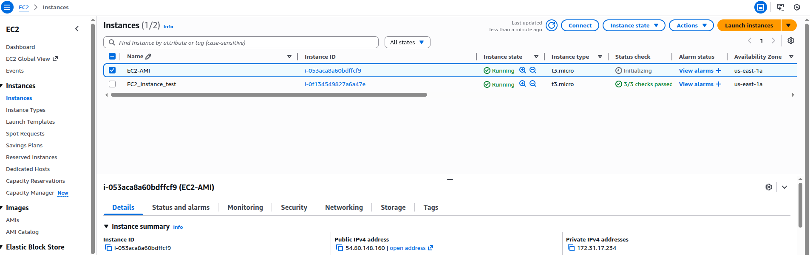

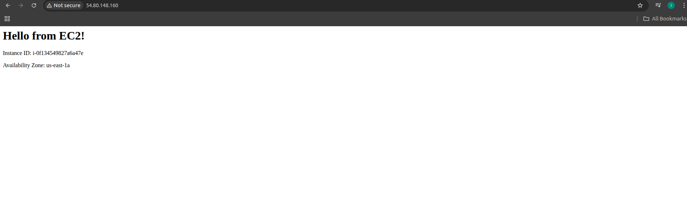
*Caption: Creating custom AMI from configured EC2 instance*

### Practice 6: EC2 Instance Metadata
**Objective**: Explore instance metadata service

**Steps**:
1. **Access Metadata** (from within EC2 instance):
   ```bash
    # Get session token
   TOKEN=$(curl -X PUT "http://169.254.169.254/latest/api/token" -H "X-aws-ec2-metadata-token-ttl-seconds: 60")

   # Fetch instance ID (as an example)
   curl -H "X-aws-ec2-metadata-token: $TOKEN" http://169.254.169.254/latest/meta-data/instance-id

   # Fetch the top-level metadata
   curl -H "X-aws-ec2-metadata-token: $TOKEN" http://169.254.169.254/latest/meta-data/

   # Fetch instance type
   curl -H "X-aws-ec2-metadata-token: $TOKEN" http://169.254.169.254/latest/meta-data/instance-type

   ```

2. **Create Metadata Script**:
   ```bash
   cat << 'EOF' > metadata-info.sh
   #!/bin/bash
   echo "=== EC2 Instance Metadata ==="

   # Get IMDSv2 session token
   TOKEN=$(curl -X PUT -s "http://169.254.169.254/latest/api/token" -H "X-aws-ec2-metadata-token-ttl-seconds: 60")

   echo "Instance ID: $(curl -s -H "X-aws-ec2-metadata-token: $TOKEN" http://169.254.169.254/latest/meta-data/instance-id)"
   echo "Instance Type: $(curl -s -H "X-aws-ec2-metadata-token: $TOKEN" http://169.254.169.254/latest/meta-data/instance-type)"
   echo "Public IP: $(curl -s -H "X-aws-ec2-metadata-token: $TOKEN" http://169.254.169.254/latest/meta-data/public-ipv4)"
   echo "Private IP: $(curl -s -H "X-aws-ec2-metadata-token: $TOKEN" http://169.254.169.254/latest/meta-data/local-ipv4)"
   echo "AZ: $(curl -s -H "X-aws-ec2-metadata-token: $TOKEN" http://169.254.169.254/latest/meta-data/placement/availability-zone)"
   # Region derived from AZ
   AZ=$(curl -s -H "X-aws-ec2-metadata-token: $TOKEN" http://169.254.169.254/latest/meta-data/placement/availability-zone)
   echo "Region: ${AZ::-1}"
   EOF

   
   chmod +x metadata-info.sh
   ./metadata-info.sh
   ```

**Screenshot Placeholder**:
![Instance Metadata] 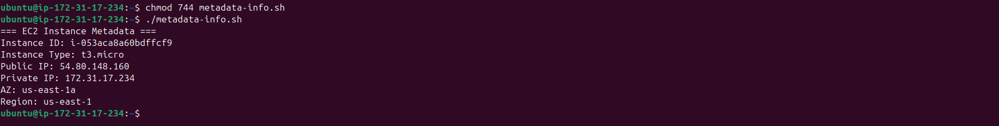
*Caption: Accessing EC2 instance metadata*

## 🔒 EC2 Security Best Practices

### 1. Security Groups
- **Act as virtual firewalls**
- **Stateful** (return traffic automatically allowed)
- **Default deny** all inbound traffic
- **Allow all outbound** traffic by default
- **Can reference other security groups**

### 2. Key Pairs
- **Secure key storage**
- **Regular key rotation**
- **Use different keys** for different environments
- **Never share private keys**

### 3. IAM Roles
- **Use IAM roles** instead of access keys
- **Principle of least privilege**
- **Regular permission reviews**

### 4. Network Security
- **Use VPC** for network isolation
- **Private subnets** for sensitive workloads
- **Network ACLs** for additional security layer

## 📊 EC2 Monitoring and Management

### 1. CloudWatch Metrics
- **CPU Utilization**
- **Network In/Out**
- **Disk Read/Write**
- **Status Checks**

### 2. CloudWatch Alarms
- **Automated responses** to metric thresholds
- **SNS notifications**
- **Auto Scaling triggers**

### 3. Systems Manager
- **Patch management**
- **Configuration management**
- **Remote command execution**

## 🚨 Common EC2 Mistakes to Avoid

1. **Leaving instances running** when not needed
2. **Using inappropriate instance types**
3. **Not using IAM roles** for applications
4. **Overly permissive security groups**
5. **Not backing up data** regularly
6. **Ignoring monitoring** and alerts
7. **Not tagging resources** properly

## 🔗 Additional Resources

- [EC2 User Guide](https://docs.aws.amazon.com/ec2/)
- [EC2 Instance Types](https://aws.amazon.com/ec2/instance-types/)
- [EC2 Pricing](https://aws.amazon.com/ec2/pricing/)
- [EC2 Best Practices](https://docs.aws.amazon.com/AWSEC2/latest/UserGuide/ec2-best-practices.html)

## 📸 Screenshots Section
*Document your EC2 learning progress:*

### Screenshot 1: EC2 Dashboard
![EC2 Dashboard]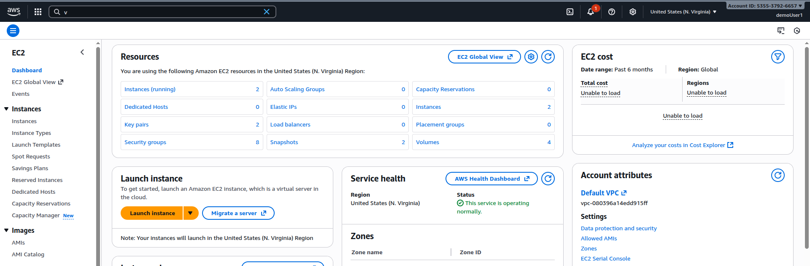
*Caption: EC2 service dashboard overview*

### Screenshot 2: Instance Launch Wizard
![Launch Wizard]
*Caption: EC2 instance launch configuration wizard*

### Screenshot 3: Running Instance
![Running Instance]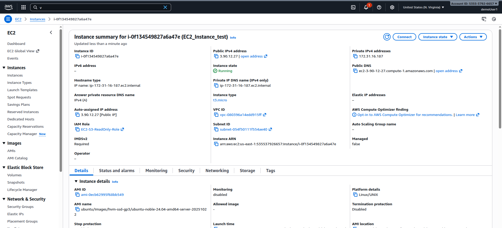
*Caption: Successfully launched EC2 instance*

### Screenshot 4: SSH Connection
![SSH Connection]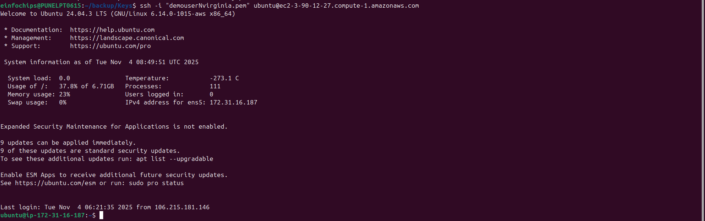
*Caption: Connected to EC2 instance via SSH*

### Screenshot 5: Web Server Test
![Web Server]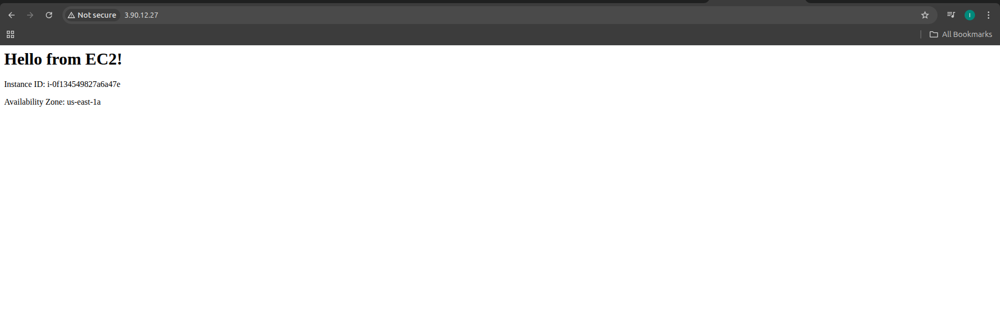
*Caption: Web server running on EC2 instance*

### Screenshot 6: EBS Volume Attachment
![EBS Volume]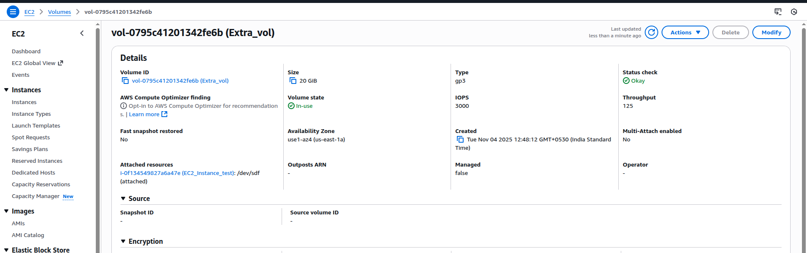
*Caption: EBS volume successfully attached and mounted*

---

## ✅ Section Completion Checklist
- [ ] Understood EC2 concepts and instance types
- [ ] Launched first EC2 instance
- [ ] Connected to instance via SSH
- [ ] Configured security groups
- [ ] Installed and configured web server
- [ ] Worked with EBS volumes
- [ ] Created custom AMI
- [ ] Explored instance metadata
- [ ] Implemented security best practices

## 🎯 Next Steps
Move to **Section 5: EC2 - Solutions Architect Associate Level** to learn advanced EC2 concepts and architectural patterns.

---