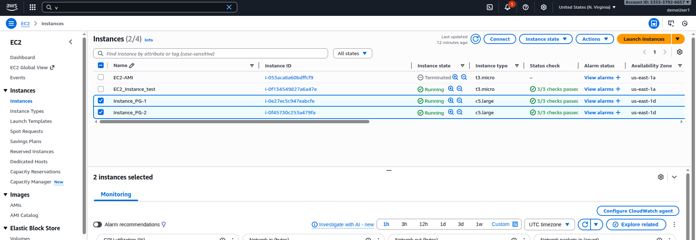
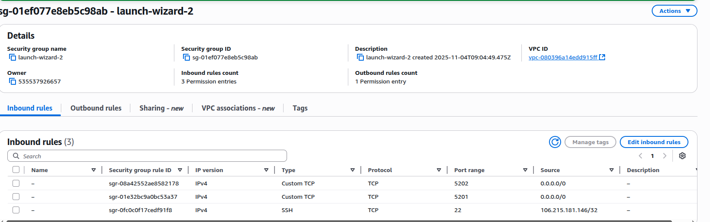

# Section 5: EC2 - Solutions Architect Associate Level

## 📋 Overview
This section covers advanced EC2 concepts essential for the Solutions Architect Associate exam, including placement groups, enhanced networking, hibernation, and architectural patterns.

## 🏗️ Advanced EC2 Concepts

### 1. Placement Groups
Placement groups determine how instances are placed on underlying hardware to meet specific requirements.

#### Cluster Placement Groups
- **Same AZ**: All instances in same availability zone
- **Low latency**: 10 Gbps network performance
- **Use case**: HPC applications, tightly coupled workloads
- **Limitation**: Single AZ, limited instance types

#### Partition Placement Groups
- **Multiple AZs**: Spread across availability zones
- **Isolated partitions**: Each partition has its own rack
- **Use case**: Large distributed systems (Hadoop, Cassandra)
- **Benefit**: Reduces correlated hardware failures

#### Spread Placement Groups
- **Different hardware**: Each instance on different rack
- **Maximum 7 instances** per AZ per group
- **Use case**: Critical applications requiring high availability
- **Benefit**: Minimizes simultaneous failures

### 2. Enhanced Networking
Advanced networking features for high-performance computing.

#### SR-IOV (Single Root I/O Virtualization)
- **Hardware-level** network virtualization
- **Higher bandwidth** and lower latency
- **Lower CPU utilization**
- **Supported on most modern instance types**

#### Elastic Network Adapter (ENA)
- **Up to 100 Gbps** network performance
- **Lower latency** and higher packet-per-second performance
- **Available on current generation instances**

#### Intel 82599 VF Interface
- **Up to 10 Gbps** network performance
- **Legacy enhanced networking**
- **Older instance types**

### 3. EC2 Hibernation
Save instance state to EBS root volume for faster startup.

#### How Hibernation Works
- **RAM contents** saved to EBS root volume
- **Instance stops** but EBS volumes remain attached
- **Fast startup** when resumed (no OS boot)
- **Preserves** instance ID and private IP

#### Hibernation Requirements
- **Supported instance families**: M3, M4, M5, C3, C4, C5, R3, R4, R5
- **Instance RAM**: Must be less than 150 GB
- **Root volume**: Must be EBS and encrypted
- **Maximum hibernation**: 60 days

## 🔧 EC2 Nitro System
AWS's next-generation virtualization infrastructure.

### Nitro Components
1. **Nitro Cards**: Specialized hardware for VPC, EBS, Instance Storage
2. **Nitro Security Chip**: Hardware-based security and attestation
3. **Nitro Hypervisor**: Lightweight hypervisor for memory and CPU allocation

### Benefits
- **Better performance**: Near bare-metal performance
- **Enhanced security**: Hardware-based security features
- **More instance types**: Enables new instance families
- **Better resource utilization**: More CPU and memory for workloads

## 🛠️ Hands-On Practice

### Practice 1: Create and Test Placement Groups
**Objective**: Understand different placement group strategies

**Steps**:
1. **Create Cluster Placement Group**:
   - Go to EC2 Console → Placement Groups
   - Create placement group
   - Name: "my-cluster-pg"
   - Strategy: Cluster
   - Create group

2. **Launch Instances in Placement Group**:
   - Launch 2 instances
   - Instance type: c5.large (or available type)
   - Placement group: my-cluster-pg
   - Same subnet (same AZ)
   - Launch instances

3. **Test Network Performance**:
   ```bash
   # Install iperf3 on both instances
   sudo apt update
   sudo apt install -y iperf3

   
   # On first instance (server)
   iperf3 -s
   
   # On second instance (client)
   iperf3 -c <private-ip-of-first-instance> -t 30
   ```

**Screenshot Placeholder**:
![Placement Groups] 
Instances: 
SG: 
Server-1 
Server-2 
*Caption: Creating and configuring placement groups*

### Practice 2: Enable Enhanced Networking
**Objective**: Configure enhanced networking for better performance

**Steps**:
1. **Check Current Instance**:
   ```bash
   # Check if ENA is enabled
   aws ec2 describe-instances --instance-ids i-0f45730c253a479fa --query 'Reservations[].Instances[].EnaSupport'
   
   # Check if SR-IOV is enabled
   aws ec2 describe-instances --instance-ids i-0f45730c253a479fa --query 'Reservations[].Instances[].SriovNetSupport'
   ```

2. **Enable Enhanced Networking** (if not already enabled):
   ```bash
   # Stop the instance first
   aws ec2 stop-instances --instance-ids i-0f45730c253a479fa
   
   # Enable ENA support
   aws ec2 modify-instance-attribute --instance-id i-0f45730c253a479fa --ena-support
   
   # Enable SR-IOV support
   aws ec2 modify-instance-attribute --instance-id i-1234567890abcdef0 --sriov-net-support simple
   
   # Start the instance
   aws ec2 start-instances --instance-ids i-1234567890abcdef0
   ```

3. **Verify Enhanced Networking**:
   ```bash
   # Check network interface
   ethtool -i eth0
   
   # Check network statistics
   ethtool -S eth0
   ```


### Practice 3: Configure EC2 Hibernation
**Objective**: Set up and test EC2 hibernation

**Steps**:
1. **Launch Hibernation-Enabled Instance**:
   - Instance type: m5.large
   - AMI: Amazon Linux 2
   - Storage: Encrypted EBS root volume (at least 16 GB)
   - Advanced details → Stop - Hibernate behavior: Enable
   - Launch instance

2. **Install Hibernation Agent**:
   ```bash
   # Connect to instance
   ssh -i your-key.pem ec2-user@instance-ip
   
   # Install hibernation agent
   sudo yum update -y
   sudo yum install -y ec2-hibinit-agent
   sudo systemctl enable hibinit-agent
   ```

3. **Test Hibernation**:
   ```bash
   # Create a test file
   echo "Before hibernation: $(date)" > /tmp/hibernation-test.txt
   
   # Start a background process
   nohup ping google.com > /tmp/ping-output.txt &
   
   # Note the process ID
   ps aux | grep ping
   ```

4. **Hibernate Instance**:
   - In EC2 Console, select instance
   - Actions → Instance State → Stop - Hibernate
   - Wait for instance to hibernate

5. **Resume and Verify**:
   - Start the instance
   - SSH back in
   - Check if files and processes are preserved:
   ```bash
   cat /tmp/hibernation-test.txt
   ps aux | grep ping
   tail /tmp/ping-output.txt
   ```


### Practice 4: Implement Auto Recovery
**Objective**: Configure automatic instance recovery

**Steps**:
1. **Create CloudWatch Alarm**:
   - Go to CloudWatch Console
   - Create Alarm
   - Metric: EC2 → Per-Instance Metrics
   - Instance: Select your instance
   - Metric: StatusCheckFailed_System
   - Condition: Greater than 0 for 2 consecutive periods
   - Action: Recover this instance

2. **Test Auto Recovery** (Optional - be careful):
   ```bash
   # Simulate system failure (WARNING: This will cause instance issues)
   # Only do this on a test instance
   sudo echo c > /proc/sysrq-trigger
   ```

3. **Monitor Recovery**:
   - Watch CloudWatch alarms
   - Check EC2 console for recovery actions
   - Verify instance comes back online


### Practice 5: EC2 Instance Connect
**Objective**: Use browser-based SSH connection

**Steps**:
1. **Enable EC2 Instance Connect**:
   - Launch new instance or use existing
   - Ensure security group allows SSH (port 22)
   - AMI must support EC2 Instance Connect (Amazon Linux 2, Ubuntu)

2. **Install EC2 Instance Connect** (if needed):
   ```bash
   # Amazon Linux 2
   sudo yum install -y ec2-instance-connect
   
   # Ubuntu
   sudo apt-get update
   sudo apt-get install -y ec2-instance-connect
   ```

3. **Connect via Browser**:
   - Go to EC2 Console
   - Select instance
   - Click "Connect"
   - Choose "EC2 Instance Connect"
   - Click "Connect"

4. **Connect via CLI**:
   ```bash
   # Install EC2 Instance Connect CLI
   pip install ec2-instance-connect-cli
   
   # Connect to instance
   mssh i-1234567890abcdef0 --region us-east-1
   ```

**Screenshot Placeholder**:

*Caption: Browser-based SSH connection using EC2 Instance Connect*

### Practice 6: Spot Instance Best Practices
**Objective**: Implement fault-tolerant spot instance architecture

**Steps**:
1. **Create Spot Instance Request**:
   - Go to EC2 Console → Spot Requests
   - Request Spot Instances
   - AMI: Amazon Linux 2
   - Instance type: t3.micro
   - Maximum price: Set appropriate limit
   - Request type: One-time
   - Launch specification

2. **Create Spot Fleet**:
   - Go to Spot Requests → Spot Fleet
   - Create Spot Fleet request
   - Target capacity: 2 instances
   - Multiple instance types: t3.micro, t3.small
   - Multiple AZs for diversification
   - Launch template or launch specification

3. **Implement Spot Instance Interruption Handling**:
   ```bash
   # Create interruption handler script
   cat << 'EOF' > /home/ec2-user/spot-handler.sh
   #!/bin/bash
   
   # Check for spot interruption notice
   TOKEN=$(curl -X PUT "http://169.254.169.254/latest/api/token" -H "X-aws-ec2-metadata-token-ttl-seconds: 21600")
   INTERRUPTION=$(curl -H "X-aws-ec2-metadata-token: $TOKEN" -s http://169.254.169.254/latest/meta-data/spot/instance-action)
   
   if [ $? -eq 0 ]; then
       echo "Spot interruption notice received: $INTERRUPTION"
       # Perform graceful shutdown tasks
       # Save work, notify other systems, etc.
       sudo shutdown -h +1
   fi
   EOF
   
   chmod +x /home/ec2-user/spot-handler.sh
   
   # Add to crontab to check every minute
   echo "* * * * * /home/ec2-user/spot-handler.sh" | crontab -
   ```

## 🏛️ EC2 Architectural Patterns

### 1. High Availability Architecture
- **Multi-AZ deployment**
- **Load balancer distribution**
- **Auto Scaling groups**
- **Health checks and replacement**

### 2. Disaster Recovery Patterns
- **Backup and Restore**: Lowest cost, highest RTO/RPO
- **Pilot Light**: Core systems always running
- **Warm Standby**: Scaled-down version always running
- **Multi-Site Active/Active**: Full production scale

### 3. Scalability Patterns
- **Horizontal scaling**: Add more instances
- **Vertical scaling**: Increase instance size
- **Auto Scaling**: Automatic capacity adjustment
- **Load balancing**: Distribute traffic

## 📊 EC2 Cost Optimization Strategies

### 1. Right-Sizing
- **Monitor utilization** with CloudWatch
- **Use AWS Compute Optimizer**
- **Regular review** of instance types
- **Consider burstable instances** for variable workloads

### 2. Reserved Instances
- **Analyze usage patterns**
- **Standard vs Convertible** RIs
- **Regional vs Zonal** RIs
- **RI marketplace** for unused reservations

### 3. Spot Instances
- **Fault-tolerant workloads**
- **Flexible timing**
- **Mixed instance types**
- **Spot Fleet** for diversification

### 4. Lifecycle Management
- **Automated start/stop** for dev/test
- **Hibernation** for infrequent use
- **Scheduled scaling**
- **Resource tagging** for cost allocation

## 🔒 Advanced Security Considerations

### 1. Instance Metadata Service v2 (IMDSv2)
- **Session-oriented** requests
- **PUT request** to get token
- **Token-based** metadata access
- **Prevents SSRF attacks**

### 2. Nitro Enclaves
- **Isolated compute environments**
- **Process sensitive data**
- **Cryptographic attestation**
- **No persistent storage**

### 3. AWS Systems Manager
- **Session Manager**: Browser-based shell
- **Patch Manager**: Automated patching
- **Run Command**: Remote execution
- **Parameter Store**: Configuration management

## 🚨 Common Advanced Mistakes

1. **Not using placement groups** for HPC workloads
2. **Ignoring enhanced networking** for performance-critical applications
3. **Improper spot instance** interruption handling
4. **Not leveraging hibernation** for cost savings
5. **Overlooking Nitro system** benefits
6. **Inadequate monitoring** of advanced metrics

## 🔗 Additional Resources

- [EC2 Placement Groups](https://docs.aws.amazon.com/AWSEC2/latest/UserGuide/placement-groups.html)
- [Enhanced Networking](https://docs.aws.amazon.com/AWSEC2/latest/UserGuide/enhanced-networking.html)
- [EC2 Hibernation](https://docs.aws.amazon.com/AWSEC2/latest/UserGuide/Hibernate.html)
- [Nitro System](https://aws.amazon.com/ec2/nitro/)
- [Spot Instances](https://docs.aws.amazon.com/AWSEC2/latest/UserGuide/using-spot-instances.html)

## 📸 Screenshots Section
*Document your advanced EC2 configurations:*

### Screenshot 1: Placement Group Configuration

*Caption: Different placement group strategies*

### Screenshot 2: Enhanced Networking Verification

*Caption: Enhanced networking features enabled*

### Screenshot 3: Hibernation Setup

*Caption: EC2 hibernation configuration*

### Screenshot 4: Spot Fleet Configuration

*Caption: Spot fleet with multiple instance types*

### Screenshot 5: Auto Recovery Alarm

*Caption: CloudWatch alarm for automatic recovery*

### Screenshot 6: Instance Connect

*Caption: Browser-based SSH using EC2 Instance Connect*

---

## ✅ Section Completion Checklist
- [ ] Understood placement group strategies
- [ ] Configured enhanced networking
- [ ] Implemented EC2 hibernation
- [ ] Set up auto recovery with CloudWatch
- [ ] Used EC2 Instance Connect
- [ ] Worked with Spot instances and fleets
- [ ] Implemented interruption handling
- [ ] Applied architectural patterns
- [ ] Optimized costs with various strategies

## 🎯 Next Steps
Move to **Section 6: EC2 Instance Storage** to learn about different storage options and their use cases.

---

*Last Updated: January 2025*
*Course Version: 2025.1*