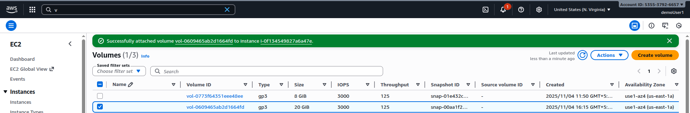
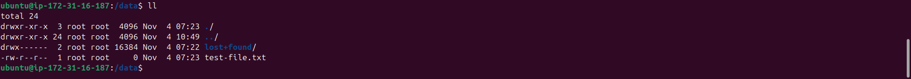
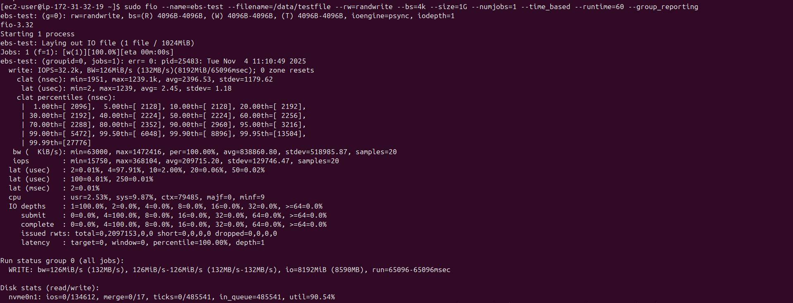
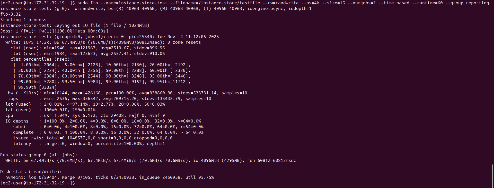
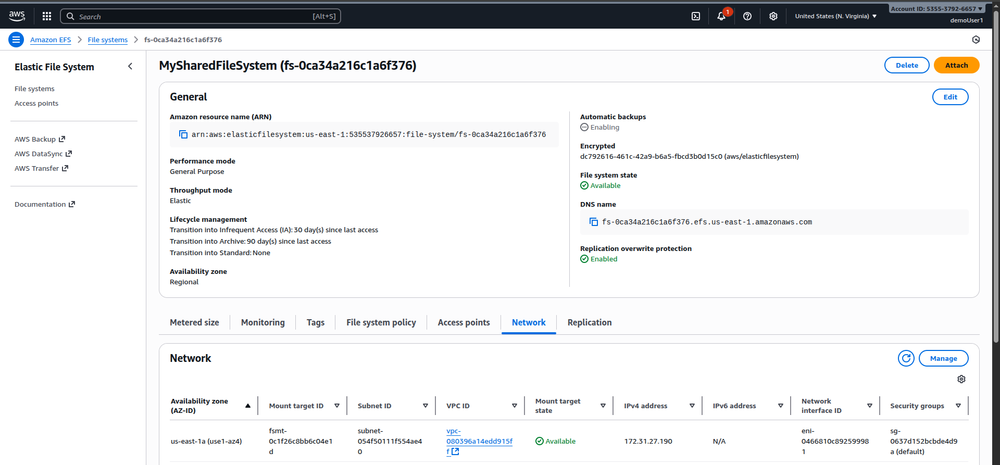
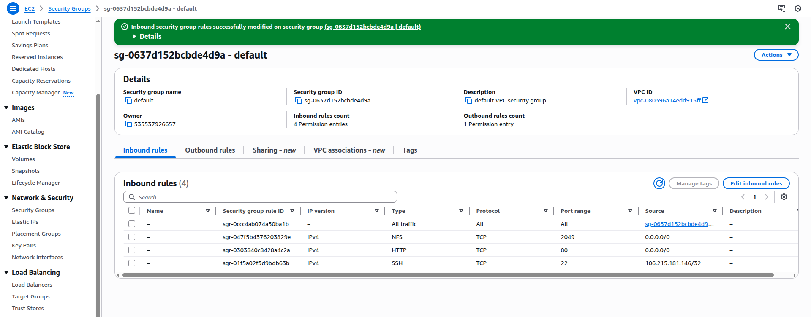
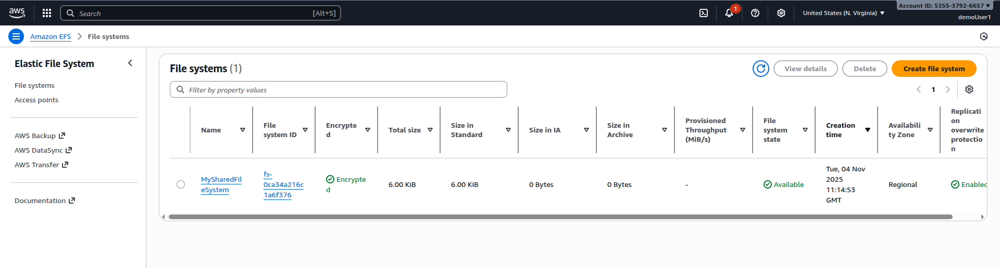
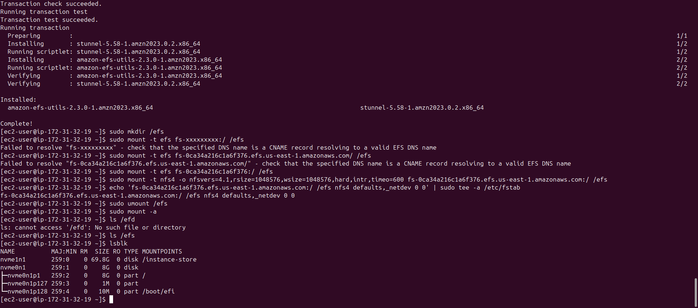
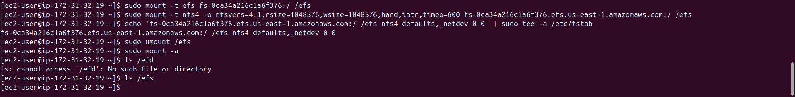
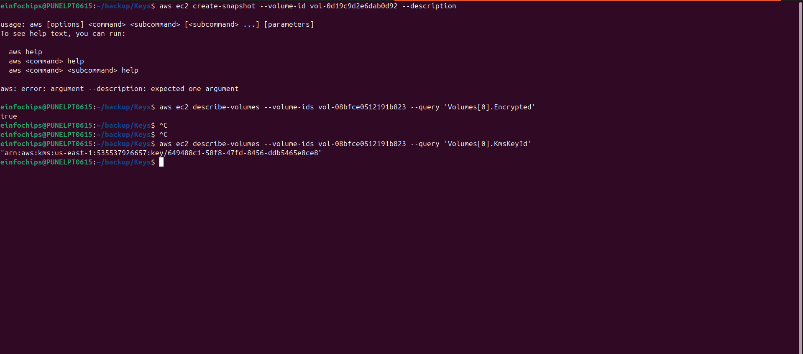

# Section 6: EC2 Instance Storage

## 📋 Overview
This section covers all storage options available for EC2 instances, including EBS volumes, instance store, EFS, and FSx. You'll learn about performance characteristics, use cases, and best practices for each storage type.

## 💾 EC2 Storage Types Overview

### 1. Amazon EBS (Elastic Block Store)
- **Network-attached storage** for EC2 instances
- **Persistent storage** that survives instance termination
- **High availability** within a single AZ
- **Snapshot capability** for backup and recovery

### 2. EC2 Instance Store
- **Physically attached** to the host computer
- **Temporary storage** lost on stop/termination
- **High performance** with very low latency
- **No additional cost**

### 3. Amazon EFS (Elastic File System)
- **Network File System (NFS)** for Linux instances
- **Shared storage** across multiple instances
- **Automatically scales** storage capacity
- **Multi-AZ availability**

### 4. Amazon FSx
- **Fully managed** file systems
- **High-performance** workloads
- **Windows and Lustre** file systems

## 🔧 EBS Volume Types Deep Dive

### General Purpose SSD (gp3/gp2)
- **gp3**: Latest generation, 3,000-16,000 IOPS
- **gp2**: Previous generation, 3 IOPS per GB
- **Use cases**: Boot volumes, development environments
- **Performance**: Balanced price/performance

### Provisioned IOPS SSD (io2/io1)
- **io2**: Up to 64,000 IOPS, 99.999% durability
- **io1**: Up to 64,000 IOPS, 99.9% durability
- **Use cases**: Critical business applications, databases
- **Performance**: Consistent, high IOPS

### Throughput Optimized HDD (st1)
- **Sequential workloads**: Big data, data warehouses
- **Throughput**: Up to 500 MiB/s
- **Cannot be boot volume**
- **Cost-effective** for large, sequential workloads

### Cold HDD (sc1)
- **Infrequent access** workloads
- **Throughput**: Up to 250 MiB/s
- **Lowest cost** per GB
- **Cannot be boot volume**

## 🛠️ Hands-On Practice

### Practice 1: EBS Volume Management
**Objective**: Create, attach, and manage EBS volumes

**Steps**:
1. **Create EBS Volume**:
   - Go to EC2 Console → Volumes
   - Create Volume
   - Type: gp3
   - Size: 20 GB
   - IOPS: 3000
   - Throughput: 125 MiB/s
   - Availability Zone: Same as your EC2 instance
   - Add tags: Name = "MyDataVolume"

2. **Attach Volume to Instance**:
   - Select the volume
   - Actions → Attach Volume
   - Instance: Select your running instance
   - Device: /dev/sdf
   - Attach volume

3. **Format and Mount Volume**:
   ```bash
   # SSH to your instance
   ssh -i your-key.pem ec2-user@instance-ip
   
   # List block devices
   lsblk
   
   # Create file system
   sudo mkfs -t ext4 /dev/nvme1n1
   
   # Create mount point
   sudo mkdir /mnt/data
   
   # Mount the volume
   udo mount /dev/nvme1n1 /mnt/data
   
   # Verify mount
   df -h
   
   # Test write operations
   sudo touch /data/test-file.txt
   echo "Hello EBS!" | sudo tee /data/test-file.txt
   ls -la /mnt/data/
   ```

4. **Configure Persistent Mount**:
   ```bash
   # Get UUID of the volume
   sudo blkid /dev/nvme0n1
   # Edit fstab for persistent mounting
   sudo cp /etc/fstab /etc/fstab.backup
   echo 'UUID=your-volume-uuid /data ext4 defaults,nofail 0 2' | sudo tee -a /etc/fstab
   
   # Test the fstab entry
   sudo umount /data
   sudo mount -a
   df -h
   ```

**Screenshot Placeholder**:
![EBS Volume Creation]
 


*Caption: Creating and attaching EBS volume*

### Practice 2: EBS Snapshots and Backup
**Objective**: Create and manage EBS snapshots

**Steps**:
1. **Create Manual Snapshot**:
   - Select your EBS volume
   - Actions → Create Snapshot
   - Description: "Manual backup of data volume"
   - Add tags: Name = "DataVolumeSnapshot"
   - Create snapshot

2. **Automate Snapshots with Data Lifecycle Manager**:
   - Go to EC2 Console → Lifecycle Manager
   - Create lifecycle policy
   - Resource type: Volume
   - Target with tags: Name = "MyDataVolume"
   - Schedule: Daily at 03:00 UTC
   - Retention: 7 snapshots
   - Create policy

3. **Restore from Snapshot**:
   - Go to Snapshots
   - Select your snapshot
   - Actions → Create Volume from Snapshot
   - Volume type: gp3
   - Size: 20 GB (or larger)
   - Create volume

4. **Test Snapshot Restore**:
   ```bash
   # Attach the restored volume as /dev/sdg
   # Mount and verify data
   sudo mkdir /restored-data
   sudo mount /dev/xvdg /restored-data
   ls -la /restored-data
   cat /restored-data/test-file.txt
   ```

**Screenshot Placeholder**:
![EBS Snapshots] 


*Caption: EBS snapshot creation and management*

### Practice 3: Instance Store Performance Testing
**Objective**: Compare instance store vs EBS performance

**Steps**:
1. **Launch Instance with Instance Store**:
   - Instance type: m5d.large (has NVMe SSD instance store)
   - AMI: Amazon Linux 2
   - Storage: Keep default EBS + instance store
   - Launch instance

2. **Identify Instance Store Volumes**:
   ```bash
   # List all block devices
   lsblk
   
   # Instance store volumes typically show as nvme*n*
   # Format instance store volume
   sudo mkfs -t ext4 /dev/nvme1n1
   
   # Mount instance store
   sudo mkdir /instance-store
   sudo mount /dev/nvme1n1 /instance-store
   ```

3. **Performance Comparison**:
   ```bash
   # Install fio for performance testing
   sudo yum install -y fio
   
   # Test EBS volume performance
   sudo fio --name=ebs-test --filename=/data/testfile --rw=randwrite --bs=4k --size=1G --numjobs=1 --time_based --runtime=60 --group_reporting
   
   # Test instance store performance
   sudo fio --name=instance-store-test --filename=/instance-store/testfile --rw=randwrite --bs=4k --size=1G --numjobs=1 --time_based --runtime=60 --group_reporting
   ```

4. **Compare Results**:
   - Note IOPS and throughput differences
   - Instance store typically shows higher performance
   - Document the trade-offs

**Screenshot Placeholder**:
![Instance Store Performance]
EBS Volume: 

Instance Store

*Caption: Performance comparison between EBS and instance store*

### Practice 4: Amazon EFS Setup
**Objective**: Create and use shared file system

**Steps**:
1. **Create EFS File System**:
   - Go to EFS Console
   - Create file system
   - Name: "MySharedFileSystem"
   - VPC: Default VPC
   - Availability and Durability: Regional
   - Performance mode: General Purpose
   - Throughput mode: Provisioned (100 MiB/s)
   - Create file system

2. **Configure Mount Targets**:
   - Select your EFS
   - Network tab
   - Ensure mount targets in each AZ
   - Security groups: Allow NFS (port 2049)
   

3. **Mount EFS on Multiple Instances**:
   ```bash
   # Install EFS utilities
   sudo yum install -y amazon-efs-utils
   
   # Create mount point
   sudo mkdir /efs
   
   # Mount using EFS helper
   sudo mount -t efs fs-xxxxxxxxx:/ /efs
   
   # Or mount using NFS
   sudo mount -t nfs4 -o nfsvers=4.1,rsize=1048576,wsize=1048576,hard,intr,timeo=600 fs-xxxxxxxxx.efs.region.amazonaws.com:/ /efs
   
   # Test shared access
   echo "Hello from $(hostname)" | sudo tee /efs/test-from-$(hostname).txt
   ```

4. **Configure Persistent EFS Mount**:
   ```bash
   # Add to fstab
   echo 'fs-xxxxxxxxx.efs.region.amazonaws.com:/ /efs nfs4 defaults,_netdev 0 0' | sudo tee -a /etc/fstab
   
   # Test persistent mount
   sudo umount /efs
   sudo mount -a
   ls /efs
   ```

**Screenshot Placeholder**:
![EFS Setup]





*Caption: Amazon EFS file system creation and mounting*

### Practice 5: EBS Encryption
**Objective**: Implement EBS encryption for data security

**Steps**:
1. **Create Encrypted EBS Volume**:
   - Create new volume
   - Enable encryption
   - Use default AWS managed key or custom KMS key
   - Attach to instance

2. **Encrypt Existing Volume**:
   ```bash
   # Create snapshot of unencrypted volume
   aws ec2 create-snapshot --volume-id vol-0d19c9d2e6dab0d92 --description "Snapshot for encryption"
   
   # Create encrypted volume from snapshot
   aws ec2 create-volume --snapshot-id snap-xxxxxxxxx --encrypted --kms-key-id alias/aws/ebs --availability-zone us-east-1a
   
   # Attach encrypted volume and migrate data
   ```

3. **Enable EBS Encryption by Default**:
   - Go to EC2 Console → EBS Encryption
   - Enable encryption by default
   - Select default KMS key
   - Apply to account

4. **Verify Encryption**:
   ```bash
   # Check volume encryption status
   aws ec2 describe-volumes --volume-ids vol-xxxxxxxxx --query 'Volumes[0].Encrypted'
   
   # Check encryption key
   aws ec2 describe-volumes --volume-ids vol-xxxxxxxxx --query 'Volumes[0].KmsKeyId'
   ```

**Screenshot Placeholder**:
![EBS Encryption]


*Caption: EBS volume encryption configuration*

### Practice 6: Storage Performance Optimization
**Objective**: Optimize storage performance for different workloads

**Steps**:
1. **EBS-Optimized Instances**:
   - Launch instance with EBS-optimized enabled
   - Compare performance with non-optimized instance
   - Monitor CloudWatch metrics

2. **Multi-Attach EBS Volumes**:
   ```bash
   # Create multi-attach enabled volume (io1/io2 only)
   aws ec2 create-volume --size 100 --volume-type io2 --iops 1000 --multi-attach-enabled --availability-zone us-east-1a
   
   # Attach to multiple instances
   aws ec2 attach-volume --volume-id vol-xxxxxxxxx --instance-id i-xxxxxxxxx --device /dev/sdf
   aws ec2 attach-volume --volume-id vol-xxxxxxxxx --instance-id i-yyyyyyyyy --device /dev/sdf
   ```

3. **RAID Configuration**:
   ```bash
   # Create RAID 0 for performance (multiple EBS volumes)
   sudo mdadm --create /dev/md0 --level=0 --raid-devices=2 /dev/xvdf /dev/xvdg
   
   # Format and mount RAID array
   sudo mkfs -t ext4 /dev/md0
   sudo mkdir /raid-data
   sudo mount /dev/md0 /raid-data
   
   # Test performance
   sudo fio --name=raid-test --filename=/raid-data/testfile --rw=randwrite --bs=4k --size=2G --numjobs=4 --time_based --runtime=60 --group_reporting
   ```

**Screenshot Placeholder**:

*Caption: Storage performance optimization techniques*

## 📊 Storage Performance Characteristics

### EBS Volume Performance
| Volume Type | Max IOPS | Max Throughput | Use Case |
|-------------|----------|----------------|----------|
| gp3 | 16,000 | 1,000 MiB/s | General purpose |
| gp2 | 16,000 | 250 MiB/s | General purpose |
| io2 | 64,000 | 1,000 MiB/s | High IOPS |
| io1 | 64,000 | 1,000 MiB/s | High IOPS |
| st1 | 500 | 500 MiB/s | Throughput optimized |
| sc1 | 250 | 250 MiB/s | Cold storage |

### Instance Store Performance
- **NVMe SSD**: Up to 3.3 million IOPS
- **SATA SSD**: Up to 365,000 IOPS
- **HDD**: Up to 2,000 IOPS

## 🔒 Storage Security Best Practices

### 1. Encryption
- **Enable encryption** for sensitive data
- **Use customer-managed keys** for compliance
- **Encrypt snapshots** and AMIs
- **Enable default encryption**

### 2. Access Control
- **IAM policies** for volume management
- **Resource-based policies** for snapshots
- **Cross-account sharing** controls
- **VPC endpoints** for private access

### 3. Backup and Recovery
- **Regular snapshots** for data protection
- **Cross-region replication** for DR
- **Lifecycle policies** for cost optimization
- **Point-in-time recovery** strategies

## 💰 Storage Cost Optimization

### 1. Right-Sizing
- **Monitor utilization** with CloudWatch
- **Use appropriate volume types**
- **Resize volumes** as needed
- **Delete unused volumes**

### 2. Snapshot Management
- **Lifecycle policies** for automatic deletion
- **Incremental snapshots** reduce costs
- **Cross-region replication** only when needed
- **Regular cleanup** of old snapshots

### 3. Storage Classes
- **gp3 vs gp2**: Better price/performance
- **st1/sc1**: For appropriate workloads
- **Instance store**: When persistence not needed
- **EFS storage classes**: Standard vs IA

## 🚨 Common Storage Mistakes

1. **Not backing up data** regularly
2. **Using wrong volume type** for workload
3. **Ignoring encryption** requirements
4. **Over-provisioning** IOPS and throughput
5. **Not monitoring** storage performance
6. **Forgetting to delete** unused volumes
7. **Not using lifecycle policies**

## 🔗 Additional Resources

- [EBS User Guide](https://docs.aws.amazon.com/ebs/)
- [EFS User Guide](https://docs.aws.amazon.com/efs/)
- [Storage Performance](https://docs.aws.amazon.com/AWSEC2/latest/UserGuide/ebs-performance.html)
- [EBS Encryption](https://docs.aws.amazon.com/AWSEC2/latest/UserGuide/EBSEncryption.html)

## 📸 Screenshots Section
*Document your storage configurations:*

### Screenshot 1: EBS Volume Types

*Caption: Different EBS volume types and their characteristics*

### Screenshot 2: Volume Attachment

*Caption: Attaching EBS volume to EC2 instance*

### Screenshot 3: EFS File System

*Caption: Amazon EFS shared file system setup*

### Screenshot 4: Performance Testing

*Caption: Storage performance comparison results*

### Screenshot 5: Encryption Configuration

*Caption: EBS encryption settings and key management*

### Screenshot 6: Snapshot Management

*Caption: EBS snapshot lifecycle and backup policies*

---

## ✅ Section Completion Checklist
- [ ] Understood different storage types and use cases
- [ ] Created and managed EBS volumes
- [ ] Implemented EBS snapshots and backup strategies
- [ ] Tested instance store performance
- [ ] Set up Amazon EFS shared file system
- [ ] Configured EBS encryption
- [ ] Optimized storage performance
- [ ] Implemented cost optimization strategies

## 🎯 Next Steps
Move to **Section 7: High Availability and Scalability: ELB & ASG** to learn about load balancing and auto scaling.

---

*Last Updated: January 2025*
*Course Version: 2025.1*