# Section 7: High Availability and Scalability: ELB & ASG

## 📋 Overview
This section covers Elastic Load Balancing (ELB) and Auto Scaling Groups (ASG) - essential services for building highly available and scalable applications on AWS.

## 🔄 High Availability vs Scalability

### High Availability
- **Minimize downtime** and ensure system remains operational
- **Multi-AZ deployments** to handle AZ failures
- **Redundancy** at every layer
- **Automatic failover** mechanisms

### Scalability
- **Handle increased load** by adding resources
- **Vertical scaling**: Increase instance size (scale up)
- **Horizontal scaling**: Add more instances (scale out)
- **Elastic scaling**: Automatic resource adjustment

## ⚖️ Elastic Load Balancer (ELB) Types

### 1. Application Load Balancer (ALB)
- **Layer 7** (HTTP/HTTPS) load balancing
- **Advanced routing** based on content
- **WebSocket and HTTP/2** support
- **Integration** with AWS services

### 2. Network Load Balancer (NLB)
- **Layer 4** (TCP/UDP) load balancing
- **Ultra-high performance** (millions of requests/second)
- **Static IP addresses**
- **Preserve source IP**

### 3. Gateway Load Balancer (GWLB)
- **Layer 3** (Network layer) load balancing
- **Third-party appliances** (firewalls, IDS/IPS)
- **GENEVE protocol** on port 6081
- **Transparent network gateway**

### 4. Classic Load Balancer (CLB) - Legacy
- **Layer 4 and 7** load balancing
- **Legacy applications**
- **Not recommended** for new applications

## 🛠️ Hands-On Practice

### Practice 1: Application Load Balancer Setup
**Objective**: Create ALB with multiple targets and health checks

**Steps**:
1. **Launch Target Instances**:
   ```bash
   # Launch 3 EC2 instances in different AZs
   # Install web server on each
   
   # Instance 1 (us-east-1a)
   sudo apt update -y
   sudo apt install -y apache2
   sudo systemctl start apache2
   sudo systemctl enable apache2
   echo "<h1>Web Server 1 - AZ: us-east-1a</h1>" | sudo tee /var/www/html/index.html
   
   # Instance 2 (us-east-1b)
   echo "<h1>Web Server 2 - AZ: us-east-1b</h1>" | sudo tee /var/www/html/index.html
   
   # Instance 3 (us-east-1c)
   echo "<h1>Web Server 3 - AZ: us-east-1c</h1>" | sudo tee /var/www/html/index.html
   ```

2. **Create Application Load Balancer**:
   - Go to EC2 Console → Load Balancers
   - Create Load Balancer → Application Load Balancer
   - Name: "MyWebAppALB"
   - Scheme: Internet-facing
   - IP address type: IPv4
   - VPC: Default VPC
   - Availability Zones: Select all 3 AZs
   - Security Group: Allow HTTP (80) and HTTPS (443)

3. **Create Target Group**:
   - Target type: Instances
   - Protocol: HTTP, Port: 80
   - VPC: Default VPC
   - Health check path: /
   - Health check interval: 30 seconds
   - Healthy threshold: 2
   - Unhealthy threshold: 5
   - Register targets: Add all 3 instances

4. **Configure Listener**:
   - Protocol: HTTP, Port: 80
   - Default action: Forward to target group
   - Create load balancer

5. **Test Load Balancer**:
   ```bash
   # Get ALB DNS name and test
   curl MyWebAppALB-1071365315.us-east-1.elb.amazonaws.com
   
   # Refresh multiple times to see different servers
   for i in {1..10}; do
     curl http://your-alb-dns-name.region.elb.amazonaws.com
     sleep 1
   done
   ```

**Screenshot Placeholder**:
![ALB Setup]
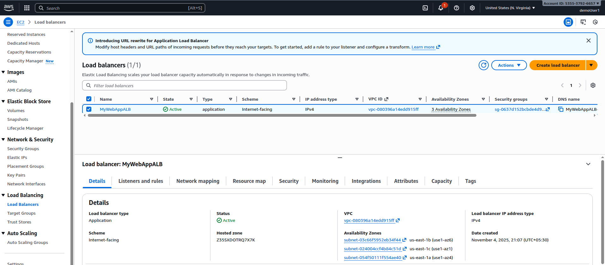
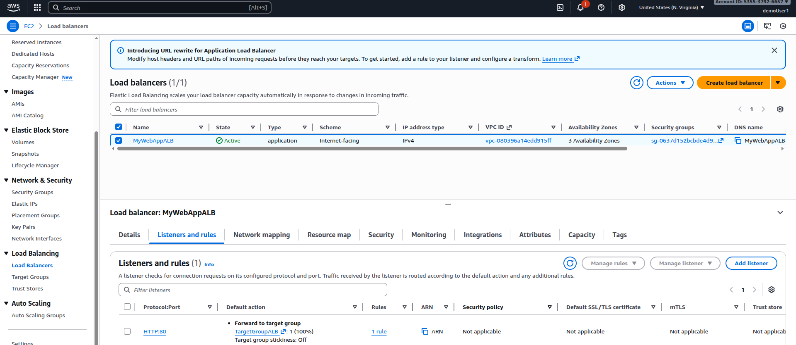
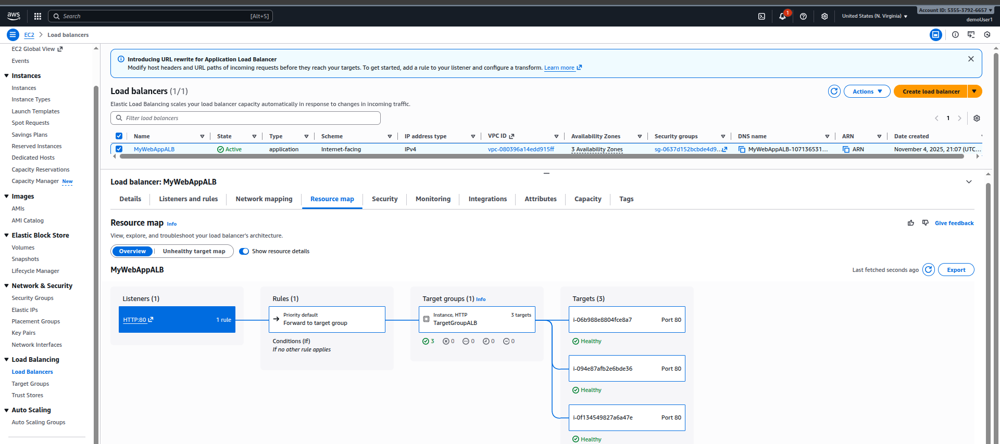
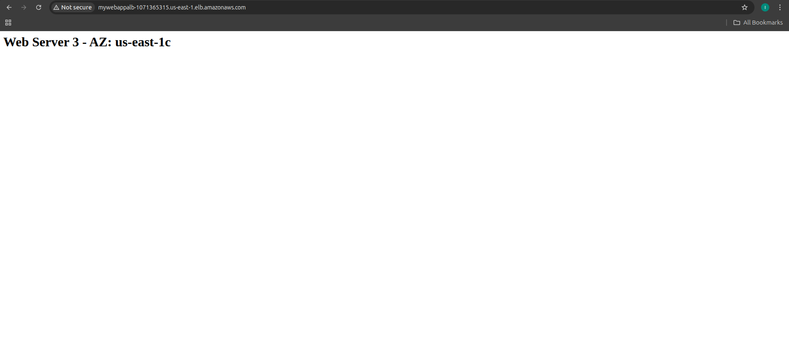
*Caption: Application Load Balancer configuration*

### Practice 2: Advanced ALB Features
**Objective**: Implement path-based and host-based routing

**Steps**:
1. **Create Additional Target Groups**:
   - API Target Group: Port 8080
   - Admin Target Group: Port 9090

2. **Set up Path-Based Routing**:
   ```bash
   # On instances, create different applications
   # API application on port 8080
   sudo mkdir -p /var/www/api
   echo "<h1>API Server - $(hostname)</h1>" | sudo tee /var/www/api/index.html
   
   # Start simple HTTP server for API
   cd /var/www/api
   sudo python3 -m http.server 8080 &
   
   # Admin application on port 9090
   sudo mkdir -p /var/www/admin
   echo "<h1>Admin Server - $(hostname)</h1>" | sudo tee /var/www/admin/index.html
   
   # Start simple HTTP server for Admin
   cd /var/www/admin
   sudo python3 -m http.server 9090 &
   ```

3. **Configure ALB Rules**:
   - Go to Load Balancer → Listeners
   - Edit HTTP:80 listener
   - Add rules:
     - Path: /api/* → Forward to API target group
     - Path: /admin/* → Forward to Admin target group
     - Default: Forward to web target group

4. **Test Routing**:
   ```bash
   # Test different paths
   curl http://your-alb-dns-name/
   curl http://your-alb-dns-name/api/
   curl http://your-alb-dns-name/admin/
   ```

**Screenshot Placeholder**:
![ALB Advanced Routing]
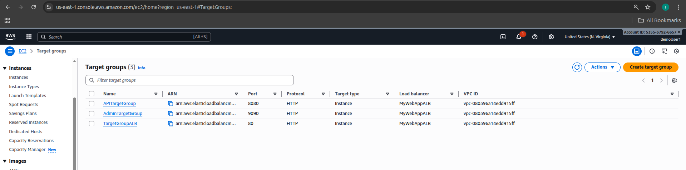
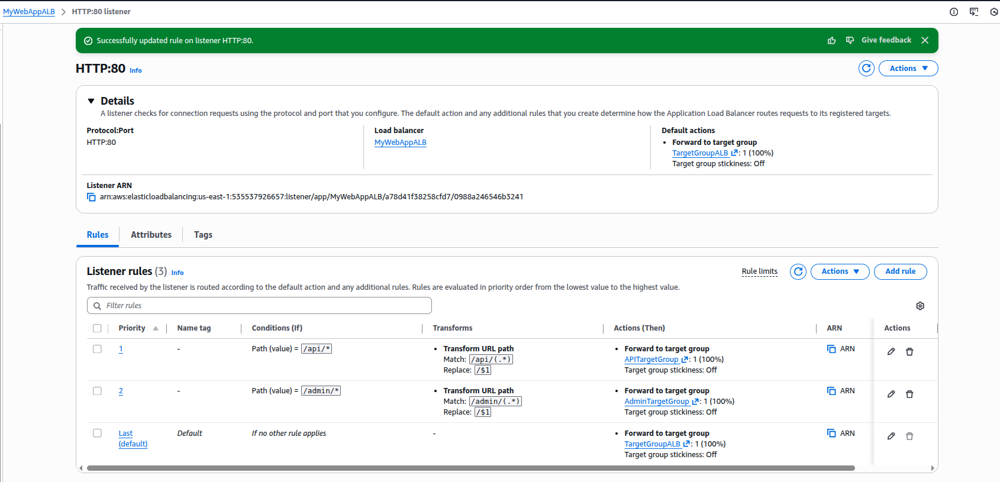
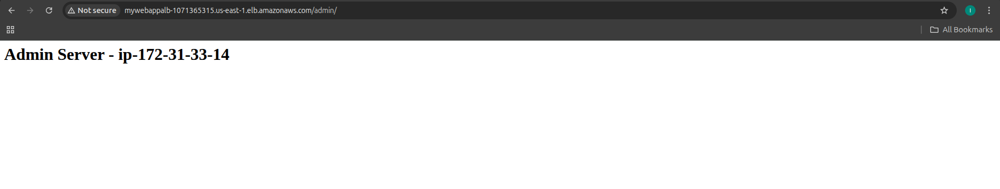
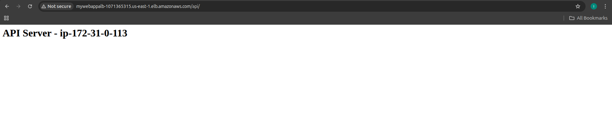
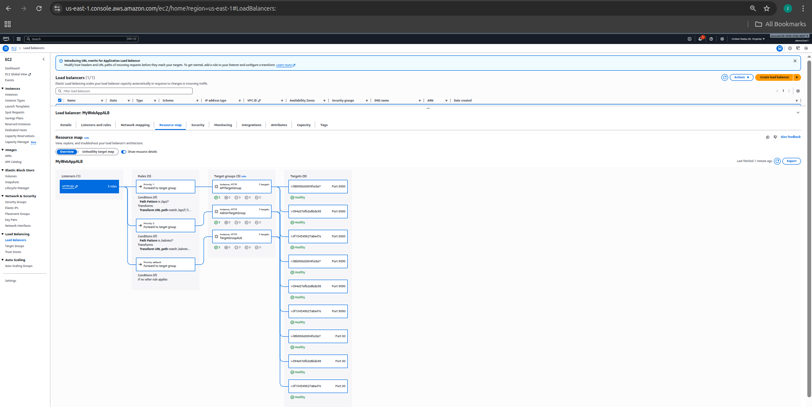
*Caption: Path-based routing configuration*

### Practice 3: Network Load Balancer
**Objective**: Create high-performance Layer 4 load balancer

**Steps**:
1. **Create Network Load Balancer**:
   - Type: Network Load Balancer
   - Name: "MyAppNLB"
   - Scheme: Internet-facing
   - IP address type: IPv4
   - VPC: Default VPC
   - Enable static IP for each AZ

2. **Configure Target Group**:
   - Target type: Instances
   - Protocol: TCP, Port: 80
   - VPC: Default VPC
   - Health check: TCP on port 80
   - Register same web server instances

3. **Test NLB Performance**:
   ```bash
   # Install Apache Bench for load testing
   sudo yum install -y httpd-tools
   
   # Test NLB performance
   ab -n 10000 -c 100 http://your-nlb-dns-name/
   
   # Compare with ALB performance
   ab -n 10000 -c 100 http://your-alb-dns-name/
   ```

**Screenshot Placeholder**:

*Caption: Network Load Balancer configuration*

### Practice 4: Auto Scaling Group (ASG) Setup
**Objective**: Create auto scaling group with launch template

**Steps**:
1. **Create Launch Template**:
   - Go to EC2 Console → Launch Templates
   - Create launch template
   - Name: "WebServerLaunchTemplate"
   - AMI: Amazon Linux 2
   - Instance type: t3.micro
   - Key pair: Your key pair
   - Security groups: Web server security group
   - User data:
   ```bash
   #!/bin/bash
   sudo apt update -y
   sudo apt install -y apache2
   sudo systemctl start apache2
   sudo systemctl enable apache2
   echo "<h1>Auto Scaled Server - $(hostname)</h1>" | sudo tee /var/www/html/index.html
   echo "<p>Instance ID: $(curl -s http://169.254.169.254/latest/meta-data/instance-id)</p>" | sudo tee -a /var/www/html/index.html

   ```

2. **Create Auto Scaling Group**:
   - Go to EC2 Console → Auto Scaling Groups
   - Create Auto Scaling group
   - Name: "WebServerASG"
   - Launch template: WebServerLaunchTemplate
   - VPC: Default VPC
   - Subnets: Select all 3 AZs
   - Load balancer: Attach to existing ALB target group
   - Health check type: ELB
   - Health check grace period: 300 seconds

3. **Configure Scaling Policies**:
   - Desired capacity: 2
   - Minimum capacity: 1
   - Maximum capacity: 6
   - Target tracking scaling policy:
     - Metric: Average CPU Utilization
     - Target value: 50%
     - Scale-out cooldown: 300 seconds
     - Scale-in cooldown: 300 seconds

**Screenshot Placeholder**:
![ASG Setup]
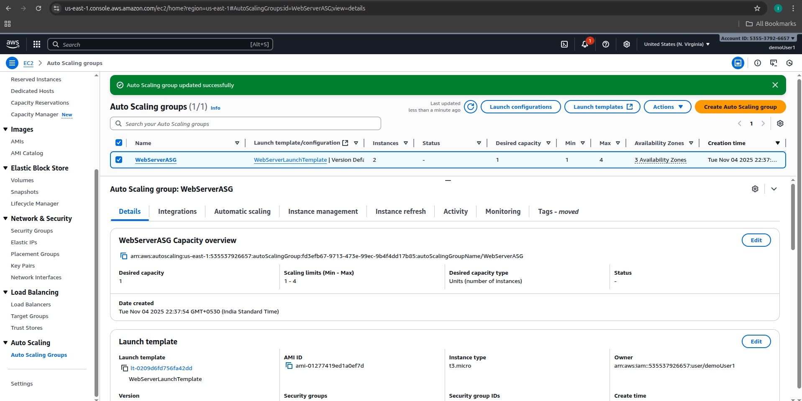
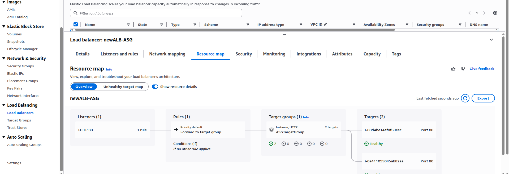
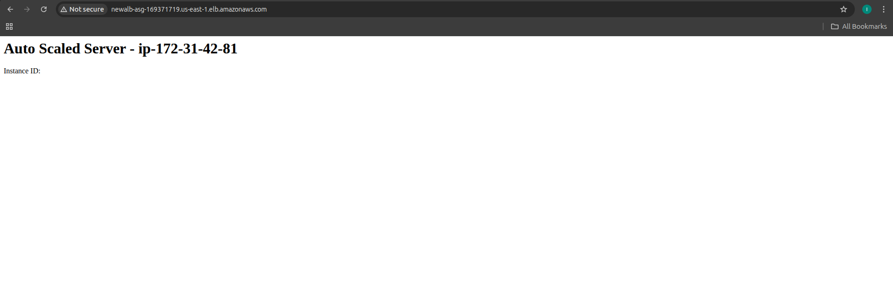
*Caption: Auto Scaling Group configuration*

### Practice 5: ASG Scaling Policies
**Objective**: Test different scaling policies and triggers

**Steps**:
1. **Create Step Scaling Policy**:
   - Go to ASG → Automatic scaling
   - Create dynamic scaling policy
   - Policy type: Step scaling
   - CloudWatch alarm: CPU > 70%
   - Action: Add 2 instances when CPU > 70%
   - Action: Add 1 instance when CPU > 50%

2. **Create Scheduled Scaling**:
   - Create scheduled action
   - Name: "MorningScaleOut"
   - Recurrence: Daily at 09:00
   - Desired capacity: 4
   - Create another for evening scale-in

3. **Test Scaling with Load**:
   ```bash
   # Generate CPU load on instances
   # SSH to instances and run:
   stress --cpu 2 --timeout 600s
   
   # Or use Apache Bench to generate load
   ab -n 100000 -c 50 http://your-alb-dns-name/
   ```

4. **Monitor Scaling Activity**:
   - Watch ASG Activity History
   - Monitor CloudWatch metrics
   - Observe new instances launching

**Screenshot Placeholder**:
![ASG Scaling]
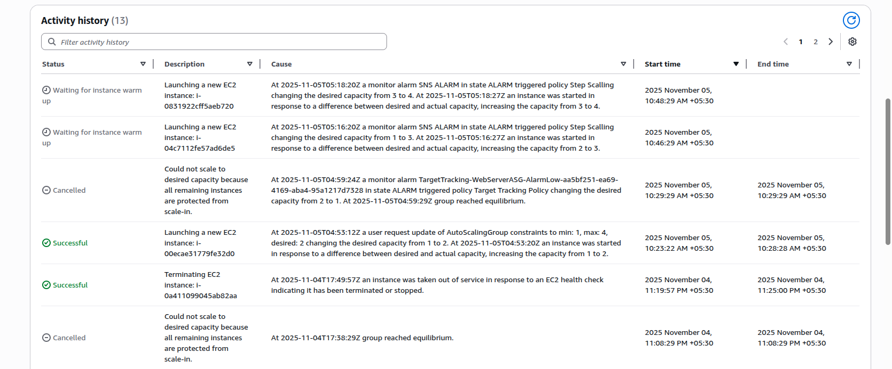

*Caption: Auto Scaling Group scaling policies and activity*

### Practice 6: Cross-Zone Load Balancing
**Objective**: Understand and configure cross-zone load balancing

**Steps**:
1. **Test Without Cross-Zone Load Balancing**:
   - Create instances unevenly across AZs
   - AZ-1a: 3 instances
   - AZ-1b: 1 instance
   - AZ-1c: 1 instance
   - Observe traffic distribution

2. **Enable Cross-Zone Load Balancing**:
   - For ALB: Enabled by default
   - For NLB: Go to Load Balancer → Attributes
   - Enable cross-zone load balancing
   - Test traffic distribution again

3. **Compare Results**:
   ```bash
   # Monitor access logs or use custom logging
   # Check if traffic is evenly distributed across all instances
   # regardless of AZ
   ```

**Screenshot Placeholder**:

*Caption: Cross-zone load balancing configuration*

## 🔧 Advanced Load Balancer Features

### SSL/TLS Termination
- **SSL certificates** from ACM or upload custom
- **SNI (Server Name Indication)** for multiple certificates
- **Security policies** for cipher suites
- **Perfect Forward Secrecy**

### Sticky Sessions
- **Application-based** cookies
- **Duration-based** cookies
- **Load balancer generated** cookies
- **Use cases**: Shopping carts, user sessions

### Connection Draining
- **Graceful shutdown** of instances
- **Complete existing requests** before termination
- **Configurable timeout** period
- **Health check integration**

## 📊 Auto Scaling Strategies

### 1. Target Tracking Scaling
- **Maintain specific metric** at target value
- **CPU utilization**, network I/O, request count
- **Automatic scale-out and scale-in**
- **Recommended approach**

### 2. Step Scaling
- **Multiple scaling steps** based on alarm breach size
- **More granular control**
- **Different actions** for different thresholds
- **Complex configuration**

### 3. Simple Scaling
- **Single scaling action** per alarm
- **Cooldown periods** prevent rapid scaling
- **Less responsive** than other methods
- **Legacy approach**

### 4. Scheduled Scaling
- **Predictable load patterns**
- **Time-based scaling**
- **Business hours scaling**
- **Seasonal adjustments**

## 🔒 Security Best Practices

### Load Balancer Security
- **Security groups** for load balancers
- **WAF integration** for application protection
- **Access logs** for monitoring
- **SSL/TLS encryption**

### Auto Scaling Security
- **IAM roles** for instances
- **Security groups** in launch templates
- **Encrypted EBS volumes**
- **Systems Manager** for patch management

## 💰 Cost Optimization

### Load Balancer Costs
- **ALB**: $0.0225 per hour + $0.008 per LCU
- **NLB**: $0.0225 per hour + $0.006 per NLCU
- **Data processing charges**
- **Cross-AZ data transfer**

### Auto Scaling Optimization
- **Right-sizing** instances
- **Spot instances** for fault-tolerant workloads
- **Mixed instance types**
- **Scheduled scaling** for predictable patterns

## 🚨 Common Mistakes

1. **Not enabling health checks** properly
2. **Incorrect security group** configurations
3. **Aggressive scaling policies** causing thrashing
4. **Not considering cooldown periods**
5. **Ignoring cross-AZ data transfer costs**
6. **Not testing failover scenarios**
7. **Inadequate monitoring** and alerting

---

## 🎯 Next Steps
Move to **Section 8: AWS Fundamentals: RDS + Aurora + ElastiCache** to learn about managed database services.

---
