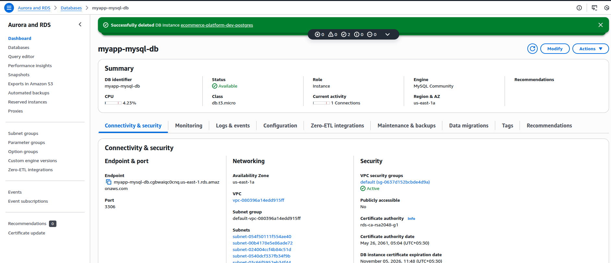
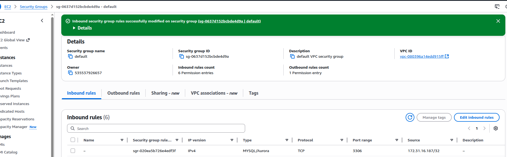
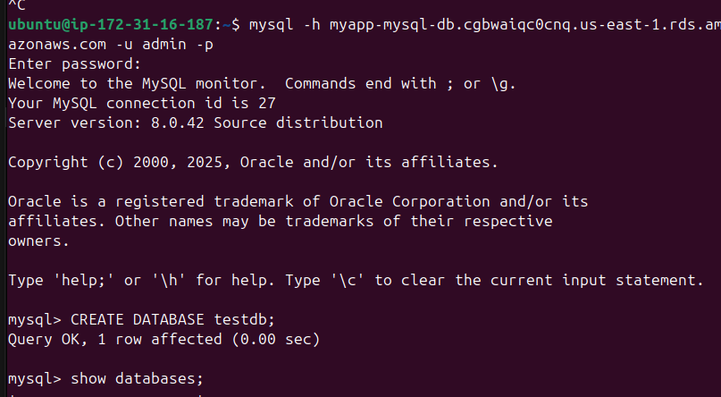
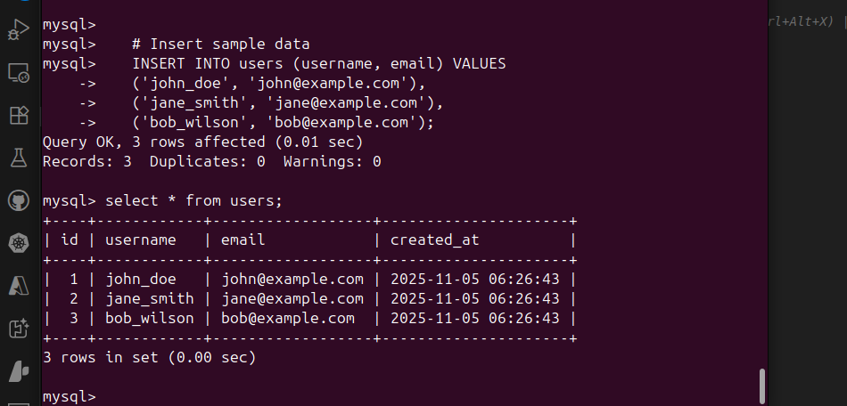
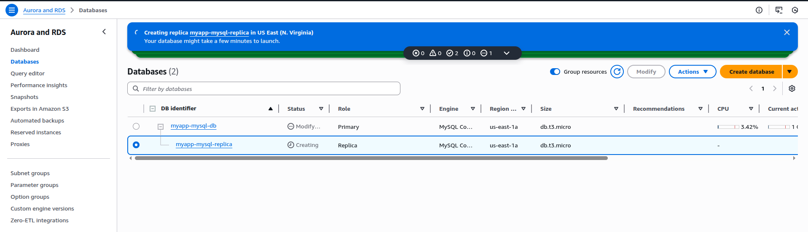
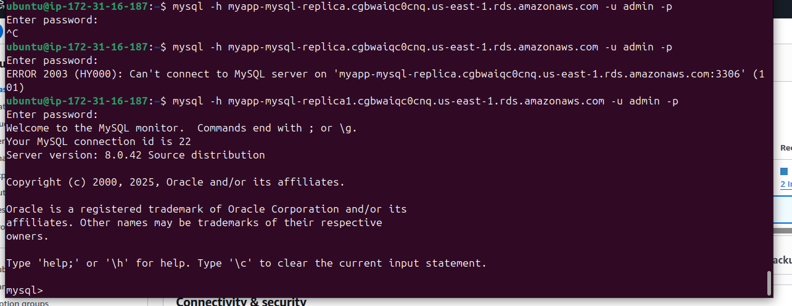
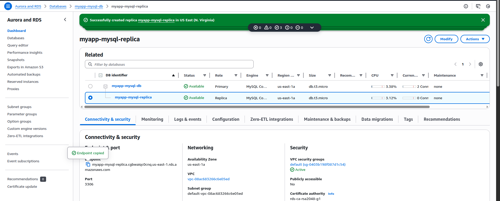

# Section 8: AWS Fundamentals: RDS + Aurora + ElastiCache

## 📋 Overview
This section covers AWS managed database services including Amazon RDS, Aurora, and ElastiCache. You'll learn about different database engines, high availability, performance optimization, and caching strategies.

## 🗄️ Amazon RDS (Relational Database Service)

### Supported Database Engines
- **MySQL**: Open-source relational database
- **PostgreSQL**: Advanced open-source database
- **MariaDB**: MySQL-compatible database
- **Oracle**: Enterprise database system
- **Microsoft SQL Server**: Microsoft's database system
- **Amazon Aurora**: AWS-native high-performance database

### RDS Benefits
- **Managed service**: AWS handles maintenance, backups, patching
- **High availability**: Multi-AZ deployments
- **Scalability**: Read replicas and vertical scaling
- **Security**: Encryption, VPC, IAM integration
- **Monitoring**: CloudWatch integration

## 🌟 Amazon Aurora

### Aurora Features
- **MySQL and PostgreSQL compatible**
- **5x faster than MySQL**, 3x faster than PostgreSQL
- **Up to 15 read replicas**
- **Automatic failover** in less than 30 seconds
- **Continuous backup** to S3
- **Point-in-time recovery**

### Aurora Architecture
- **Cluster volume**: Shared storage across AZs
- **Writer endpoint**: Single write instance
- **Reader endpoint**: Load-balanced read replicas
- **Custom endpoints**: Specific instance targeting

## ⚡ Amazon ElastiCache

### Supported Engines
- **Redis**: Advanced key-value store with data structures
- **Memcached**: Simple, high-performance caching

### ElastiCache Benefits
- **Sub-millisecond latency**
- **Fully managed**: Automatic failover, backup, patching
- **Scalable**: Add/remove nodes dynamically
- **Secure**: VPC, encryption, IAM integration

## 🛠️ Hands-On Practice

### Practice 1: Create RDS MySQL Database
**Objective**: Set up managed MySQL database with Multi-AZ

**Steps**:
1. **Create RDS Instance**:
   - Go to RDS Console → Create database
   - Engine: MySQL
   - Version: Latest (8.0.x)
   - Template: Free tier (for learning)
   - DB instance identifier: "myapp-mysql-db"
   - Master username: admin
   - Master password: (create strong password)
   - DB instance class: db.t3.micro
   - Storage: 20 GB gp2
   - Enable storage autoscaling: Yes
   - Multi-AZ deployment: Yes (for production)
   - VPC: Default VPC
   - Subnet group: Default
   - Public access: No
   - VPC security group: Create new
   - Database name: "myappdb"
   - Backup retention: 7 days
   - Monitoring: Enable Enhanced Monitoring
   - Create database

2. **Configure Security Group**:
   - Go to EC2 Console → Security Groups
   - Find RDS security group
   - Add inbound rule:
     - Type: MySQL/Aurora (3306)
     - Source: EC2 security group or specific IP
   - Save rules

3. **Connect to RDS from EC2**:
   ```bash
   # Install MySQL client on EC2
   sudo yum update -y
   sudo yum install -y mysql
   
   # Connect to RDS instance
   mysql -h myapp-mysql-db.cgbwaiqc0cnq.us-east-1.rds.amazonaws.com -u admin -p
   
   # Create sample database and table
   CREATE DATABASE testdb;
   USE testdb;
   CREATE TABLE users (
       id INT AUTO_INCREMENT PRIMARY KEY,
       username VARCHAR(50) NOT NULL,
       email VARCHAR(100) NOT NULL,
       created_at TIMESTAMP DEFAULT CURRENT_TIMESTAMP
   );
   
   # Insert sample data
   INSERT INTO users (username, email) VALUES 
   ('john_doe', 'john@example.com'),
   ('jane_smith', 'jane@example.com'),
   ('bob_wilson', 'bob@example.com');
   
   # Query data
   SELECT * FROM users;
   ```

**Screenshot Placeholder**:
![RDS MySQL Setup]
RDS:


SG:


Connected to RDS-DB



*Caption: RDS MySQL database creation and configuration*

### Practice 2: RDS Read Replicas
**Objective**: Create read replicas for read scaling

**Steps**:
1. **Create Read Replica**:
   - Select your RDS instance
   - Actions → Create read replica
   - DB instance identifier: "myapp-mysql-replica"
   - Destination region: Same region
   - DB instance class: db.t3.micro
   - Multi-AZ deployment: No (for replica)
   - Public accessibility: No
   - Create read replica

2. **Test Read Replica**:
   ```bash
   # Connect to read replica
   mysql -h your-replica-endpoint.region.rds.amazonaws.com -u admin -p
   
   # Try to read data (should work)
   USE testdb;
   SELECT * FROM users;
   
   # Try to write data (should fail)
   INSERT INTO users (username, email) VALUES ('test', 'test@example.com');
   # Error: The MySQL server is running with the --read-only option
   ```

3. **Create Cross-Region Read Replica**:
   - Create read replica in different region
   - Test connectivity and replication lag
   - Monitor CloudWatch metrics

**Screenshot Placeholder**:
![RDS Read Replicas]

Connected to replica



*Caption: RDS read replica configuration and monitoring*

### Practice 3: Amazon Aurora Cluster
**Objective**: Create Aurora cluster with multiple read replicas

**Steps**:
1. **Create Aurora Cluster**:
   - Go to RDS Console → Create database
   - Engine: Amazon Aurora
   - Edition: Aurora MySQL
   - Version: Latest
   - Template: Production (or Dev/Test for learning)
   - DB cluster identifier: "myapp-aurora-cluster"
   - Master username: admin
   - Master password: (strong password)
   - DB instance class: db.r5.large (or db.t3.small for testing)
   - Multi-AZ deployment: Yes
   - Create Aurora Serverless: No
   - VPC: Default VPC
   - Create database

2. **Add Aurora Read Replicas**:
   - Select Aurora cluster
   - Actions → Add reader
   - DB instance identifier: "myapp-aurora-reader-1"
   - DB instance class: db.r5.large
   - Same AZ or different AZ
   - Add reader
   - Repeat for second reader in different AZ

3. **Test Aurora Endpoints**:
   ```bash
   # Connect to writer endpoint
   mysql -h your-aurora-cluster.cluster-xxxxxxxxx.region.rds.amazonaws.com -u admin -p
   
   # Create test data
   CREATE DATABASE auroratest;
   USE auroratest;
   CREATE TABLE performance_test (
       id INT AUTO_INCREMENT PRIMARY KEY,
       data VARCHAR(1000),
       created_at TIMESTAMP DEFAULT CURRENT_TIMESTAMP
   );
   
   # Insert test data
   INSERT INTO performance_test (data) VALUES 
   (REPEAT('A', 1000)),
   (REPEAT('B', 1000)),
   (REPEAT('C', 1000));
   
   # Connect to reader endpoint
   mysql -h your-aurora-cluster.cluster-ro-xxxxxxxxx.region.rds.amazonaws.com -u admin -p
   
   # Test read operations
   USE auroratest;
   SELECT COUNT(*) FROM performance_test;
   ```

**Screenshot Placeholder**:

*Caption: Amazon Aurora cluster with multiple read replicas*

### Practice 4: Aurora Serverless
**Objective**: Create and test Aurora Serverless database

**Steps**:
1. **Create Aurora Serverless**:
   - Create database → Amazon Aurora
   - Edition: Aurora MySQL
   - Capacity type: Serverless
   - Version: Latest
   - DB cluster identifier: "myapp-aurora-serverless"
   - Master username: admin
   - Master password: (strong password)
   - Capacity settings:
     - Minimum: 2 ACUs
     - Maximum: 16 ACUs
     - Automatic pause: After 5 minutes
   - Create database

2. **Test Serverless Scaling**:
   ```bash
   # Connect to Aurora Serverless
   mysql -h your-serverless-cluster.cluster-xxxxxxxxx.region.rds.amazonaws.com -u admin -p
   
   # Create load to test scaling
   CREATE DATABASE loadtest;
   USE loadtest;
   
   # Create table with more data
   CREATE TABLE large_table (
       id INT AUTO_INCREMENT PRIMARY KEY,
       data TEXT,
       random_num INT,
       created_at TIMESTAMP DEFAULT CURRENT_TIMESTAMP
   );
   
   # Insert large amount of data
   INSERT INTO large_table (data, random_num) 
   SELECT REPEAT('X', 1000), FLOOR(RAND() * 10000)
   FROM (SELECT 1 UNION SELECT 2 UNION SELECT 3 UNION SELECT 4) t1,
        (SELECT 1 UNION SELECT 2 UNION SELECT 3 UNION SELECT 4) t2,
        (SELECT 1 UNION SELECT 2 UNION SELECT 3 UNION SELECT 4) t3;
   ```

3. **Monitor Serverless Metrics**:
   - Watch CloudWatch metrics for ACU usage
   - Observe automatic scaling
   - Test pause/resume functionality

**Screenshot Placeholder**:

*Caption: Aurora Serverless configuration and scaling*

### Practice 5: ElastiCache Redis Cluster
**Objective**: Set up Redis cluster for caching

**Steps**:
1. **Create Redis Cluster**:
   - Go to ElastiCache Console
   - Create → Redis cluster
   - Cluster mode: Disabled (for simplicity)
   - Name: "myapp-redis-cache"
   - Description: "Application caching layer"
   - Node type: cache.t3.micro
   - Number of replicas: 2
   - Multi-AZ: Yes
   - Subnet group: Default
   - Security group: Create new
   - Backup: Enable automatic backups
   - Create cluster

2. **Configure Security Group**:
   - Allow Redis port 6379 from EC2 security group
   - Source: EC2 instances that need cache access

3. **Test Redis Connection**:
   ```bash
   # Install Redis CLI on EC2
   sudo yum install -y gcc
   wget http://download.redis.io/redis-stable.tar.gz
   tar xvzf redis-stable.tar.gz
   cd redis-stable
   make
   sudo cp src/redis-cli /usr/local/bin/
   
   # Connect to Redis cluster
   redis-cli -h your-redis-cluster.xxxxxx.cache.amazonaws.com -p 6379
   
   # Test Redis operations
   SET user:1 "John Doe"
   GET user:1
   HSET user:2 name "Jane Smith" email "jane@example.com"
   HGETALL user:2
   
   # Test expiration
   SETEX session:abc123 3600 "user_session_data"
   TTL session:abc123
   ```

**Screenshot Placeholder**:

*Caption: ElastiCache Redis cluster setup*

### Practice 6: Database Performance Optimization
**Objective**: Optimize database performance with monitoring

**Steps**:
1. **Enable Performance Insights**:
   - Go to RDS Console
   - Select your database
   - Modify database
   - Performance Insights: Enable
   - Retention period: 7 days (free tier)
   - Apply changes

2. **Create Performance Test**:
   ```bash
   # Create performance test script
   cat << 'EOF' > db_performance_test.py
   #!/usr/bin/env python3
   import mysql.connector
   import time
   import threading
   import random
   
   def db_worker(host, user, password, database):
       try:
           conn = mysql.connector.connect(
               host=host,
               user=user,
               password=password,
               database=database
           )
           cursor = conn.cursor()
           
           for i in range(100):
               # Random read operations
               cursor.execute("SELECT * FROM users ORDER BY RAND() LIMIT 1")
               result = cursor.fetchall()
               
               # Random write operations
               cursor.execute(
                   "INSERT INTO users (username, email) VALUES (%s, %s)",
                   (f"user_{random.randint(1000, 9999)}", f"user{i}@example.com")
               )
               conn.commit()
               
               time.sleep(0.1)
               
       except Exception as e:
           print(f"Error: {e}")
       finally:
           conn.close()
   
   # Run multiple threads
   threads = []
   for i in range(5):
       t = threading.Thread(target=db_worker, args=(
           'your-rds-endpoint.region.rds.amazonaws.com',
           'admin',
           'your-password',
           'testdb'
       ))
       threads.append(t)
       t.start()
   
   for t in threads:
       t.join()
   
   print("Performance test completed")
   EOF
   
   # Install Python MySQL connector
   sudo yum install -y python3-pip
   pip3 install mysql-connector-python
   
   # Run performance test
   python3 db_performance_test.py
   ```

3. **Monitor Performance**:
   - Check Performance Insights dashboard
   - Monitor CloudWatch metrics
   - Identify slow queries and bottlenecks

**Screenshot Placeholder**:

*Caption: Database performance monitoring and optimization*

## 🔧 Advanced Database Features

### RDS Proxy
- **Connection pooling** for serverless applications
- **Improved security** with IAM authentication
- **Automatic failover** handling
- **Reduced connection overhead**

### Aurora Global Database
- **Cross-region replication** with low latency
- **Disaster recovery** capabilities
- **Read scaling** across regions
- **Fast recovery** from region-wide outages

### Database Migration Service (DMS)
- **Migrate databases** to AWS
- **Homogeneous and heterogeneous** migrations
- **Continuous replication**
- **Schema conversion** tools

## 🔒 Database Security Best Practices

### Encryption
- **Encryption at rest** using KMS
- **Encryption in transit** with SSL/TLS
- **Transparent Data Encryption** (TDE)
- **Key rotation** policies

### Access Control
- **VPC security groups** for network access
- **IAM database authentication**
- **Database user management**
- **Least privilege principle**

### Monitoring and Auditing
- **CloudTrail** for API logging
- **Database activity streams**
- **Performance Insights**
- **CloudWatch alarms**

## 💰 Cost Optimization Strategies

### RDS Cost Optimization
- **Reserved Instances** for predictable workloads
- **Right-sizing** instance types
- **Storage optimization** (gp2 vs gp3)
- **Automated backups** retention policies

### Aurora Cost Optimization
- **Aurora Serverless** for variable workloads
- **I/O optimization** with Aurora I/O-Optimized
- **Storage compression**
- **Read replica optimization**

### ElastiCache Cost Optimization
- **Reserved nodes** for long-term usage
- **Appropriate node types**
- **Cluster mode** for better resource utilization
- **Data compression**

## 🚨 Common Database Mistakes

1. **Not enabling Multi-AZ** for production
2. **Inadequate security group** configuration
3. **Poor backup and recovery** planning
4. **Not monitoring performance** metrics
5. **Ignoring read replica lag**
6. **Over-provisioning** resources
7. **Not using connection pooling**

---

## 🎯 Next Steps
Move to **Section 9: Route 53** to learn about DNS services and traffic routing.

---
