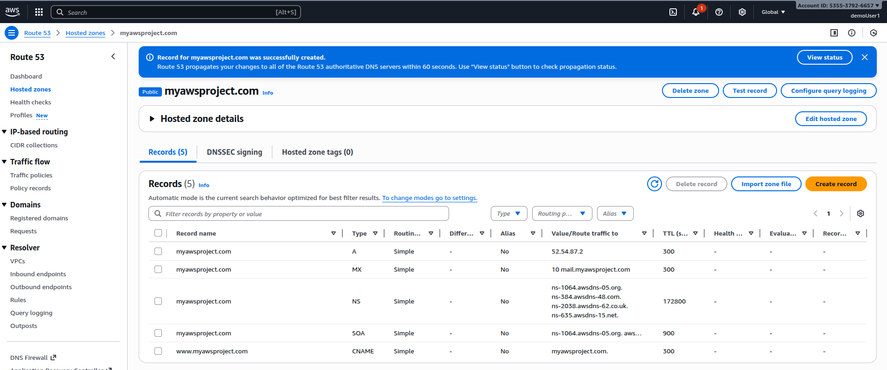
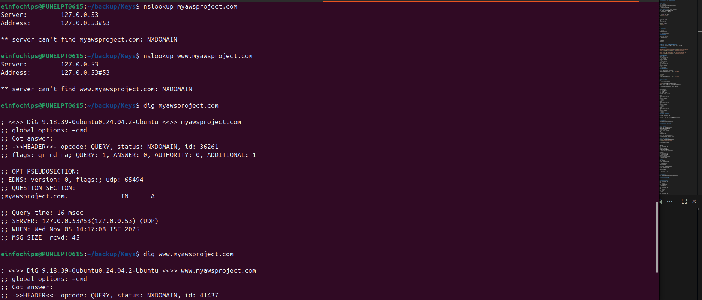
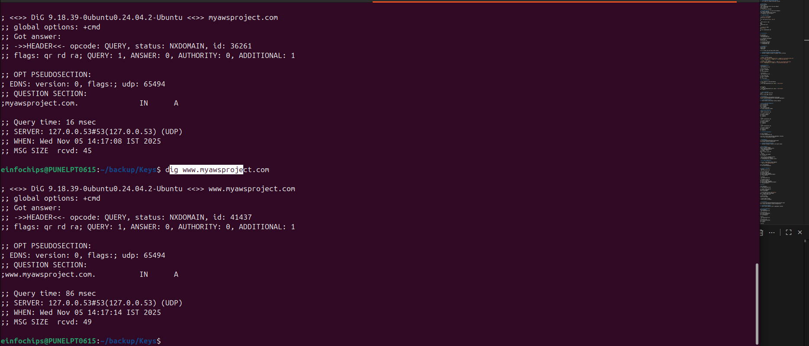
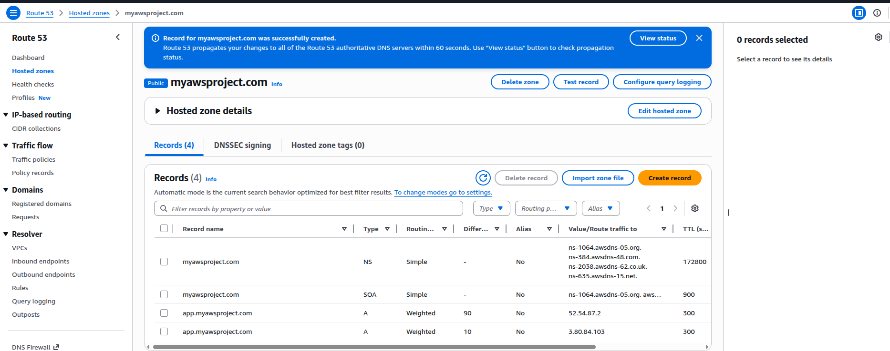

# Section 9: Route 53

## 📋 Overview
This section covers Amazon Route 53, AWS's highly available and scalable Domain Name System (DNS) web service. You'll learn about DNS fundamentals, hosted zones, routing policies, and health checks.

## 🌐 DNS Fundamentals

### What is DNS?
- **Domain Name System**: Translates human-readable domain names to IP addresses
- **Hierarchical system**: Root → TLD → Domain → Subdomain
- **Distributed database**: No single point of failure
- **Caching mechanism**: Improves performance and reduces load

### DNS Record Types
- **A Record**: Maps domain to IPv4 address
- **AAAA Record**: Maps domain to IPv6 address
- **CNAME Record**: Maps domain to another domain name
- **MX Record**: Mail exchange servers
- **NS Record**: Name servers for the domain
- **SOA Record**: Start of Authority information
- **TXT Record**: Text information (SPF, DKIM, verification)

## 🎯 Amazon Route 53 Features

### Core Services
- **DNS service**: Authoritative DNS for your domains
- **Domain registration**: Register new domains
- **Health checking**: Monitor endpoint health
- **Traffic flow**: Visual traffic policy editor

### Key Benefits
- **High availability**: 100% uptime SLA
- **Global network**: Anycast network with edge locations
- **Integration**: Works with all AWS services
- **Cost-effective**: Pay only for what you use

## 🔄 Route 53 Routing Policies

### 1. Simple Routing
- **Single resource**: One IP address per record
- **No health checks**: Basic DNS resolution
- **Use case**: Simple websites with one server

### 2. Weighted Routing
- **Traffic distribution**: Split traffic by percentage
- **Multiple resources**: Different weights assigned
- **Use case**: Blue/green deployments, A/B testing

### 3. Latency-Based Routing
- **Performance optimization**: Route to lowest latency
- **Geographic distribution**: Resources in multiple regions
- **Use case**: Global applications requiring fast response

### 4. Failover Routing
- **Active/passive setup**: Primary and secondary resources
- **Health checks required**: Automatic failover
- **Use case**: Disaster recovery scenarios

### 5. Geolocation Routing
- **Geographic targeting**: Route based on user location
- **Continent/country/state**: Granular location control
- **Use case**: Content localization, compliance requirements

### 6. Geoproximity Routing
- **Distance-based routing**: Route to nearest resource
- **Bias adjustment**: Shift traffic with bias values
- **Use case**: Load balancing with geographic preferences

### 7. Multivalue Answer Routing
- **Multiple IP addresses**: Return up to 8 healthy records
- **Health checks**: Only return healthy resources
- **Use case**: Simple load balancing without load balancer

## 🛠️ Hands-On Practice

### Practice 1: Create Hosted Zone and Basic Records
**Objective**: Set up DNS for a domain with basic records

**Steps**:
1. **Create Hosted Zone**:
   - Go to Route 53 Console
   - Create hosted zone
   - Domain name: "myawsproject.com" (use your domain)
   - Type: Public hosted zone
   - Create hosted zone
   - Note the 4 name servers provided

2. **Update Domain Name Servers** (if you own the domain):
   - Go to your domain registrar
   - Update name servers to Route 53 NS records
   - Wait for propagation (up to 48 hours)

3. **Create Basic DNS Records**:
   ```bash
   # Create A record for root domain
   # Name: (leave blank for root)
   # Type: A
   # Value: Your web server IP (e.g., ALB IP)
   # TTL: 300
   
   # Create CNAME record for www
   # Name: www
   # Type: CNAME
   # Value: myawsproject.com
   # TTL: 300
   
   # Create MX record for email
   # Name: (leave blank)
   # Type: MX
   # Value: 10 mail.myawsproject.com
   # TTL: 300
   ```

4. **Test DNS Resolution**:
   ```bash
   # Test DNS resolution
   nslookup myawsproject.com
   nslookup www.myawsproject.com
   
   # Use dig for detailed information
   dig myawsproject.com
   dig www.myawsproject.com
   
   # Test from different locations
   dig @8.8.8.8 myawsproject.com
   dig @1.1.1.1 myawsproject.com
   ```

**Screenshot Placeholder**:
![Route 53 Hosted Zone]






*Caption: Route 53 hosted zone with basic DNS records*

### Practice 2: Weighted Routing for Blue/Green Deployment
**Objective**: Implement weighted routing for gradual traffic shifting

**Steps**:
1. **Set Up Two Web Servers**:
   ```bash
   # Server 1 (Blue) - Current version
   echo "<h1>Blue Version - Current Production</h1>" | sudo tee /var/www/html/index.html
   echo "<p>Server: $(hostname)</p>" | sudo tee -a /var/www/html/index.html
   
   # Server 2 (Green) - New version
   echo "<h1>Green Version - New Release</h1>" | sudo tee /var/www/html/index.html
   echo "<p>Server: $(hostname)</p>" | sudo tee -a /var/www/html/index.html
   ```

2. **Create Weighted Records**:
   - Create Record Set 1:
     - Name: app.myawsproject.com
     - Type: A
     - Value: Blue server IP
     - Routing Policy: Weighted
     - Weight: 90
     - Set ID: Blue-Production
   
   - Create Record Set 2:
     - Name: app.myawsproject.com
     - Type: A
     - Value: Green server IP
     - Routing Policy: Weighted
     - Weight: 10
     - Set ID: Green-Canary

3. **Test Traffic Distribution**:
   ```bash
   # Test multiple requests to see distribution
   for i in {1..20}; do
     curl -s http://app.myawsproject.com | grep -o "Blue\|Green"
     sleep 1
   done
   
   # Count distribution
   for i in {1..100}; do
     curl -s http://app.myawsproject.com | grep -o "Blue\|Green"
   done | sort | uniq -c
   ```

4. **Gradually Shift Traffic**:
   - Update weights: Blue 70%, Green 30%
   - Test again
   - Continue until Green 100%, Blue 0%

**Screenshot Placeholder**:
![Weighted Routing]



*Caption: Weighted routing configuration for blue/green deployment*

### Practice 3: Latency-Based Routing
**Objective**: Route traffic to the lowest latency endpoint

**Steps**:
1. **Deploy Servers in Multiple Regions**:
   - Launch EC2 instances in:
     - us-east-1 (N. Virginia)
     - us-west-2 (Oregon)
     - eu-west-1 (Ireland)
   - Install web servers on each
   - Configure unique content per region

2. **Create Latency-Based Records**:
   - Record Set 1:
     - Name: global.myawsproject.com
     - Type: A
     - Value: us-east-1 server IP
     - Routing Policy: Latency
     - Region: us-east-1
     - Set ID: US-East-1
   
   - Record Set 2:
     - Name: global.myawsproject.com
     - Type: A
     - Value: us-west-2 server IP
     - Routing Policy: Latency
     - Region: us-west-2
     - Set ID: US-West-2
   
   - Record Set 3:
     - Name: global.myawsproject.com
     - Type: A
     - Value: eu-west-1 server IP
     - Routing Policy: Latency
     - Region: eu-west-1
     - Set ID: EU-West-1

3. **Test from Different Locations**:
   ```bash
   # Test from your location
   curl http://global.myawsproject.com
   
   # Use online tools to test from different geographic locations
   # Or use VPN to test from different regions
   ```

**Screenshot Placeholder**:

*Caption: Latency-based routing configuration*

### Practice 4: Health Checks and Failover
**Objective**: Implement automatic failover with health checks

**Steps**:
1. **Create Health Checks**:
   - Go to Route 53 → Health checks
   - Create health check for primary server:
     - Name: Primary-Web-Server-Health
     - What to monitor: Endpoint
     - Protocol: HTTP
     - IP address: Primary server IP
     - Port: 80
     - Path: /health
     - Request interval: 30 seconds
     - Failure threshold: 3
   
   - Create health check for secondary server:
     - Name: Secondary-Web-Server-Health
     - Similar configuration for secondary server

2. **Create Health Check Endpoints**:
   ```bash
   # On both servers, create health check endpoint
   echo "OK" | sudo tee /var/www/html/health
   
   # Test health check endpoint
   curl http://your-server-ip/health
   ```

3. **Configure Failover Routing**:
   - Primary Record:
     - Name: app.myawsproject.com
     - Type: A
     - Value: Primary server IP
     - Routing Policy: Failover
     - Failover Record Type: Primary
     - Health Check: Primary-Web-Server-Health
     - Set ID: Primary-Server
   
   - Secondary Record:
     - Name: app.myawsproject.com
     - Type: A
     - Value: Secondary server IP
     - Routing Policy: Failover
     - Failover Record Type: Secondary
     - Health Check: Secondary-Web-Server-Health
     - Set ID: Secondary-Server

4. **Test Failover**:
   ```bash
   # Test normal operation
   curl http://app.myawsproject.com
   
   # Simulate primary server failure
   # Stop web server on primary
   sudo systemctl stop httpd
   
   # Wait for health check to fail (3-5 minutes)
   # Test again - should route to secondary
   curl http://app.myawsproject.com
   
   # Restore primary server
   sudo systemctl start httpd
   
   # Wait for health check to pass
   # Traffic should return to primary
   ```

**Screenshot Placeholder**:

*Caption: Health checks and failover routing configuration*

### Practice 5: Geolocation Routing
**Objective**: Route traffic based on user's geographic location

**Steps**:
1. **Create Geolocation Records**:
   - North America Record:
     - Name: geo.myawsproject.com
     - Type: A
     - Value: US server IP
     - Routing Policy: Geolocation
     - Location: North America
     - Set ID: North-America
   
   - Europe Record:
     - Name: geo.myawsproject.com
     - Type: A
     - Value: EU server IP
     - Routing Policy: Geolocation
     - Location: Europe
     - Set ID: Europe
   
   - Default Record:
     - Name: geo.myawsproject.com
     - Type: A
     - Value: Default server IP
     - Routing Policy: Geolocation
     - Location: Default
     - Set ID: Default

2. **Test Geolocation Routing**:
   ```bash
   # Test from your location
   curl http://geo.myawsproject.com
   
   # Use VPN or proxy to test from different countries
   # Or use online testing tools
   ```

**Screenshot Placeholder**:

*Caption: Geolocation routing based on user location*

### Practice 6: Route 53 Resolver
**Objective**: Set up DNS resolution for hybrid environments

**Steps**:
1. **Create Route 53 Resolver Endpoints**:
   - Go to Route 53 → Resolver
   - Create inbound endpoint:
     - Name: Inbound-Resolver
     - VPC: Your VPC
     - Security group: Allow DNS (port 53)
     - IP addresses: Choose subnets and IPs
   
   - Create outbound endpoint:
     - Name: Outbound-Resolver
     - VPC: Your VPC
     - Security group: Allow DNS (port 53)
     - IP addresses: Choose subnets and IPs

2. **Create Resolver Rules**:
   - Create forwarding rule:
     - Name: Forward-to-OnPrem
     - Rule type: Forward
     - Domain name: onprem.local
     - VPC: Your VPC
     - Outbound endpoint: Outbound-Resolver
     - Target IP: On-premises DNS server IP

3. **Test Hybrid DNS Resolution**:
   ```bash
   # Test resolution of AWS resources
   nslookup ec2-instance.us-east-1.compute.internal
   
   # Test resolution of on-premises resources
   nslookup server.onprem.local
   ```

**Screenshot Placeholder**:

*Caption: Route 53 Resolver for hybrid DNS*

## 🔧 Advanced Route 53 Features

### Route 53 Application Recovery Controller
- **Application-level failover**: Beyond DNS failover
- **Readiness checks**: Verify application readiness
- **Recovery groups**: Logical grouping of resources
- **Control panels**: Manual override capabilities

### DNS Firewall
- **Block malicious domains**: Prevent DNS queries to bad domains
- **Custom rules**: Create your own block/allow lists
- **Managed rules**: AWS-managed threat intelligence
- **Logging**: Monitor blocked queries

### Traffic Flow
- **Visual policy editor**: Create complex routing policies
- **Version control**: Manage policy versions
- **Testing**: Test policies before applying
- **Global deployment**: Apply policies to multiple hosted zones

## 📊 Route 53 Monitoring and Logging

### CloudWatch Metrics
- **Query count**: Number of DNS queries
- **Health check status**: Health check results
- **Resolver query count**: Resolver endpoint metrics
- **Custom metrics**: Application-specific metrics

### Query Logging
- **DNS query logs**: Log all DNS queries
- **CloudWatch Logs**: Store logs in CloudWatch
- **Analysis**: Analyze query patterns
- **Security**: Detect suspicious activity

## 💰 Route 53 Pricing

### Hosted Zone Costs
- **$0.50 per hosted zone** per month
- **First 25 hosted zones**: $0.50 each
- **Additional hosted zones**: Discounted pricing

### Query Costs
- **Standard queries**: $0.40 per million queries
- **Latency-based queries**: $0.60 per million queries
- **Geo DNS queries**: $0.70 per million queries
- **Health checks**: $0.50 per health check per month

## 🔒 Route 53 Security Best Practices

### Access Control
- **IAM policies**: Control Route 53 access
- **Resource record set permissions**: Granular control
- **Cross-account access**: Secure delegation
- **API logging**: CloudTrail integration

### DNSSEC
- **Domain signing**: Cryptographic signatures
- **Chain of trust**: Verify DNS responses
- **Key management**: Automatic key rotation
- **Validation**: Prevent DNS spoofing

## 🚨 Common Route 53 Mistakes

1. **Incorrect TTL values**: Too high or too low
2. **Missing health checks** for failover
3. **Improper weight distribution**
4. **Not testing DNS changes**
5. **Forgetting to update NS records**
6. **Inadequate monitoring**
7. **Not using alias records** for AWS resources

## 🔗 Additional Resources

- [Route 53 Developer Guide](https://docs.aws.amazon.com/route53/)
- [DNS Best Practices](https://docs.aws.amazon.com/Route53/latest/DeveloperGuide/best-practices-dns.html)
- [Route 53 Health Checks](https://docs.aws.amazon.com/Route53/latest/DeveloperGuide/health-checks-creating.html)
- [Route 53 Pricing](https://aws.amazon.com/route53/pricing/)

## 📸 Screenshots Section
*Document your DNS configurations:*

### Screenshot 1: Hosted Zone Dashboard

*Caption: Route 53 hosted zone with DNS records*

### Screenshot 2: Routing Policies

*Caption: Different routing policies configuration*

### Screenshot 3: Health Check Status

*Caption: Health check monitoring dashboard*

### Screenshot 4: Traffic Flow

*Caption: Route 53 Traffic Flow visual editor*

### Screenshot 5: DNS Query Logs

*Caption: DNS query logging and analysis*

### Screenshot 6: Resolver Configuration

*Caption: Route 53 Resolver for hybrid DNS*

---

## ✅ Section Completion Checklist
- [ ] Created hosted zone and basic DNS records
- [ ] Implemented weighted routing for blue/green deployment
- [ ] Configured latency-based routing across regions
- [ ] Set up health checks and failover routing
- [ ] Implemented geolocation routing
- [ ] Configured Route 53 Resolver for hybrid DNS
- [ ] Applied DNS security best practices
- [ ] Monitored DNS performance and queries

## 🎯 Next Steps
Move to **Section 10: Classic Solution Architecture Discussion** to learn about common architectural patterns and best practices.

---

*Last Updated: January 2025*
*Course Version: 2025.1*