# Section 11: Amazon S3 Introduction - Advanced S3

## 📋 Overview
This section covers Amazon Simple Storage Service (S3), AWS's object storage service. You'll learn about S3 fundamentals, storage classes, lifecycle policies, versioning, and advanced features for building scalable applications.

## 🪣 Amazon S3 Fundamentals

### What is Amazon S3?
- **Object storage service**: Store and retrieve any amount of data
- **Virtually unlimited storage**: No capacity planning required
- **11 9's durability**: 99.999999999% data durability
- **Global accessibility**: Access from anywhere on the internet
- **RESTful API**: Simple web services interface

### Key Concepts
- **Buckets**: Containers for objects (globally unique names)
- **Objects**: Files stored in buckets (up to 5TB each)
- **Keys**: Unique identifier for objects within bucket
- **Regions**: Geographic location where bucket is stored
- **Eventual consistency**: Strong consistency for all operations

## 🗂️ S3 Storage Classes

### Standard Storage Classes
- **S3 Standard**: Frequently accessed data, low latency
- **S3 Intelligent-Tiering**: Automatic cost optimization
- **S3 Standard-IA**: Infrequently accessed data
- **S3 One Zone-IA**: Lower cost, single AZ storage

### Archive Storage Classes
- **S3 Glacier Instant Retrieval**: Archive with instant access
- **S3 Glacier Flexible Retrieval**: Archive with retrieval times
- **S3 Glacier Deep Archive**: Lowest cost, long-term archive

### Specialized Storage Classes
- **S3 Outposts**: On-premises S3 storage
- **S3 Express One Zone**: High-performance storage

## 🛠️ Hands-On Practice

### Practice 1: S3 Bucket Creation and Basic Operations
**Objective**: Create S3 bucket and perform basic object operations

**Steps**:
1. **Create S3 Bucket**:
   ```bash
   # Create bucket with AWS CLI
   aws s3 mb s3://my-unique-bucket-name-12345 --region us-east-1
   
   # List buckets
   aws s3 ls
   
   # Create bucket via console
   # Go to S3 Console → Create bucket
   # Bucket name: my-unique-bucket-name-12345
   # Region: us-east-1
   # Block all public access: Yes (default)
   # Bucket versioning: Disable (for now)
   # Default encryption: Enable with SSE-S3
   ```
    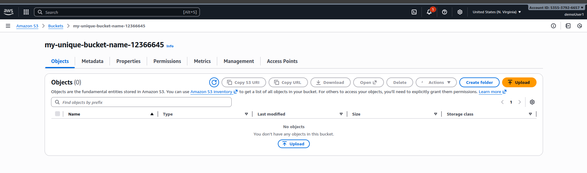

2. **Upload Objects**:
   ```bash
   # Create test files
   echo "Hello S3!" > test-file.txt
   echo "This is a larger file with more content for testing purposes." > large-file.txt
   
   # Upload files
   aws s3 cp test-file.txt s3://my-unique-bucket-name-12366645/
   aws s3 cp large-file.txt s3://my-unique-bucket-name-12366645/documents/
   
   # Upload with metadata
   aws s3 cp test-file.txt s3://my-unique-bucket-name-12366645/metadata-test.txt \
     --metadata "author=john,department=engineering"
   
   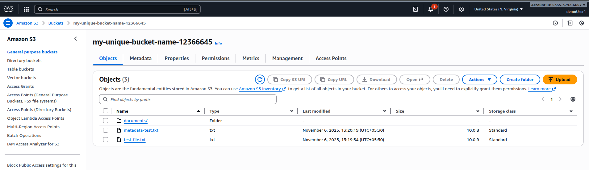
   

   # List objects
   aws s3 ls s3://my-unique-bucket-name-12366645/ --recursive
   ```

3. **Object Operations**:
   ```bash
   # Download objects
   aws s3 cp s3://my-unique-bucket-name-12366645/test-file.txt downloaded-file.txt
   
   # Copy objects within S3
   aws s3 cp s3://my-unique-bucket-name-12366645/test-file.txt \
     s3://my-unique-bucket-name-12366645/backup/test-file-backup.txt
   
   # Move objects
   aws s3 mv s3://my-unique-bucket-name-12366645/test-file.txt \
     s3://my-unique-bucket-name-12366645/moved/test-file.txt
   
   # Delete objects
   aws s3 rm s3://my-unique-bucket-name-12366645/moved/test-file.txt
   ```

**Screenshot Placeholder**:
![S3 Bucket Creation]
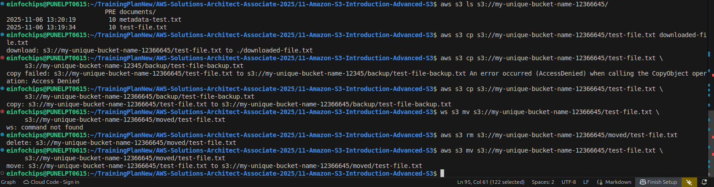
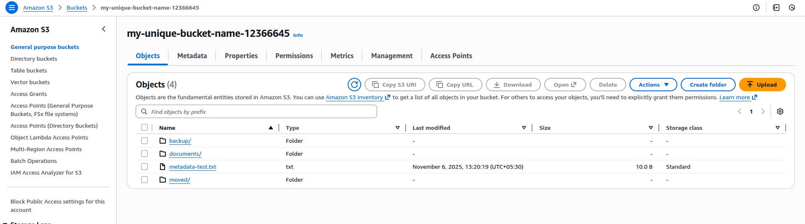
*Caption: S3 bucket creation and basic operations*

### Practice 2: S3 Storage Classes and Lifecycle Policies
**Objective**: Configure different storage classes and automate transitions

**Steps**:
1. **Upload Objects to Different Storage Classes**:
   ```bash
   # Upload to Standard storage class (default)
   aws s3 cp large-file.txt s3://my-unique-bucket-name-12366645/standard/
   
   # Upload to Standard-IA
   aws s3 cp large-file.txt s3://my-unique-bucket-name-12366645/standard-ia/ \
     --storage-class STANDARD_IA
   
   # Upload to Glacier
   aws s3 cp large-file.txt s3://my-unique-bucket-name-12366645/glacier/ \
     --storage-class GLACIER
   
   # Upload to Intelligent Tiering
   aws s3 cp large-file.txt s3://my-unique-bucket-name-12366645/intelligent/ \
     --storage-class INTELLIGENT_TIERING
   ```

2. **Create Lifecycle Policy**:
   ```json
   {
     "Rules": [
       {
         "ID": "DocumentsLifecycle",
         "Status": "Enabled",
         "Filter": {
           "Prefix": "documents/"
         },
         "Transitions": [
           {
             "Days": 30,
             "StorageClass": "STANDARD_IA"
           },
           {
             "Days": 90,
             "StorageClass": "GLACIER"
           },
           {
             "Days": 365,
             "StorageClass": "DEEP_ARCHIVE"
           }
         ],
         "Expiration": {
           "Days": 2555
         }
       },
       {
         "ID": "LogsLifecycle",
         "Status": "Enabled",
         "Filter": {
           "Prefix": "logs/"
         },
         "Transitions": [
           {
             "Days": 7,
             "StorageClass": "STANDARD_IA"
           },
           {
             "Days": 30,
             "StorageClass": "GLACIER"
           }
         ],
         "Expiration": {
           "Days": 90
         }
       }
     ]
   }
   ```

3. **Apply Lifecycle Policy**:
   ```bash
   # Save policy to file
   cat > lifecycle-policy.json << 'EOF'
   [JSON content from above]
   EOF
   
   # Apply lifecycle policy
   aws s3api put-bucket-lifecycle-configuration \
     --bucket my-unique-bucket-name-12366645 \
     --lifecycle-configuration file://lifecycle-policy.json
   
   # Verify policy
   aws s3api get-bucket-lifecycle-configuration \
     --bucket my-unique-bucket-name-12366645
   ```

**Screenshot Placeholder**:

*Caption: S3 storage classes and lifecycle policy configuration*

### Practice 3: S3 Versioning and MFA Delete
**Objective**: Enable versioning and configure MFA delete protection

**Steps**:
1. **Enable Versioning**:
   ```bash
   # Enable versioning
   aws s3api put-bucket-versioning \
     --bucket my-unique-bucket-name-12366645 \
     --versioning-configuration Status=Enabled
   
   # Verify versioning status
   aws s3api get-bucket-versioning \
     --bucket my-unique-bucket-name-12366645
   ```

2. **Test Versioning**:
   ```bash
   # Upload initial version
   echo "Version 1 content" > versioned-file.txt
   aws s3 cp versioned-file.txt s3://my-unique-bucket-name-12366645/
   
   # Upload second version
   echo "Version 2 content - updated" > versioned-file.txt
   aws s3 cp versioned-file.txt s3://my-unique-bucket-name-12366645/
   
   # Upload third version
   echo "Version 3 content - final update" > versioned-file.txt
   aws s3 cp versioned-file.txt s3://my-unique-bucket-name-12366645/
   
   # List all versions
   aws s3api list-object-versions \
     --bucket my-unique-bucket-name-12366645 \
     --prefix versioned-file.txt
   ```
    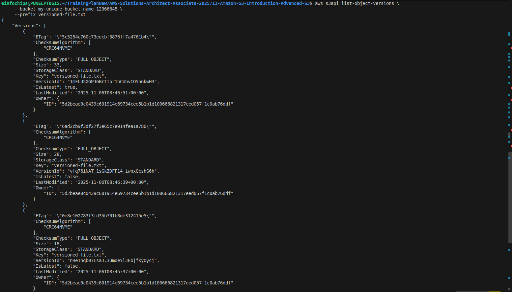

3. **Work with Specific Versions**:
   ```bash
   # Download specific version
   aws s3api get-object \
     --bucket my-unique-bucket-name-12366645 \
     --key versioned-file.txt \
     --version-id "vfq76iNAT_1sGkZDFF14_iwnxQcshS6h" \
     versioned-file-v1.txt

     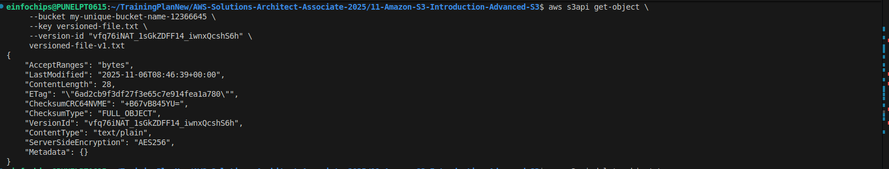

     Version-id: 1 1mFLU5XGPJ6BrtIpr1hCUhvCO556kwH3, vfq76iNAT_1sGkZDFF14_iwnxQcshS6h, nHe1nqb07LsaJ.3UmoeYlJEbjfkyOycj
   
   # Delete specific version
   aws s3api delete-object \
     --bucket my-unique-bucket-name-12366645 \
     --key versioned-file.txt \
     --version-id "vfq76iNAT_1sGkZDFF14_iwnxQcshS6h"
   ```
    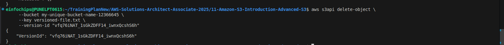

4. **Configure MFA Delete** (requires root account):
   ```bash
   # Enable MFA Delete (requires MFA token)
   aws s3api put-bucket-versioning \
     --bucket my-unique-bucket-name-12366645 \
     --versioning-configuration Status=Enabled,MFADelete=Enabled \
     --mfa "arn:aws:iam::account-id:mfa/root-account-mfa-device mfa-code"
   ```

### Practice 4: S3 Cross-Region Replication
**Objective**: Set up automatic replication to another region

**Steps**:
1. **Create Destination Bucket**:
   ```bash
   # Create bucket in different region
   aws s3 mb s3://webapp-dr-primary-bucket-1730806800 --region us-west-2
   
   # Enable versioning on destination bucket
   aws s3api put-bucket-versioning \
     --bucket webapp-dr-secondary-bucket-1730806800 \
     --versioning-configuration Status=Enabled
   ```

2. **Create IAM Role for Replication**:
   ```json
   {
     "Version": "2012-10-17",
     "Statement": [
       {
         "Effect": "Allow",
         "Principal": {
           "Service": "s3.amazonaws.com"
         },
         "Action": "sts:AssumeRole"
       }
     ]
   }
   ```

3. **Configure Replication**:
   ```json
   {
     "Role": "arn:aws:iam::account-id:role/replication-role",
     "Rules": [
       {
         "ID": "ReplicateEverything",
         "Status": "Enabled",
         "Priority": 1,
         "Filter": {},
         "Destination": {
           "Bucket": "arn:aws:s3:::webapp-dr-secondary-bucket-1730806800",
           "StorageClass": "STANDARD_IA"
         }
       }
     ]
   }
   ```

4. **Test Replication**:
   ```bash
   # Upload test file
   echo "Replication test content" > replication-test.txt
   aws s3 cp replication-test.txt s3://webapp-dr-primary-bucket-1730806800/
   
   # Wait a few minutes and check destination bucket
   aws s3 ls s3://webapp-dr-secondary-bucket-1730806800/ --region us-west-2
   ```

**Screenshot Placeholder**:
![S3 Cross-Region Replication]
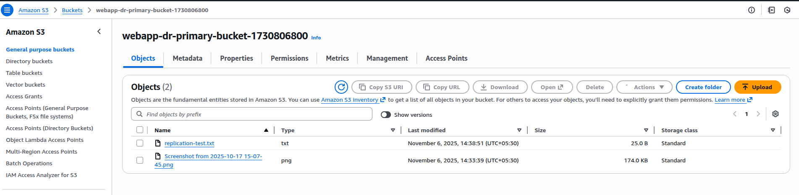
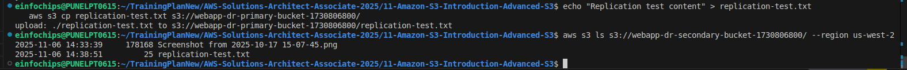
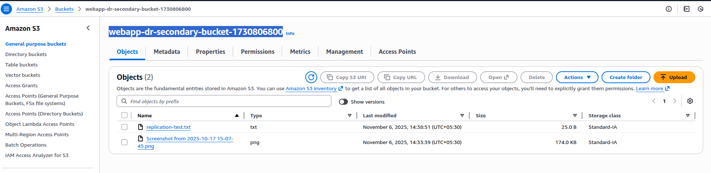
*Caption: S3 cross-region replication configuration*

### Practice 5: S3 Event Notifications
**Objective**: Configure S3 to trigger events on object operations

**Steps**:
1. **Create SNS Topic**:
   ```bash
   # Create SNS topic
   aws sns create-topic --name s3-notifications
   
   # Subscribe email to topic
   aws sns subscribe \
     --topic-arn arn:aws:sns:us-east-1:535537926657:s3-notifications \
     --protocol email \
     --notification-endpoint imradev29@gmail.com
   ```

2. **Create Lambda Function**:
   ```python
   import json
   import boto3
   
   def lambda_handler(event, context):
       print("S3 Event received:")
       print(json.dumps(event, indent=2))
       
       for record in event['Records']:
           bucket = record['s3']['bucket']['name']
           key = record['s3']['object']['key']
           event_name = record['eventName']
           
           print(f"Event: {event_name}")
           print(f"Bucket: {bucket}")
           print(f"Object: {key}")
           
           # Process the event (e.g., resize image, process data, etc.)
           
       return {
           'statusCode': 200,
           'body': json.dumps('Event processed successfully')
       }
   ```

3. **Configure S3 Event Notifications**:
   ```json
   {
     "TopicConfigurations": [
       {
         "Id": "ObjectCreatedEvents",
         "TopicArn": "arn:aws:sns:us-east-1:account-id:s3-notifications",
         "Events": ["s3:ObjectCreated:*"]
       }
     ],
     "LambdaConfigurations": [
       {
         "Id": "ProcessUploads",
         "LambdaFunctionArn": "arn:aws:lambda:us-east-1:account-id:function:process-s3-uploads",
         "Events": ["s3:ObjectCreated:Put"],
         "Filter": {
           "Key": {
             "FilterRules": [
               {
                 "Name": "prefix",
                 "Value": "uploads/"
               },
               {
                 "Name": "suffix",
                 "Value": ".jpg"
               }
             ]
           }
         }
       }
     ]
   }
   ```

4. **Test Event Notifications**:
   ```bash
   # Upload file to trigger notifications
   aws s3 cp test-image.jpg s3://my-unique-bucket-name-12366645/uploads/
   
   # Check CloudWatch logs for Lambda execution
   # Check email for SNS notification
   ```

**Screenshot Placeholder**:
![S3 Event Notifications]
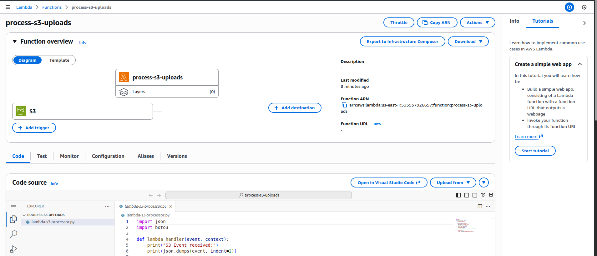
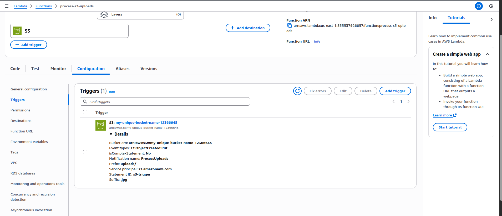
*Caption: S3 event notifications with SNS and Lambda*

### Practice 6: S3 Performance Optimization
**Objective**: Optimize S3 performance for high-throughput applications

**Steps**:
1. **Multipart Upload**:
   ```bash
   # Create large test file (100MB)
   dd if=/dev/zero of=large-file.dat bs=1M count=100
   
   # Configure multipart upload threshold
   aws configure set default.s3.multipart_threshold 64MB
   aws configure set default.s3.multipart_chunksize 16MB
   aws configure set default.s3.max_concurrent_requests 10
   
   # Upload large file (automatically uses multipart)
   aws s3 cp large-file.dat s3://my-unique-bucket-name-12345/
   ```

2. **Transfer Acceleration**:
   ```bash
   # Enable Transfer Acceleration
   aws s3api put-bucket-accelerate-configuration \
     --bucket my-unique-bucket-name-12345 \
     --accelerate-configuration Status=Enabled
   
   # Test with acceleration endpoint
   aws s3 cp large-file.dat s3://my-unique-bucket-name-12345/accelerated/ \
     --endpoint-url https://s3-accelerate.amazonaws.com
   ```

3. **Request Patterns and Prefixes**:
   ```bash
   # Good prefix pattern (distributes load)
   aws s3 cp file1.txt s3://my-unique-bucket-name-12345/2024/01/15/12/file1.txt
   aws s3 cp file2.txt s3://my-unique-bucket-name-12345/2024/01/15/13/file2.txt
   
   # Bad prefix pattern (hot spotting)
   # Don't use: /logs/2024-01-15-file1.txt
   # Don't use: /logs/2024-01-15-file2.txt
   
   # Use random prefixes for high request rates
   aws s3 cp file3.txt s3://my-unique-bucket-name-12345/a1b2c3/file3.txt
   aws s3 cp file4.txt s3://my-unique-bucket-name-12345/d4e5f6/file4.txt
   ```

4. **CloudWatch Metrics**:
   ```bash
   # Monitor S3 performance metrics
   aws cloudwatch get-metric-statistics \
     --namespace AWS/S3 \
     --metric-name NumberOfObjects \
     --dimensions Name=BucketName,Value=my-unique-bucket-name-12345 \
     --start-time 2024-01-01T00:00:00Z \
     --end-time 2024-01-02T00:00:00Z \
     --period 3600 \
     --statistics Average
   ```

**Screenshot Placeholder**:

*Caption: S3 performance optimization techniques*

## 🔧 Advanced S3 Features

### S3 Select
- **Query data in place**: SQL queries on S3 objects
- **Reduce data transfer**: Return only required data
- **Supported formats**: CSV, JSON, Parquet
- **Cost optimization**: Pay for scanned data only

### S3 Batch Operations
- **Large-scale operations**: Process billions of objects
- **Built-in operations**: Copy, tag, ACL, restore
- **Custom operations**: Lambda functions
- **Job tracking**: Monitor progress and results

### S3 Object Lock
- **WORM compliance**: Write Once Read Many
- **Legal hold**: Indefinite retention
- **Retention periods**: Time-based retention
- **Governance vs compliance**: Different protection levels

## 📊 S3 Cost Optimization

### Storage Cost Factors
- **Storage class**: Choose appropriate class
- **Data transfer**: Minimize cross-region transfers
- **Request costs**: Optimize request patterns
- **Management features**: Lifecycle, replication costs

### Cost Optimization Strategies
- **Intelligent Tiering**: Automatic optimization
- **Lifecycle policies**: Automated transitions
- **Delete incomplete uploads**: Clean up failed uploads
- **Compress data**: Reduce storage requirements

## 🔒 S3 Security Best Practices

### Access Control
- **Bucket policies**: Resource-based permissions
- **IAM policies**: User-based permissions
- **ACLs**: Object-level permissions (legacy)
- **Pre-signed URLs**: Temporary access

### Encryption
- **SSE-S3**: Server-side encryption with S3 keys
- **SSE-KMS**: Server-side encryption with KMS keys
- **SSE-C**: Server-side encryption with customer keys
- **Client-side encryption**: Encrypt before upload

## 🚨 Common S3 Mistakes

1. **Public buckets** without intention
2. **Inadequate access controls**
3. **Not using lifecycle policies**
4. **Ignoring cost optimization**
5. **Poor naming conventions**
6. **Not enabling versioning** for critical data
7. **Inadequate backup strategies**


## 🎯 Next Steps
Move to **Section 12: Amazon S3 Security** to learn about advanced S3 security features and access control mechanisms.

---