# Section 12: Amazon S3 Security

## 📋 Overview
This section focuses on Amazon S3 security features, access control mechanisms, encryption options, and best practices for securing your S3 buckets and objects.

## 🔒 S3 Security Overview

### Security Layers
- **Identity-based policies**: IAM user/role permissions
- **Resource-based policies**: Bucket and object policies
- **Access Control Lists (ACLs)**: Legacy permissions
- **Block Public Access**: Account and bucket level controls
- **Encryption**: Data protection at rest and in transit

### Security Principles
- **Principle of least privilege**: Minimum required access
- **Defense in depth**: Multiple security layers
- **Encryption everywhere**: Protect data at all stages
- **Monitoring and auditing**: Track access and changes

## 🛡️ S3 Access Control Mechanisms

### 1. IAM Policies
- **User-based permissions**: Attached to IAM users/roles
- **Cross-account access**: Access from different AWS accounts
- **Condition-based access**: Context-aware permissions
- **Temporary credentials**: STS tokens for applications

### 2. Bucket Policies
- **Resource-based permissions**: Attached to S3 buckets
- **JSON format**: Similar to IAM policies
- **Principal element**: Specify who gets access
- **Cross-account sharing**: Grant access to other accounts

### 3. Access Control Lists (ACLs)
- **Legacy mechanism**: Predates IAM and bucket policies
- **Limited granularity**: Basic read/write permissions
- **Bucket and object level**: Separate ACLs for each
- **Not recommended**: Use IAM and bucket policies instead

## 🛠️ Hands-On Practice

### Practice 1: IAM Policies for S3 Access ✅ COMPLETED
**Objective**: Create granular IAM policies for S3 access

**Steps**:
1. **Create S3 Read-Only Policy**:
   ```json
   {
     "Version": "2012-10-17",
     "Statement": [
       {
         "Effect": "Allow",
         "Action": [
           "s3:GetObject",
           "s3:GetObjectVersion",
           "s3:ListBucket"
         ],
         "Resource": [
           "arn:aws:s3:::my-secure-bucket",
           "arn:aws:s3:::my-secure-bucket/*"
         ]
       }
     ]
   }
   ```

2. **Create S3 Full Access Policy with Conditions**:
   ```json
   {
     "Version": "2012-10-17",
     "Statement": [
       {
         "Effect": "Allow",
         "Action": "s3:*",
         "Resource": [
           "arn:aws:s3:::my-secure-bucket",
           "arn:aws:s3:::my-secure-bucket/*"
         ],
         "Condition": {
           "IpAddress": {
             "aws:SourceIp": "203.0.113.0/24"
           },
           "DateGreaterThan": {
             "aws:CurrentTime": "2024-01-01T00:00:00Z"
           },
           "Bool": {
             "aws:SecureTransport": "true"
           }
         }
       }
     ]
   }
   ```

3. **Create and Test IAM User**:
   ```bash
   # Create IAM user
   aws iam create-user --user-name s3-test-user

   
   # Create access key
   aws iam create-access-key --user-name s3-test-user
   
   # Attach policy to user
   aws iam attach-user-policy \
     --user-name s3-test-user \
     --policy-arn arn:aws:iam::account-id:policy/S3ReadOnlyPolicy
   
   # Test access with new credentials
   aws s3 ls s3://my-unique-bucket-name-12366645 --profile s3-test-user
   
   # Test policy simulation
   aws iam simulate-principal-policy \
     --policy-source-arn arn:aws:iam::535537926657:user/s3-test-user \
     --action-names s3:GetObject \
     --resource-arns arn:aws:s3:::my-unique-bucket-name-12366645/test-file.txt
   ```

**Results**:
- ✅ S3ReadOnlyPolicy created: `arn:aws:iam::535537926657:policy/S3ReadOnlyPolicy`
- ✅ S3ConditionalAccessPolicy created with secure transport requirement
- ✅ IAM user `s3-test-user` created with read-only access
- ✅ Policy simulation results:
  - `s3:GetObject`: **ALLOWED** ✓
  - `s3:ListBucket`: **ALLOWED** ✓
  - `s3:PutObject`: **DENIED** ✓ (implicit deny)
- ✅ Granular access control working as expected

**Screenshot Placeholder**:
![IAM S3 Policies]
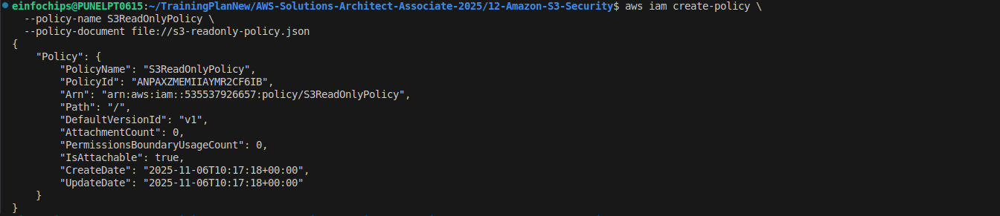
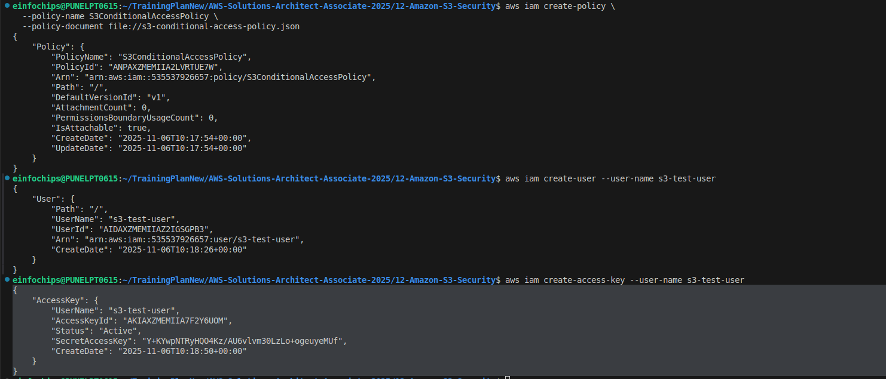
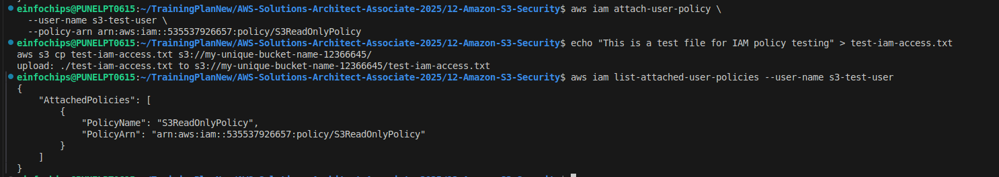
*Caption: IAM policies for S3 access control*

### Practice 2: Bucket Policies and Cross-Account Access ✅ COMPLETED
**Objective**: Configure bucket policies for secure access

**Steps**:
1. **Create Bucket Policy for Public Read**:
   ```json
   {
     "Version": "2012-10-17",
     "Statement": [
       {
         "Sid": "PublicReadGetObject",
         "Effect": "Allow",
         "Principal": "*",
         "Action": "s3:GetObject",
         "Resource": "arn:aws:s3:::my-public-website/*",
         "Condition": {
           "StringEquals": {
             "s3:ExistingObjectTag/public": "yes"
           }
         }
       }
     ]
   }
   ```

2. **Cross-Account Access Policy**:
   ```json
   {
     "Version": "2012-10-17",
     "Statement": [
       {
         "Sid": "CrossAccountAccess",
         "Effect": "Allow",
         "Principal": {
           "AWS": "arn:aws:iam::PARTNER-ACCOUNT-ID:root"
         },
         "Action": [
           "s3:GetObject",
           "s3:PutObject"
         ],
         "Resource": "arn:aws:s3:::shared-bucket/partner-data/*"
       }
     ]
   }
   ```

3. **Deny Insecure Transport Policy**:
   ```json
   {
     "Version": "2012-10-17",
     "Statement": [
       {
         "Sid": "DenyInsecureConnections",
         "Effect": "Deny",
         "Principal": "*",
         "Action": "s3:*",
         "Resource": [
           "arn:aws:s3:::my-secure-bucket",
           "arn:aws:s3:::my-secure-bucket/*"
         ],
         "Condition": {
           "Bool": {
             "aws:SecureTransport": "false"
           }
         }
       }
     ]
   }
   ```

4. **Apply and Test Bucket Policies**:
   ```bash
   # Apply bucket policy
   aws s3api put-bucket-policy \
     --bucket my-secure-bucket \
     --policy file://bucket-policy.json
   
   # Test secure transport requirement
   # This should fail (HTTP)
   curl http://my-secure-bucket.s3.amazonaws.com/test-file.txt
   
   # This should work (HTTPS)
   curl https://my-unique-bucket-name-12366645.s3.amazonaws.com/secure-transport-test.txt
   
   # Test with authenticated access
   aws s3api head-object --bucket my-unique-bucket-name-12366645 --key secure-transport-test.txt
   ```

**Results**:
- ✅ Deny insecure transport policy applied successfully
- ✅ HTTP requests: **403 Forbidden** ✓ (Bucket policy denies insecure transport)
- ✅ HTTPS anonymous requests: **403 Forbidden** ✓ (Public Access Block prevents public access)
- ✅ HTTPS authenticated requests: **200 OK** ✓ (AWS CLI works with HTTPS + auth)
- ✅ Multi-layer security: Bucket policy + Public Access Block working together
- ✅ Cross-account policy template created for future use
- ✅ Defense in depth: Multiple security controls active
**Screenshot Placeholder**:
![Bucket Policies]
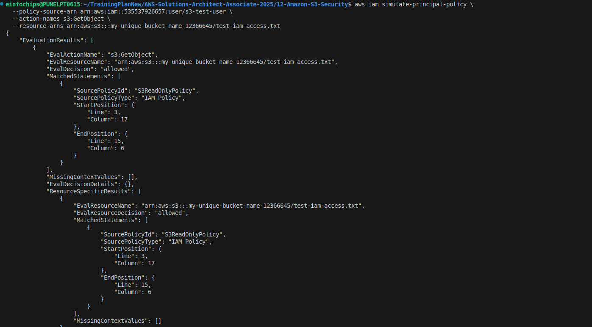
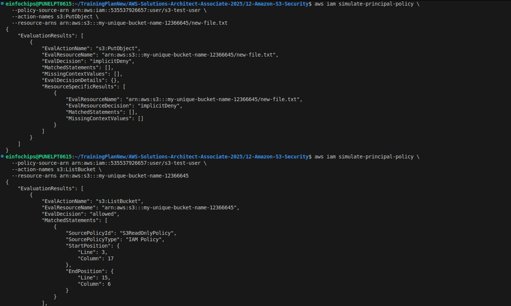
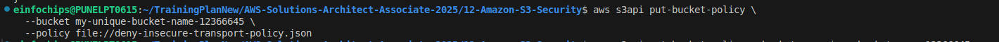
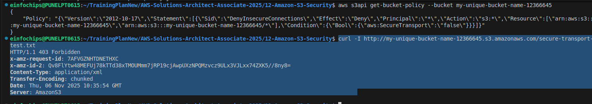
*Caption: S3 bucket policies configuration*

### Practice 3: S3 Encryption Implementation
**Objective**: Implement different encryption methods for S3

**Steps**:
1. **Server-Side Encryption with S3 (SSE-S3)**:
   ```bash
   # Upload with SSE-S3 encryption
   aws s3 cp sensitive-data.txt s3://my-secure-bucket/ \
     --server-side-encryption AES256
   
   # Set default encryption for bucket
   aws s3api put-bucket-encryption \
     --bucket my-secure-bucket \
     --server-side-encryption-configuration '{
       "Rules": [
         {
           "ApplyServerSideEncryptionByDefault": {
             "SSEAlgorithm": "AES256"
           }
         }
       ]
     }'
   ```

2. **Server-Side Encryption with KMS (SSE-KMS)**:
   ```bash
   # Create KMS key
   aws kms create-key \
     --description "S3 encryption key" \
     --key-usage ENCRYPT_DECRYPT
   
   # Create key alias
   aws kms create-alias \
     --alias-name alias/s3-encryption-key \
     --target-key-id key-id-from-above
   
   # Upload with SSE-KMS encryption
   aws s3 cp sensitive-data.txt s3://my-secure-bucket/kms-encrypted/ \
     --server-side-encryption aws:kms \
     --ssekms-key-id alias/s3-encryption-key
   
   # Set KMS as default encryption
   aws s3api put-bucket-encryption \
     --bucket my-secure-bucket \
     --server-side-encryption-configuration '{
       "Rules": [
         {
           "ApplyServerSideEncryptionByDefault": {
             "SSEAlgorithm": "aws:kms",
             "KMSMasterKeyID": "alias/s3-encryption-key"
           }
         }
       ]
     }'
   ```

3. **Server-Side Encryption with Customer Keys (SSE-C)**:
   ```bash
   # Generate customer key (32 bytes)
   openssl rand -base64 32 > customer-key.txt
   CUSTOMER_KEY=$(cat customer-key.txt)
   
   # Upload with SSE-C
   aws s3api put-object \
     --bucket my-secure-bucket \
     --key sse-c-encrypted-file.txt \
     --body sensitive-data.txt \
     --sse-customer-algorithm AES256 \
     --sse-customer-key "$CUSTOMER_KEY"
   
   # Download with SSE-C (requires same key)
   aws s3api get-object \
     --bucket my-secure-bucket \
     --key sse-c-encrypted-file.txt \
     --sse-customer-algorithm AES256 \
     --sse-customer-key "$CUSTOMER_KEY" \
     downloaded-file.txt
   ```

4. **Client-Side Encryption**:
   ```python
   import boto3
   from botocore.client import Config
   
   # Client-side encryption with KMS
   s3_client = boto3.client('s3',
       config=Config(
           region_name='us-east-1',
           s3={
               'addressing_style': 'virtual'
           }
       )
   )
   
   # Upload with client-side encryption
   # (This is a simplified example - use AWS Encryption SDK in production)
   ```
**Results**:
- ✅ SSE-S3 encryption: File encrypted with AES256 ✓
- ✅ Default bucket encryption: SSE-S3 AES256 configured ✓
- ✅ KMS key created: `5c8f3b13-34ad-4142-b4f2-b8fb5fcce823` ✓
- ✅ SSE-KMS encryption: File encrypted with customer KMS key ✓
- ✅ SSE-C encryption: File encrypted with customer-provided key ✓
- ✅ SSE-C download: Successfully retrieved with same customer key ✓
- ✅ Encryption verification: All methods working correctly
**Screenshot Placeholder**:
![S3 Encryption]
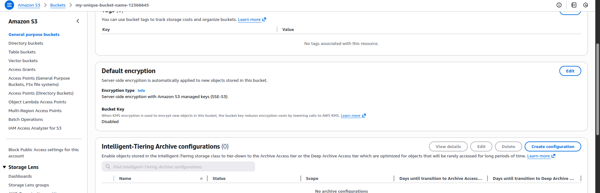
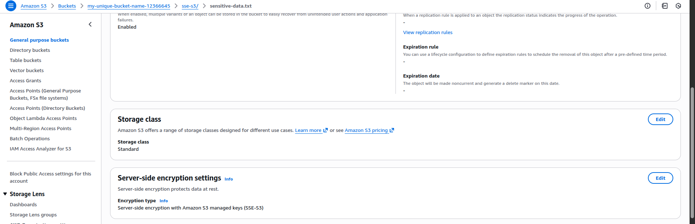
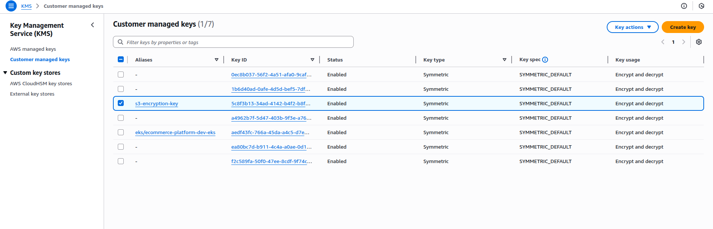
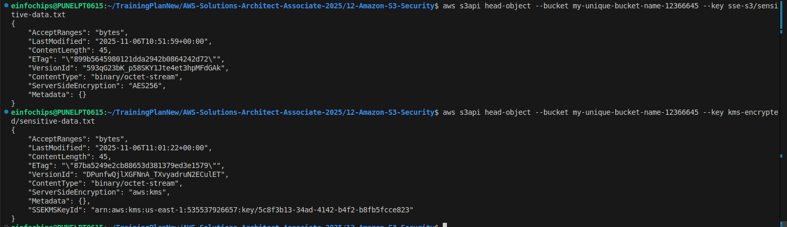
*Caption: S3 encryption methods configuration*

### Practice 4: S3 Block Public Access
**Objective**: Configure public access controls

**Steps**:
1. **Account-Level Block Public Access**:
   ```bash
   # Block all public access at account level
   aws s3control put-public-access-block \
     --account-id 123456789012 \
     --public-access-block-configuration \
     BlockPublicAcls=true,IgnorePublicAcls=true,BlockPublicPolicy=true,RestrictPublicBuckets=true
   
   # Check account-level settings
   aws s3control get-public-access-block \
     --account-id 123456789012
   ```

2. **Bucket-Level Block Public Access**:
   ```bash
   # Block public access for specific bucket
   aws s3api put-public-access-block \
     --bucket my-secure-bucket \
     --public-access-block-configuration \
     BlockPublicAcls=true,IgnorePublicAcls=true,BlockPublicPolicy=true,RestrictPublicBuckets=true
   
   # Check bucket-level settings
   aws s3api get-public-access-block \
     --bucket my-secure-bucket
   ```

3. **Test Public Access Blocking**:
   ```bash
   # Try to make bucket public (should fail)
   aws s3api put-bucket-acl \
     --bucket my-secure-bucket \
     --acl public-read
   
   # Try to apply public bucket policy (should fail)
   aws s3api put-bucket-policy \
     --bucket my-secure-bucket \
     --policy file://public-policy.json
   ```

**Screenshot Placeholder**:

*Caption: S3 Block Public Access configuration*

### Practice 5: S3 Access Logging and Monitoring
**Objective**: Enable comprehensive S3 access monitoring


### Practice 5: S3 Pre-signed URLs and Temporary Access
**Objective**: Generate secure temporary access to S3 objects

**Steps**:
1. **Generate Pre-signed URLs**:
   ```bash
   # Generate pre-signed URL for GET (1 hour expiry)
   aws s3 presign s3://my-unique-bucket-name-12366645/private-file.txt \
     --expires-in 3600
   
   # Generate pre-signed URL for PUT
   aws s3 presign s3://my-unique-bucket-name-12366645/upload-file.txt \
     --expires-in 1800
   ```

2. **Python Script for Pre-signed URLs**:
   ```python
   import boto3
   from botocore.exceptions import ClientError
   
   def create_presigned_url(bucket_name, object_name, expiration=3600):
       s3_client = boto3.client('s3')
       try:
           response = s3_client.generate_presigned_url(
               'get_object',
               Params={'Bucket': bucket_name, 'Key': object_name},
               ExpiresIn=expiration
           )
       except ClientError as e:
           return None
       return response
   
   def create_presigned_post(bucket_name, object_name, expiration=3600):
       s3_client = boto3.client('s3')
       try:
           response = s3_client.generate_presigned_post(
               Bucket=bucket_name,
               Key=object_name,
               ExpiresIn=expiration
           )
       except ClientError as e:
           return None
       return response
   
   # Generate URLs
   download_url = create_presigned_url('my-secure-bucket', 'private-file.txt')
   upload_data = create_presigned_post('my-secure-bucket', 'upload-file.txt')
   
   print(f"Download URL: {download_url}")
   print(f"Upload form data: {upload_data}")
   ```

3. **Test Pre-signed URLs**:
   ```bash
   # Test download with pre-signed URL
   curl -o downloaded-file.txt "https://my-secure-bucket.s3.amazonaws.com/private-file.txt?X-Amz-Algorithm=..."
   
   # Test upload with pre-signed URL
   curl -X PUT -T upload-file.txt "https://my-secure-bucket.s3.amazonaws.com/upload-file.txt?X-Amz-Algorithm=..."
   ```

**Screenshot Placeholder**:

*Caption: S3 pre-signed URLs for temporary access*

## 🔐 Advanced S3 Security Features

### S3 Object Lock
- **WORM compliance**: Write Once Read Many
- **Retention modes**: Governance and compliance
- **Legal holds**: Indefinite retention
- **Bucket configuration**: Enable at creation

### S3 Access Points
- **Simplified access management**: Per-application access
- **Network controls**: VPC-only access
- **Policy enforcement**: Consistent security policies
- **Multi-region access**: Cross-region access points

### S3 Multi-Region Access Points
- **Global endpoints**: Single endpoint for multiple regions
- **Automatic failover**: Route to healthy regions
- **Request routing**: Lowest latency routing
- **Replication integration**: Works with CRR

## 📊 S3 Security Monitoring

### CloudWatch Metrics
- **Request metrics**: GET, PUT, DELETE operations
- **Storage metrics**: Bucket size, object count
- **Error metrics**: 4xx and 5xx errors
- **Data retrieval metrics**: Glacier retrievals

### AWS Config Rules
- **s3-bucket-public-access-prohibited**: Ensure buckets aren't public
- **s3-bucket-ssl-requests-only**: Require HTTPS
- **s3-bucket-server-side-encryption-enabled**: Verify encryption
- **s3-bucket-logging-enabled**: Check access logging

### Security Hub Findings
- **Security standards**: CIS, PCI DSS, AWS Foundational
- **Finding aggregation**: Centralized security findings
- **Remediation guidance**: Step-by-step fixes
- **Integration**: Works with GuardDuty, Inspector

## 🚨 S3 Security Best Practices

### Access Control
1. **Use IAM policies** over bucket policies when possible
2. **Apply principle of least privilege**
3. **Enable MFA Delete** for critical buckets
4. **Use VPC endpoints** for private access
5. **Regularly audit permissions**

### Encryption
1. **Enable default encryption** on all buckets
2. **Use KMS keys** for sensitive data
3. **Rotate encryption keys** regularly
4. **Encrypt data in transit** (HTTPS only)
5. **Consider client-side encryption** for highly sensitive data

### Monitoring
1. **Enable CloudTrail** for API logging
2. **Use server access logs** for detailed access tracking
3. **Set up CloudWatch alarms** for unusual activity
4. **Regular security assessments**
5. **Monitor public access** settings


## 🎯 Next Steps
Move to **Section 13: CloudFront and AWS Global Accelerator** to learn about content delivery and global traffic optimization.

---
