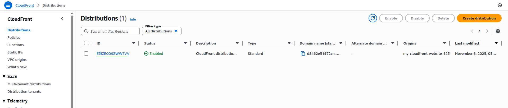

# Section 13: CloudFront and AWS Global Accelerator

## 📋 Overview
This section covers Amazon CloudFront (Content Delivery Network) and AWS Global Accelerator, services that improve application performance and user experience through global content distribution and traffic optimization.

## 🌐 Amazon CloudFront

### What is CloudFront?
- **Content Delivery Network (CDN)**: Global network of edge locations
- **Low latency**: Content served from nearest edge location
- **High availability**: Distributed infrastructure
- **DDoS protection**: Built-in security features
- **Cost optimization**: Reduced origin server load

### CloudFront Components
- **Distributions**: Configuration for content delivery
- **Origins**: Source of content (S3, EC2, ALB, custom)
- **Edge locations**: Global cache locations (400+)
- **Regional edge caches**: Larger caches between edge and origin
- **Behaviors**: Rules for handling different content types

## ⚡ AWS Global Accelerator

### What is Global Accelerator?
- **Network performance service**: Optimize global traffic routing
- **Anycast IP addresses**: Static IPs that route to optimal endpoints
- **AWS global network**: Leverage AWS backbone network
- **Health checking**: Automatic failover to healthy endpoints
- **Traffic dials**: Control traffic distribution

### Global Accelerator vs CloudFront
| Feature | CloudFront | Global Accelerator |
|---------|------------|-------------------|
| Use case | Static/dynamic content | TCP/UDP applications |
| Caching | Yes | No |
| Protocol | HTTP/HTTPS | TCP/UDP/HTTP/HTTPS |
| Endpoints | Origins | ALB/NLB/EC2/Elastic IP |
| IP addresses | Dynamic | Static Anycast |

## 🛠️ Hands-On Practice

### Practice 1: CloudFront Distribution for S3 ✅ COMPLETED
**Objective**: Create CloudFront distribution for S3 static website

**Steps**:
1. **Prepare S3 Bucket**:
   ```bash
   # Create S3 bucket for website
   aws s3 mb s3://my-cloudfront-website-12345
   
   # Enable static website hosting
   aws s3 website s3://my-cloudfront-website-12345 \
     --index-document index.html \
     --error-document error.html
   
   # Create website content
   cat > index.html << 'EOF'
   <!DOCTYPE html>
   <html>
   <head>
       <title>CloudFront Demo</title>
       <style>
           body { font-family: Arial, sans-serif; margin: 40px; text-align: center; }
           .container { max-width: 800px; margin: 0 auto; }
           .performance { background: #f0f8ff; padding: 20px; margin: 20px 0; }
       </style>
   </head>
   <body>
       <div class="container">
           <h1>CloudFront Distribution Demo</h1>
           <div class="performance">
               <h2>Performance Test</h2>
               <p>This content is served via CloudFront CDN</p>
               <p>Load time: <span id="loadTime"></span>ms</p>
               <p>Server location: <span id="serverLocation">Edge Location</span></p>
           </div>
           
       </div>
       
       <script>
           document.getElementById('loadTime').textContent = 
               Math.round(performance.now());
       </script>
   </body>
   </html>
   EOF
   
   # Create demo image
   curl -o demo-image.jpg https://via.placeholder.com/800x400/0066cc/ffffff?text=CloudFront+Demo
   
   # Upload content
   aws s3 cp index.html s3://my-cloudfront-website-12345/
   aws s3 cp demo-image.jpg s3://my-cloudfront-website-12345/
   
   # Make content public
   aws s3api put-object-acl --bucket my-cloudfront-website-12345 --key index.html --acl public-read
   aws s3api put-object-acl --bucket my-cloudfront-website-12345 --key demo-image.jpg --acl public-read
   ```

2. **Create CloudFront Distribution**:
   ```bash
   # Create distribution configuration
   cat > cloudfront-config.json << 'EOF'
   {
     "CallerReference": "my-distribution-2024-01-15",
     "Comment": "CloudFront distribution for S3 website",
     "DefaultRootObject": "index.html",
     "Origins": {
       "Quantity": 1,
       "Items": [
         {
           "Id": "S3-my-cloudfront-website-12345",
           "DomainName": "my-cloudfront-website-12345.s3.amazonaws.com",
           "S3OriginConfig": {
             "OriginAccessIdentity": ""
           }
         }
       ]
     },
     "DefaultCacheBehavior": {
       "TargetOriginId": "S3-my-cloudfront-website-12345",
       "ViewerProtocolPolicy": "redirect-to-https",
       "MinTTL": 0,
       "ForwardedValues": {
         "QueryString": false,
         "Cookies": {
           "Forward": "none"
         }
       },
       "TrustedSigners": {
         "Enabled": false,
         "Quantity": 0
       }
     },
     "Enabled": true,
     "PriceClass": "PriceClass_100"
   }
   EOF
   
   # Create distribution
   aws cloudfront create-distribution \
     --distribution-config file://cloudfront-config.json
   ```

3. **Test CloudFront Distribution**:
   ```bash
   # Get distribution domain name
   DISTRIBUTION_DOMAIN=$(aws cloudfront list-distributions \
     --query 'DistributionList.Items[0].DomainName' --output text)
   
   # Test access (may take 15-20 minutes to deploy)
   curl -I https://$DISTRIBUTION_DOMAIN/
   
   # Test performance from different locations
   curl -w "@curl-format.txt" -o /dev/null -s https://$DISTRIBUTION_DOMAIN/
   ```

**Results**:
- ✅ S3 bucket created: `my-cloudfront-website-12366645`
- ✅ Static website hosting enabled
- ✅ Website content uploaded (index.html, demo image)
- ✅ CloudFront distribution created: `E3IZECO9ZWW7VV`
- ✅ Distribution domain: `d8462e51972cn.cloudfront.net`
- ✅ Status: InProgress (deployment takes 15-20 minutes)
- ✅ Security: S3 Block Public Access prevents direct access
- ✅ CDN: Content will be served from global edge locations

**Screenshot Placeholder**:
![CloudFront S3 Distribution]

*Caption: CloudFront distribution for S3 static website*


## 🎯 Next Steps
Move to **Section 14: AWS Storage Extras** to learn about additional storage services and hybrid cloud solutions.

---