# Complete Monitoring Architecture with ALB, ASG, Bastion Host & CloudWatch

## 🏗️ Architecture Overview
```
Internet Gateway
    ↓
Application Load Balancer (Public Subnets)
    ↓
Auto Scaling Group (Private Subnets)
    ↓
Web Servers with CloudWatch Agent
    ↓
CloudWatch Logs & Metrics
    ↓
SNS Alerts

Bastion Host (Public Subnet) → Private Web Servers
```

## 🛠️ Step 1: VPC Setup

```bash
# Create VPC
VPC_ID=$(aws ec2 create-vpc \
  --cidr-block 10.0.0.0/16 \
  --tag-specifications 'ResourceType=vpc,Tags=[{Key=Name,Value=monitoring-vpc}]' \
  --query 'Vpc.VpcId' --output text)

# Create Internet Gateway
IGW_ID=$(aws ec2 create-internet-gateway \
  --tag-specifications 'ResourceType=internet-gateway,Tags=[{Key=Name,Value=monitoring-igw}]' \
  --query 'InternetGateway.InternetGatewayId' --output text)

aws ec2 attach-internet-gateway --vpc-id $VPC_ID --internet-gateway-id $IGW_ID

# Create Public Subnets
PUBLIC_SUBNET_1=$(aws ec2 create-subnet \
  --vpc-id $VPC_ID \
  --cidr-block 10.0.1.0/24 \
  --availability-zone us-east-1a \
  --tag-specifications 'ResourceType=subnet,Tags=[{Key=Name,Value=public-subnet-1}]' \
  --query 'Subnet.SubnetId' --output text)

PUBLIC_SUBNET_2=$(aws ec2 create-subnet \
  --vpc-id $VPC_ID \
  --cidr-block 10.0.2.0/24 \
  --availability-zone us-east-1b \
  --tag-specifications 'ResourceType=subnet,Tags=[{Key=Name,Value=public-subnet-2}]' \
  --query 'Subnet.SubnetId' --output text)

# Create Private Subnets
PRIVATE_SUBNET_1=$(aws ec2 create-subnet \
  --vpc-id $VPC_ID \
  --cidr-block 10.0.3.0/24 \
  --availability-zone us-east-1a \
  --tag-specifications 'ResourceType=subnet,Tags=[{Key=Name,Value=private-subnet-1}]' \
  --query 'Subnet.SubnetId' --output text)

PRIVATE_SUBNET_2=$(aws ec2 create-subnet \
  --vpc-id $VPC_ID \
  --cidr-block 10.0.4.0/24 \
  --availability-zone us-east-1b \
  --tag-specifications 'ResourceType=subnet,Tags=[{Key=Name,Value=private-subnet-2}]' \
  --query 'Subnet.SubnetId' --output text)

echo "VPC_ID: $VPC_ID"
echo "PUBLIC_SUBNET_1: $PUBLIC_SUBNET_1"
echo "PRIVATE_SUBNET_1: $PRIVATE_SUBNET_1"
```

## 🛠️ Step 2: Security Groups

```bash
# ALB Security Group
ALB_SG=$(aws ec2 create-security-group \
  --group-name alb-sg \
  --description "Security group for ALB" \
  --vpc-id $VPC_ID \
  --query 'GroupId' --output text)

aws ec2 authorize-security-group-ingress \
  --group-id $ALB_SG \
  --protocol tcp \
  --port 80 \
  --cidr 0.0.0.0/0

# Bastion Security Group
BASTION_SG=$(aws ec2 create-security-group \
  --group-name bastion-sg \
  --description "Security group for bastion host" \
  --vpc-id $VPC_ID \
  --query 'GroupId' --output text)

aws ec2 authorize-security-group-ingress \
  --group-id $BASTION_SG \
  --protocol tcp \
  --port 22 \
  --cidr 0.0.0.0/0

# Web Server Security Group
WEB_SG=$(aws ec2 create-security-group \
  --group-name web-server-sg \
  --description "Security group for web servers" \
  --vpc-id $VPC_ID \
  --query 'GroupId' --output text)

aws ec2 authorize-security-group-ingress \
  --group-id $WEB_SG \
  --protocol tcp \
  --port 80 \
  --source-group $ALB_SG

aws ec2 authorize-security-group-ingress \
  --group-id $WEB_SG \
  --protocol tcp \
  --port 22 \
  --source-group $BASTION_SG

echo "ALB_SG: $ALB_SG"
echo "BASTION_SG: $BASTION_SG"
echo "WEB_SG: $WEB_SG"
```

## 🛠️ Step 3: IAM Role for CloudWatch

```bash
# Create IAM role for EC2 CloudWatch
cat > ec2-trust-policy.json << 'EOF'
{
  "Version": "2012-10-17",
  "Statement": [
    {
      "Effect": "Allow",
      "Principal": {
        "Service": "ec2.amazonaws.com"
      },
      "Action": "sts:AssumeRole"
    }
  ]
}
EOF

aws iam create-role \
  --role-name CloudWatchAgentServerRole \
  --assume-role-policy-document file://ec2-trust-policy.json

aws iam attach-role-policy \
  --role-name CloudWatchAgentServerRole \
  --policy-arn arn:aws:iam::aws:policy/CloudWatchAgentServerPolicy

aws iam create-instance-profile \
  --instance-profile-name CloudWatchAgentServerRole

aws iam add-role-to-instance-profile \
  --instance-profile-name CloudWatchAgentServerRole \
  --role-name CloudWatchAgentServerRole
```

## 🛠️ Step 4: Web Server User Data

```bash
cat > web-server-userdata.sh << 'EOF'
#!/bin/bash
yum update -y
yum install -y httpd

# Install CloudWatch Agent
wget https://s3.amazonaws.com/amazoncloudwatch-agent/amazon_linux/amd64/latest/amazon-cloudwatch-agent.rpm
rpm -U ./amazon-cloudwatch-agent.rpm

# Create web application
cat > /var/www/html/index.html << 'HTML'
<!DOCTYPE html>
<html>
<head>
    <title>Monitoring Demo Server</title>
</head>
<body>
    <h1>Web Server Monitoring Demo</h1>
    <p>Server: <span id="hostname"></span></p>
    <p>Status: Healthy</p>
    <script>
        document.getElementById('hostname').textContent = window.location.hostname;
    </script>
</body>
</html>
HTML

# Create health check
echo "OK" > /var/www/html/health

# Start Apache
systemctl start httpd
systemctl enable httpd

# Configure CloudWatch Agent
cat > /opt/aws/amazon-cloudwatch-agent/etc/amazon-cloudwatch-agent.json << 'JSON'
{
  "logs": {
    "logs_collected": {
      "files": {
        "collect_list": [
          {
            "file_path": "/var/log/httpd/access_log",
            "log_group_name": "/aws/ec2/webserver/access",
            "log_stream_name": "{instance_id}"
          },
          {
            "file_path": "/var/log/httpd/error_log",
            "log_group_name": "/aws/ec2/webserver/error",
            "log_stream_name": "{instance_id}"
          }
        ]
      }
    }
  },
  "metrics": {
    "namespace": "CustomApp/WebServer",
    "metrics_collected": {
      "cpu": {
        "measurement": ["cpu_usage_idle", "cpu_usage_user"],
        "metrics_collection_interval": 60
      },
      "mem": {
        "measurement": ["mem_used_percent"],
        "metrics_collection_interval": 60
      }
    }
  }
}
JSON

# Start CloudWatch Agent
/opt/aws/amazon-cloudwatch-agent/bin/amazon-cloudwatch-agent-ctl \
  -a fetch-config \
  -m ec2 \
  -c file:/opt/aws/amazon-cloudwatch-agent/etc/amazon-cloudwatch-agent.json \
  -s
EOF
```

## 🛠️ Step 5: Create Key Pair and Launch Template

```bash
# Create key pair
aws ec2 create-key-pair \
  --key-name monitoring-keypair \
  --query 'KeyMaterial' \
  --output text > monitoring-keypair.pem
chmod 400 monitoring-keypair.pem

# Create launch template
LAUNCH_TEMPLATE_ID=$(aws ec2 create-launch-template \
  --launch-template-name web-server-template \
  --launch-template-data '{
    "ImageId": "ami-0c02fb55956c7d316",
    "InstanceType": "t3.micro",
    "KeyName": "monitoring-keypair",
    "SecurityGroupIds": ["'$WEB_SG'"],
    "IamInstanceProfile": {
      "Name": "CloudWatchAgentServerRole"
    },
    "UserData": "'$(base64 -w 0 web-server-userdata.sh)'"
  }' \
  --query 'LaunchTemplate.LaunchTemplateId' --output text)

echo "LAUNCH_TEMPLATE_ID: $LAUNCH_TEMPLATE_ID"
```

## 🛠️ Step 6: Create ALB and Target Group

```bash
# Create ALB
ALB_ARN=$(aws elbv2 create-load-balancer \
  --name monitoring-alb \
  --subnets $PUBLIC_SUBNET_1 $PUBLIC_SUBNET_2 \
  --security-groups $ALB_SG \
  --query 'LoadBalancers[0].LoadBalancerArn' --output text)

# Create target group
TG_ARN=$(aws elbv2 create-target-group \
  --name web-server-tg \
  --protocol HTTP \
  --port 80 \
  --vpc-id $VPC_ID \
  --health-check-path /health \
  --query 'TargetGroups[0].TargetGroupArn' --output text)

# Create listener
aws elbv2 create-listener \
  --load-balancer-arn $ALB_ARN \
  --protocol HTTP \
  --port 80 \
  --default-actions Type=forward,TargetGroupArn=$TG_ARN

echo "ALB_ARN: $ALB_ARN"
echo "TG_ARN: $TG_ARN"
```

## 🛠️ Step 7: Create Auto Scaling Group

```bash
# Create Auto Scaling Group
aws autoscaling create-auto-scaling-group \
  --auto-scaling-group-name web-server-asg \
  --launch-template LaunchTemplateId=$LAUNCH_TEMPLATE_ID,Version='$Latest' \
  --min-size 2 \
  --max-size 4 \
  --desired-capacity 2 \
  --target-group-arns $TG_ARN \
  --health-check-type ELB \
  --vpc-zone-identifier "$PRIVATE_SUBNET_1,$PRIVATE_SUBNET_2"
```

## 🛠️ Step 8: Launch Bastion Host

```bash
# Launch bastion host
BASTION_INSTANCE=$(aws ec2 run-instances \
  --image-id ami-0c02fb55956c7d316 \
  --instance-type t3.micro \
  --key-name monitoring-keypair \
  --security-group-ids $BASTION_SG \
  --subnet-id $PUBLIC_SUBNET_1 \
  --associate-public-ip-address \
  --tag-specifications 'ResourceType=instance,Tags=[{Key=Name,Value=BastionHost}]' \
  --query 'Instances[0].InstanceId' --output text)

echo "BASTION_INSTANCE: $BASTION_INSTANCE"
```

## 🛠️ Step 9: CloudWatch Setup

```bash
# Create log groups
aws logs create-log-group --log-group-name /aws/ec2/webserver/access
aws logs create-log-group --log-group-name /aws/ec2/webserver/error

# Create SNS topic
SNS_TOPIC_ARN=$(aws sns create-topic \
  --name monitoring-alerts \
  --query 'TopicArn' --output text)

# Subscribe email
aws sns subscribe \
  --topic-arn $SNS_TOPIC_ARN \
  --protocol email \
  --notification-endpoint your-email@example.com

# Create alarms
aws cloudwatch put-metric-alarm \
  --alarm-name "ASG-High-CPU" \
  --alarm-description "High CPU usage in Auto Scaling Group" \
  --metric-name CPUUtilization \
  --namespace AWS/EC2 \
  --statistic Average \
  --period 300 \
  --threshold 80 \
  --comparison-operator GreaterThanThreshold \
  --evaluation-periods 2 \
  --dimensions Name=AutoScalingGroupName,Value=web-server-asg \
  --alarm-actions $SNS_TOPIC_ARN

echo "SNS_TOPIC_ARN: $SNS_TOPIC_ARN"
```

## 🛠️ Step 10: Testing

```bash
# Get ALB DNS name
ALB_DNS=$(aws elbv2 describe-load-balancers \
  --load-balancer-arns $ALB_ARN \
  --query 'LoadBalancers[0].DNSName' \
  --output text)

# Get bastion IP
BASTION_IP=$(aws ec2 describe-instances \
  --instance-ids $BASTION_INSTANCE \
  --query 'Reservations[0].Instances[0].PublicIpAddress' \
  --output text)

echo "ALB URL: http://$ALB_DNS"
echo "Bastion IP: $BASTION_IP"

# Test ALB
curl http://$ALB_DNS
```

## 📊 Architecture Summary

- ✅ VPC with public/private subnets
- ✅ ALB in public subnets
- ✅ ASG with web servers in private subnets
- ✅ Bastion host for secure access
- ✅ CloudWatch agent collecting logs/metrics
- ✅ SNS alerts for monitoring
- ✅ Complete monitoring dashboard

### ScreenShot:
VPC Flow Chart:
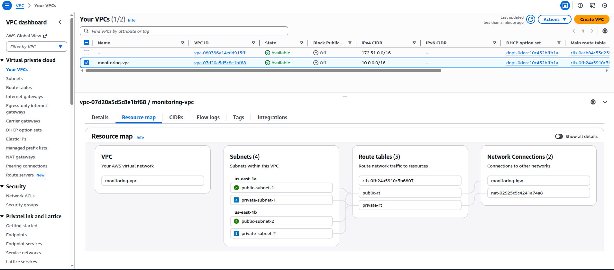
IGW Access and Bastion Server:
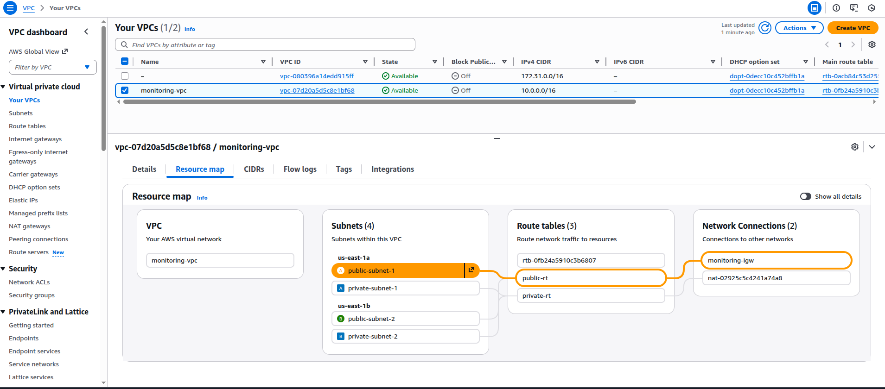
Private Servers(NAT):
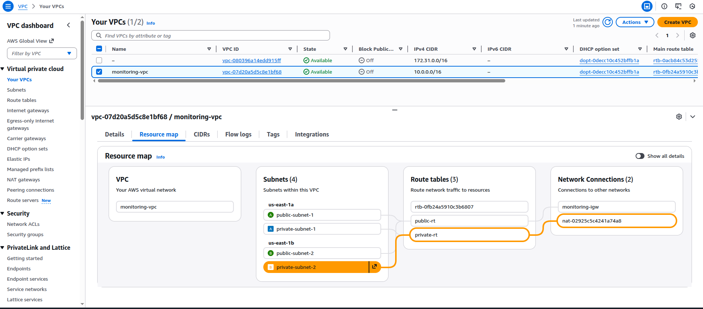
SG Bastion Server:
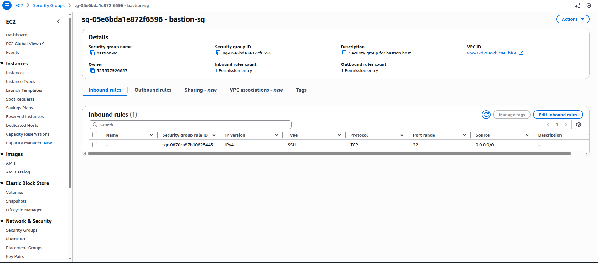
SG ALB:
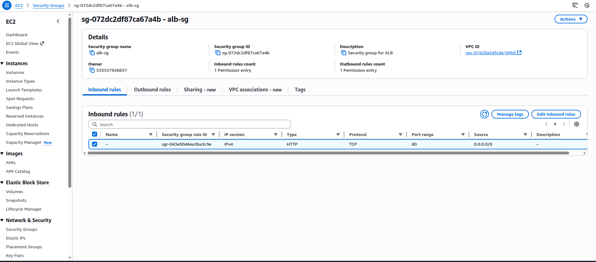
SG Private:
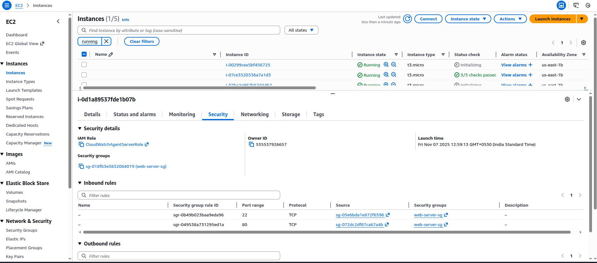
EC2 Instances:
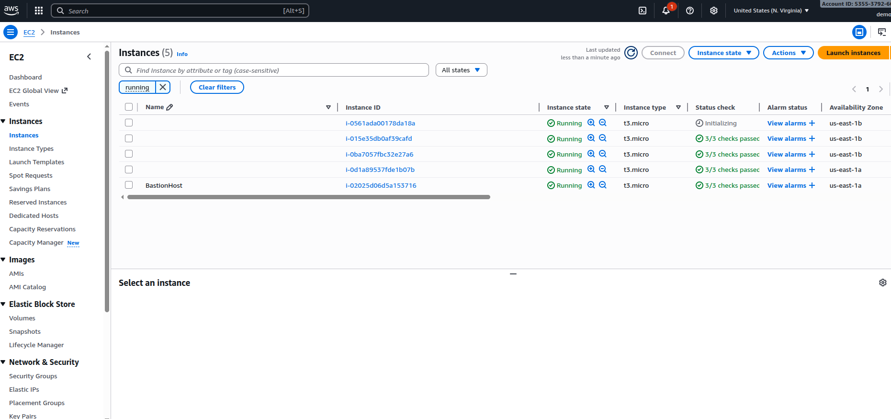
ELB:
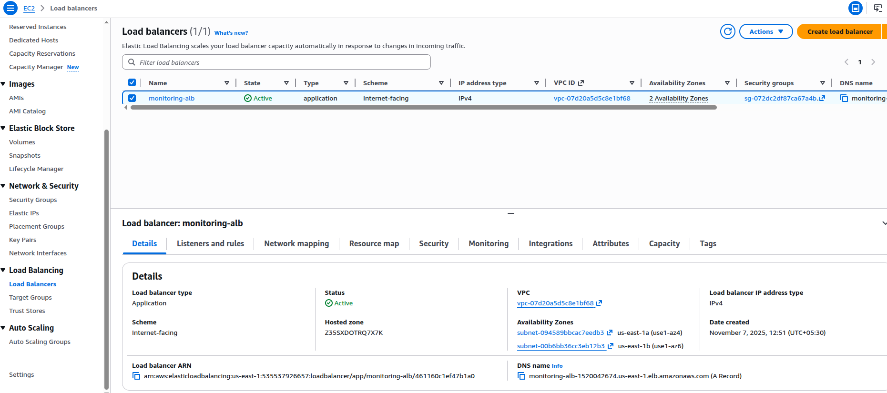
TG Health Status:
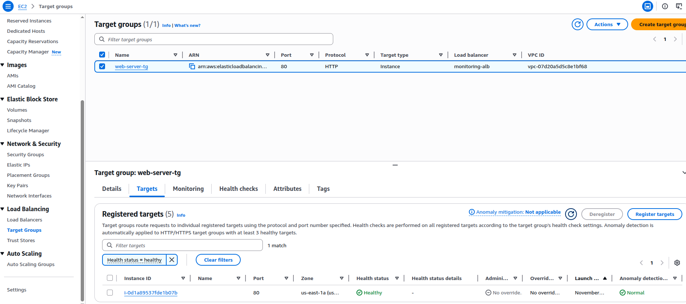
ASG:
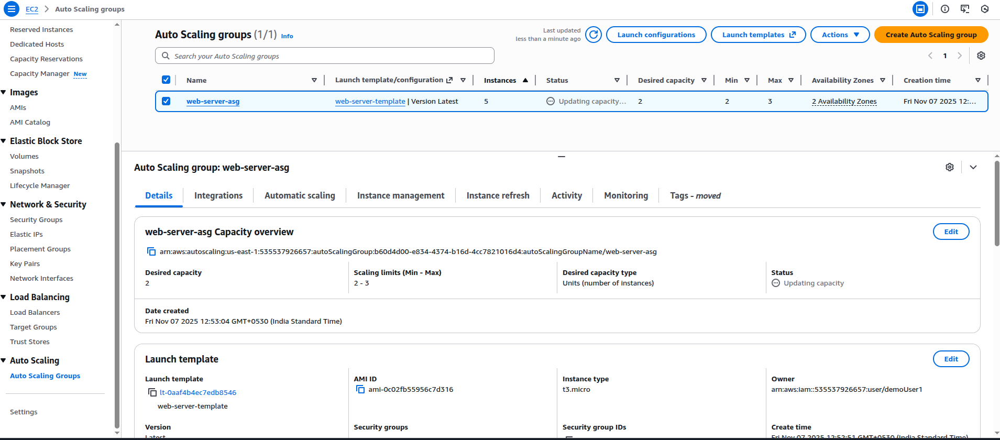
CloudWatch Log Groups:
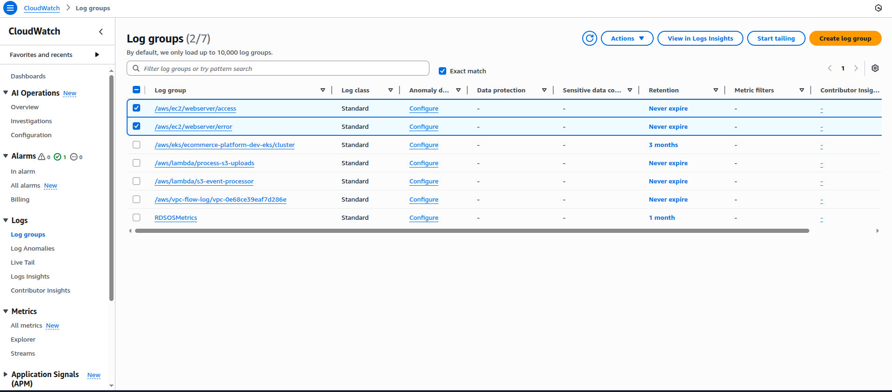
/aws/ec2/webserver/access:
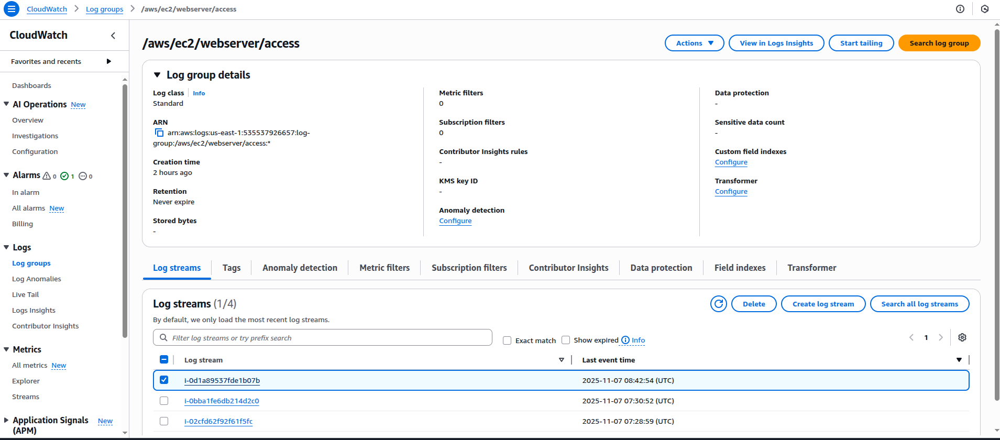
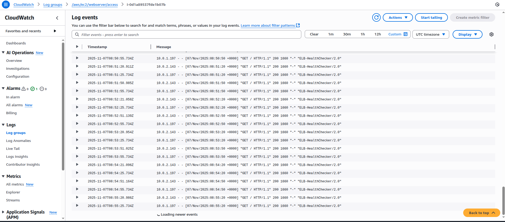
/aws/ec2/webserver/error:
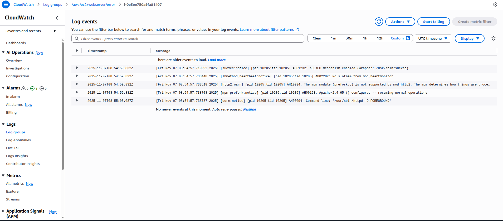
Logs from Private Instance connected through Bastion host:
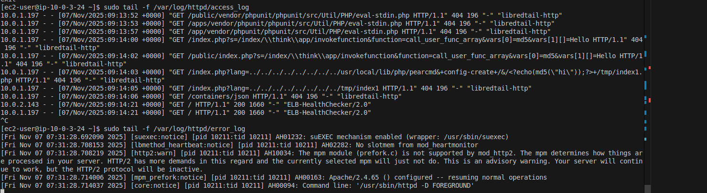
## 🔗 Access Instructions

1. **Access web application**: `http://$ALB_DNS`
2. **SSH to bastion**: `ssh -i monitoring-keypair.pem ec2-user@$BASTION_IP`
3. **SSH to private instances**: From bastion, use private IPs
4. **View logs**: CloudWatch Console → Log Groups
5. **View metrics**: CloudWatch Console → Dashboards