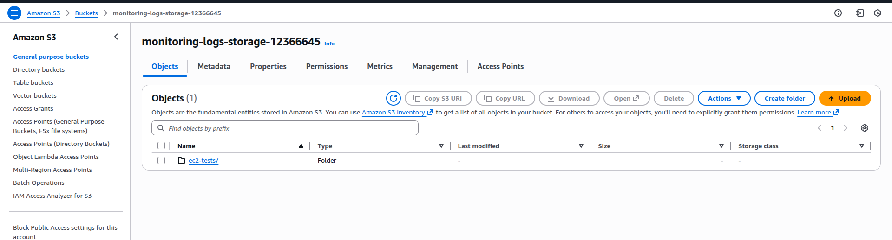
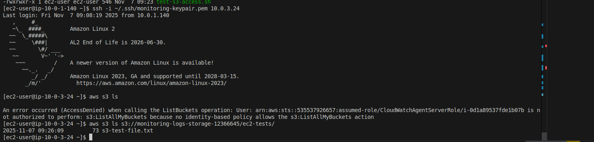
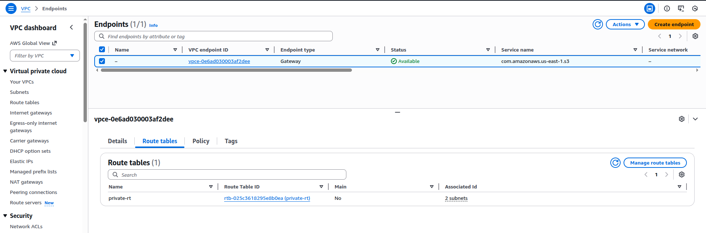
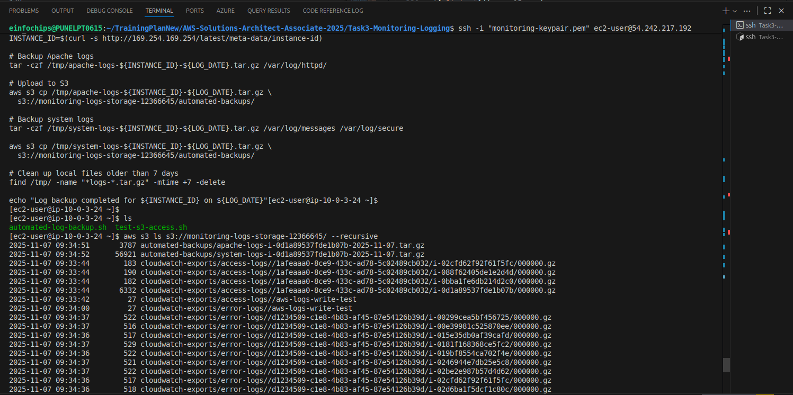
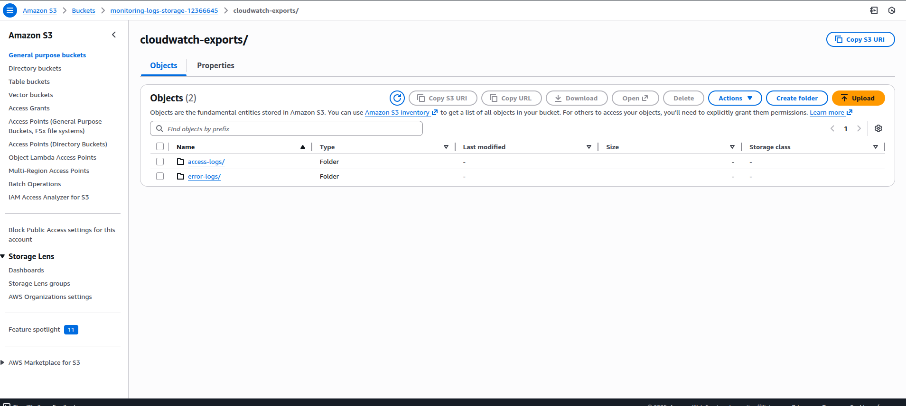

# S3 Integration with EC2 and CloudWatch Logs

## 🎯 Objective
- Test S3 access from EC2 instances (via NAT Gateway)
- Configure CloudWatch logs to export to S3 bucket
- Set up VPC endpoint for S3 (optional optimization)

## 🛠️ Step 1: Create S3 Bucket for Logs

```bash
# Create S3 bucket for storing logs
aws s3 mb s3://monitoring-logs-storage-12366645 --region us-east-1

# Create bucket policy for CloudWatch Logs
cat > s3-logs-bucket-policy.json << 'EOF'
{
  "Version": "2012-10-17",
  "Statement": [
    {
      "Effect": "Allow",
      "Principal": {
        "Service": "logs.amazonaws.com"
      },
      "Action": "s3:GetBucketAcl",
      "Resource": "arn:aws:s3:::monitoring-logs-storage-12366645"
    },
    {
      "Effect": "Allow",
      "Principal": {
        "Service": "logs.amazonaws.com"
      },
      "Action": "s3:PutObject",
      "Resource": "arn:aws:s3:::monitoring-logs-storage-12366645/*",
      "Condition": {
        "StringEquals": {
          "s3:x-amz-acl": "bucket-owner-full-control"
        }
      }
    }
  ]
}
EOF

aws s3api put-bucket-policy \
  --bucket monitoring-logs-storage-12366645 \
  --policy file://s3-logs-bucket-policy.json
```

## 🛠️ Step 2: Test S3 Access from EC2 (via NAT)

```bash
# Create test script for EC2 instances
cat > test-s3-access.sh << 'EOF'
#!/bin/bash
echo "Testing S3 access from EC2 instance..."

# Create test file
echo "Test data from $(hostname) at $(date)" > /tmp/s3-test-file.txt

# Upload to S3 (this will use NAT Gateway for internet access)
aws s3 cp /tmp/s3-test-file.txt s3://monitoring-logs-storage-12366645/ec2-tests/

# List S3 bucket contents
aws s3 ls s3://monitoring-logs-storage-12366645/ec2-tests/

# Download file back
aws s3 cp s3://monitoring-logs-storage-12366645/ec2-tests/s3-test-file.txt /tmp/downloaded-file.txt

echo "S3 access test completed successfully!"
EOF

# Copy script to bastion for deployment to private instances
scp -i monitoring-keypair.pem test-s3-access.sh ec2-user@54.242.217.192:~/
```

## 🛠️ Step 3: Update IAM Role for S3 Access

```bash
# Create S3 access policy for EC2 instances
cat > s3-access-policy.json << 'EOF'
{
  "Version": "2012-10-17",
  "Statement": [
    {
      "Effect": "Allow",
      "Action": [
        "s3:GetObject",
        "s3:PutObject",
        "s3:DeleteObject",
        "s3:ListBucket"
      ],
      "Resource": [
        "arn:aws:s3:::monitoring-logs-storage-12366645",
        "arn:aws:s3:::monitoring-logs-storage-12366645/*"
      ]
    }
  ]
}
EOF

# Create and attach policy to existing role
aws iam create-policy \
  --policy-name S3AccessPolicy \
  --policy-document file://s3-access-policy.json

aws iam attach-role-policy \
  --role-name CloudWatchAgentServerRole \
  --policy-arn arn:aws:iam::535537926657:policy/S3AccessPolicy
```

## 🛠️ Step 4: Configure CloudWatch Logs Export to S3

```bash
# Create export task for access logs
aws logs create-export-task \
  --log-group-name "/aws/ec2/webserver/access" \
  --from 1699200000000 \
  --to $(date +%s)000 \
  --destination "monitoring-logs-storage-12366645" \
  --destination-prefix "cloudwatch-exports/access-logs/"

# Create export task for error logs
aws logs create-export-task \
  --log-group-name "/aws/ec2/webserver/error" \
  --from 1699200000000 \
  --to $(date +%s)000 \
  --destination "monitoring-logs-storage-12366645" \
  --destination-prefix "cloudwatch-exports/error-logs/"
```

## 🛠️ Step 5: Create VPC Endpoint for S3 (Optional)

```bash
# Create VPC endpoint for S3 (improves performance and reduces NAT costs)
VPC_ENDPOINT=$(aws ec2 create-vpc-endpoint \
  --vpc-id vpc-07d20a5d5c8e1bf68 \
  --service-name com.amazonaws.us-east-1.s3 \
  --vpc-endpoint-type Gateway \
  --route-table-ids rtb-025c3618295e8b0ea \
  --query 'VpcEndpoint.VpcEndpointId' --output text)

echo "VPC Endpoint created: $VPC_ENDPOINT"
```

## 🛠️ Step 6: Test S3 Integration

```bash
# Test from bastion host first
ssh -i monitoring-keypair.pem ec2-user@54.242.217.192 << 'EOF'
# Test S3 access from bastion
echo "Testing from bastion host..." > /tmp/bastion-test.txt
aws s3 cp /tmp/bastion-test.txt s3://monitoring-logs-storage-12366645/bastion-tests/
aws s3 ls s3://monitoring-logs-storage-12366645/bastion-tests/
EOF

# Test from private instance via bastion
ssh -i monitoring-keypair.pem ec2-user@54.242.217.192 << 'EOF'
# Copy test script to private instance
scp test-s3-access.sh ec2-user@10.0.3.24:~/
ssh ec2-user@10.0.3.24 'chmod +x test-s3-access.sh && ./test-s3-access.sh'
EOF
```

## 🛠️ Step 7: Automated Log Backup Script

```bash
# Create automated backup script for EC2 instances
cat > automated-log-backup.sh << 'EOF'
#!/bin/bash
# Automated log backup to S3

LOG_DATE=$(date +%Y-%m-%d)
INSTANCE_ID=$(curl -s http://169.254.169.254/latest/meta-data/instance-id)

# Backup Apache logs
tar -czf /tmp/apache-logs-${INSTANCE_ID}-${LOG_DATE}.tar.gz /var/log/httpd/

# Upload to S3
aws s3 cp /tmp/apache-logs-${INSTANCE_ID}-${LOG_DATE}.tar.gz \
  s3://monitoring-logs-storage-12366645/automated-backups/

# Backup system logs
tar -czf /tmp/system-logs-${INSTANCE_ID}-${LOG_DATE}.tar.gz /var/log/messages /var/log/secure

aws s3 cp /tmp/system-logs-${INSTANCE_ID}-${LOG_DATE}.tar.gz \
  s3://monitoring-logs-storage-12366645/automated-backups/

# Clean up local files older than 7 days
find /tmp/ -name "*logs-*.tar.gz" -mtime +7 -delete

echo "Log backup completed for ${INSTANCE_ID} on ${LOG_DATE}"
EOF

# Set up cron job for daily backup (deploy via user data or manually)
echo "0 2 * * * /home/ec2-user/automated-log-backup.sh >> /var/log/backup.log 2>&1" | crontab -
```

## 🛠️ Step 8: Verification Commands

```bash
# Check S3 bucket contents
aws s3 ls s3://monitoring-logs-storage-12366645/ --recursive

# Check CloudWatch export tasks
aws logs describe-export-tasks

# Check VPC endpoint
aws ec2 describe-vpc-endpoints --vpc-endpoint-ids $VPC_ENDPOINT

# Monitor S3 access from CloudTrail
aws logs filter-log-events \
  --log-group-name CloudTrail/S3DataEvents \
  --start-time $(date -d '1 hour ago' +%s)000 \
  --filter-pattern "{ $.eventSource = s3.amazonaws.com }"
```

## 📊 Expected Results

- ✅ S3 bucket created for log storage
- ✅ EC2 instances can access S3 via NAT Gateway
- ✅ CloudWatch logs exported to S3
- ✅ VPC endpoint reduces NAT Gateway usage
- ✅ Automated log backup system
- ✅ Cost optimization through VPC endpoint

### ScreenShot:
S3 Bucket Creted:

S3 Buckect Access from Private server Through NAT:

VPC ENDPOINT to access S3 to reduces NAT Gateway:

Exported Logs to S3 Bucket:



## 🔗 S3 Integration Benefits

1. **Cost Savings**: VPC endpoint reduces NAT Gateway data transfer costs
2. **Log Archival**: Long-term storage of logs in S3
3. **Compliance**: Centralized log storage for auditing
4. **Analytics**: Logs in S3 can be analyzed with Athena/EMR
5. **Backup**: Automated backup of critical logs