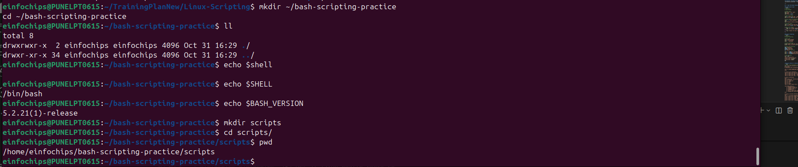
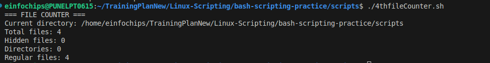
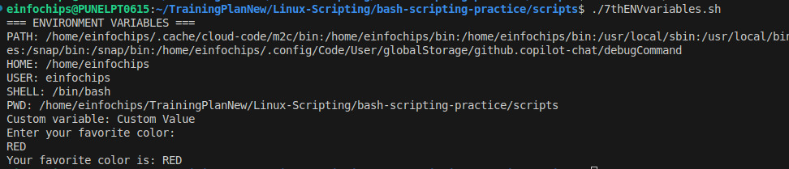
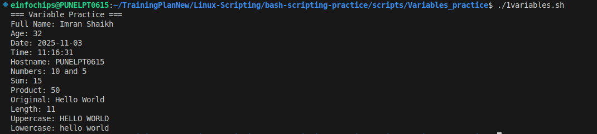
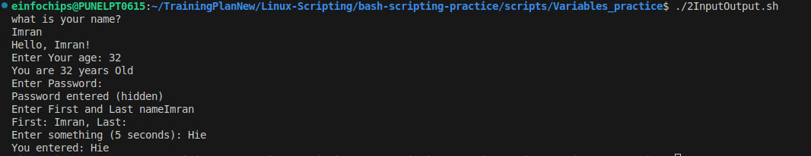
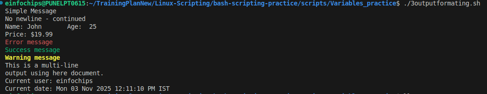
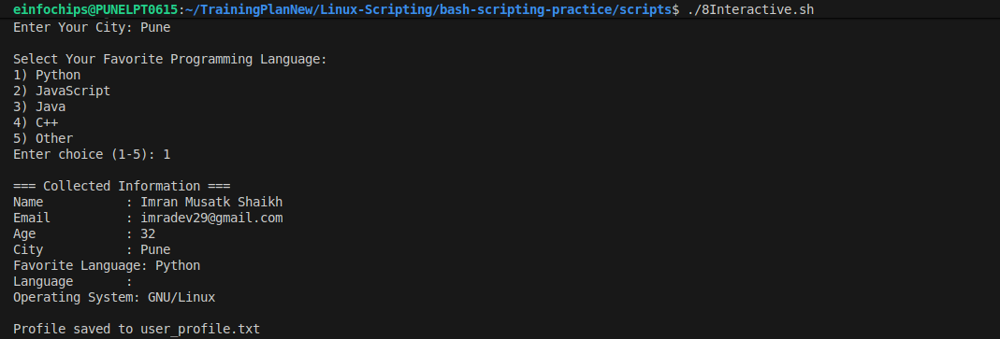
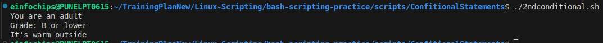
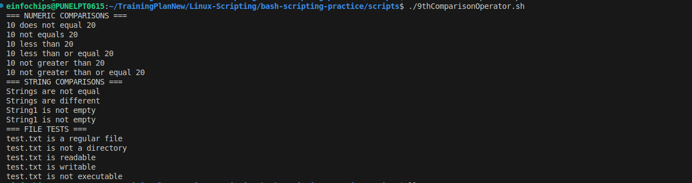

# Complete Bash Scripting Guide - Basic to Advanced

## Table of Contents
1. [Introduction to Bash Scripting](#introduction)
2. [Basic Script Structure](#basic-structure)
3. [Variables and Data Types](#variables)
4. [Input and Output](#input-output)
5. [Conditional Statements](#conditionals)
6. [Loops](#loops)
7. [Functions](#functions)
8. [Arrays](#arrays)
9. [String Manipulation](#strings)
10. [File Operations](#file-operations)
11. [Advanced Scripting](#advanced)
12. [Error Handling](#error-handling)
13. [Best Practices](#best-practices)
14. [Real-World Projects](#projects)

---

## 1. Introduction to Bash Scripting {#introduction}

### What is Bash Scripting?
Bash (Bourne Again Shell) scripting is writing commands in a file to automate tasks in Linux/Unix systems.

### Why Learn Bash Scripting?
- **Automation**: Automate repetitive tasks
- **System Administration**: Manage servers and systems
- **DevOps**: CI/CD pipelines, deployments
- **Data Processing**: Process files and logs
- **Task Scheduling**: Cron jobs and scheduled tasks

### Basic Commands You Need to Know
```bash
# File operations
ls          # List files
cd          # Change directory
pwd         # Print working directory
mkdir       # Create directory
touch       # Create empty file
cp          # Copy files
mv          # Move/rename files
rm          # Remove files
chmod       # Change permissions

# Text processing
cat         # Display file content
grep        # Search text patterns
sed         # Stream editor
awk         # Text processing tool
sort        # Sort lines
uniq        # Remove duplicates
wc          # Word count
```

**Practice Session 1: Environment Setup**
```bash
# Create practice directory
mkdir ~/bash-scripting-practice
cd ~/bash-scripting-practice

# Check your shell
echo $SHELL
echo $BASH_VERSION

# Create your first script directory
mkdir scripts
cd scripts
```
**Screenshot: Environment setup and directory creation**


---

## 2. Basic Script Structure {#basic-structure}

### Creating Your First Script
```bash
#!/bin/bash
# This is a comment
# Script: hello.sh
# Purpose: Display a greeting message

echo "Hello, World!"
echo "Welcome to Bash Scripting!"
```

### Script Components Explained
- **Shebang (`#!/bin/bash`)**: Tells system which interpreter to use
- **Comments (`#`)**: Documentation and notes
- **Commands**: Actual instructions to execute

### Making Scripts Executable
```bash
# Create the script
cat > hello.sh << 'EOF'
#!/bin/bash
echo "Hello, World!"
echo "Today is $(date)"
echo "Current user: $(whoami)"
EOF

# Make it executable
chmod +x hello.sh

# Run the script
./hello.sh
```

**Practice Session 2: First Scripts**
```bash
# Script 1: System Information
cat > system_info.sh << 'EOF'
#!/bin/bash
# System Information Script

echo "=== SYSTEM INFORMATION ==="
echo "Hostname: $(hostname)"
echo "Operating System: $(uname -o)"
echo "Kernel Version: $(uname -r)"
echo "Current User: $(whoami)"
echo "Current Directory: $(pwd)"
echo "Date and Time: $(date)"
echo "Uptime: $(uptime -p)"
EOF

chmod +x system_info.sh
./system_info.sh
```

```bash
# Script 2: File Counter
cat > file_counter.sh << 'EOF'
#!/bin/bash
# Count files in current directory

echo "=== FILE COUNTER ==="
echo "Current directory: $(pwd)"
echo "Total files: $(ls -1 | wc -l)"
echo "Hidden files: $(ls -1a | grep '^\\.' | wc -l)"
echo "Directories: $(ls -1 -d */ 2>/dev/null | wc -l)"
echo "Regular files: $(ls -1 -p | grep -v / | wc -l)"
EOF

chmod +x file_counter.sh
./file_counter.sh
```
**Screenshot: First scripts execution and output**


---

## 3. Variables and Data Types {#variables}

### Variable Declaration and Usage
```bash
#!/bin/bash
# Variable examples

# String variables
name="John Doe"
city="New York"
message="Welcome to $city"

# Numeric variables
age=25
year=2024
count=100

# System variables
current_user=$USER
home_dir=$HOME
current_path=$PWD

echo "Name: $name"
echo "Age: $age"
echo "Message: $message"
echo "User: $current_user"
echo "Home: $home_dir"
```


### Variable Types and Rules
```bash
#!/bin/bash
# Variable rules and types

# Valid variable names
user_name="alice"
USER_ID=1001
file2="document.txt"

# Invalid variable names (commented out)
# 2file="invalid"     # Cannot start with number
# user-name="invalid" # Cannot contain hyphens
# user name="invalid" # Cannot contain spaces

# Special variables
echo "Script name: $0"
echo "First argument: $1"
echo "All arguments: $@"
echo "Number of arguments: $#"
echo "Process ID: $$"
echo "Exit status of last command: $?"
```

### Environment Variables
```bash
#!/bin/bash
# Working with environment variables

echo "=== ENVIRONMENT VARIABLES ==="
echo "PATH: $PATH"
echo "HOME: $HOME"
echo "USER: $USER"
echo "SHELL: $SHELL"
echo "PWD: $PWD"

# Setting custom environment variables
export MY_VAR="Custom Value"
echo "Custom variable: $MY_VAR"

# Reading environment variables
echo "Enter your favorite color:"
read favorite_color
export FAVORITE_COLOR=$favorite_color
echo "Your favorite color is: $FAVORITE_COLOR"
```


**Practice Session 3: Variables**
```bash
# Script: Variable Practice
cat > variables_practice.sh << 'EOF'
#!/bin/bash
# Variables Practice Script

echo "=== VARIABLES PRACTICE ==="

# Personal information
first_name="John"
last_name="Smith"
full_name="$first_name $last_name"
age=30

echo "Full Name: $full_name"
echo "Age: $age"

# System information
current_date=$(date +%Y-%m-%d)
current_time=$(date +%H:%M:%S)
hostname=$(hostname)

echo "Date: $current_date"
echo "Time: $current_time"
echo "Hostname: $hostname"

# Calculations
num1=10
num2=5
sum=$((num1 + num2))
product=$((num1 * num2))

echo "Numbers: $num1 and $num2"
echo "Sum: $sum"
echo "Product: $product"

# String operations
text="Hello World"
echo "Original: $text"
echo "Length: ${#text}"
echo "Uppercase: ${text^^}"
echo "Lowercase: ${text,,}"
EOF

chmod +x variables_practice.sh
./variables_practice.sh
```
**Screenshot: Variables practice output**


---

## 4. Input and Output {#input-output}

### Reading User Input
```bash
#!/bin/bash
# Input methods

# Simple input
echo "What's your name?"
read name
echo "Hello, $name!"

# Input with prompt
read -p "Enter your age: " age
echo "You are $age years old"

# Silent input (for passwords)
read -s -p "Enter password: " password
echo
echo "Password entered (hidden)"

# Multiple inputs
read -p "Enter first and last name: " first last
echo "First: $first, Last: $last"

# Input with timeout
if read -t 5 -p "Enter something (5 seconds): " input; then
    echo "You entered: $input"
else
    echo "Timeout! No input received"
fi
```


### Output Formatting
```bash
#!/bin/bash
# Output formatting

# Basic echo
echo "Simple message"
echo -n "No newline"
echo " - continued"

# Printf formatting
printf "Name: %-10s Age: %3d\n" "John" 25
printf "Price: $%.2f\n" 19.99

# Colors and formatting
RED='\033[0;31m'
GREEN='\033[0;32m'
YELLOW='\033[1;33m'
NC='\033[0m' # No Color

echo -e "${RED}Error message${NC}"
echo -e "${GREEN}Success message${NC}"
echo -e "${YELLOW}Warning message${NC}"

# Here documents
cat << EOF
This is a multi-line
output using here document.
Current user: $(whoami)
Current date: $(date)
EOF
```


**Practice Session 4: Interactive Scripts**
```bash
# Script: User Information Collector
cat > user_info_collector.sh << 'EOF'
#!/bin/bash
# Interactive User Information Collector

echo "=== USER INFORMATION COLLECTOR ==="
echo

# Collect user information
read -p "Enter your full name: " full_name
read -p "Enter your email: " email
read -p "Enter your age: " age
read -p "Enter your city: " city

# Collect preferences
echo
echo "Select your favorite programming language:"
echo "1) Python"
echo "2) JavaScript"
echo "3) Java"
echo "4) C++"
echo "5) Other"
read -p "Enter choice (1-5): " lang_choice

case $lang_choice in
    1) language="Python" ;;
    2) language="JavaScript" ;;
    3) language="Java" ;;
    4) language="C++" ;;
    5) read -p "Enter your favorite language: " language ;;
    *) language="Not specified" ;;
esac

# Display collected information
echo
echo "=== COLLECTED INFORMATION ==="
printf "%-15s: %s\n" "Name" "$full_name"
printf "%-15s: %s\n" "Email" "$email"
printf "%-15s: %s\n" "Age" "$age"
printf "%-15s: %s\n" "City" "$city"
printf "%-15s: %s\n" "Language" "$language"

# Save to file
cat > user_profile.txt << EOL
User Profile
============
Name: $full_name
Email: $email
Age: $age
City: $city
Favorite Language: $language
Created: $(date)
EOL

echo
echo "Profile saved to user_profile.txt"
EOF

chmod +x user_info_collector.sh
./user_info_collector.sh
```
**Screenshot: Interactive script execution**



---

## 5. Conditional Statements {#conditionals}

### If-Then-Else Statements
```bash
#!/bin/bash
# Conditional statements

# Simple if statement
age=18
if [ $age -ge 18 ]; then
    echo "You are an adult"
fi

# If-else statement
score=85
if [ $score -ge 90 ]; then
    echo "Grade: A"
else
    echo "Grade: B or lower"
fi

# If-elif-else statement
temperature=25
if [ $temperature -gt 30 ]; then
    echo "It's hot outside"
elif [ $temperature -gt 20 ]; then
    echo "It's warm outside"
elif [ $temperature -gt 10 ]; then
    echo "It's cool outside"
else
    echo "It's cold outside"
fi
```


```bash

#!/bin/bash
# Conditional statements

# Simple if statement
num=10
if [ $num -lt 20 ]; then
    echo "$num is less than 20"
fi

# If-else statement
day="Sunday"
if [ "$day" == "Saturday" ] || [ "$day" == "Sunday" ]; then
    echo "It's the weekend!"
else
    echo "It's a weekday."
fi

# If-elif-else statement
marks=75
if [ $marks -ge 90 ]; then
    echo "Excellent!"
elif [ $marks -ge 70 ]; then
    echo "Good job!"
elif [ $marks -ge 50 ]; then
    echo "You passed."
else
    echo "Better luck next time."
fi
```


### Comparison Operators
```bash
#!/bin/bash
# Comparison operators

num1=10
num2=20
string1="hello"
string2="world"

# Numeric comparisons
echo "=== NUMERIC COMPARISONS ==="
[ $num1 -eq $num2 ] && echo "$num1 equals $num2" || echo "$num1 does not equal $num2"
[ $num1 -ne $num2 ] && echo "$num1 not equals $num2"
[ $num1 -lt $num2 ] && echo "$num1 less than $num2"
[ $num1 -le $num2 ] && echo "$num1 less than or equal $num2"
[ $num1 -gt $num2 ] && echo "$num1 greater than $num2" || echo "$num1 not greater than $num2"
[ $num1 -ge $num2 ] && echo "$num1 greater than or equal $num2" || echo "$num1 not greater than or equal $num2"

# String comparisons
echo "=== STRING COMPARISONS ==="
[ "$string1" = "$string2" ] && echo "Strings are equal" || echo "Strings are not equal"
[ "$string1" != "$string2" ] && echo "Strings are different"
[ -z "$string1" ] && echo "String1 is empty" || echo "String1 is not empty"
[ -n "$string1" ] && echo "String1 is not empty"

# File tests
echo "=== FILE TESTS ==="
filename="test.txt"
touch $filename
[ -f "$filename" ] && echo "$filename is a regular file"
[ -d "$filename" ] && echo "$filename is a directory" || echo "$filename is not a directory"
[ -r "$filename" ] && echo "$filename is readable"
[ -w "$filename" ] && echo "$filename is writable"
[ -x "$filename" ] && echo "$filename is executable" || echo "$filename is not executable"
```


### Case Statements
```bash
#!/bin/bash
# Case statement example

echo "Enter a day of the week (1-7):"
read day

case $day in
    1)
        echo "Monday - Start of work week"
        ;;
    2)
        echo "Tuesday - Getting into the groove"
        ;;
    3)
        echo "Wednesday - Hump day"
        ;;
    4)
        echo "Thursday - Almost there"
        ;;
    5)
        echo "Friday - TGIF!"
        ;;
    6|7)
        echo "Weekend - Time to relax"
        ;;
    *)
        echo "Invalid day. Please enter 1-7"
        ;;
esac
```


**Practice Session 5: Conditional Logic**
```bash
# Script: Grade Calculator
cat > grade_calculator.sh << 'EOF'
#!/bin/bash
# Grade Calculator with Conditional Logic
# Conditional Logic

echo "=== GRADE CALCULATOR ==="
echo

# Get student information
read -p "Enter student name: " student_name
read -p "Enter score (0-100): " score

# Validate input
if ! [[ "$score" =~ ^[0-9]+$ ]] || [ $score -lt 0 ] || [ $score -gt 100 ]; then
    echo "Error: Please enter a valid score between 0 and 100"
    exit 1
fi

# Calculate grade
if [ $score -ge 90 ]; then
    grade="A"
    message="Excellent work!"
elif [ $score -ge 80 ]; then
    grade="B"
    message="Good job!"
elif [ $score -ge 70 ]; then
    grade="C"
    message="Satisfactory"
elif [ $score -ge 60 ]; then
    grade="D"
    message="Needs improvement"
else
    grade="F"
    message="Please study harder"
fi

# Display results
echo
echo "=== GRADE REPORT ==="
echo "Student: $student_name"
echo "Score: $score/100"
echo "Grade: $grade"
echo "Comment: $message"

# Additional feedback based on grade
case $grade in
    "A")
        echo "🌟 Outstanding performance!"
        ;;
    "B")
        echo "👍 Keep up the good work!"
        ;;
    "C")
        echo "📚 Room for improvement"
        ;;
    "D")
        echo "⚠️  Consider additional study"
        ;;
    "F")
        echo "❌ Retake recommended"
        ;;
esac
EOF

chmod +x grade_calculator.sh
./grade_calculator.sh
```
**Screenshot: Grade calculator with different inputs**
![Screenshot placeholder - Grade Calculator]

---
----------------------------------------------------------------------

## 6. Loops {#loops}

### For Loops
```bash
#!/bin/bash
# For loop examples

# Simple for loop
echo "=== SIMPLE FOR LOOP ==="
for i in 1 2 3 4 5; do
    echo "Number: $i"
done

# For loop with range
echo "=== FOR LOOP WITH RANGE ==="
for i in {1..10}; do
    echo "Count: $i"
done

# For loop with step
echo "=== FOR LOOP WITH STEP ==="
for i in {0..20..2}; do
    echo "Even number: $i"
done

# For loop with files
echo "=== FOR LOOP WITH FILES ==="
for file in *.sh; do
    if [ -f "$file" ]; then
        echo "Script file: $file"
    fi
done

# C-style for loop
echo "=== C-STYLE FOR LOOP ==="
for ((i=1; i<=5; i++)); do
    echo "Iteration: $i"
done
```

### While Loops
```bash
#!/bin/bash
# While loop examples

# Simple while loop
echo "=== SIMPLE WHILE LOOP ==="
counter=1
while [ $counter -le 5 ]; do
    echo "Counter: $counter"
    counter=$((counter + 1))
done

# While loop reading file
echo "=== WHILE LOOP READING FILE ==="
echo -e "line1\nline2\nline3" > sample.txt
while IFS= read -r line; do
    echo "Read: $line"
done < sample.txt

# Infinite loop with break
echo "=== CONTROLLED INFINITE LOOP ==="
counter=1
while true; do
    echo "Loop iteration: $counter"
    if [ $counter -eq 3 ]; then
        echo "Breaking out of loop"
        break
    fi
    counter=$((counter + 1))
done
```

### Until Loops
```bash
#!/bin/bash
# Until loop examples

echo "=== UNTIL LOOP ==="
counter=1
until [ $counter -gt 5 ]; do
    echo "Until counter: $counter"
    counter=$((counter + 1))
done
```

**Practice Session 6: Loop Applications**
```bash
# Script: File Processor
cat > file_processor.sh << 'EOF'
#!/bin/bash
# File Processing with Loops

echo "=== FILE PROCESSOR ==="

# Create sample files
mkdir -p sample_files
cd sample_files

# Generate test files
for i in {1..5}; do
    echo "This is content of file $i" > "file$i.txt"
    echo "Line 2 of file $i" >> "file$i.txt"
    echo "Line 3 of file $i" >> "file$i.txt"
done

# Create some log files
for day in Mon Tue Wed Thu Fri; do
    echo "$(date): $day log entry" > "${day}_log.txt"
    echo "$(date): Another $day entry" >> "${day}_log.txt"
done

echo "Created sample files:"
ls -la

echo
echo "=== PROCESSING FILES ==="

# Process all .txt files
file_count=0
total_lines=0

for file in *.txt; do
    if [ -f "$file" ]; then
        file_count=$((file_count + 1))
        lines=$(wc -l < "$file")
        total_lines=$((total_lines + lines))
        
        echo "File: $file"
        echo "  Lines: $lines"
        echo "  Size: $(wc -c < "$file") bytes"
        echo "  First line: $(head -n1 "$file")"
        echo
    fi
done

echo "=== SUMMARY ==="
echo "Total files processed: $file_count"
echo "Total lines: $total_lines"
echo "Average lines per file: $((total_lines / file_count))"

# Cleanup
cd ..
rm -rf sample_files
EOF

chmod +x file_processor.sh
./file_processor.sh
```

```bash
# Script: System Monitor
cat > system_monitor.sh << 'EOF'
#!/bin/bash
# System Monitoring Loop

echo "=== SYSTEM MONITOR ==="
echo "Monitoring system for 30 seconds (Ctrl+C to stop)"
echo

count=0
while [ $count -lt 6 ]; do
    echo "=== Check #$((count + 1)) at $(date) ==="
    
    # CPU Load
    load=$(uptime | awk -F'load average:' '{print $2}' | awk '{print $1}' | sed 's/,//')
    echo "CPU Load: $load"
    
    # Memory Usage
    memory=$(free | grep Mem | awk '{printf "%.1f", $3/$2 * 100.0}')
    echo "Memory Usage: ${memory}%"
    
    # Disk Usage
    disk=$(df / | tail -1 | awk '{print $5}' | sed 's/%//')
    echo "Disk Usage: ${disk}%"
    
    # Process Count
    processes=$(ps aux | wc -l)
    echo "Running Processes: $processes"
    
    echo "---"
    
    count=$((count + 1))
    
    if [ $count -lt 6 ]; then
        sleep 5
    fi
done

echo "Monitoring complete!"
EOF

chmod +x system_monitor.sh
./system_monitor.sh
```
**Screenshot: Loop applications output**
![Screenshot placeholder - Loop Applications]

---

## 7. Functions {#functions}

### Basic Function Syntax
```bash
#!/bin/bash
# Function examples

# Simple function
greet() {
    echo "Hello from function!"
}

# Function with parameters
greet_user() {
    local name=$1
    local age=$2
    echo "Hello $name, you are $age years old"
}

# Function with return value
add_numbers() {
    local num1=$1
    local num2=$2
    local result=$((num1 + num2))
    echo $result
}

# Function with local variables
calculate_area() {
    local length=$1
    local width=$2
    local area=$((length * width))
    echo "Area of ${length}x${width} rectangle is: $area"
}

# Call functions
greet
greet_user "Alice" 25
result=$(add_numbers 10 20)
echo "Sum: $result"
calculate_area 5 8
```

### Advanced Function Features
```bash
#!/bin/bash
# Advanced function features

# Function with multiple return values
get_system_info() {
    local hostname=$(hostname)
    local kernel=$(uname -r)
    local uptime=$(uptime -p)
    
    echo "$hostname|$kernel|$uptime"
}

# Function with error handling
divide_numbers() {
    local num1=$1
    local num2=$2
    
    if [ $num2 -eq 0 ]; then
        echo "Error: Division by zero" >&2
        return 1
    fi
    
    local result=$((num1 / num2))
    echo $result
    return 0
}

# Recursive function
factorial() {
    local n=$1
    if [ $n -le 1 ]; then
        echo 1
    else
        local prev=$(factorial $((n - 1)))
        echo $((n * prev))
    fi
}

# Using functions
info=$(get_system_info)
IFS='|' read -r host kernel uptime <<< "$info"
echo "Host: $host"
echo "Kernel: $kernel"
echo "Uptime: $uptime"

if result=$(divide_numbers 20 4); then
    echo "Division result: $result"
else
    echo "Division failed"
fi

echo "Factorial of 5: $(factorial 5)"
```

**Practice Session 7: Function Library**
```bash
# Script: Utility Functions Library
cat > utility_functions.sh << 'EOF'
#!/bin/bash
# Utility Functions Library

# Color codes for output
RED='\033[0;31m'
GREEN='\033[0;32m'
YELLOW='\033[1;33m'
BLUE='\033[0;34m'
NC='\033[0m' # No Color

# Logging functions
log_info() {
    echo -e "${BLUE}[INFO]${NC} $(date '+%Y-%m-%d %H:%M:%S') - $1"
}

log_success() {
    echo -e "${GREEN}[SUCCESS]${NC} $(date '+%Y-%m-%d %H:%M:%S') - $1"
}

log_warning() {
    echo -e "${YELLOW}[WARNING]${NC} $(date '+%Y-%m-%d %H:%M:%S') - $1"
}

log_error() {
    echo -e "${RED}[ERROR]${NC} $(date '+%Y-%m-%d %H:%M:%S') - $1" >&2
}

# File operations
backup_file() {
    local file=$1
    if [ -f "$file" ]; then
        local backup="${file}.backup.$(date +%Y%m%d_%H%M%S)"
        cp "$file" "$backup"
        log_success "File backed up: $file -> $backup"
        echo "$backup"
    else
        log_error "File not found: $file"
        return 1
    fi
}

# System information functions
get_memory_usage() {
    free | grep Mem | awk '{printf "%.1f", $3/$2 * 100.0}'
}

get_disk_usage() {
    df / | tail -1 | awk '{print $5}' | sed 's/%//'
}

get_cpu_count() {
    nproc
}

# Validation functions
is_number() {
    local input=$1
    if [[ $input =~ ^[0-9]+$ ]]; then
        return 0
    else
        return 1
    fi
}

is_email() {
    local email=$1
    if [[ $email =~ ^[a-zA-Z0-9._%+-]+@[a-zA-Z0-9.-]+\.[a-zA-Z]{2,}$ ]]; then
        return 0
    else
        return 1
    fi
}

# Menu function
show_menu() {
    echo "=== UTILITY FUNCTIONS DEMO ==="
    echo "1) Show system information"
    echo "2) Test validation functions"
    echo "3) Create and backup a file"
    echo "4) Show colored logs"
    echo "5) Exit"
    echo
}

# System info display
show_system_info() {
    log_info "Gathering system information..."
    echo
    echo "Hostname: $(hostname)"
    echo "CPU Cores: $(get_cpu_count)"
    echo "Memory Usage: $(get_memory_usage)%"
    echo "Disk Usage: $(get_disk_usage)%"
    echo "Current User: $(whoami)"
    echo "Uptime: $(uptime -p)"
    log_success "System information displayed"
}

# Test validation
test_validation() {
    log_info "Testing validation functions..."
    
    # Test number validation
    test_numbers=("123" "abc" "45.6" "0")
    for num in "${test_numbers[@]}"; do
        if is_number "$num"; then
            log_success "$num is a valid number"
        else
            log_warning "$num is not a valid number"
        fi
    done
    
    # Test email validation
    test_emails=("user@example.com" "invalid.email" "test@domain.co.uk" "bad@")
    for email in "${test_emails[@]}"; do
        if is_email "$email"; then
            log_success "$email is a valid email"
        else
            log_warning "$email is not a valid email"
        fi
    done
}

# File backup demo
demo_backup() {
    log_info "Creating test file for backup demo..."
    
    local test_file="demo_file.txt"
    echo "This is a test file created at $(date)" > "$test_file"
    echo "Line 2 of the test file" >> "$test_file"
    
    log_info "Original file created: $test_file"
    
    if backup_file "$test_file"; then
        log_success "Backup operation completed"
        echo "Files in directory:"
        ls -la demo_file.txt*
    fi
    
    # Cleanup
    rm -f demo_file.txt*
    log_info "Cleanup completed"
}

# Log demo
demo_logs() {
    log_info "This is an info message"
    log_success "This is a success message"
    log_warning "This is a warning message"
    log_error "This is an error message"
}

# Main menu loop
main() {
    while true; do
        show_menu
        read -p "Enter your choice (1-5): " choice
        echo
        
        case $choice in
            1)
                show_system_info
                ;;
            2)
                test_validation
                ;;
            3)
                demo_backup
                ;;
            4)
                demo_logs
                ;;
            5)
                log_info "Exiting program"
                exit 0
                ;;
            *)
                log_error "Invalid choice. Please enter 1-5"
                ;;
        esac
        
        echo
        read -p "Press Enter to continue..."
        clear
    done
}

# Run main function
main
EOF

chmod +x utility_functions.sh
./utility_functions.sh
```
**Screenshot: Function library demonstration**
![Screenshot placeholder - Function Library]

---

## 8. Arrays {#arrays}

### Basic Array Operations
```bash
#!/bin/bash
# Array examples

# Declare arrays
fruits=("apple" "banana" "orange" "grape")
numbers=(1 2 3 4 5)
mixed=("hello" 42 "world" 3.14)

# Access array elements
echo "First fruit: ${fruits[0]}"
echo "Second number: ${numbers[1]}"
echo "All fruits: ${fruits[@]}"
echo "All numbers: ${numbers[*]}"

# Array length
echo "Number of fruits: ${#fruits[@]}"
echo "Number of numbers: ${#numbers[@]}"

# Add elements
fruits+=("mango")
echo "After adding mango: ${fruits[@]}"

# Loop through array
echo "All fruits:"
for fruit in "${fruits[@]}"; do
    echo "  - $fruit"
done
```

### Advanced Array Operations
```bash
#!/bin/bash
# Advanced array operations

# Associative arrays (declare required)
declare -A student_grades
student_grades["Alice"]=95
student_grades["Bob"]=87
student_grades["Charlie"]=92

echo "Alice's grade: ${student_grades["Alice"]}"
echo "All students: ${!student_grades[@]}"
echo "All grades: ${student_grades[@]}"

# Array manipulation
numbers=(10 5 8 3 15 12)
echo "Original array: ${numbers[@]}"

# Sort array
IFS=$'\n' sorted=($(sort -n <<<"${numbers[*]}"))
unset IFS
echo "Sorted array: ${sorted[@]}"

# Find maximum
max=${numbers[0]}
for num in "${numbers[@]}"; do
    if [ $num -gt $max ]; then
        max=$num
    fi
done
echo "Maximum value: $max"
```

**Practice Session 8: Array Applications**
```bash
# Script: Student Grade Manager
cat > grade_manager.sh << 'EOF'
#!/bin/bash
# Student Grade Management System using Arrays

# Initialize arrays
declare -a student_names
declare -a student_grades
declare -A grade_counts

# Function to add student
add_student() {
    read -p "Enter student name: " name
    read -p "Enter grade (0-100): " grade
    
    # Validate grade
    if ! [[ "$grade" =~ ^[0-9]+$ ]] || [ $grade -lt 0 ] || [ $grade -gt 100 ]; then
        echo "Invalid grade. Please enter 0-100."
        return 1
    fi
    
    student_names+=("$name")
    student_grades+=("$grade")
    
    echo "Student $name added with grade $grade"
}

# Function to display all students
display_students() {
    if [ ${#student_names[@]} -eq 0 ]; then
        echo "No students found."
        return
    fi
    
    echo "=== ALL STUDENTS ==="
    printf "%-20s %s\n" "Name" "Grade"
    printf "%-20s %s\n" "----" "-----"
    
    for i in "${!student_names[@]}"; do
        printf "%-20s %s\n" "${student_names[$i]}" "${student_grades[$i]}"
    done
}

# Function to calculate statistics
calculate_stats() {
    if [ ${#student_grades[@]} -eq 0 ]; then
        echo "No grades to calculate."
        return
    fi
    
    local total=0
    local max=${student_grades[0]}
    local min=${student_grades[0]}
    
    # Calculate total, max, min
    for grade in "${student_grades[@]}"; do
        total=$((total + grade))
        [ $grade -gt $max ] && max=$grade
        [ $grade -lt $min ] && min=$grade
    done
    
    local count=${#student_grades[@]}
    local average=$((total / count))
    
    echo "=== STATISTICS ==="
    echo "Total students: $count"
    echo "Average grade: $average"
    echo "Highest grade: $max"
    echo "Lowest grade: $min"
    echo "Total points: $total"
}

# Function to find top students
find_top_students() {
    if [ ${#student_grades[@]} -eq 0 ]; then
        echo "No students found."
        return
    fi
    
    # Create array of indices sorted by grades
    local indices=()
    for i in "${!student_grades[@]}"; do
        indices+=($i)
    done
    
    # Simple bubble sort by grades (descending)
    local n=${#indices[@]}
    for ((i=0; i<n-1; i++)); do
        for ((j=0; j<n-i-1; j++)); do
            local idx1=${indices[$j]}
            local idx2=${indices[$((j+1))]}
            if [ ${student_grades[$idx1]} -lt ${student_grades[$idx2]} ]; then
                # Swap indices
                local temp=${indices[$j]}
                indices[$j]=${indices[$((j+1))]}
                indices[$((j+1))]=$temp
            fi
        done
    done
    
    echo "=== TOP 3 STUDENTS ==="
    local count=0
    for idx in "${indices[@]}"; do
        if [ $count -ge 3 ]; then
            break
        fi
        printf "%d. %-20s %s\n" $((count+1)) "${student_names[$idx]}" "${student_grades[$idx]}"
        count=$((count+1))
    done
}

# Function to search student
search_student() {
    read -p "Enter student name to search: " search_name
    
    local found=false
    for i in "${!student_names[@]}"; do
        if [[ "${student_names[$i],,}" == "${search_name,,}" ]]; then
            echo "Found: ${student_names[$i]} - Grade: ${student_grades[$i]}"
            found=true
        fi
    done
    
    if [ "$found" = false ]; then
        echo "Student '$search_name' not found."
    fi
}

# Main menu
show_menu() {
    echo
    echo "=== STUDENT GRADE MANAGER ==="
    echo "1) Add student"
    echo "2) Display all students"
    echo "3) Calculate statistics"
    echo "4) Find top students"
    echo "5) Search student"
    echo "6) Exit"
    echo
}

# Add some sample data
add_sample_data() {
    student_names=("Alice Johnson" "Bob Smith" "Charlie Brown" "Diana Prince" "Eve Wilson")
    student_grades=(95 87 92 78 88)
    echo "Sample data loaded: ${#student_names[@]} students"
}

# Main program
main() {
    echo "Loading sample data..."
    add_sample_data
    
    while true; do
        show_menu
        read -p "Enter your choice (1-6): " choice
        
        case $choice in
            1) add_student ;;
            2) display_students ;;
            3) calculate_stats ;;
            4) find_top_students ;;
            5) search_student ;;
            6) echo "Goodbye!"; exit 0 ;;
            *) echo "Invalid choice. Please enter 1-6." ;;
        esac
        
        echo
        read -p "Press Enter to continue..."
    done
}

# Run the program
main
EOF

chmod +x grade_manager.sh
./grade_manager.sh
```
**Screenshot: Grade manager with array operations**
![Screenshot placeholder - Grade Manager]

---

## 9. String Manipulation {#strings}

### Basic String Operations
```bash
#!/bin/bash
# String manipulation examples

text="Hello World Programming"
echo "Original string: $text"

# String length
echo "Length: ${#text}"

# Substring extraction
echo "Substring (0,5): ${text:0:5}"
echo "Substring (6,5): ${text:6:5}"
echo "From position 12: ${text:12}"

# Case conversion
echo "Uppercase: ${text^^}"
echo "Lowercase: ${text,,}"
echo "First char uppercase: ${text^}"

# String replacement
echo "Replace 'World' with 'Universe': ${text/World/Universe}"
echo "Replace all 'o' with '0': ${text//o/0}"

# String removal
echo "Remove 'Hello ': ${text#Hello }"
echo "Remove ' Programming': ${text% Programming}"
```

### Advanced String Processing
```bash
#!/bin/bash
# Advanced string processing

# String splitting
csv_data="John,25,Engineer,New York"
IFS=',' read -ra fields <<< "$csv_data"
echo "Name: ${fields[0]}"
echo "Age: ${fields[1]}"
echo "Job: ${fields[2]}"
echo "City: ${fields[3]}"

# String validation
validate_email() {
    local email=$1
    if [[ $email =~ ^[a-zA-Z0-9._%+-]+@[a-zA-Z0-9.-]+\.[a-zA-Z]{2,}$ ]]; then
        echo "Valid email: $email"
    else
        echo "Invalid email: $email"
    fi
}

validate_email "user@example.com"
validate_email "invalid.email"

# String formatting
printf "%-20s %10s %8s\n" "Name" "Age" "Salary"
printf "%-20s %10d %8.2f\n" "John Doe" 30 50000.50
printf "%-20s %10d %8.2f\n" "Jane Smith" 25 45000.75
```

**Practice Session 9: Text Processing Tool**
```bash
# Script: Text Processing Toolkit
cat > text_processor.sh << 'EOF'
#!/bin/bash
# Text Processing Toolkit

# Function to analyze text
analyze_text() {
    local text="$1"
    
    echo "=== TEXT ANALYSIS ==="
    echo "Original text: $text"
    echo "Length: ${#text} characters"
    
    # Count words
    local word_count=$(echo "$text" | wc -w)
    echo "Word count: $word_count"
    
    # Count lines
    local line_count=$(echo "$text" | wc -l)
    echo "Line count: $line_count"
    
    # Count vowels
    local vowels=$(echo "$text" | grep -o -i '[aeiou]' | wc -l)
    echo "Vowel count: $vowels"
    
    # Count consonants
    local consonants=$(echo "$text" | grep -o -i '[bcdfghjklmnpqrstvwxyz]' | wc -l)
    echo "Consonant count: $consonants"
}

# Function to transform text
transform_text() {
    local text="$1"
    
    echo "=== TEXT TRANSFORMATIONS ==="
    echo "Original: $text"
    echo "Uppercase: ${text^^}"
    echo "Lowercase: ${text,,}"
    echo "Title Case: ${text^}"
    echo "Reverse: $(echo "$text" | rev)"
    
    # Remove spaces
    echo "No spaces: ${text// /}"
    
    # Replace spaces with underscores
    echo "Underscores: ${text// /_}"
    
    # Remove vowels
    echo "No vowels: $(echo "$text" | sed 's/[aeiouAEIOU]//g')"
}

# Function to extract information
extract_info() {
    local text="$1"
    
    echo "=== INFORMATION EXTRACTION ==="
    
    # Extract email addresses
    local emails=$(echo "$text" | grep -oE '[a-zA-Z0-9._%+-]+@[a-zA-Z0-9.-]+\.[a-zA-Z]{2,}')
    if [ -n "$emails" ]; then
        echo "Email addresses found:"
        echo "$emails"
    else
        echo "No email addresses found"
    fi
    
    # Extract phone numbers (simple pattern)
    local phones=$(echo "$text" | grep -oE '[0-9]{3}-[0-9]{3}-[0-9]{4}')
    if [ -n "$phones" ]; then
        echo "Phone numbers found:"
        echo "$phones"
    else
        echo "No phone numbers found (format: XXX-XXX-XXXX)"
    fi
    
    # Extract URLs
    local urls=$(echo "$text" | grep -oE 'https?://[a-zA-Z0-9.-]+\.[a-zA-Z]{2,}[/a-zA-Z0-9._-]*')
    if [ -n "$urls" ]; then
        echo "URLs found:"
        echo "$urls"
    else
        echo "No URLs found"
    fi
}

# Function to format text
format_text() {
    local text="$1"
    
    echo "=== TEXT FORMATTING ==="
    
    # Create a formatted report
    local date=$(date '+%Y-%m-%d %H:%M:%S')
    local word_count=$(echo "$text" | wc -w)
    local char_count=${#text}
    
    cat << EOF

╔══════════════════════════════════════════════════════════════════════════════╗
║                              TEXT REPORT                                     ║
╠══════════════════════════════════════════════════════════════════════════════╣
║ Generated: $date                                           ║
║ Word Count: $word_count words                                                      ║
║ Character Count: $char_count characters                                            ║
╠══════════════════════════════════════════════════════════════════════════════╣
║ CONTENT:                                                                     ║
║ $text
╚══════════════════════════════════════════════════════════════════════════════╝

EOF
}

# Function to process file
process_file() {
    local filename="$1"
    
    if [ ! -f "$filename" ]; then
        echo "File not found: $filename"
        return 1
    fi
    
    echo "=== FILE PROCESSING: $filename ==="
    
    local content=$(cat "$filename")
    local lines=$(wc -l < "$filename")
    local words=$(wc -w < "$filename")
    local chars=$(wc -c < "$filename")
    
    echo "File statistics:"
    echo "  Lines: $lines"
    echo "  Words: $words"
    echo "  Characters: $chars"
    echo
    
    echo "First 5 lines:"
    head -n 5 "$filename"
    echo
    
    echo "Last 5 lines:"
    tail -n 5 "$filename"
}

# Main menu
show_menu() {
    echo
    echo "=== TEXT PROCESSING TOOLKIT ==="
    echo "1) Analyze text"
    echo "2) Transform text"
    echo "3) Extract information"
    echo "4) Format text"
    echo "5) Process file"
    echo "6) Demo with sample text"
    echo "7) Exit"
    echo
}

# Demo function
demo_processing() {
    local sample_text="Hello World! This is a sample text with email john@example.com and phone 123-456-7890. Visit https://www.example.com for more info."
    
    echo "Using sample text for demonstration:"
    echo "\"$sample_text\""
    echo
    
    analyze_text "$sample_text"
    echo
    transform_text "$sample_text"
    echo
    extract_info "$sample_text"
    echo
    format_text "$sample_text"
}

# Main program
main() {
    while true; do
        show_menu
        read -p "Enter your choice (1-7): " choice
        
        case $choice in
            1)
                read -p "Enter text to analyze: " input_text
                analyze_text "$input_text"
                ;;
            2)
                read -p "Enter text to transform: " input_text
                transform_text "$input_text"
                ;;
            3)
                read -p "Enter text to extract info from: " input_text
                extract_info "$input_text"
                ;;
            4)
                read -p "Enter text to format: " input_text
                format_text "$input_text"
                ;;
            5)
                read -p "Enter filename to process: " filename
                process_file "$filename"
                ;;
            6)
                demo_processing
                ;;
            7)
                echo "Goodbye!"
                exit 0
                ;;
            *)
                echo "Invalid choice. Please enter 1-7."
                ;;
        esac
        
        echo
        read -p "Press Enter to continue..."
    done
}

# Run the program
main
EOF

chmod +x text_processor.sh
./text_processor.sh
```
**Screenshot: Text processing toolkit demonstration**
![Screenshot placeholder - Text Processor]

---

## 10. File Operations {#file-operations}

### File Reading and Writing
```bash
#!/bin/bash
# File operations

# Create a sample file
cat > sample.txt << EOF
Line 1: Hello World
Line 2: This is a test file
Line 3: Learning bash scripting
Line 4: File operations are important
Line 5: End of file
EOF

# Read entire file
echo "=== ENTIRE FILE ==="
cat sample.txt

# Read file line by line
echo "=== LINE BY LINE ==="
while IFS= read -r line; do
    echo "Read: $line"
done < sample.txt

# Read specific lines
echo "=== SPECIFIC LINES ==="
echo "First line: $(head -n 1 sample.txt)"
echo "Last line: $(tail -n 1 sample.txt)"
echo "Lines 2-4:"
sed -n '2,4p' sample.txt

# Append to file
echo "Line 6: Appended line" >> sample.txt
echo "File after append:"
cat sample.txt
```

### File Processing and Manipulation
```bash
#!/bin/bash
# Advanced file processing

# Create test data
cat > employees.csv << EOF
Name,Age,Department,Salary
John Doe,30,Engineering,75000
Jane Smith,25,Marketing,65000
Bob Johnson,35,Engineering,80000
Alice Brown,28,HR,60000
Charlie Wilson,32,Marketing,70000
EOF

echo "=== CSV FILE PROCESSING ==="
echo "Original file:"
cat employees.csv

# Process CSV file
echo -e "\n=== PROCESSING RESULTS ==="

# Count employees by department
echo "Employees by department:"
tail -n +2 employees.csv | cut -d',' -f3 | sort | uniq -c

# Calculate average salary
echo "Average salary:"
tail -n +2 employees.csv | cut -d',' -f4 | awk '{sum+=$1; count++} END {printf "%.2f\n", sum/count}'

# Find highest paid employee
echo "Highest paid employee:"
tail -n +2 employees.csv | sort -t',' -k4 -nr | head -n 1

# Create department-wise files
echo "Creating department files..."
for dept in $(tail -n +2 employees.csv | cut -d',' -f3 | sort | uniq); do
    echo "Name,Age,Department,Salary" > "${dept}.csv"
    grep ",$dept," employees.csv >> "${dept}.csv"
    echo "Created: ${dept}.csv ($(wc -l < "${dept}.csv") lines)"
done
```

**Practice Session 10: Log File Analyzer**
```bash
# Script: Log File Analyzer
cat > log_analyzer.sh << 'EOF'
#!/bin/bash
# Advanced Log File Analyzer

# Function to create sample log file
create_sample_log() {
    local logfile="$1"
    
    cat > "$logfile" << 'LOGEOF'
2024-01-15 08:00:01 INFO [web-server] Server started on port 8080
2024-01-15 08:00:15 INFO [database] Connection pool initialized with 10 connections
2024-01-15 08:01:30 INFO [auth] User john.doe logged in from 192.168.1.100
2024-01-15 08:02:45 WARNING [web-server] High memory usage detected: 85%
2024-01-15 08:03:12 ERROR [database] Query timeout after 30 seconds: SELECT * FROM users
2024-01-15 08:03:13 INFO [database] Retrying failed query
2024-01-15 08:03:20 INFO [database] Query retry successful
2024-01-15 08:04:05 INFO [auth] User jane.smith logged in from 192.168.1.101
2024-01-15 08:05:30 ERROR [web-server] Failed to load configuration file: /etc/app/config.xml
2024-01-15 08:05:31 WARNING [web-server] Using default configuration
2024-01-15 08:06:45 CRITICAL [database] Connection lost to primary database
2024-01-15 08:06:46 INFO [database] Switching to backup database
2024-01-15 08:07:12 INFO [database] Connection restored to primary database
2024-01-15 08:08:30 INFO [auth] User bob.wilson logged in from 192.168.1.102
2024-01-15 08:09:15 WARNING [web-server] Disk space low: 90% used on /var/log
2024-01-15 08:10:00 ERROR [auth] Failed login attempt for user admin from 192.168.1.200
2024-01-15 08:10:05 ERROR [auth] Failed login attempt for user admin from 192.168.1.200
2024-01-15 08:10:10 ERROR [auth] Failed login attempt for user admin from 192.168.1.200
2024-01-15 08:10:15 WARNING [security] Multiple failed login attempts from 192.168.1.200
2024-01-15 08:11:30 INFO [web-server] Request processed: GET /api/users - 200 OK
2024-01-15 08:12:45 INFO [web-server] Request processed: POST /api/login - 200 OK
2024-01-15 08:13:12 ERROR [web-server] Request failed: GET /api/data - 500 Internal Server Error
2024-01-15 08:14:30 INFO [backup] Daily backup started
2024-01-15 08:15:45 INFO [backup] Database backup completed: 2.5GB
2024-01-15 08:16:12 INFO [backup] File backup completed: 1.8GB
2024-01-15 08:17:30 INFO [backup] Daily backup finished successfully
LOGEOF
    
    echo "Sample log file created: $logfile"
}

# Function to analyze log levels
analyze_log_levels() {
    local logfile="$1"
    
    echo "=== LOG LEVEL ANALYSIS ==="
    echo "Log level distribution:"
    
    awk '{print $3}' "$logfile" | sort | uniq -c | sort -nr | while read count level; do
        printf "%-10s: %d entries\n" "$level" "$count"
    done
    
    echo
    echo "Total log entries: $(wc -l < "$logfile")"
}

# Function to analyze components
analyze_components() {
    local logfile="$1"
    
    echo "=== COMPONENT ANALYSIS ==="
    echo "Activity by component:"
    
    awk '{gsub(/\[|\]/, "", $4); print $4}' "$logfile" | sort | uniq -c | sort -nr | while read count component; do
        printf "%-15s: %d entries\n" "$component" "$count"
    done
}

# Function to find errors and warnings
find_issues() {
    local logfile="$1"
    
    echo "=== ERRORS AND WARNINGS ==="
    
    echo "ERROR entries:"
    grep "ERROR" "$logfile" | while IFS= read -r line; do
        echo "  $line"
    done
    
    echo
    echo "CRITICAL entries:"
    grep "CRITICAL" "$logfile" | while IFS= read -r line; do
        echo "  $line"
    done
    
    echo
    echo "WARNING entries:"
    grep "WARNING" "$logfile" | while IFS= read -r line; do
        echo "  $line"
    done
}

# Function to analyze time patterns
analyze_time_patterns() {
    local logfile="$1"
    
    echo "=== TIME PATTERN ANALYSIS ==="
    
    echo "Activity by hour:"
    awk '{print substr($2, 1, 2)}' "$logfile" | sort | uniq -c | while read count hour; do
        printf "Hour %s: %d entries\n" "$hour" "$count"
    done
    
    echo
    echo "Activity by minute (last hour):"
    awk '{print substr($2, 4, 2)}' "$logfile" | sort | uniq -c | tail -10 | while read count minute; do
        printf "Minute %s: %d entries\n" "$minute" "$count"
    done
}

# Function to analyze IP addresses
analyze_ips() {
    local logfile="$1"
    
    echo "=== IP ADDRESS ANALYSIS ==="
    
    echo "IP addresses found in logs:"
    grep -oE '[0-9]{1,3}\.[0-9]{1,3}\.[0-9]{1,3}\.[0-9]{1,3}' "$logfile" | sort | uniq -c | sort -nr | while read count ip; do
        printf "%-15s: %d occurrences\n" "$ip" "$count"
    done
    
    echo
    echo "Suspicious activity (multiple failed logins):"
    grep "Failed login" "$logfile" | grep -oE '[0-9]{1,3}\.[0-9]{1,3}\.[0-9]{1,3}\.[0-9]{1,3}' | sort | uniq -c | sort -nr | while read count ip; do
        if [ $count -gt 1 ]; then
            printf "%-15s: %d failed attempts\n" "$ip" "$count"
        fi
    done
}

# Function to generate summary report
generate_report() {
    local logfile="$1"
    local reportfile="log_analysis_report.txt"
    
    echo "=== GENERATING COMPREHENSIVE REPORT ==="
    
    {
        echo "LOG ANALYSIS REPORT"
        echo "==================="
        echo "Generated: $(date)"
        echo "Log file: $logfile"
        echo "Analysis period: $(head -n1 "$logfile" | awk '{print $1, $2}') to $(tail -n1 "$logfile" | awk '{print $1, $2}')"
        echo
        
        echo "SUMMARY STATISTICS"
        echo "------------------"
        echo "Total entries: $(wc -l < "$logfile")"
        echo "INFO entries: $(grep -c "INFO" "$logfile")"
        echo "WARNING entries: $(grep -c "WARNING" "$logfile")"
        echo "ERROR entries: $(grep -c "ERROR" "$logfile")"
        echo "CRITICAL entries: $(grep -c "CRITICAL" "$logfile")"
        echo
        
        echo "TOP COMPONENTS"
        echo "--------------"
        awk '{gsub(/\[|\]/, "", $4); print $4}' "$logfile" | sort | uniq -c | sort -nr | head -5
        echo
        
        echo "RECENT ERRORS"
        echo "-------------"
        grep "ERROR\|CRITICAL" "$logfile" | tail -5
        echo
        
        echo "SECURITY ALERTS"
        echo "---------------"
        grep -i "failed\|security\|unauthorized\|attack" "$logfile"
        
    } > "$reportfile"
    
    echo "Report saved to: $reportfile"
    echo "Report size: $(wc -l < "$reportfile") lines"
}

# Function to search logs
search_logs() {
    local logfile="$1"
    
    echo "=== LOG SEARCH ==="
    read -p "Enter search term: " search_term
    
    if [ -z "$search_term" ]; then
        echo "No search term provided."
        return
    fi
    
    echo "Searching for: '$search_term'"
    echo
    
    local matches=$(grep -i "$search_term" "$logfile")
    local count=$(echo "$matches" | grep -c ".")
    
    if [ $count -gt 0 ]; then
        echo "Found $count matches:"
        echo "$matches" | while IFS= read -r line; do
            echo "  $line"
        done
    else
        echo "No matches found for '$search_term'"
    fi
}

# Function to tail logs (simulate real-time monitoring)
monitor_logs() {
    local logfile="$1"
    
    echo "=== LOG MONITORING ==="
    echo "Showing last 10 lines of log file:"
    echo "Press Ctrl+C to stop monitoring"
    echo
    
    tail -n 10 "$logfile"
    echo
    echo "Monitoring for new entries... (simulated)"
    
    # Simulate new log entries
    for i in {1..5}; do
        sleep 2
        echo "$(date '+%Y-%m-%d %H:%M:%S') INFO [monitor] Simulated log entry $i" | tee -a "$logfile"
    done
    
    echo "Monitoring stopped."
}

# Main menu
show_menu() {
    echo
    echo "=== LOG FILE ANALYZER ==="
    echo "1) Create sample log file"
    echo "2) Analyze log levels"
    echo "3) Analyze components"
    echo "4) Find errors and warnings"
    echo "5) Analyze time patterns"
    echo "6) Analyze IP addresses"
    echo "7) Generate comprehensive report"
    echo "8) Search logs"
    echo "9) Monitor logs (simulated)"
    echo "10) Exit"
    echo
}

# Main program
main() {
    local logfile="application.log"
    
    while true; do
        show_menu
        read -p "Enter your choice (1-10): " choice
        
        case $choice in
            1)
                create_sample_log "$logfile"
                ;;
            2)
                if [ -f "$logfile" ]; then
                    analyze_log_levels "$logfile"
                else
                    echo "Log file not found. Create sample log first."
                fi
                ;;
            3)
                if [ -f "$logfile" ]; then
                    analyze_components "$logfile"
                else
                    echo "Log file not found. Create sample log first."
                fi
                ;;
            4)
                if [ -f "$logfile" ]; then
                    find_issues "$logfile"
                else
                    echo "Log file not found. Create sample log first."
                fi
                ;;
            5)
                if [ -f "$logfile" ]; then
                    analyze_time_patterns "$logfile"
                else
                    echo "Log file not found. Create sample log first."
                fi
                ;;
            6)
                if [ -f "$logfile" ]; then
                    analyze_ips "$logfile"
                else
                    echo "Log file not found. Create sample log first."
                fi
                ;;
            7)
                if [ -f "$logfile" ]; then
                    generate_report "$logfile"
                else
                    echo "Log file not found. Create sample log first."
                fi
                ;;
            8)
                if [ -f "$logfile" ]; then
                    search_logs "$logfile"
                else
                    echo "Log file not found. Create sample log first."
                fi
                ;;
            9)
                if [ -f "$logfile" ]; then
                    monitor_logs "$logfile"
                else
                    echo "Log file not found. Create sample log first."
                fi
                ;;
            10)
                echo "Goodbye!"
                exit 0
                ;;
            *)
                echo "Invalid choice. Please enter 1-10."
                ;;
        esac
        
        echo
        read -p "Press Enter to continue..."
    done
}

# Run the program
main
EOF

chmod +x log_analyzer.sh
./log_analyzer.sh
```
**Screenshot: Log analyzer comprehensive demonstration**
![Screenshot placeholder - Log Analyzer]

This completes the first half of the comprehensive Bash scripting guide. The guide covers fundamental concepts with practical examples and hands-on exercises. Each section builds upon the previous one, providing a solid foundation for bash scripting skills.

Would you like me to continue with the remaining sections (Advanced Scripting, Error Handling, Best Practices, and Real-World Projects)?