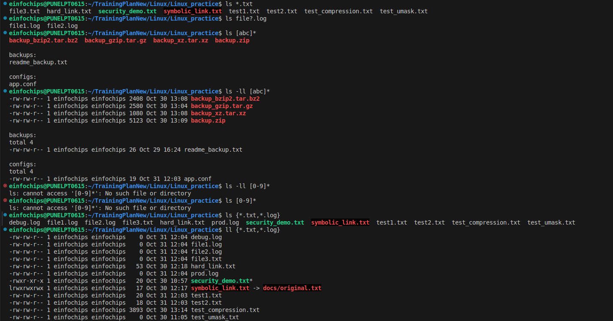
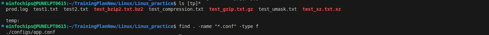
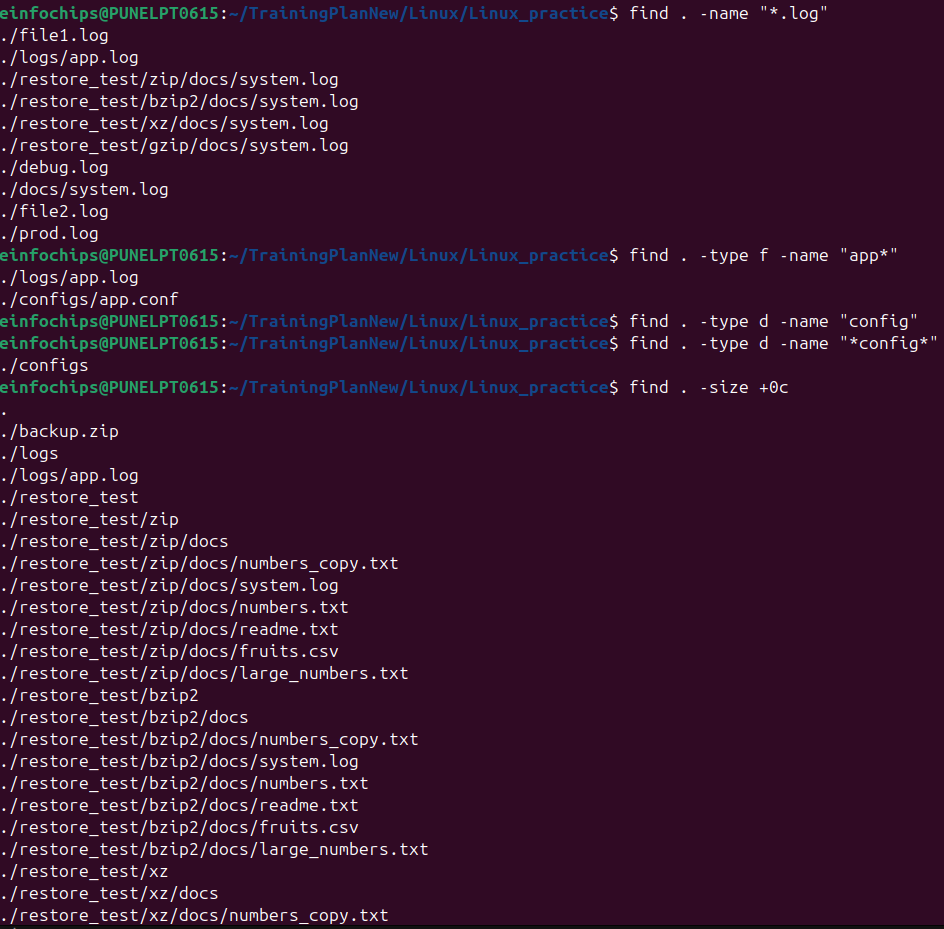
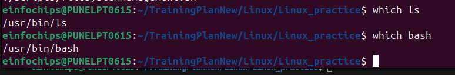
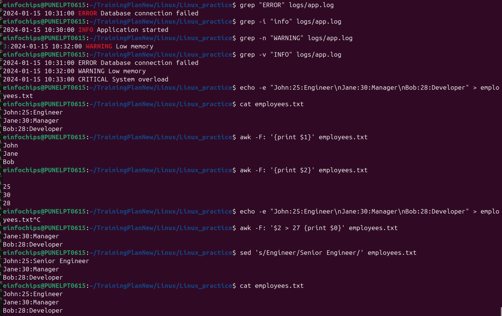
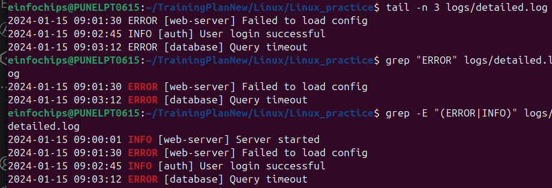
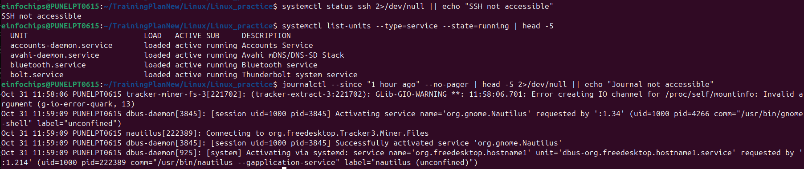
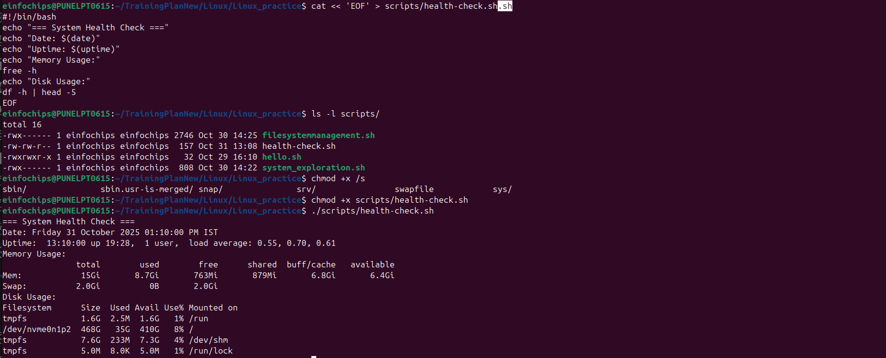
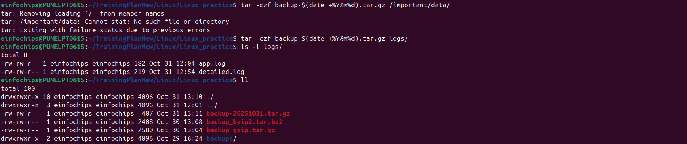

# Linux Commands for DevOps Engineers

## Essential File Operations & Wildcards

### Wildcards & Pattern Matching
```bash
# Basic wildcards
ls *.txt                    # All .txt files
ls file?.log               # file1.log, file2.log, etc.
ls [abc]*                  # Files starting with a, b, or c
ls [0-9]*                  # Files starting with numbers
ls {*.txt,*.log}           # Multiple patterns
ls file[!0-9]*             # Files NOT starting with numbers

# Advanced patterns
find . -name "*.conf" -type f
find . -regex ".*\.(jpg|png|gif)$"

# PRACTICE EXAMPLES:
cd ~/linux-practice
ls *.txt                    # Should show: test1.txt file3.txt
ls *.log                    # Should show: debug.log prod.log file1.log file2.log
ls file?.log               # Should show: file1.log file2.log
ls [tp]*                   # Files starting with 't' or 'p'
ls {*.txt,*.log}           # All .txt and .log files
```




### File Search Commands
```bash
# find - Search files and directories
find /path -name "filename"
find . -type f -name "*.log" -mtime -7    # Modified in last 7 days
find . -size +100M                        # Files larger than 100MB
find . -perm 755                          # Files with specific permissions
find . -user root -group root             # Files owned by root

# locate - Fast file search (uses database)
locate filename
updatedb                                  # Update locate database

# which - Find executable location
which python3
which docker

# whereis - Find binary, source, manual
whereis nginx

# PRACTICE EXAMPLES:
cd ~/linux-practice
find . -name "*.log"                    # Find all .log files
find . -type f -name "app*"             # Find files starting with 'app'
find . -type d -name "*config*"         # Find directories with 'config'
find . -size +0c                        # Find non-empty files
which ls                                # Should show: /bin/ls
which bash                              # Should show: /bin/bash
```



### Text Processing & Search
```bash
# grep - Pattern searching
grep -r "error" /var/log/                 # Recursive search
grep -i "warning" file.log                # Case insensitive
grep -v "debug" file.log                  # Exclude pattern
grep -n "exception" *.log                 # Show line numbers
grep -A 5 -B 5 "error" file.log          # 5 lines after/before

# Advanced grep
grep -E "(error|warning|critical)" *.log # Extended regex
grep -P "\d{1,3}\.\d{1,3}\.\d{1,3}\.\d{1,3}" access.log  # Perl regex for IPs

# awk - Text processing
awk '{print $1}' file.txt                # Print first column
awk -F: '{print $1,$3}' /etc/passwd      # Custom delimiter
awk '/error/ {print $0}' logfile          # Print lines with 'error'

# sed - Stream editor
sed 's/old/new/g' file.txt               # Replace all occurrences
sed -i 's/old/new/g' file.txt            # In-place editing
sed -n '10,20p' file.txt                 # Print lines 10-20

# PRACTICE EXAMPLES:
cd ~/linux-practice
grep "ERROR" logs/app.log               # Find ERROR lines
grep -i "info" logs/app.log             # Case insensitive search
grep -n "WARNING" logs/app.log          # Show line numbers
grep -v "INFO" logs/app.log             # Exclude INFO lines

# Create test file for awk/sed
echo -e "John:25:Engineer\nJane:30:Manager\nBob:28:Developer" > employees.txt
awk -F: '{print $1}' employees.txt      # Print names
awk -F: '$2 > 27 {print $0}' employees.txt  # Age > 27
sed 's/Engineer/Senior Engineer/' employees.txt  # Replace text
```


## System Monitoring & Performance

### Process Management
```bash
# Process monitoring
ps aux                                    # All processes
ps -ef | grep nginx                       # Find specific process
pgrep -f "java.*tomcat"                   # Find process by pattern
pkill -f "java.*old-app"                  # Kill process by pattern

# System resources
top                                       # Real-time process viewer
htop                                      # Enhanced top
iotop                                     # I/O monitoring
nload                                     # Network monitoring
vmstat 1                                  # Virtual memory stats
iostat 1                                  # I/O statistics
```

### System Information
```bash
# System details
uname -a                                  # System information
lscpu                                     # CPU information
free -h                                   # Memory usage
df -h                                     # Disk usage
du -sh /path/*                           # Directory sizes
lsblk                                     # Block devices
lsof -i :80                              # Files/processes using port 80
netstat -tulpn                           # Network connections
ss -tulpn                                # Modern netstat alternative

# PRACTICE EXAMPLES:
ps aux | head -10                       # Top 10 processes
ps -ef | grep bash                      # Find bash processes
uname -a                               # System info
free -h                                # Memory usage
df -h                                  # Disk usage
du -sh ~/linux-practice                # Directory size
ss -tuln | head -10                    # Network connections
```

## Cron Jobs & Scheduling

### Crontab Management
```bash
# Crontab operations
crontab -l                               # List current cron jobs
crontab -e                               # Edit cron jobs
crontab -r                               # Remove all cron jobs
crontab -u username -l                   # List jobs for specific user

# Cron syntax: minute hour day month weekday command
# Examples:
0 2 * * *     /backup/daily.sh          # Daily at 2 AM
*/15 * * * *  /monitor/check.sh          # Every 15 minutes
0 0 1 * *     /backup/monthly.sh        # Monthly on 1st
0 9-17 * * 1-5 /check/business-hours.sh # Business hours weekdays

# System-wide cron directories
/etc/cron.daily/                         # Daily scripts
/etc/cron.weekly/                        # Weekly scripts
/etc/cron.monthly/                       # Monthly scripts
/etc/cron.d/                            # Custom cron files

# PRACTICE EXAMPLES:
crontab -l                             # List current jobs (might be empty)

# Create test cron script
echo '#!/bin/bash
echo "$(date): Cron test executed" >> ~/linux-practice/cron-test.log' > ~/linux-practice/scripts/cron-test.sh
chmod +x ~/linux-practice/scripts/cron-test.sh

# To test (OPTIONAL - modifies crontab):
# echo "* * * * * ~/linux-practice/scripts/cron-test.sh" | crontab -
# Wait a few minutes, then: cat ~/linux-practice/cron-test.log
# Remove with: crontab -r
```

## Network & Security Commands

### Network Diagnostics
```bash
# Network testing
ping -c 4 google.com                     # Ping with count
traceroute google.com                    # Route tracing
nslookup domain.com                      # DNS lookup
dig domain.com                           # DNS information
curl -I http://example.com               # HTTP headers
wget -O- http://example.com              # Download to stdout

# Port scanning
nmap -p 80,443 target.com                # Scan specific ports
nc -zv host 22                           # Check if port is open
telnet host 80                           # Test connection
```

### Security & Permissions
```bash
# File permissions
chmod 755 script.sh                      # Set permissions
chown user:group file.txt                # Change ownership
umask 022                                # Set default permissions

# User management
sudo -u username command                  # Run as different user
su - username                            # Switch user
id username                              # User information
groups username                          # User groups

# PRACTICE EXAMPLES:
ping -c 3 8.8.8.8                     # Ping Google DNS
nslookup google.com                    # DNS lookup
curl -I https://httpbin.org/get        # Get HTTP headers
ls -la ~/linux-practice/               # View permissions
id                                     # Current user info
groups                                 # User groups
```

## DevOps Daily Commands

### Log Analysis
```bash
# Log monitoring
tail -f /var/log/syslog                  # Follow log in real-time
tail -n 100 /var/log/nginx/error.log     # Last 100 lines
head -n 50 /var/log/messages             # First 50 lines
less +F /var/log/application.log         # Follow mode in less

# Log rotation and compression
logrotate -f /etc/logrotate.conf         # Force log rotation
zcat /var/log/syslog.1.gz | grep error   # Search compressed logs

# PRACTICE EXAMPLES:
cd ~/linux-practice
# Create detailed log for testing
cat << 'EOF' > logs/detailed.log
2024-01-15 09:00:01 INFO [web-server] Server started
2024-01-15 09:01:30 ERROR [web-server] Failed to load config
2024-01-15 09:02:45 INFO [auth] User login successful
2024-01-15 09:03:12 ERROR [database] Query timeout
EOF

tail -n 3 logs/detailed.log            # Last 3 lines
grep "ERROR" logs/detailed.log         # Find errors
grep -E "(ERROR|INFO)" logs/detailed.log  # Multiple patterns
```


### Service Management (systemd)
```bash
# Service operations
systemctl status nginx                    # Check service status
systemctl start/stop/restart nginx       # Control services
systemctl enable/disable nginx           # Auto-start configuration
systemctl reload nginx                   # Reload configuration
systemctl list-units --type=service      # List all services
journalctl -u nginx -f                   # Follow service logs
journalctl --since "1 hour ago"          # Recent logs

# PRACTICE EXAMPLES:
systemctl status ssh 2>/dev/null || echo "SSH not accessible"
systemctl list-units --type=service --state=running | head -5
journalctl --since "1 hour ago" --no-pager | head -5 2>/dev/null || echo "Journal not accessible"
```


### Package Management
```bash
# Ubuntu/Debian (apt)
apt update && apt upgrade                 # Update system
apt install package-name                 # Install package
apt remove package-name                  # Remove package
apt search keyword                       # Search packages
dpkg -l | grep package                   # List installed packages

# CentOS/RHEL (yum/dnf)
yum update                               # Update system
yum install package-name                 # Install package
yum remove package-name                  # Remove package
rpm -qa | grep package                   # List installed packages

# PRACTICE EXAMPLES:
dpkg -l | grep -i python | head -3     # List Python packages (Ubuntu/Debian)
rpm -qa | grep -i python | head -3 2>/dev/null || echo "RPM not available"
which curl                             # Check if curl is installed
apt search curl 2>/dev/null | head -3 || echo "APT not available"
```

## DevOps Best Practices & Daily Tasks

### Infrastructure Monitoring
```bash
# Daily health checks
df -h | awk '$5 > 80 {print $0}'         # Check disk usage >80%
free -m | awk 'NR==2{printf "%.2f%%\n", $3*100/$2}'  # Memory usage
uptime                                   # System uptime and load
who                                      # Current users
last | head -10                          # Recent logins

# Service availability
curl -s -o /dev/null -w "%{http_code}" http://service-url  # HTTP status check
nc -z localhost 3306 && echo "MySQL UP" || echo "MySQL DOWN"  # Port check

# PRACTICE EXAMPLES:
cd ~/linux-practice
# Create health check script
cat << 'EOF' > scripts/health-check.sh
#!/bin/bash
echo "=== System Health Check ==="
echo "Date: $(date)"
echo "Uptime: $(uptime)"
echo "Memory Usage:"
free -h
echo "Disk Usage:"
df -h | head -5
EOF

chmod +x scripts/health-check.sh
./scripts/health-check.sh              # Run health check
df -h | awk '$5 > 50 {print "WARNING: " $6 " is " $5 " full"}'  # Check >50% usage
```


### Backup & Maintenance
```bash
# Backup operations
tar -czf backup-$(date +%Y%m%d).tar.gz /important/data/
rsync -av --delete /source/ /backup/     # Incremental backup
mysqldump -u user -p database > backup.sql  # Database backup

# PRACTICE EXAMPLES:
cd ~/linux-practice
tar -czf backup-$(date +%Y%m%d).tar.gz logs/  # Backup logs directory
ls -la backup-*.tar.gz                 # List backup files

# Cleanup examples
touch temp/old1.tmp temp/old2.tmp
find temp/ -name "*.tmp" -delete       # Clean temp files
find . -name "*.bak" -delete 2>/dev/null || echo "No .bak files found"

# Cleanup tasks
find /tmp -type f -mtime +7 -delete      # Clean old temp files
find /var/log -name "*.log" -mtime +30 -delete  # Clean old logs
docker system prune -f                   # Clean Docker resources
```


### Performance Tuning
```bash
# System optimization
echo 3 > /proc/sys/vm/drop_caches        # Clear cache
sysctl -w vm.swappiness=10               # Reduce swap usage
ulimit -n 65536                          # Increase file descriptors

# Process priority
nice -n 10 command                       # Run with lower priority
renice -10 -p PID                        # Change process priority
ionice -c 3 -p PID                       # Set I/O priority

# PRACTICE EXAMPLES:
# Create test process
sleep 300 &
SLEEP_PID=$!
ps -p $SLEEP_PID                      # Check our process
ps aux | sort -nrk 3,3 | head -5      # Top 5 CPU processes
ps aux | sort -nrk 4,4 | head -5      # Top 5 memory processes
kill $SLEEP_PID                       # Clean up test process
```

### Automation Scripts
```bash
# Health check script
#!/bin/bash
check_service() {
    systemctl is-active --quiet $1 && echo "$1: OK" || echo "$1: FAILED"
}

check_service nginx
check_service mysql
check_service docker

# Disk space alert
#!/bin/bash
THRESHOLD=90
df -h | awk -v threshold=$THRESHOLD '
$5 > threshold {
    print "WARNING: " $6 " is " $5 " full"
}'

# PRACTICE EXAMPLES:
cd ~/linux-practice
# Create monitoring script
cat << 'EOF' > scripts/monitor.sh
#!/bin/bash
check_disk() {
    df -h | awk '$5 > 80 {print "ALERT: " $6 " is " $5 " full"}'
}
check_memory() {
    free -m | awk 'NR==2{printf "Memory Usage: %.2f%%\n", $3*100/$2}'
}
check_disk
check_memory
EOF

chmod +x scripts/monitor.sh
./scripts/monitor.sh                   # Run monitoring
```

### Container & Orchestration
```bash
# Docker operations
docker ps -a                            # List all containers
docker logs -f container_name           # Follow container logs
docker exec -it container_name bash     # Enter container
docker system df                        # Docker disk usage
docker stats                            # Container resource usage

# PRACTICE EXAMPLES (if Docker available):
docker --version 2>/dev/null || echo "Docker not installed"
docker ps 2>/dev/null || echo "Docker not running/accessible"
kubectl version --client 2>/dev/null || echo "kubectl not installed"

# Kubernetes operations
kubectl get pods -A                      # All pods in all namespaces
kubectl describe pod pod-name            # Pod details
kubectl logs -f pod-name                # Follow pod logs
kubectl top nodes                       # Node resource usage
kubectl get events --sort-by=.metadata.creationTimestamp  # Recent events
```

### Security Hardening
```bash
# Security checks
ss -tulpn | grep LISTEN                  # Check listening ports
iptables -L -n                          # Firewall rules
fail2ban-client status                  # Check fail2ban status
chkrootkit                              # Rootkit scanner
lynis audit system                      # Security audit

# PRACTICE EXAMPLES:
ss -tuln | grep LISTEN | head -5       # Check listening ports
find /tmp -type f -perm /o+w 2>/dev/null | head -5 || echo "No world-writable files in /tmp"
ps aux | grep -E "(ssh|nginx|apache)" | head -3  # Check common services

# File integrity
find /etc -type f -perm /o+w             # World-writable files
find / -nouser -o -nogroup 2>/dev/null   # Files without owner
```

## Advanced Tips

### Command Combinations
```bash
# Powerful one-liners
ps aux | sort -nrk 3,3 | head -5        # Top 5 CPU processes
netstat -tuln | grep :80                # Check if port 80 is listening
find . -name "*.log" -exec grep -l "error" {} \;  # Files containing "error"
lsof +D /path | wc -l                   # Count open files in directory

# Process monitoring
watch -n 1 'ps aux | grep java'         # Monitor Java processes
while true; do clear; date; ps aux | head -20; sleep 5; done  # Custom monitor

# PRACTICE EXAMPLES:
cd ~/linux-practice
find . -name "*.log" -exec wc -l {} \; # Count lines in log files
find . -type f -exec ls -la {} \; | head -5  # Detailed file listing
watch -n 2 'date; ps aux | head -5'   # Monitor top processes (Ctrl+C to exit)
```

### Useful Aliases
```bash
# Add to ~/.bashrc
alias ll='ls -alF'
alias la='ls -A'
alias l='ls -CF'
alias grep='grep --color=auto'
alias ports='netstat -tulanp'
alias meminfo='free -m -l -t'
alias psmem='ps auxf | sort -nr -k 4'
alias pscpu='ps auxf | sort -nr -k 3'
alias logs='journalctl -f'
alias dsize='du -sh'

# PRACTICE EXAMPLES:
# Test aliases (temporary for current session)
alias ll='ls -alF'
alias meminfo='free -m -l -t'
alias psmem='ps auxf | sort -nr -k 4 | head -5'

# Use the aliases
ll ~/linux-practice/                   # Detailed listing
meminfo                                # Memory information
psmem                                  # Top memory processes
```

## Test Environment Cleanup

```bash
# When done practicing, clean up
rm -rf ~/linux-practice
echo "Test environment cleaned up"
```

## Quick Verification

```bash
# Verify your test environment setup
cd ~/linux-practice 2>/dev/null && echo "Environment ready" || echo "Run setup first"
echo "Directory structure:"
find ~/linux-practice -type d 2>/dev/null
echo "Files created:"
find ~/linux-practice -type f 2>/dev/null | wc -l
```

This comprehensive guide covers essential Linux commands and DevOps practices for daily operations, monitoring, and system administration.

---

# PRACTICE EXAMPLES

## Setup Test Environment

```bash
# Create test directory structure
mkdir -p ~/linux-practice/{logs,configs,scripts,temp}
cd ~/linux-practice

# Create sample files
echo "This is a test file" > test1.txt
echo "Another test file" > test2.txt
echo "Configuration file" > configs/app.conf
echo "#!/bin/bash\necho 'Hello World'" > scripts/hello.sh
chmod +x scripts/hello.sh

# Create sample log files
echo "2024-01-15 10:30:00 INFO Application started" > logs/app.log
echo "2024-01-15 10:31:00 ERROR Database connection failed" >> logs/app.log
echo "2024-01-15 10:32:00 WARNING Low memory" >> logs/app.log
echo "2024-01-15 10:33:00 CRITICAL System overload" >> logs/app.log

# Create test files for wildcards
touch file1.log file2.log file3.txt debug.log prod.log
```