# Complete Linux Training Guide - Theory to Hands-On Practice

## Table of Contents
1. [What is Linux?](#what-is-linux)
2. [Linux Kernel](#linux-kernel)
3. [File System Structure](#file-system-structure)
4. [Command Categories](#command-categories)
5. [Hands-On Practice Exercises](#hands-on-practice-exercises)
6. [Bash Scripting](#bash-scripting)
7. [Real-World Projects](#real-world-projects)

---

## What is Linux?

### Definition
Linux is a **free and open-source operating system** based on Unix, created by Linus Torvalds in 1991.

### Key Features
- **Open Source**: Source code freely available
- **Multi-user**: Multiple users simultaneously
- **Multi-tasking**: Multiple processes at once
- **Secure**: Built-in security and permissions
- **Stable**: High reliability and uptime

### Linux vs Others
| Feature | Linux | Windows | macOS |
|---------|-------|---------|-------|
| Cost | Free | Paid | Paid |
| Customization | High | Medium | Low |
| Security | High | Medium | High |

---

## Linux Kernel

### What is the Kernel?
The kernel is the core of Linux that manages hardware and system resources.

### Kernel Functions
- **Process Management**: Handle running programs
- **Memory Management**: Manage RAM and storage
- **File System**: Handle files and directories
- **Device Drivers**: Control hardware
- **Network Stack**: Manage network connections

### Check Kernel Information
```bash
uname -r        # Kernel version
uname -a        # Complete system info
lsmod          # Loaded kernel modules
dmesg          # Kernel messages
```

---

## File System Structure

```
/                    # Root directory
├── bin/            # Essential commands (ls, cp, mv)
├── boot/           # Boot files
├── dev/            # Device files
├── etc/            # Configuration files
├── home/           # User directories
├── lib/            # System libraries
├── tmp/            # Temporary files
├── usr/            # User programs
└── var/            # Variable data (logs)
```

---

## Command Categories

## 1. FUNDAMENTAL COMMANDS

### System Information
```bash
# Basic identity and system info
whoami                          # Current username
id                             # User and group IDs
hostname                       # Computer name
uname -a                       # System information
uptime                         # System uptime
date                           # Current date/time
cal                            # Calendar
```

**Hands-On Exercise 1:**
```bash
# complete system check Info
echo "=== System Information ==="
echo "User: $(whoami)"
echo "Hostname: $(hostname)"
echo "System: $(uname -s)"
echo "Kernel: $(uname -r)"
echo "Date: $(date)"
echo "System uptime: $(uptime)"
```


**Screenshot this output for your documentation**
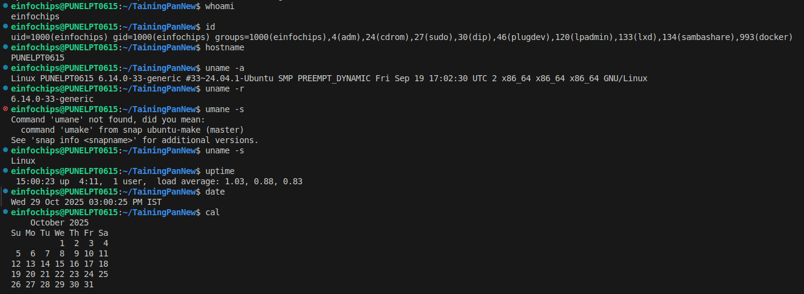
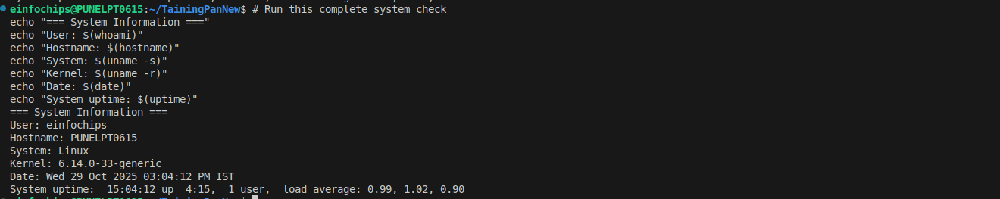

### Navigation Basics
```bash
# Directory navigation
pwd                            # Show current directory
ls                             # List files
ls -l                          # Detailed list
ls -la                         # Include hidden files
cd /path/to/directory          # Change directory
cd ~                           # Go home
cd ..                          # Go up one level
cd -                           # Go to previous directory
```

**Hands-On Exercise 2:**
```bash
# Navigation practice
echo "=== Navigation Practice ==="
pwd
echo "Home directory contents:"
ls -la ~
echo "Root directory structure:"
ls -l /
echo "Current location after cd /tmp:"
cd /tmp && pwd
echo "Back to home:"
cd ~ && pwd
```
**Screenshot this navigation sequence**
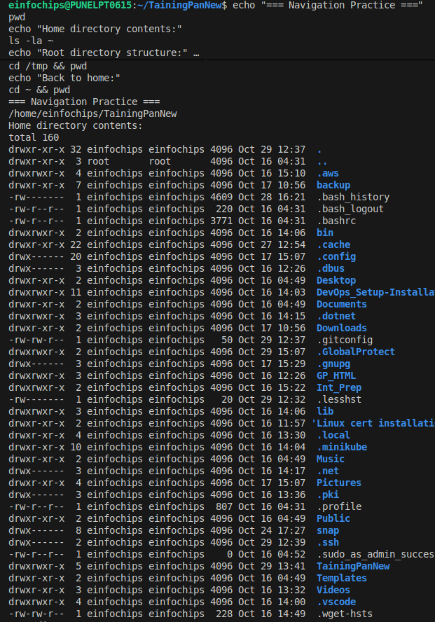
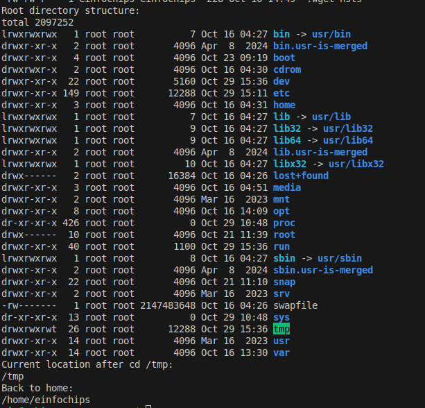

## 2. BASIC COMMANDS

### File Operations
```bash
# File and directory management
touch filename                 # Create empty file
mkdir dirname                  # Create directory
mkdir -p path/to/dir           # Create nested directories
cp source destination          # Copy file
cp -r source destination       # Copy directory
mv source destination          # Move/rename
rm filename                    # Delete file
rm -r dirname                  # Delete directory
rmdir dirname                  # Remove empty directory
```

**Hands-On Exercise 3:**
```bash
# Complete file management workflow
cd ~
mkdir -p linux_practice/{docs,scripts,backups}
cd linux_practice

echo "=== File Management Practice ==="
echo "Created directory structure:"
ls -la

# Create sample files
echo "This is a sample document" > docs/readme.txt
echo "#!/bin/bash" > scripts/hello.sh
echo "echo 'Hello Linux!'" >> scripts/hello.sh

echo "Files created:"
ls -la docs/
ls -la scripts/

# Copy and move operations
cp docs/readme.txt backups/
mv backups/readme.txt backups/readme_backup.txt
echo "Backup operations:"
ls -la backups/

# File permissions
chmod +x scripts/hello.sh
echo "Script permissions:"
ls -la scripts/hello.sh
```
**Screenshot of above workflow**
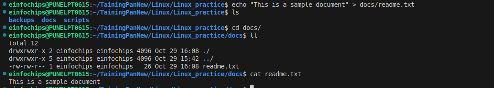
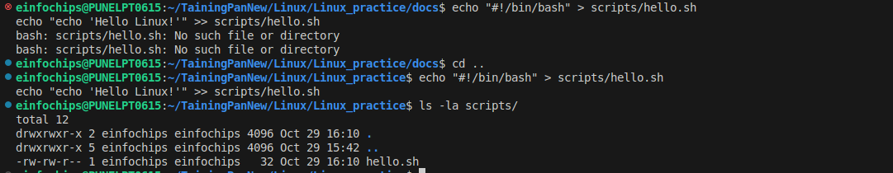
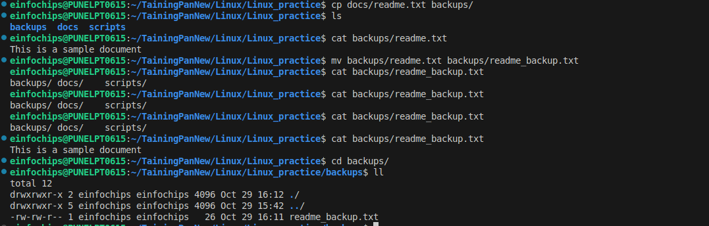


### File Viewing and Content
```bash
# View file contents
cat filename                   # Display entire file
head filename                  # First 10 lines
head -n 5 filename            # First 5 lines
tail filename                  # Last 10 lines
tail -f filename              # Follow file changes
less filename                  # Page through file
more filename                  # Page through file
```

**Hands-On Exercise 4:**
```bash
# Create sample data and practice viewing
cd ~/linux_practice

# Create multi-line file
seq 1 50 > docs/numbers.txt
echo -e "apple,red,sweet\nbanana,yellow,sweet\ngrape,purple,sour\norange,orange,citrus" > docs/fruits.csv

echo "=== File Viewing Practice ==="
echo "First 10 numbers:"
head docs/numbers.txt

echo "Last 5 numbers:"
tail -n 5 docs/numbers.txt

echo "Fruit data:"
cat docs/fruits.csv

echo "File information:"
wc -l docs/numbers.txt
wc -w docs/fruits.csv
```
**Screenshot these file viewing operations**
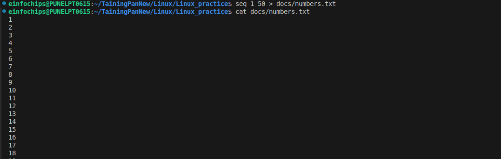
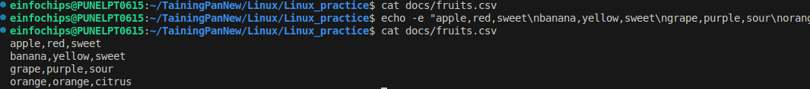
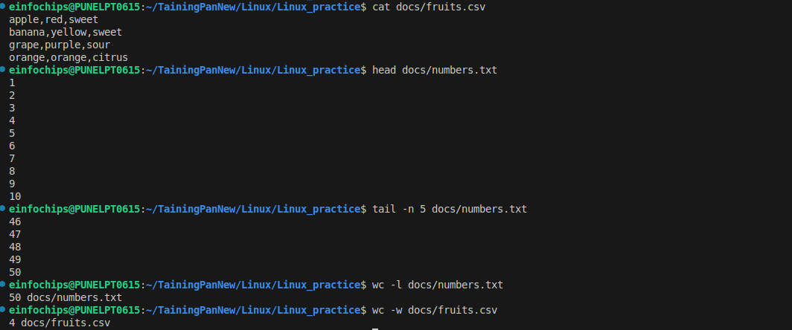

## 3. INTERMEDIATE COMMANDS

### Text Processing
```bash
# Search and process text
grep "pattern" filename        # Search for text
grep -i "pattern" filename     # Case-insensitive search
grep -v "pattern" filename     # Exclude pattern
grep -c "pattern" filename     # Count matches
sed 's/old/new/g' filename     # Replace text
awk '{print $1}' filename      # Print first column
sort filename                  # Sort lines
uniq filename                  # Remove duplicates
cut -d',' -f1 filename         # Extract CSV field
```

**Hands-On Exercise 5:**
```bash
# Advanced text processing
cd ~/linux_practice

# Create sample log file
cat << EOF > docs/system.log
2023-12-18 10:30:15 INFO System started
2023-12-18 10:31:20 ERROR Database connection failed
2023-12-18 10:32:10 INFO User login successful
2023-12-18 10:33:05 ERROR File not found
2023-12-18 10:34:15 WARNING Low disk space
2023-12-18 10:35:20 INFO Backup completed
EOF

echo "=== Text Processing Practice ==="
echo "Total log entries:"
wc -l docs/system.log

echo "Error messages:"
grep "ERROR" docs/system.log

echo "Non-error messages:"
grep -v "ERROR" docs/system.log

echo "Log levels count:"
awk '{print $3}' docs/system.log | sort | uniq -c

echo "Fruit processing:"
echo "Fruit names only:"
cut -d',' -f1 docs/fruits.csv

echo "Sorted fruits:"
sort docs/fruits.csv
```
**Screenshot this text processing session**
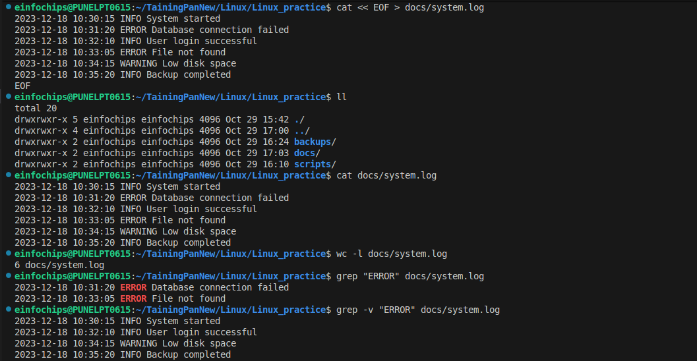
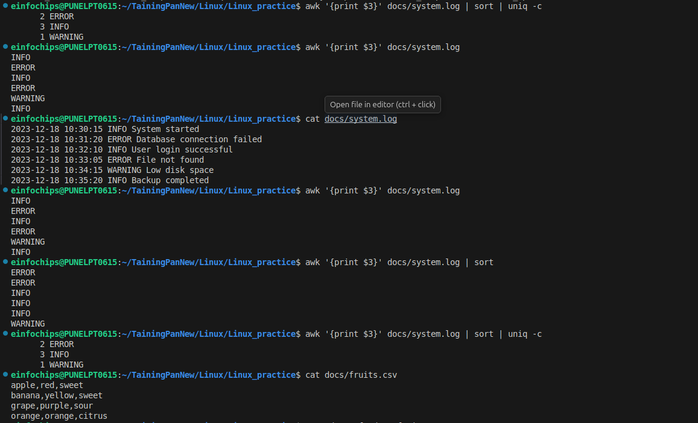
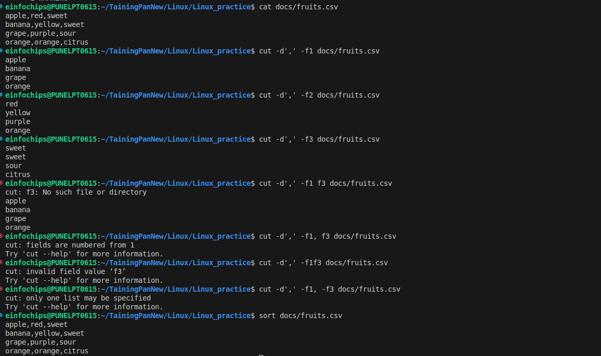

### Process Management
```bash
# Manage running processes
ps                             # Current processes
ps aux                         # All processes detailed
top                            # Dynamic process view
htop                           # Enhanced process viewer
jobs                           # Active jobs
bg                             # Background job
fg                             # Foreground job
kill PID                       # Kill process
killall name                   # Kill by name
pgrep name                     # Find process ID
```

**Hands-On Exercise 6:**
```bash
echo "=== Process Management Practice ==="
echo "Current processes:"
ps

echo "Starting background jobs:"
sleep 30 &
job1_pid=$!
sleep 45 &
job2_pid=$!

echo "Active jobs:"
jobs

echo "Process details:"
ps aux | grep sleep | grep -v grep

echo "Killing first job:"
kill $job1_pid
sleep 2
echo "Remaining jobs:"
jobs

# Clean up
kill $job2_pid 2>/dev/null
```
**Screenshot this process management demo**
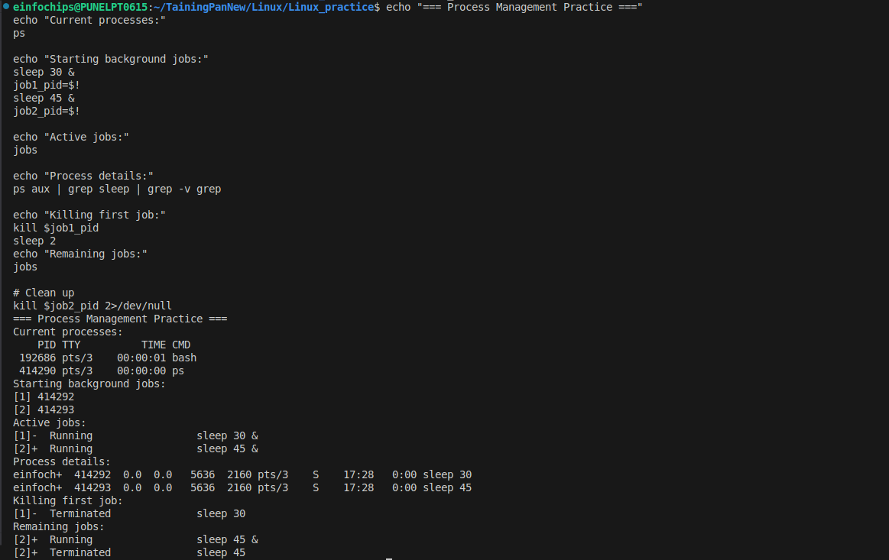

