# Serverless Products API

## Project Overview
A fully serverless REST API built on AWS using API Gateway, Lambda, and DynamoDB to manage product inventory.

## Architecture
```
Client → API Gateway → Lambda Functions → DynamoDB
```

### Components
- **API Gateway**: REST API endpoint
- **Lambda Functions**: Business logic (Add, Get, List products)
- **DynamoDB**: NoSQL database for product storage
- **IAM**: Security and permissions

## Architecture Diagram
```
┌─────────────┐
│   Client    │
│ (Postman/   │
│   curl)     │
└──────┬──────┘
       │
       ▼
┌─────────────────────────────────────┐
│        API Gateway (REST)           │
│  https://xxx.execute-api.region.aws │
├─────────────────────────────────────┤
│  POST   /products                   │
│  GET    /products                   │
│  GET    /products/{id}              │
└──────┬──────────────┬───────────┬───┘
       │              │           │
       ▼              ▼           ▼
┌─────────────┐ ┌──────────┐ ┌──────────┐
│ AddProduct  │ │GetProduct│ │  List    │
│   Lambda    │ │  Lambda  │ │ Products │
│             │ │          │ │  Lambda  │
└──────┬──────┘ └────┬─────┘ └────┬─────┘
       │             │            │
       └─────────────┴────────────┘
                     │
                     ▼
              ┌─────────────┐
              │  DynamoDB   │
              │   Products  │
              │    Table    │
              └─────────────┘
```

## Features
-  Add new products
-  Retrieve single product by ID
-  List all products
-  Serverless architecture (auto-scaling)
-  Pay-per-use pricing model

## Tech Stack
- **AWS API Gateway**: REST API management
- **AWS Lambda**: Python 3.12 runtime
- **AWS DynamoDB**: NoSQL database
- **AWS IAM**: Access control

## API Endpoints

### Base URL
```
https://{api-id}.execute-api.{region}.amazonaws.com/prod
```

### Endpoints

| Method | Endpoint | Description |
|--------|----------|-------------|
| POST | `/products` | Add a new product |
| GET | `/products` | List all products |
| GET | `/products/{id}` | Get product by ID |

## Setup Instructions

### Prerequisites
- AWS Account
- AWS Console access
- Basic understanding of AWS services

### Step 1: Create DynamoDB Table
1. Navigate to **DynamoDB Console**
2. Click **Create table**
3. Configuration:
   - Table name: `Products`
   - Partition key: `productId` (String)
4. Click **Create table**

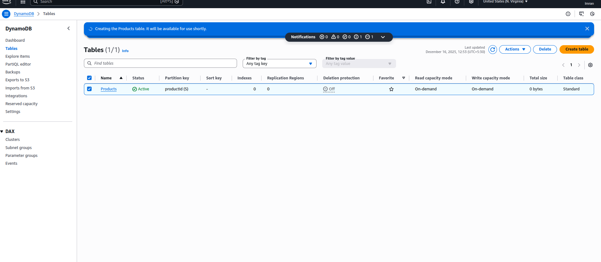
*Shows: Table overview, sample data, and configuration settings*

### Step 2: Create IAM Role
1. Navigate to **IAM Console** → **Roles**
2. Click **Create role**
3. Select **Lambda** as trusted entity
4. Attach policies:
   - `AWSLambdaBasicExecutionRole`
   - `AmazonDynamoDBFullAccess`
5. Role name: `LambdaProductsAPIRole`
6. Click **Create role**

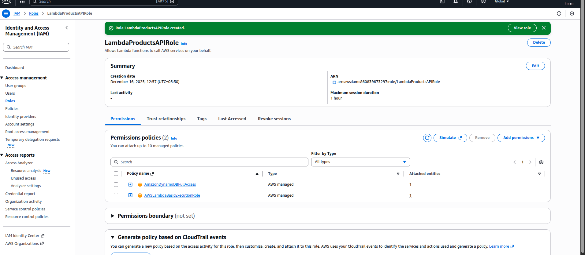
*Shows: Role details, attached policies, and trust relationships*

### Step 3: Create Lambda Functions

#### 3.1 AddProduct Lambda
- **Function name**: `AddProduct`
- **Runtime**: Python 3.12
- **Role**: `LambdaProductsAPIRole`
- **Code**: See `lambda/add_product.py`

#### 3.2 GetProduct Lambda
- **Function name**: `GetProduct`
- **Runtime**: Python 3.12
- **Role**: `LambdaProductsAPIRole`
- **Code**: See `lambda/get_product.py`

#### 3.3 ListProducts Lambda
- **Function name**: `ListProducts`
- **Runtime**: Python 3.12
- **Role**: `LambdaProductsAPIRole`
- **Code**: See `lambda/list_products.py`

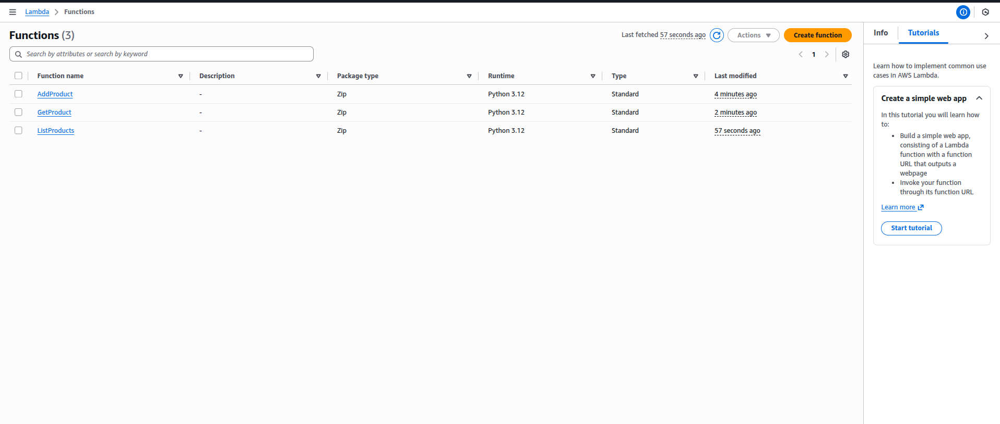
Add_product Function
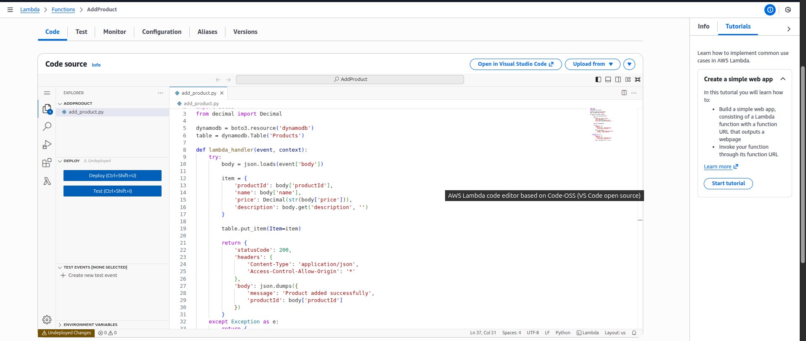
List_product Function
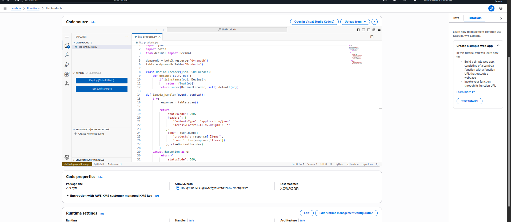
Get_product Function
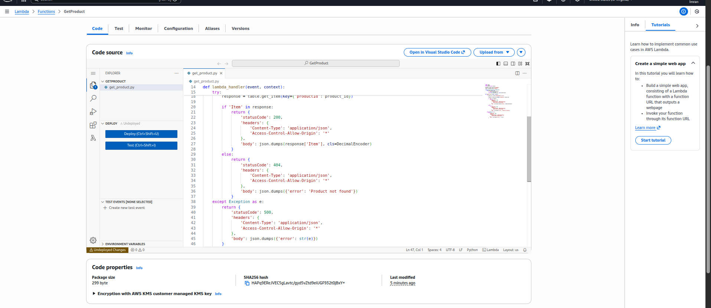
*Shows: All 3 functions, code editor, and configuration*

### Step 4: Create API Gateway
1. Navigate to **API Gateway Console**
2. Create **REST API**
3. API name: `ProductsAPI`
4. Create resources:
   - `/products` (POST, GET methods)
   - `/products/{id}` (GET method)
5. Enable CORS on all resources
6. Deploy to `prod` stage

Invoke Url: https://v7dul4vebf.execute-api.us-east-1.amazonaws.com/prod

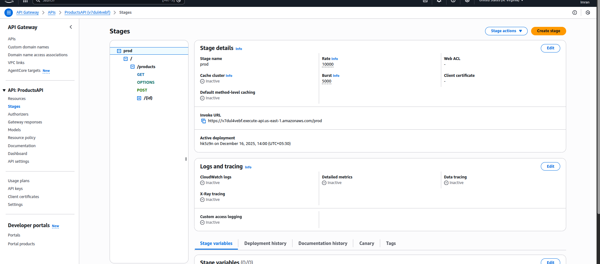

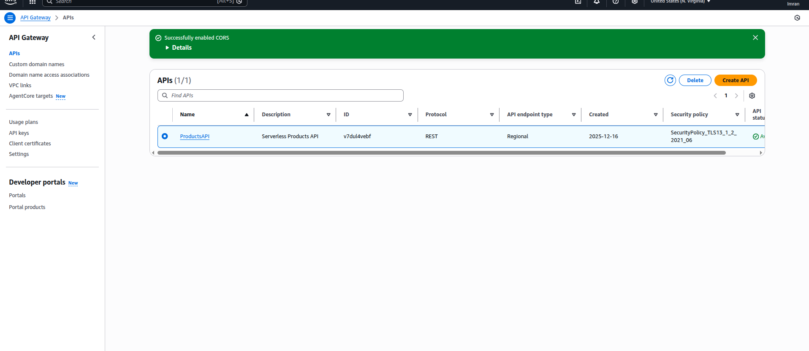

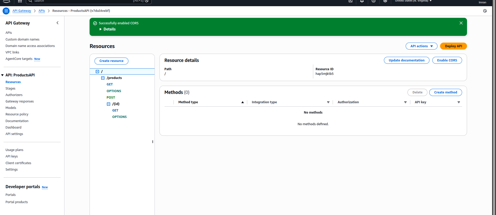
*Shows: Resource structure, method integration, and deployment URL*

## API Usage

### 1. Add Product
```bash
curl -X POST https://v7dul4vebf.execute-api.us-east-1.amazonaws.com/prod/products \
  -H "Content-Type: application/json" \
  -d '{
    "productId": "P001",
    "name": "Laptop",
    "price": 999.99,
    "description": "Gaming laptop"
  }'
```

**Response:**
```json
{
  "message": "Product added successfully",
  "productId": "P001"
}
```
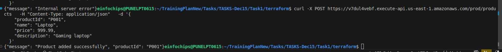

Added another product

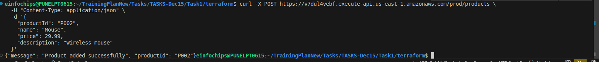

DynamoDB Console View:

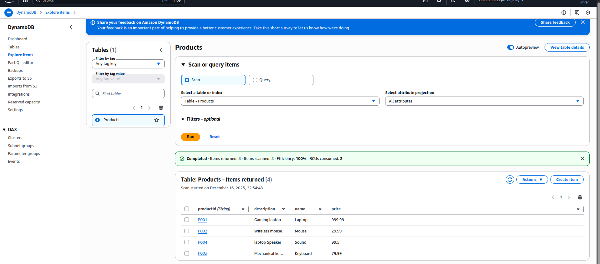

### 2. List All Products
```bash
curl https://v7dul4vebf.execute-api.us-east-1.amazonaws.com/prod/products
```
**Response:**
```json
{
  "products": [
    {
      "productId": "P001",
      "name": "Laptop",
      "price": 999.99,
      "description": "Gaming laptop"
    }
  ],
  "count": 1
}
```
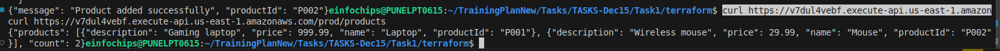

### 3. Get Product by ID
```bash
curl https://v7dul4vebf.execute-api.us-east-1.amazonaws.com/prod/products/P001
```

**Response:**
```json
{
  "productId": "P001",
  "name": "Laptop",
  "price": 999.99,
  "description": "Gaming laptop"
}
```
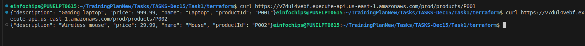

## Testing

### Using Postman
1. Import the collection from `postman/ProductsAPI.postman_collection.json`
2. Update the `{{baseUrl}}` variable with your API URL
3. Run the requests

Postman Result:

List Product
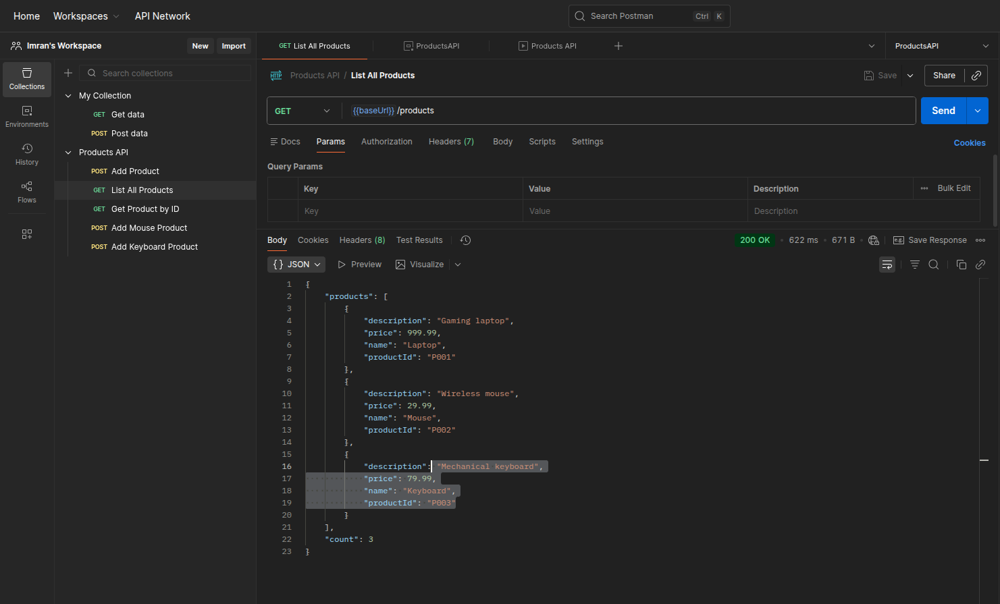

Add Product:
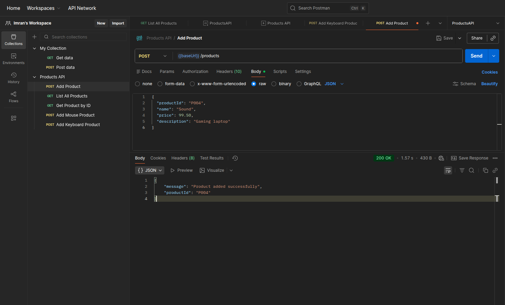

by Producty Id:
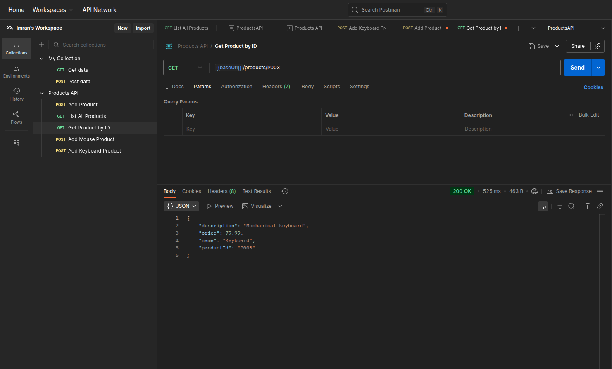


### Using curl
See examples in the API Usage section above.

---
### CloudWatch Logs:

All Log Groups:
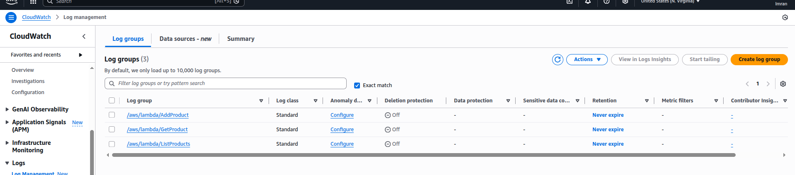

ListProducts Log:
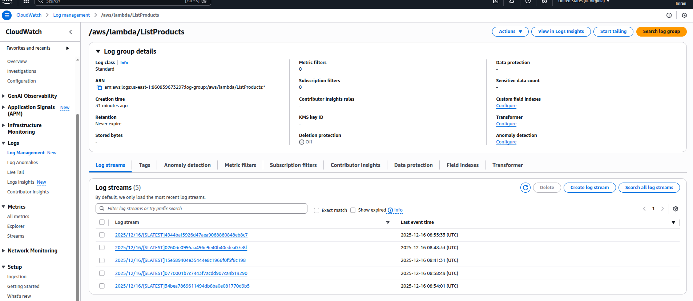

GetProduct Log Events:
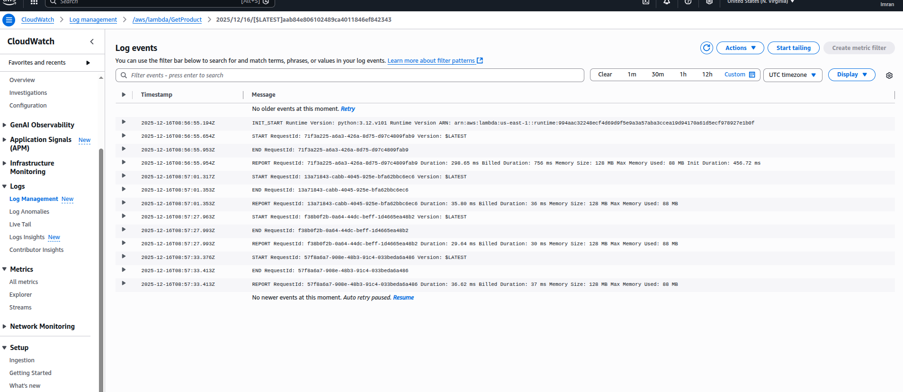

AddProduct Events:
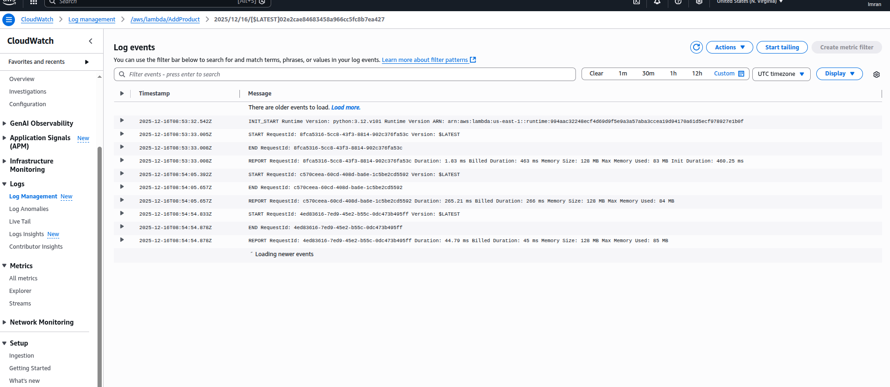

*Shows: Lambda execution logs and monitoring metrics*

## Project Structure
```
Serverless-API-Project/
├── README.md
├── lambda/
│   ├── add_product.py
│   ├── get_product.py
│   └── list_products.py
├── postman/
│   └── ProductsAPI.postman_collection.json
├── screenshots/
│   ├── 01-dynamodb-table.png
│   ├── 02-lambda-functions.png
│   ├── 03-api-gateway.png
│   └── 04-test-results.png
└── docs/
    ├── DEPLOYMENT.md
    └── TROUBLESHOOTING.md
```