# VPC Infrastructure Documentation - Task 3

## Project Overview
This project demonstrates the creation of a production-ready VPC infrastructure using Terraform modules, following AWS networking best practices for multi-tier architecture.

## Architecture Implemented

### Network Design
```
                    Internet
                       │
                ┌──────▼──────┐
                │Internet GW  │
                └──────┬──────┘
                       │
        ┌──────────────▼──────────────┐
        │         VPC                │
        │      10.0.0.0/16           │
        └──────────────┬──────────────┘
                       │
        ┌──────────────┼──────────────┐
        │    AZ-1a     │    AZ-1b     │
        │              │              │
   ┌────▼────┐   ┌────▼────┐   ┌────▼────┐   ┌────▼────┐
   │Public-1 │   │Public-2 │   │Private-1│   │Private-2│
   │10.0.1/24│   │10.0.2/24│   │10.0.3/24│   │10.0.4/24│
   └────┬────┘   └────┬────┘   └────┬────┘   └────┬────┘
        │             │             │             │
   ┌────▼────┐   ┌────▼────┐   ┌────▼────┐       │
   │ Bastion │   │   NAT   │   │   App   │       │
   │  Host   │   │Gateway  │   │ Server  │       │
   └─────────┘   └────┬────┘   └─────────┘       │
        │             │             ▲             │
        │             └─────────────┘             │
        │                                        │
        └────────────────────────────────────────┘

Traffic Flow:
- Public Subnets → Internet Gateway (0.0.0.0/0)
- Private Subnets → NAT Gateway (0.0.0.0/0)
- Bastion Host ← SSH from Internet
- App Server ← SSH from Bastion only```

### Components Created
- **1 VPC** with DNS support enabled
- **2 Public Subnets** across different AZs
- **2 Private Subnets** across different AZs  
- **1 Internet Gateway** for public internet access
- **1 NAT Gateway** for private subnet outbound access
- **1 Bastion Host** in public subnet
- **1 Application Server** in private subnet
- **Security Groups** with least privilege access

---

## Step-by-Step Implementation

### Step 1: Initialize Terraform

```bash
cd /home/einfochips/TrainingPlanNew/Tasks/TASKS-Dec15/Task3
terraform init
```

**📸 Screenshot 1.1: Terraform Initialization**

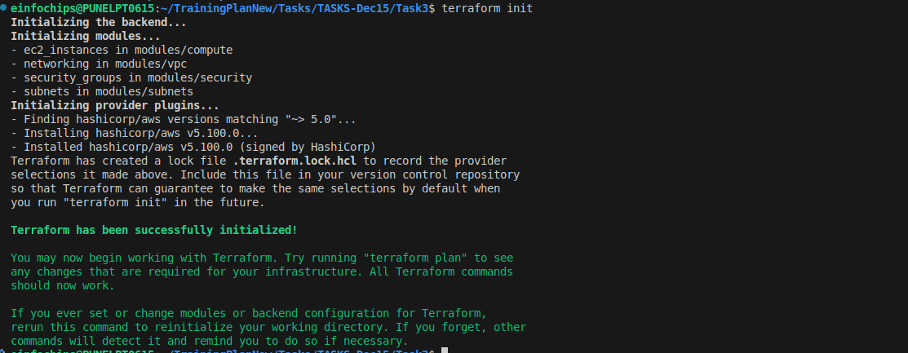

---

### Step 2: Plan Infrastructure

```bash
terraform plan
```

**📸 Screenshot 2.1: Terraform Plan Output**

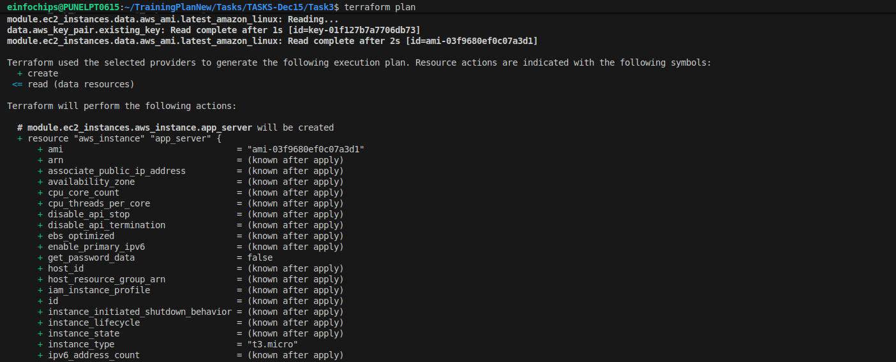

**📸 Screenshot 2.2: Resources to be Created**


---

### Step 3: Deploy Infrastructure

```bash
terraform apply
```

**📸 Screenshot 3.1: Terraform Apply**

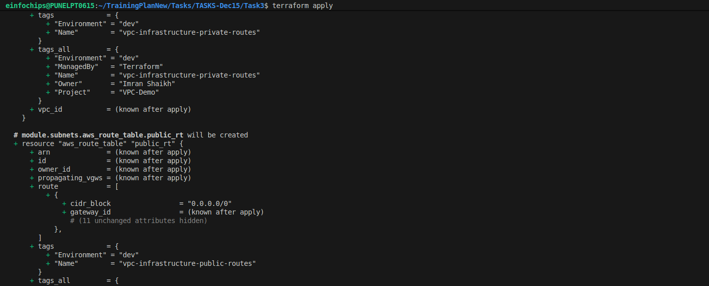


**📸 Screenshot 3.3: Deployment Complete**

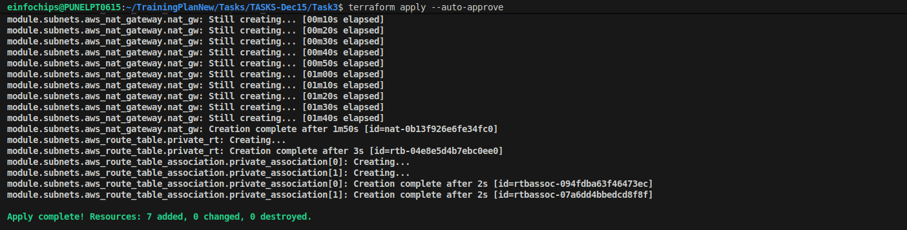

---

## Infrastructure Verification

### Step 4: Verify VPC Creation

Navigate to: **AWS Console → VPC → Your VPCs**

**📸 Screenshot 4.1: VPC Overview**

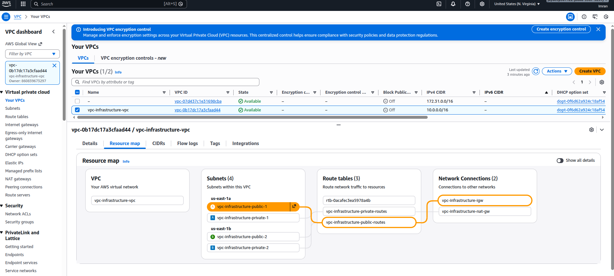

**📸 Screenshot 4.2: VPC Details**

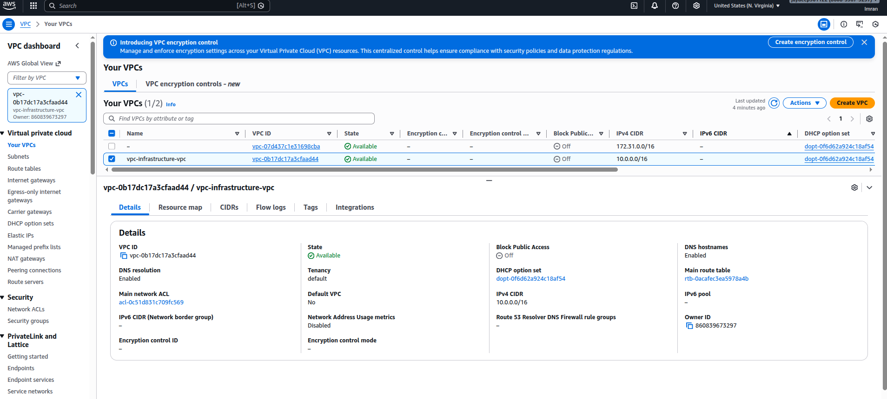

---

### Step 5: Verify Subnets

Navigate to: **AWS Console → VPC → Subnets**

**📸 Screenshot 5.1: All Subnets**

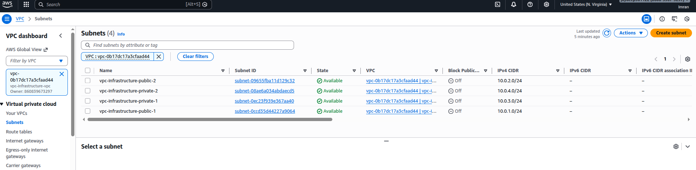

**📸 Screenshot 5.2: Public Subnets**

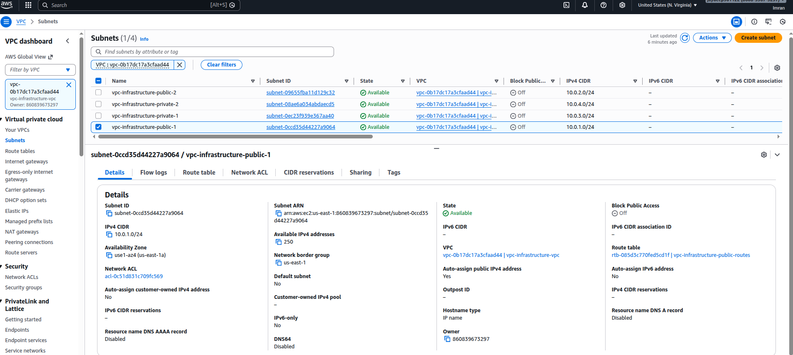

**📸 Screenshot 5.3: Private Subnets**

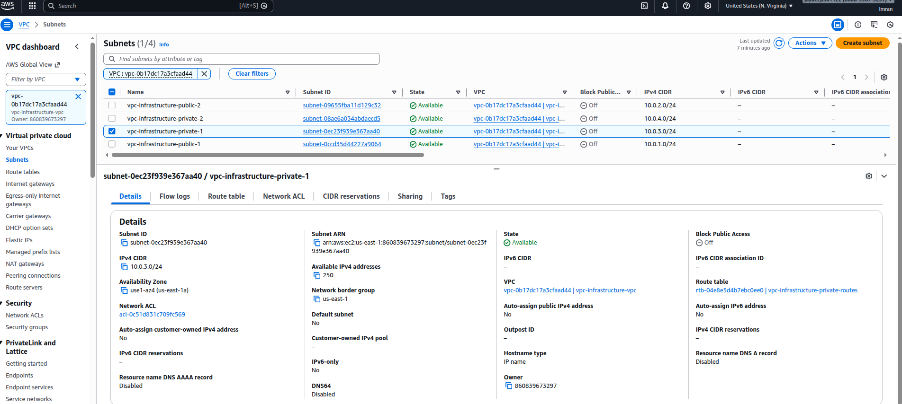

---

### Step 6: Verify Internet Gateway

Navigate to: **AWS Console → VPC → Internet Gateways**

**📸 Screenshot 6.1: Internet Gateway**

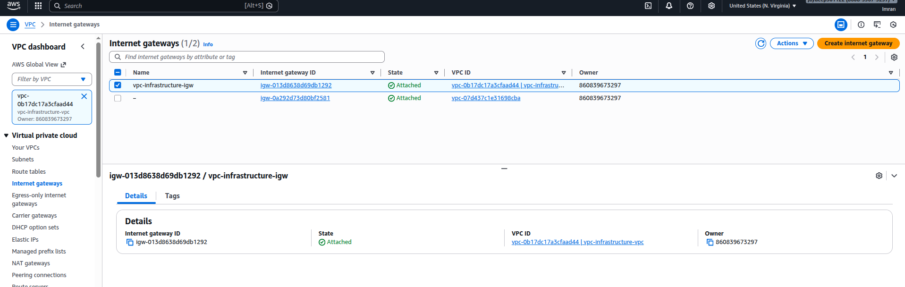

---

### Step 7: Verify NAT Gateway

Navigate to: **AWS Console → VPC → NAT Gateways**

**📸 Screenshot 7.1: NAT Gateway**

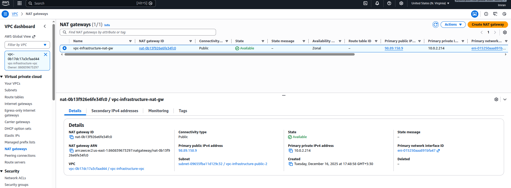

---

### Step 8: Verify Route Tables

Navigate to: **AWS Console → VPC → Route Tables**

**📸 Screenshot 8.1: All Route Tables**

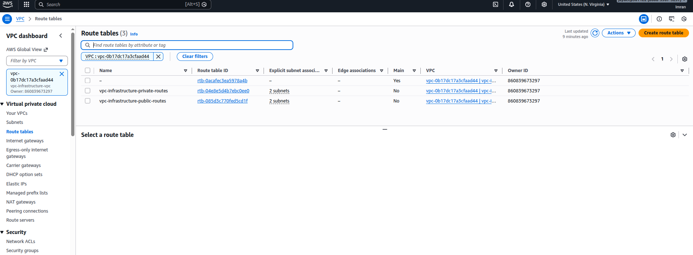

**📸 Screenshot 8.2: Public Route Table**


**📸 Screenshot 8.3: Private Route Table**

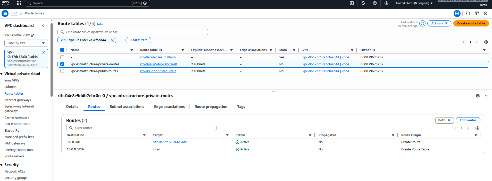

**📸 Screenshot 8.4: Route Table Associations of both Public & Private**


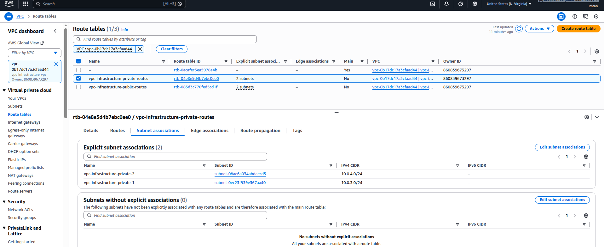

---

### Step 9: Verify Security Groups

Navigate to: **AWS Console → EC2 → Security Groups**

**📸 Screenshot 9.1: Security Groups List**

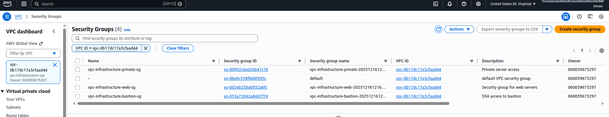

**📸 Screenshot 9.2: Bastion Security Group Rules**

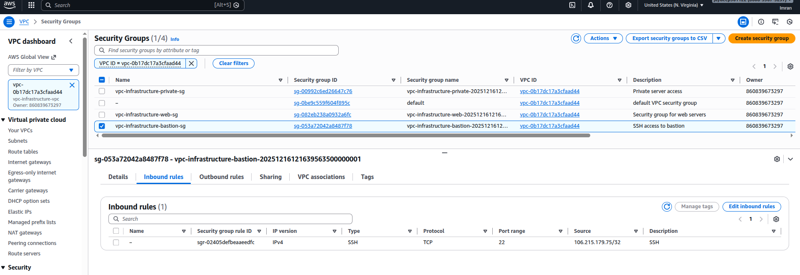

**📸 Screenshot 9.3: Private Security Group Rules**

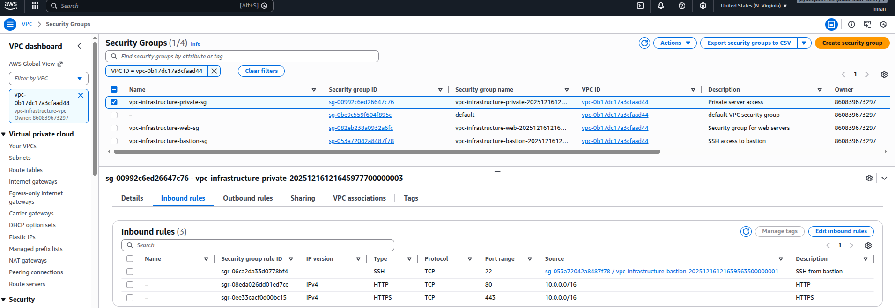

**📸 Screenshot 9.3: Web Security Group Rules**

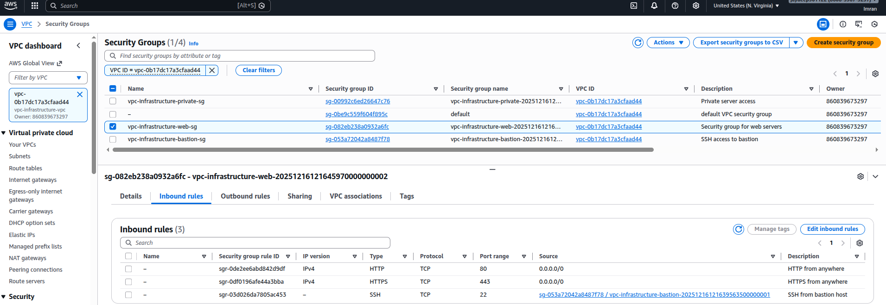

---

### Step 10: Verify EC2 Instances

Navigate to: **AWS Console → EC2 → Instances**

**📸 Screenshot 10.1: EC2 Instances**

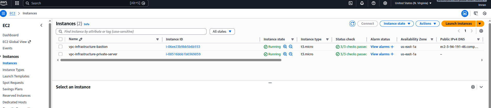

**📸 Screenshot 10.2: Bastion Host Details**

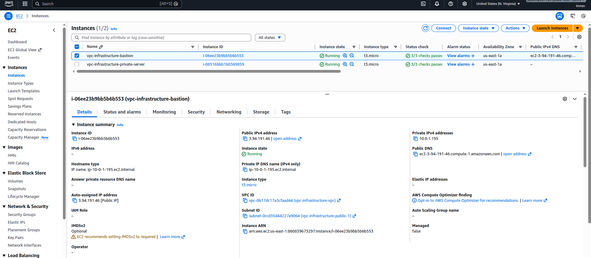

**📸 Screenshot 10.3: Private Instance Details**

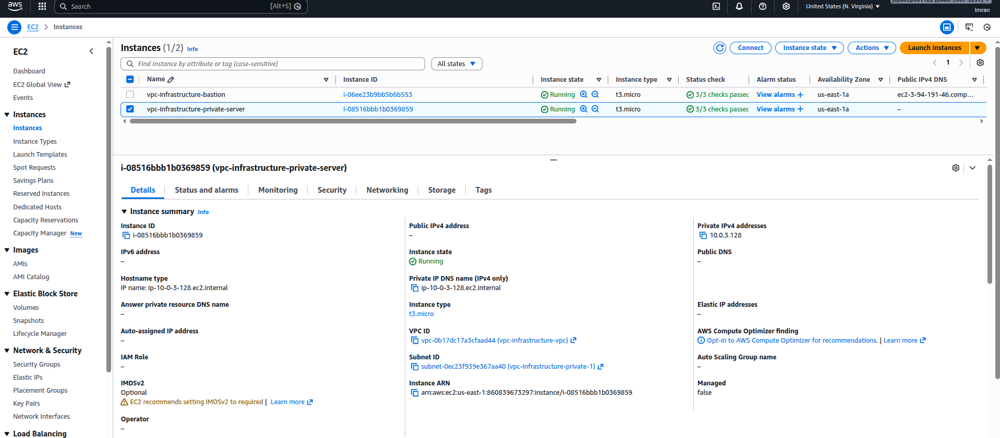

---

## Connectivity Testing

### Step 11: SSH to Bastion Host

```bash
# Get connection details
terraform output ssh_connection_commands

# Connect to bastion host
ssh -i ~/jayimrankey.pem ec2-user@<BASTION_PUBLIC_IP>
I have used SSH Agent Forwarding it loads the key into your SSH agent (in memory) The key is kept in RAM.
ssh-add "key-name.pem"
ssh -A ec2-user@<BASTION_PUBLIC_IP>
ssh ec2-user@<PRIVATE_INSTANCE_IP>


```

**📸 Screenshot 11.1: Terraform Output**

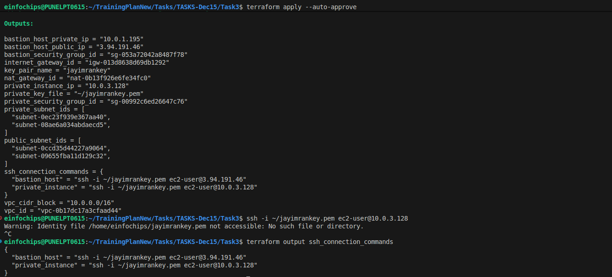

**📸 Screenshot 11.2: SSH to Bastion Host**

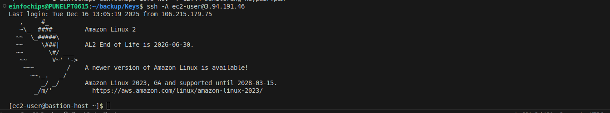

---

### Step 12: SSH from Bastion to Private Instance

```bash
# From bastion host, SSH to private instance
ssh -i ~/jayimrankey.pem ec2-user@<PRIVATE_INSTANCE_IP>
```

**📸 Screenshot 12.1: SSH to Private Instance**

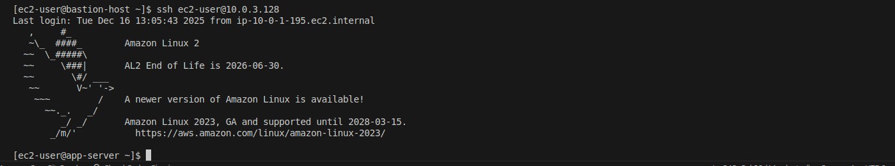

---

### Step 13: Test Internet Connectivity

```bash
# From private instance, test outbound internet via NAT Gateway
ping -c 4 8.8.8.8
curl -I https://www.google.com
```

**📸 Screenshot 13.1: Internet Connectivity Test**

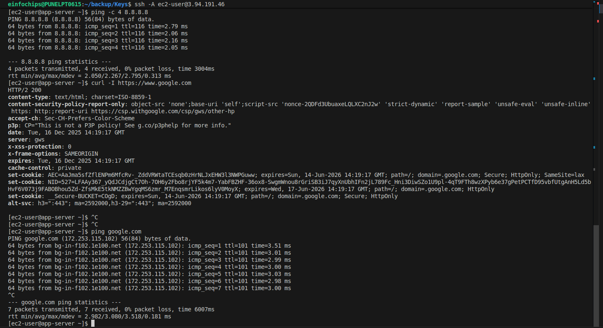

---

## Network Flow Verification

### Step 14: Verify Network Paths

**📸 Screenshot 14.1: Network Topology Diagram**

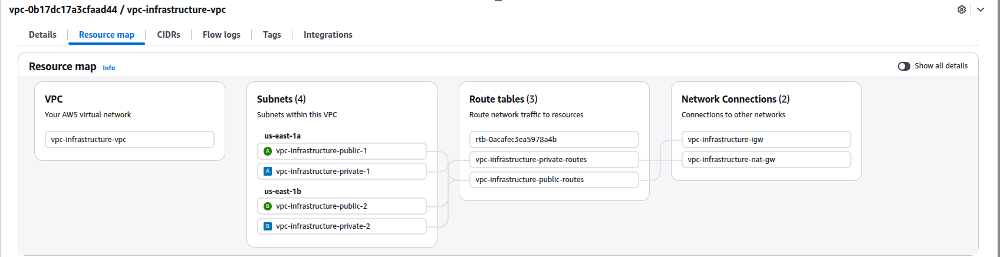

---

## Configuration Details

### Network Configuration
| Component | CIDR/Details | AZ | Purpose |
|-----------|-------------|----|---------| 
| VPC | 10.0.0.0/16 | Multi-AZ | Main network |
| Public Subnet 1 | 10.0.1.0/24 | us-east-1a | Bastion Host |
| Public Subnet 2 | 10.0.2.0/24 | us-east-1b | NAT Gateway |
| Private Subnet 1 | 10.0.3.0/24 | us-east-1a | App Server |
| Private Subnet 2 | 10.0.4.0/24 | us-east-1b | Future use |

### Security Groups
| Security Group | Port | Source | Purpose |
|---------------|------|--------|---------|
| Bastion SG | 22 | 0.0.0.0/0 | SSH access |
| Private SG | 22 | Bastion SG | SSH from bastion |
| Private SG | 80/443 | VPC CIDR | Internal web traffic |

### Instance Details
| Instance | Type | Subnet | IP | Purpose |
|----------|------|--------|----|---------| 
| Bastion Host | t3.micro | Public-1 | Dynamic | Jump server |
| App Server | t3.micro | Private-1 | 10.0.3.x | Application |

---

## Terraform Modules Structure

```
modules/
├── vpc/                 # VPC and Internet Gateway
│   ├── main.tf
│   ├── variables.tf
│   └── outputs.tf
├── subnets/            # Subnets, NAT Gateway, Route Tables
│   ├── main.tf
│   ├── variables.tf
│   └── outputs.tf
├── security/           # Security Groups
│   ├── main.tf
│   ├── variables.tf
│   └── outputs.tf
└── compute/            # EC2 Instances
    ├── main.tf
    ├── variables.tf
    └── outputs.tf
```

## Cleanup

### Step 16: Destroy Infrastructure

```bash
terraform destroy
```

**📸 Screenshot 16.1: Terraform Destroy Confirmation**

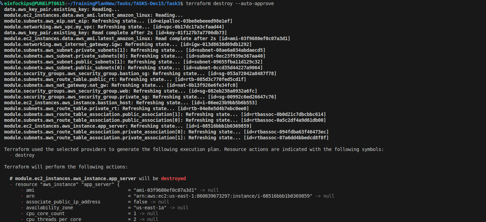

**📸 Screenshot 16.2: Resources Destroyed Successfully**

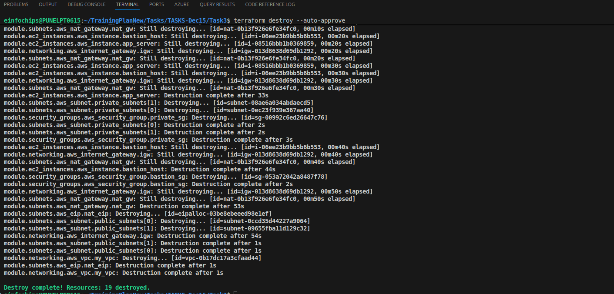
---

## Troubleshooting

### Common Issues

**Issue 1: SSH Connection Refused**
- Check security group rules
- Verify key pair permissions (chmod 400)
- Confirm correct IP addresses

**Issue 2: Private Instance No Internet**
- Verify NAT Gateway is running
- Check private route table routes to NAT Gateway
- Confirm NAT Gateway is in public subnet

**Issue 3: Terraform Apply Fails**
- Check AWS credentials
- Verify region availability
- Ensure sufficient permissions

---
