# Task 4: Production-Ready EKS Cluster with Private Nodes + Public ALB

**Purpose:** Deploy EKS cluster with private worker nodes and public Application Load Balancer

## Architecture Overview

This implementation creates a production-ready EKS cluster with the following architecture:

- **VPC**: Custom VPC (10.0.0.0/16) with DNS support
- **Public Subnets**: For ALB only (10.0.1.0/24, 10.0.2.0/24)
- **Private Subnets**: For EKS worker nodes (10.0.10.0/24, 10.0.11.0/24)
- **Pod Subnets**: For VPC CNI custom networking (10.0.50.0/24, 10.0.51.0/24)
- **NAT Gateway**: Provides internet access for private subnets
- **EKS Cluster**: Kubernetes 1.28 with private endpoint access
- **Worker Nodes**: t3.medium instances with no public IPs
- **VPC CNI Custom Networking**: Pods use separate subnets from nodes
- **ALB Ingress Controller**: Manages Application Load Balancer
- **NGINX App**: Sample application with Ingress

**📋 Detailed Architecture:** See [ARCHITECTURE.md](ARCHITECTURE.md) for complete diagram and component details

## Prerequisites

- AWS CLI configured with appropriate permissions
- Terraform >= 1.0 installed
- kubectl installed
- Existing EC2 key pair (jayimrankey)

## Implementation Steps

### Step 1: Initialize Terraform

```bash
cd /home/einfochips/TrainingPlanNew/Tasks/TASKS-Dec15/Task4
terraform init
```

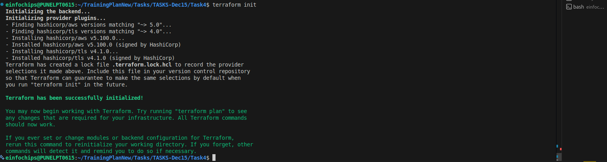

### Step 2: Review Terraform Plan

```bash
terraform plan
```


### Step 3: Deploy Infrastructure

```bash
terraform apply -auto-approve
```

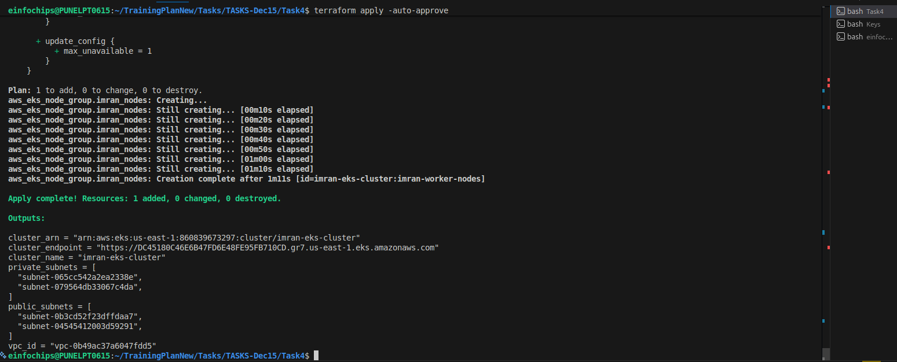

### Step 4: Verify VPC Creation

Navigate to AWS Console → VPC → Your VPCs

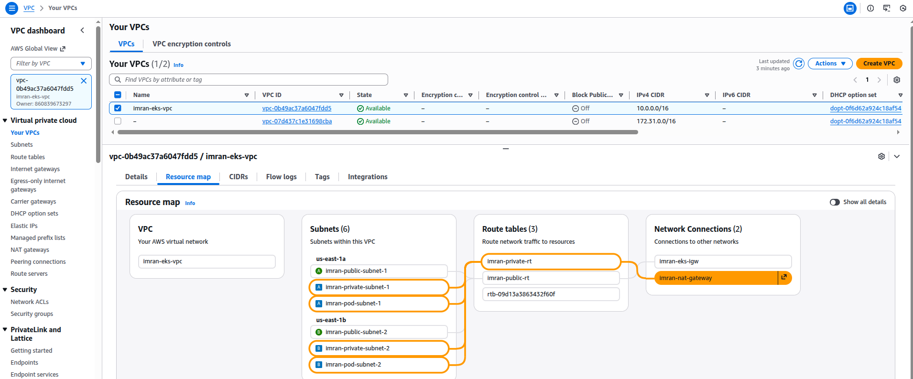

### Step 5: Verify Subnets Configuration

Check public and private subnets with proper tags

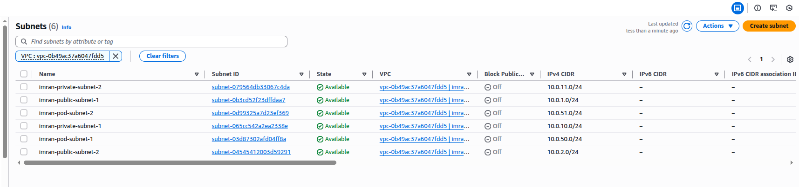

Public Subnet:
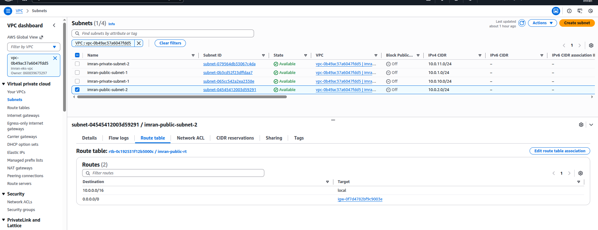

Private Subnet:
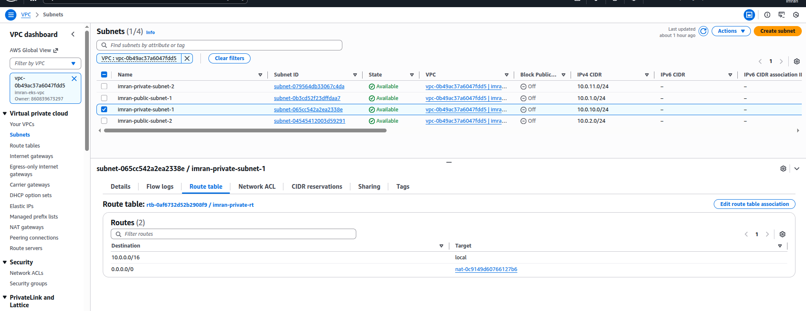

Pod Subnet:
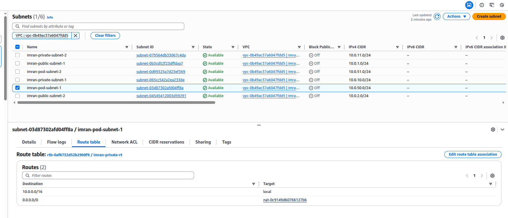

### Step 6: Verify NAT Gateway

Confirm NAT Gateway is created in public subnet

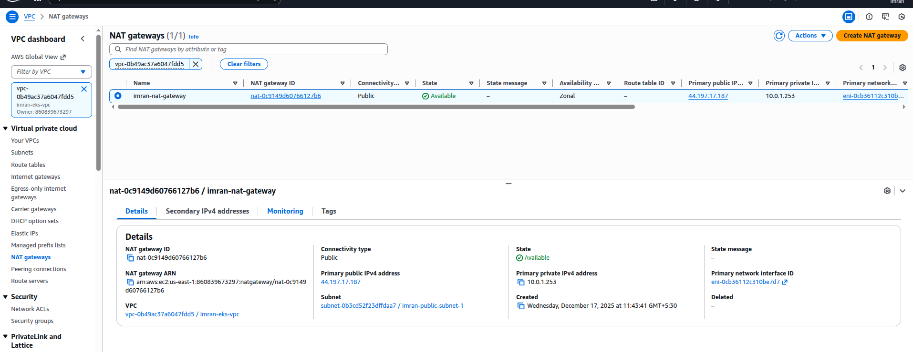

### Step 7: Verify EKS Cluster

Navigate to AWS Console → EKS → Clusters

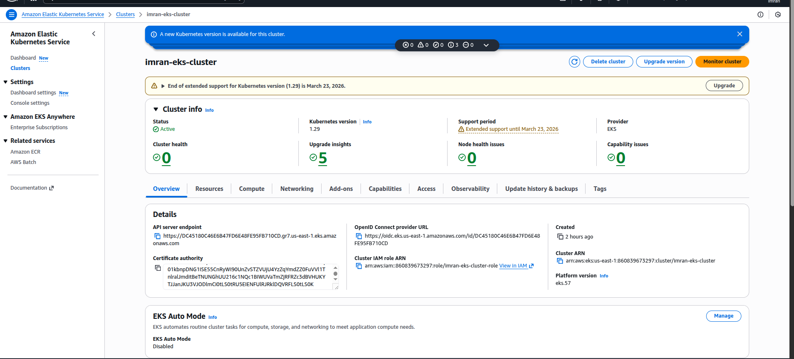

### Step 8: Verify Node Groups

Check worker nodes are in private subnets with no public IPs

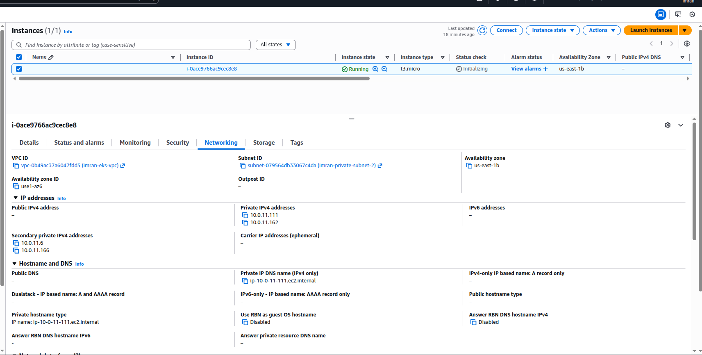

### Step 9: Configure kubectl
Update kubeconfig to connect to EKS cluster:

```bash
aws eks update-kubeconfig --region us-east-1 --name imran-eks-cluster
```

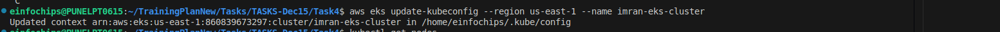

### Step 10: Verify Cluster Access

```bash
kubectl get nodes
kubectl get pods -A
```

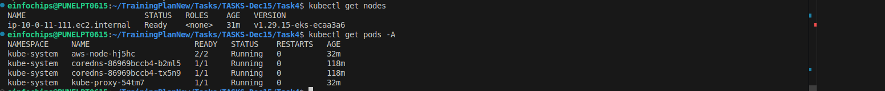

### Step 11: Create IAM Policy for ALB Controller

Download and create the official AWS Load Balancer Controller IAM policy:

```bash
# Download official IAM policy
curl -o iam_policy.json \
https://raw.githubusercontent.com/kubernetes-sigs/aws-load-balancer-controller/main/docs/install/iam_policy.json

# Create IAM policy
aws iam create-policy \
  --policy-name AWSLoadBalancerControllerIAMPolicy \
  --policy-document file://iam_policy.json
```

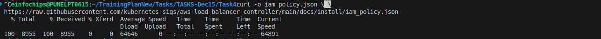

### Step 12: Create IAM Service Account

Create IAM service account with proper permissions:

```bash
# Create service account with IAM role
eksctl create iamserviceaccount \
  --cluster=imran-eks-cluster \
  --namespace=kube-system \
  --name=aws-load-balancer-controller \
  --attach-policy-arn=arn:aws:iam::860839673297:policy/AWSLoadBalancerControllerIAMPolicy \
  --approve --override-existing-serviceaccounts
```


### Step 13: Install AWS Load Balancer Controller

Install AWS Load Balancer Controller using Helm:

```bash
# Add EKS chart repo
helm repo add eks https://aws.github.io/eks-charts
helm repo update

# Install ALB controller
helm install aws-load-balancer-controller eks/aws-load-balancer-controller \
  -n kube-system \
  --set clusterName=imran-eks-cluster \
  --set serviceAccount.create=false \
  --set serviceAccount.name=aws-load-balancer-controller
```

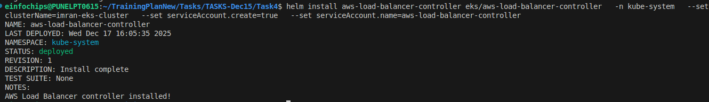

### Step 14: Verify ALB Controller

Verify ALB controller is running:

```bash
kubectl get pods -n kube-system | grep aws-load-balancer
kubectl logs -n kube-system deployment/aws-load-balancer-controller
```

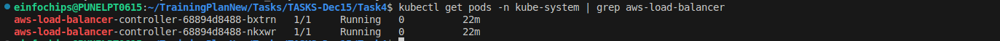

### Step 15: Deploy NGINX Application

```bash
kubectl apply -f manifests/nginx-deployment.yaml
```

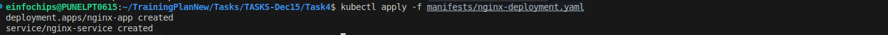

### Step 16: Deploy NGINX Ingress

```bash
kubectl apply -f manifests/nginx-ingress.yaml
```

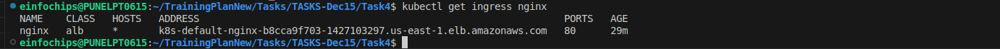

### Step 17: Verify ALB Creation

Navigate to AWS Console → EC2 → Load Balancers

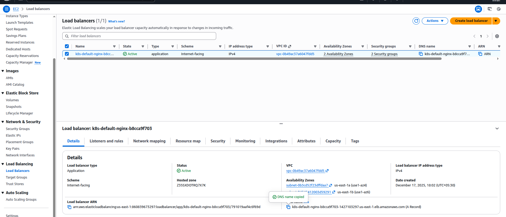

### Step 18: Get ALB DNS Name

```bash
kubectl get ingress nginx-ingress
```


### Step 19: Test Application Access

Access the application using ALB DNS name in browser

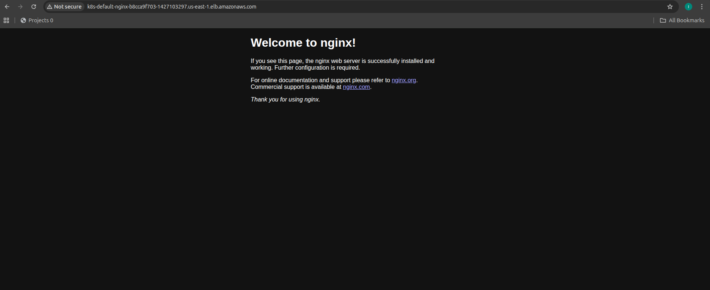

### Step 20: Verify Private Node IPs

Confirm worker nodes have only private IPs

```bash
kubectl get nodes -o wide
```

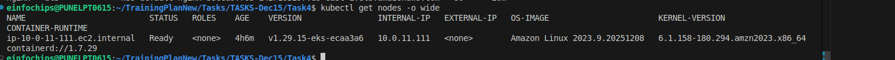

### Step 21: Verify Network Flow

Check that traffic flows: Internet → ALB → Private Nodes

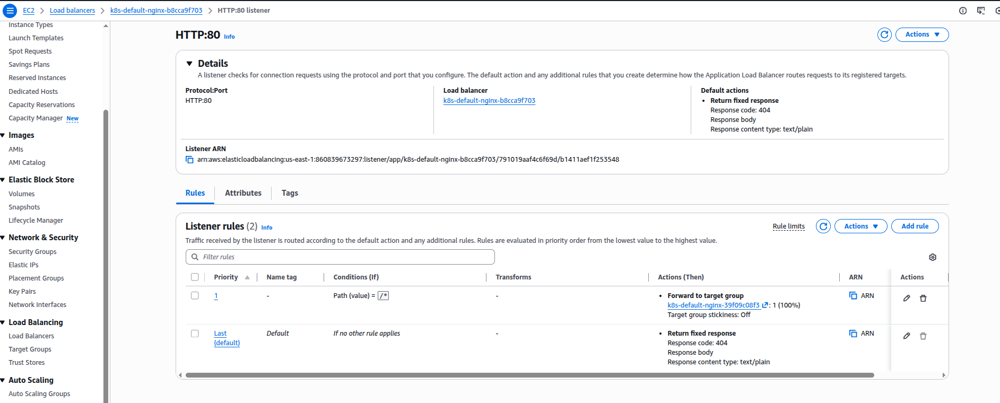

### Step 22: Test Scaling

Scale NGINX deployment to verify load balancing

```bash
kubectl scale deployment nginx-app --replicas=5
```

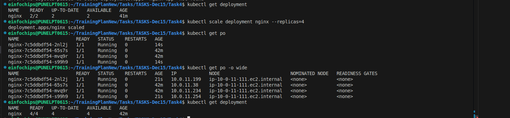

### Step 23: Verify Target Groups

Check ALB target groups in AWS Console

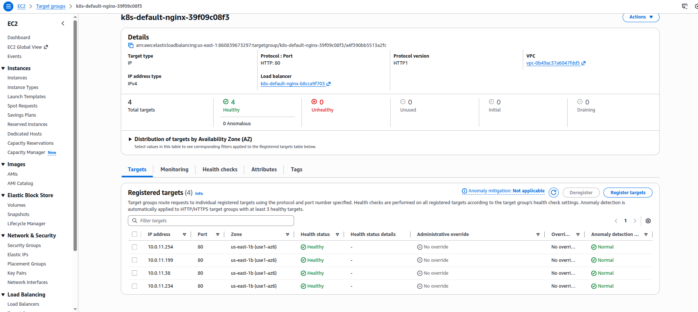

### Step 24: Security Group Verification

Verify security groups allow proper traffic flow

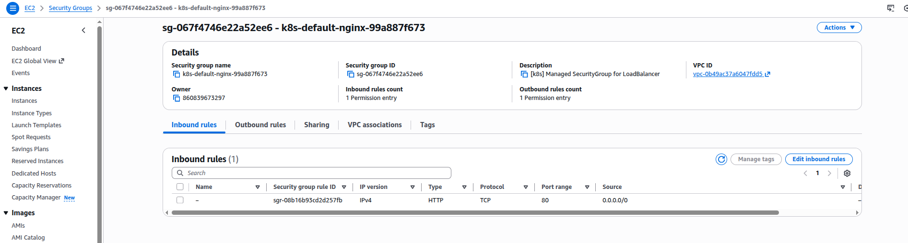

### Step 25: Enable VPC CNI Custom Networking

Configure VPC CNI to use separate subnets for pods:

```bash
# Enable custom networking
kubectl set env daemonset aws-node -n kube-system AWS_VPC_K8S_CNI_CUSTOM_NETWORK_CFG=true

# Set ENI config annotation
kubectl set env daemonset aws-node -n kube-system ENI_CONFIG_ANNOTATION_DEF=k8s.amazonaws.com/eniConfig
```


### Step 26: Create Pod Subnets

Add dedicated subnets for pod networking (already created via Terraform):

- **Pod Subnet 1**: `10.0.50.0/24` (us-east-1a)
- **Pod Subnet 2**: `10.0.51.0/24` (us-east-1b)


### Step 27: Create ENIConfig Resources

Create ENIConfig for each availability zone:

```bash
# Create ENIConfig manifest
cat > eniconfig.yaml << EOF
apiVersion: crd.k8s.amazonaws.com/v1alpha1
kind: ENIConfig
metadata:
  name: us-east-1a
spec:
  securityGroups:
    - sg-00c8ad24f8fbc68f5
  subnet: subnet-03d87302afd04ff8a
---
apiVersion: crd.k8s.amazonaws.com/v1alpha1
kind: ENIConfig
metadata:
  name: us-east-1b
spec:
  securityGroups:
    - sg-00c8ad24f8fbc68f5
  subnet: subnet-0d99325a7d23ef369
EOF

# Apply ENIConfig
kubectl apply -f eniconfig.yaml
```

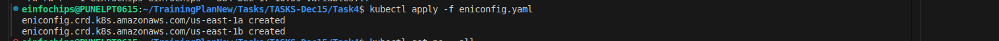

### Step 28: Annotate Nodes for Custom Networking

Annotate nodes to use ENIConfig based on their availability zone:

```bash
# Annotate nodes with ENIConfig
kubectl annotate node --all k8s.amazonaws.com/eniConfig=us-east-1b --overwrite

# Restart aws-node daemonset
kubectl rollout restart daemonset/aws-node -n kube-system
```


### Step 29: Verify Custom Networking

Confirm pods get IPs from pod subnets (10.0.50.x/10.0.51.x):

```bash
# Check pod IPs after custom networking
kubectl get pods -o wide

# Verify VPC CNI configuration
kubectl get daemonset aws-node -n kube-system -o yaml | grep -A 5 "AWS_VPC_K8S_CNI_CUSTOM_NETWORK_CFG"
```

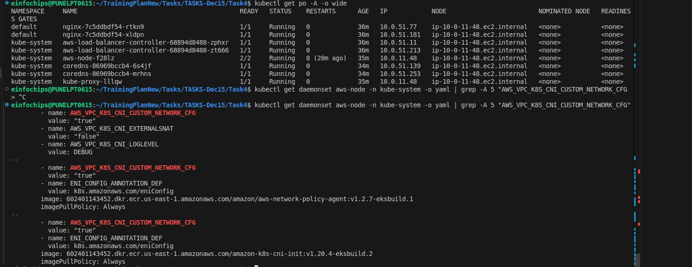


## Key Achievements

 **EKS cluster deployed in private subnets only**  
 **Public subnets dedicated for ALB**  
 **Worker nodes have no public IP addresses**  
 **ALB Ingress Controller successfully installed**  
 **NGINX application accessible only through ALB**  
 **VPC CNI custom networking enabled with separate pod subnets**  
 **Pod IPs from dedicated subnets (10.0.50.x/10.0.51.x)**  
 **Node IPs from worker subnets (10.0.10.x/10.0.11.x)**  
 **Production-ready security configuration**

## Resource Summary

| Resource Type | Count | Purpose |
|---------------|-------|---------|
| VPC | 1 | Network isolation |
| Public Subnets | 2 | ALB placement |
| Private Subnets | 2 | EKS worker nodes |
| Pod Subnets | 2 | Custom networking for pods |
| NAT Gateway | 1 | Internet access for private subnets |
| EKS Cluster | 1 | Kubernetes control plane |
| Node Group | 1 | Worker nodes (1-4 instances) |
| ALB | 1 | Application load balancer |
| ENIConfig | 2 | Custom networking configuration |
| Security Groups | 1 | Network security |


### Useful Commands:

```bash
# Check cluster status
kubectl cluster-info

# View ALB controller logs
kubectl logs -n kube-system deployment/aws-load-balancer-controller

# Check node status
kubectl describe nodes

# View ingress details
kubectl describe ingress nginx
```
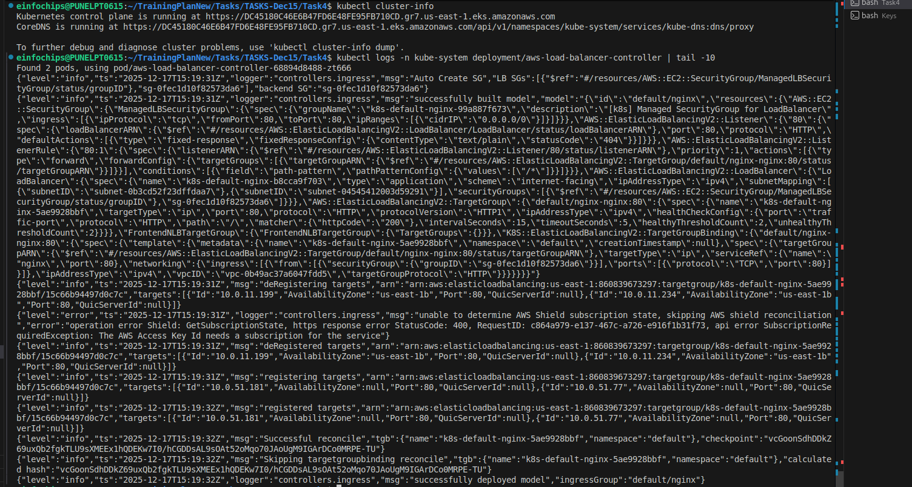

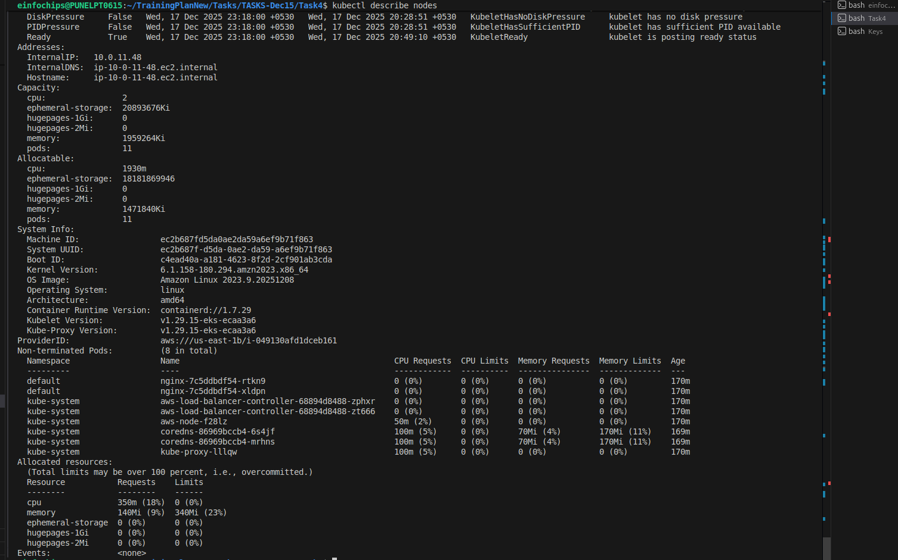


---

**Note**: This implementation demonstrates production-ready EKS deployment with proper network segmentation and security best practices. All worker nodes remain private while maintaining internet connectivity through NAT Gateway and external access through Application Load Balancer.