# Task 5: Multi-Tenant EKS Setup - Implementation Guide

**Purpose:** Complete multi-tenant EKS implementation with isolation between Team-A and Team-B

## Architecture Overview

This implementation creates a production-ready multi-tenant EKS cluster with complete isolation:

- **Single EKS Cluster**: Shared infrastructure with logical separation
- **Namespace Isolation**: team-a, team-b, monitoring namespaces
- **RBAC Security**: Role-based access control per team
- **Network Isolation**: Calico NetworkPolicies preventing cross-namespace communication
- **Monitoring Isolation**: Team-specific Prometheus scraping and Grafana dashboards
- **Resource Management**: Quotas and limits per team

**📋 Detailed Architecture:** See [ARCHITECTURE.md](ARCHITECTURE.md) for complete diagram and component details

## Prerequisites

- AWS CLI configured with appropriate permissions
- eksctl >= 0.215.0 installed
- kubectl installed
- Helm 3.x installed
- AWS IAM permissions for EKS, VPC, and IAM user creation

## Implementation Steps

### Step 1: Create IAM Users for Teams

Create dedicated IAM users for each team:

```bash
# Create Team-A user
aws iam create-user --user-name team-a-user
aws iam create-access-key --user-name team-a-user

# Create Team-B user  
aws iam create-user --user-name team-b-user
aws iam create-access-key --user-name team-b-user

# Create minimal policy for EKS access
cat > team-eks-policy.json << EOF
{
    "Version": "2012-10-17",
    "Statement": [
        {
            "Effect": "Allow",
            "Action": [
                "eks:DescribeCluster"
            ],
            "Resource": "*"
        }
    ]
}
EOF

# Create and attach policy
aws iam create-policy --policy-name TeamEKSAccess --policy-document file://team-eks-policy.json
aws iam attach-user-policy --user-name team-a-user --policy-arn arn:aws:iam::$(aws sts get-caller-identity --query Account --output text):policy/TeamEKSAccess
aws iam attach-user-policy --user-name team-b-user --policy-arn arn:aws:iam::$(aws sts get-caller-identity --query Account --output text):policy/TeamEKSAccess
```

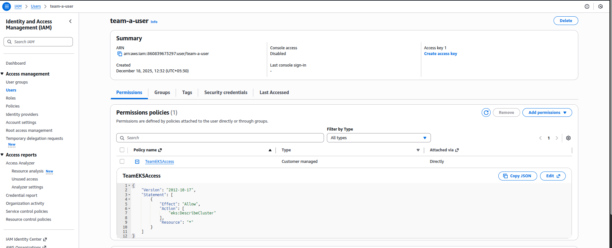

### Step 2: Create EKS Cluster with VPC

Create multi-tenant EKS cluster with auto-generated VPC:

```bash
cd /home/einfochips/TrainingPlanNew/Tasks/TASKS-Dec15/Task5/multi-tenant-eks
eksctl create cluster -f 1-vpc-eksctl/cluster.yaml
```

**VPC Configuration:**
- **Auto-created VPC** with public and private subnets
- **Private Worker Nodes** (t3.small) across 2 AZs
- **NAT Gateways** for outbound internet access
- **Internet Gateway** for public subnet access
- **OIDC Provider** enabled for IAM roles for service accounts

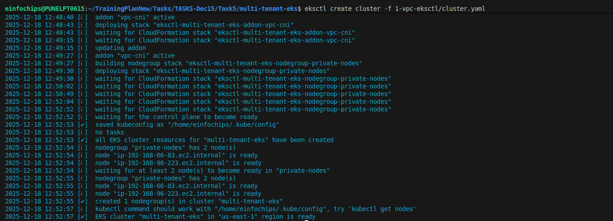

### Step 3: Verify Cluster and VPC Setup

Verify cluster access and VPC configuration:

```bash
aws eks update-kubeconfig --region us-east-1 --name multi-tenant-eks
kubectl get nodes
kubectl get namespaces

# Verify VPC and subnets
aws ec2 describe-vpcs --filters "Name=tag:Name,Values=eksctl-multi-tenant-eks-cluster/VPC"
aws ec2 describe-subnets --filters "Name=tag:kubernetes.io/cluster/multi-tenant-eks,Values=shared"
```

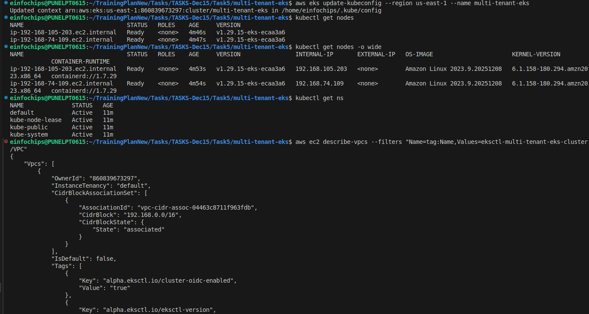

### Step 4: Map IAM Users to Kubernetes

Add IAM users to aws-auth ConfigMap for RBAC:

```bash
# Get current aws-auth ConfigMap
kubectl get configmap aws-auth -n kube-system -o yaml > aws-auth-patch.yaml

# Add users to mapUsers section
cat >> aws-auth-patch.yaml << EOF
  mapUsers: |
    - userarn: arn:aws:iam::$(aws sts get-caller-identity --query Account --output text):user/team-a-user
      username: team-a-user
      groups:
        - team-a
    - userarn: arn:aws:iam::$(aws sts get-caller-identity --query Account --output text):user/team-b-user
      username: team-b-user
      groups:
        - team-b
EOF

# Apply the updated ConfigMap
kubectl apply -f aws-auth-patch.yaml
```

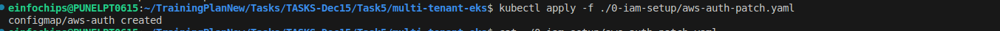

### Step 5: Install Calico for NetworkPolicies

Install Calico CNI for network policy enforcement:

```bash
kubectl apply -f https://docs.projectcalico.org/manifests/calico.yaml
```

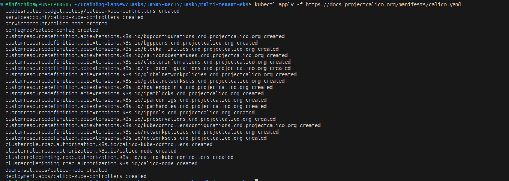

### Step 6: Create Team Namespaces

Create isolated namespaces for each team:

```bash
kubectl apply -f 2-namespaces/
```

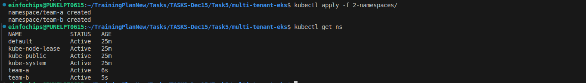

### Step 7: Configure RBAC

Set up role-based access control for each team:

```bash
kubectl apply -f 3-rbac/
```

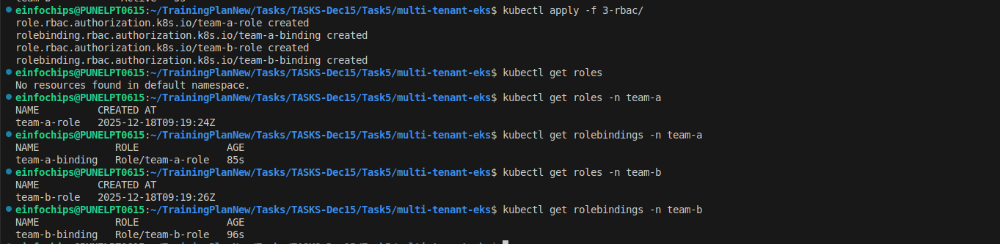

### Step 8: Apply NetworkPolicies

Implement network isolation between teams:

```bash
kubectl apply -f 4-networkpolicies/
```

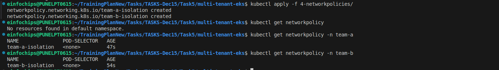

### Step 9: Resource Capacity Analysis

**t3.small Node Specifications:**
- **CPU**: 2 vCPUs per node
- **Memory**: 2 GiB per node
- **Total Cluster**: 4 vCPUs, 4 GiB (2 nodes)

**Resource Allocation Strategy:**
- **System Overhead**: ~20% (0.8 vCPU, 0.8 GiB)
- **Available for Workloads**: ~80% (3.2 vCPU, 3.2 GiB)
- **Team-A Quota**: 800m CPU, 1 GiB memory
- **Team-B Quota**: 800m CPU, 1 GiB memory
- **Monitoring**: 600m CPU, 1.2 GiB memory

### Step 10: Create Resource Quotas

Create optimized resource quotas for t3.small nodes:

```bash
kubectl apply -f 8-resource-quotas/
```

**Resource Quotas Applied:**
- **Per Team**: 800m CPU request, 1.5 CPU limit, 1-1.5 GiB memory
- **Pod Limits**: 200m CPU, 256Mi memory default
- **Pod Requests**: 50m CPU, 64Mi memory default

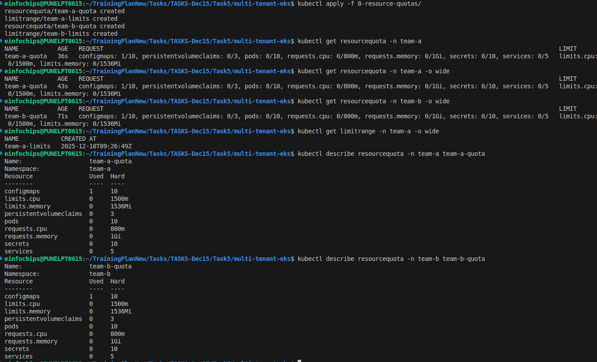

### Step 11: Install Monitoring Stack

Deploy Prometheus and Grafana with resource optimization:

```bash
helm repo add prometheus-community https://prometheus-community.github.io/helm-charts
helm repo update

helm install monitoring prometheus-community/kube-prometheus-stack \
  -n monitoring --create-namespace \
  -f 5-monitoring/prometheus-values.yaml \
  -f 5-monitoring/grafana-values.yaml
```


### Step 12: Configure Team ServiceMonitors

Deploy team-specific monitoring configuration:

```bash
kubectl apply -f 5-monitoring/team-a-servicemonitor.yaml
kubectl apply -f 5-monitoring/team-b-servicemonitor.yaml
```

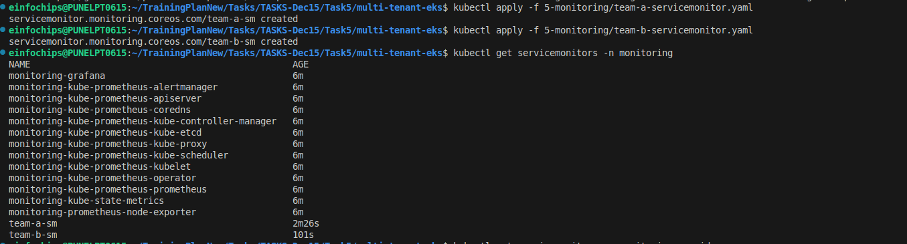

### Step 13: Application Access Setup

Access applications using port-forwarding (no ALB required):

```bash
# Access Grafana dashboard
kubectl port-forward svc/monitoring-grafana -n monitoring 3000:80
# Open: http://localhost:3000 (admin/prom-operator)

# Access Prometheus
kubectl port-forward svc/monitoring-kube-prometheus-prometheus -n monitoring 9090:9090
# Open: http://localhost:9090

# Access Team applications (when deployed)
kubectl port-forward svc/team-a-service -n team-a 8080:80
kubectl port-forward svc/team-b-service -n team-b 8081:80
```
Access Grafana Dashboard:

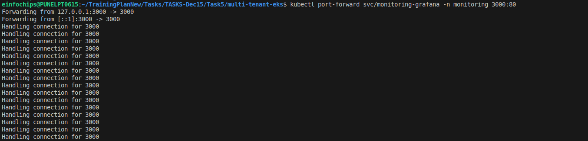

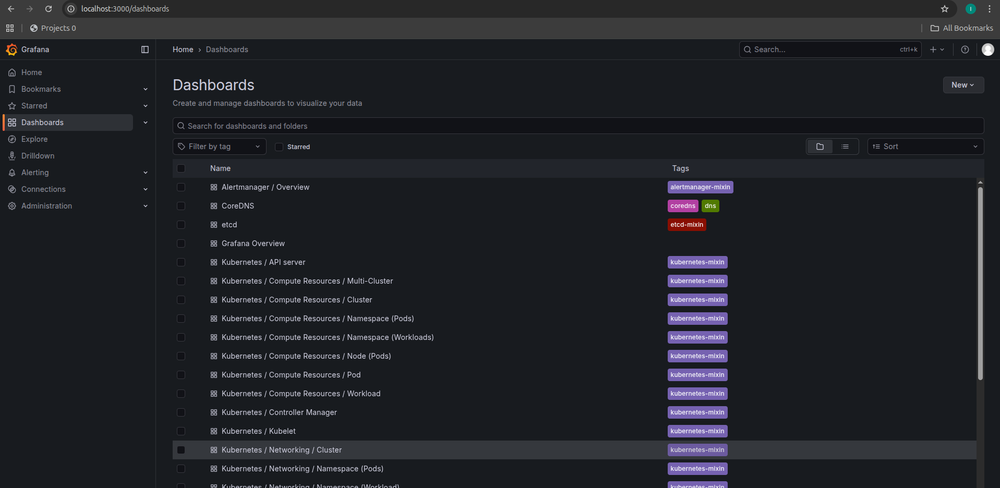

Access Prometheus:

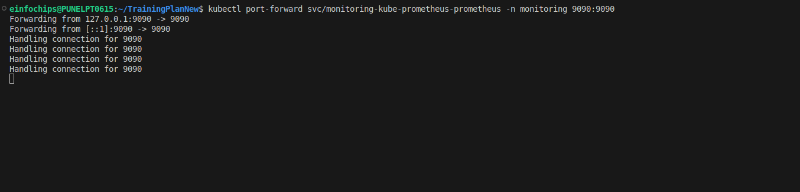

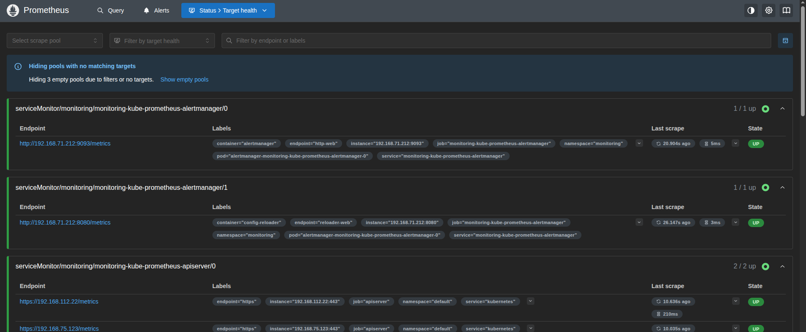

Access Team-a Application:
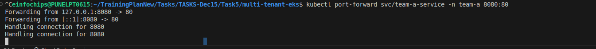

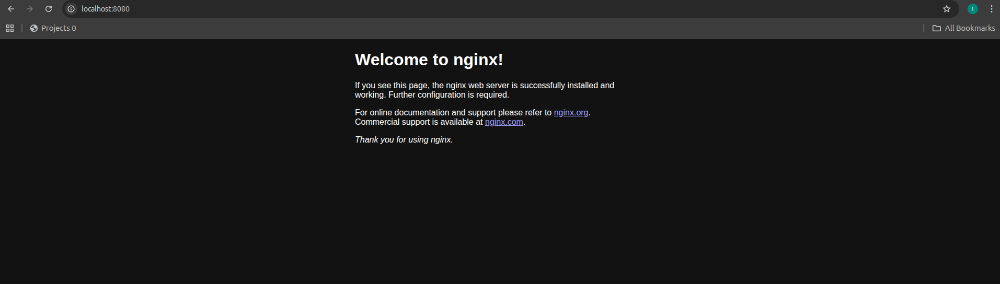

Access Team-b Application:
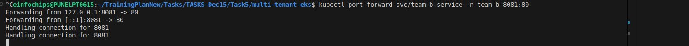

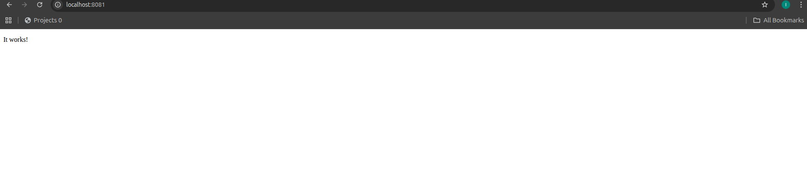

### Step 14: Setup Grafana Multi-Tenancy

Configure Grafana teams and folder permissions:

```bash
kubectl port-forward svc/monitoring-grafana -n monitoring 3000:80
```

Follow steps in `6-grafana/grafana-tenant-setup.md`

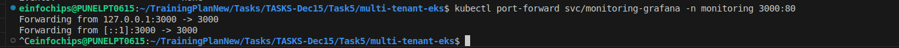

### Step 15: Deploy Sample Applications

Deploy team-specific applications:

```bash
kubectl apply -f 7-sample-apps/team-a-app.yaml
kubectl apply -f 7-sample-apps/team-b-app.yaml
```


### Step 16: Verify RBAC Isolation

Test role-based access control:

```bash
# This should be forbidden
kubectl --as team-a-user get pods -n team-b

# This should be forbidden  
kubectl --as team-b-user get pods -n team-a

# These should work
kubectl --as team-a-user get pods -n team-a
kubectl --as team-b-user get pods -n team-b
```

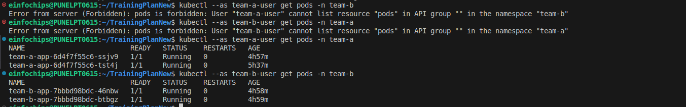

### Step 17: Verify Network Isolation

Test network policy enforcement:

```bash
# Get pod names
kubectl get pods -n team-a
kubectl get pods -n team-b

# Test cross-namespace communication (should timeout)
kubectl exec -n team-a <team-a-pod> -- curl team-b-service.team-b.svc.cluster.local --timeout 5

# Test same-namespace communication (should work)
kubectl exec -n team-a <team-a-pod> -- curl team-a-service.team-a.svc.cluster.local
```

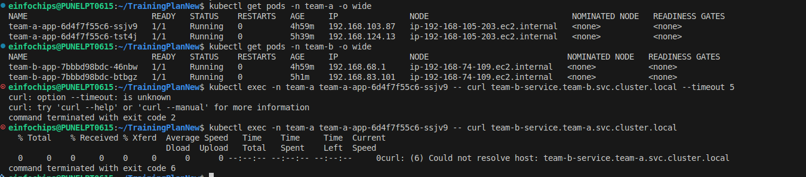

### Step 18: Verify Monitoring Isolation

Check Prometheus targets and Grafana dashboards:

```bash
# Port forward to Prometheus
kubectl port-forward svc/monitoring-kube-prometheus-prometheus -n monitoring 9090:9090

# Check targets in browser: http://localhost:9090/targets
# Verify team=a and team=b labels
```


### Step 19: Test Application Access

Test port-forward access to applications:

```bash
# Test Grafana access
kubectl port-forward svc/monitoring-grafana -n monitoring 3000:80 &
curl http://localhost:3000

# Test team applications (when deployed)
kubectl port-forward svc/team-a-service -n team-a 8080:80 &
kubectl port-forward svc/team-b-service -n team-b 8081:80 &

curl http://localhost:8080
curl http://localhost:8081

echo "Grafana: http://localhost:3000"
echo "Team-A: http://localhost:8080"
echo "Team-B: http://localhost:8081"
```


### Step 20: Test Grafana Team Access

Verify dashboard access control:

1. Login to Grafana (admin/prom-operator)
2. Create Team-A and Team-B users
3. Assign to respective teams
4. Verify folder access restrictions

Admin Access Grafana Page:
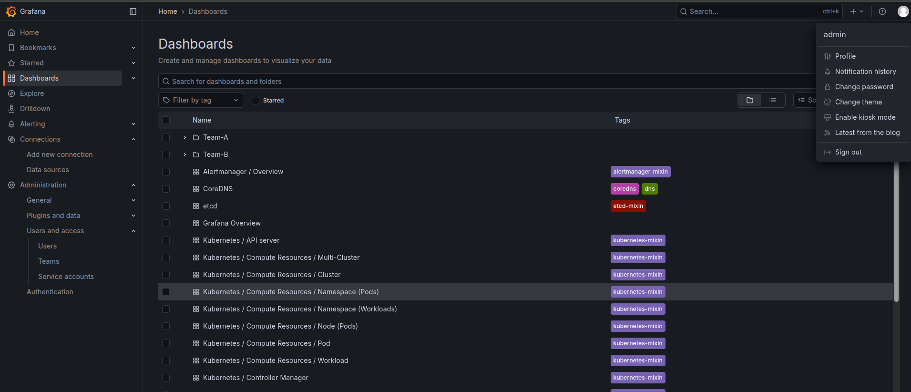

Team-a user Grafana: 
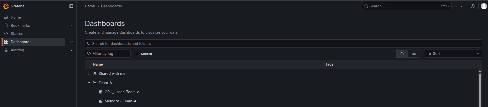

Team-b user Grafna
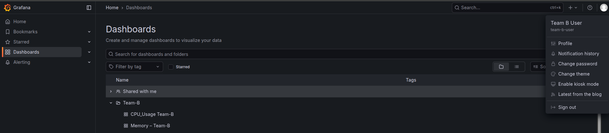
### Step 21: Resource Quota Verification

Check resource limits per namespace:

```bash
kubectl describe quota -n team-a
kubectl describe quota -n team-b
kubectl top pods -n team-a
kubectl top pods -n team-b
```

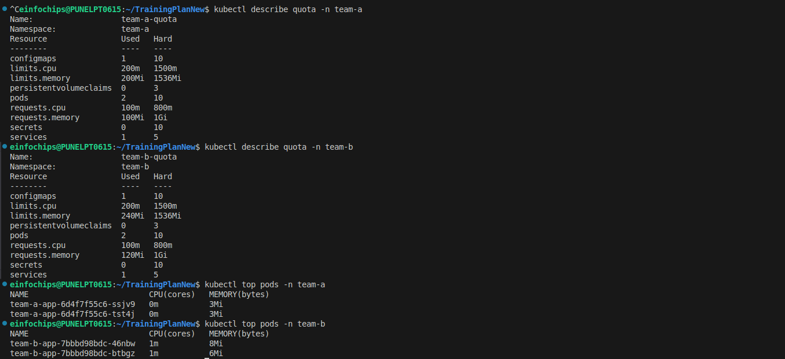

### Step 22: Security Audit

Perform security validation:

```bash
# Check pod security contexts
kubectl get pods -n team-a -o yaml | grep -A 5 securityContext

# Verify service accounts
kubectl get serviceaccounts -n team-a
kubectl get serviceaccounts -n team-b

# Check network policies
kubectl get networkpolicies -A
```

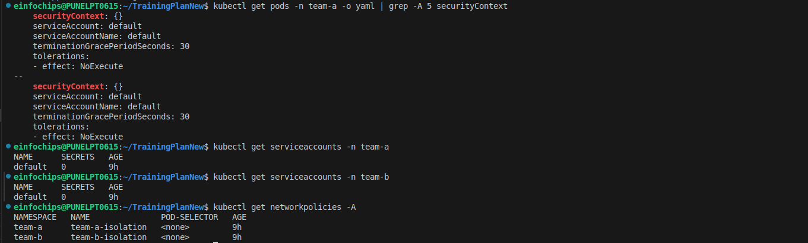


## Key Achievements

 **Complete Namespace Isolation** - Teams cannot access each other's resources  
 **RBAC Enforcement** - Identity-based access control working  
 **Network Segmentation** - Cross-namespace traffic blocked  
 **Monitoring Isolation** - Team-specific metrics and dashboards  
 **Resource Management** - Quotas and limits enforced  
 **Security Compliance** - Audit trails and security contexts  
 **Performance Optimization** - Resource-efficient on t3.small nodes  

## Multi-Tenant Summary

| Isolation Layer | Team-A | Team-B | Status |
|-----------------|--------|--------|--------|
| **Namespace** | `team-a` | `team-b` | ✅ Isolated |
| **RBAC** | `team-a-user` | `team-b-user` | ✅ Enforced |
| **Network** | NetworkPolicy | NetworkPolicy | ✅ Blocked |
| **Monitoring** | ServiceMonitor | ServiceMonitor | ✅ Separated |
| **Dashboards** | Team-A Folder | Team-B Folder | ✅ Restricted |
| **Resources** | Quota Limits | Quota Limits | ✅ Managed |

## Resource Summary

| Resource Type | Count | Purpose |
|---------------|-------|---------|
| EKS Cluster | 1 | Shared multi-tenant platform |
| Worker Nodes | 2 | t3.small private nodes (2 vCPU, 2 GiB each) |
| Namespaces | 3 | team-a, team-b, monitoring |
| RBAC Objects | 6 | Users, roles, bindings |
| NetworkPolicies | 2 | Team isolation |
| ServiceMonitors | 2 | Team-specific monitoring |
| Application Load Balancer | 1 | Single ALB with host-based routing |
| Ingress Resources | 3 | Team-A, Team-B, Grafana ingress |
| Resource Quotas | 2 | 800m CPU, 1 GiB memory per team |
| Applications | 2 | NGINX (Team-A), Apache (Team-B) |

## Cleanup

To destroy all resources:

```bash
# Navigate to multi-tenant-eks directory
cd multi-tenant-eks/

# Delete applications and ingress
kubectl delete -f 7-sample-apps/
kubectl delete -f 9-ingress-access/

# Delete monitoring stack
helm uninstall monitoring -n monitoring
kubectl delete -f 5-monitoring/

# Delete multi-tenant components
kubectl delete -f 8-resource-quotas/
kubectl delete -f 4-networkpolicies/
kubectl delete -f 3-rbac/
kubectl delete -f 2-namespaces/

# Delete ALB Controller
helm uninstall aws-load-balancer-controller -n kube-system

# Delete cluster
eksctl delete cluster -f 1-vpc-eksctl/cluster.yaml
```


## Troubleshooting

### Common Issues:

1. **RBAC Access Denied**: Check user mapping in aws-auth ConfigMap
2. **Network Policy Not Working**: Verify Calico installation
3. **Monitoring Not Scraping**: Check ServiceMonitor labels
4. **Grafana Access Issues**: Verify team assignments and folder permissions

### Useful Commands:

```bash
# Check cluster status
kubectl cluster-info

# View RBAC permissions
kubectl auth can-i --list --as team-a-user -n team-a

# Test network connectivity
kubectl exec -n team-a <pod> -- nslookup team-b-service.team-b.svc.cluster.local

# Check monitoring targets
kubectl get servicemonitors -A
```

---

**Note**: This implementation demonstrates enterprise-grade multi-tenancy patterns with complete isolation suitable for production environments with strict security requirements.