# Task 6: AI-Powered AWS Inventory Automation System - Complete Documentation

**Created by:** Imran Shaikh  
**Date:** December 2024  
**Purpose:** Production-grade serverless AWS inventory system with AI-powered FinOps analysis

---

## Overview

This system automatically discovers, tracks, and analyzes AWS infrastructure resources using:
- **Lambda Functions** for serverless execution
- **DynamoDB** for persistent storage
- **EventBridge** for scheduled automation
- **Amazon Bedrock** for AI-powered analysis
- **SNS** for email notifications

---

## Architecture

```
EventBridge (Daily 2 AM) → Lambda Collector → DynamoDB → Lambda Analyzer → Bedrock AI → SNS Email
```

---
## Architecture Overview

```
┌─────────────────────────────────────────────────────────────┐
│              EventBridge Rule (Daily 2 AM UTC)               │
└──────────────────────┬──────────────────────────────────────┘
                       │
                       ▼
┌─────────────────────────────────────────────────────────────┐
│         Lambda: inventory-collector (Python 3.12)            │
│  • Scans: EC2, RDS, S3, Lambda, EKS                         │
│  • Timeout: 5 minutes                                        │
│  • Memory: 512 MB                                            │
└──────────────────────┬──────────────────────────────────────┘
                       │
                       ▼
┌─────────────────────────────────────────────────────────────┐
│         DynamoDB: aws-inventory (PAY_PER_REQUEST)            │
│  • Hash Key: resource_id                                     │
│  • Range Key: timestamp                                      │
│  • GSI: scan_date                                            │
└──────────────────────┬──────────────────────────────────────┘
                       │
                       ▼
┌─────────────────────────────────────────────────────────────┐
│         Lambda: inventory-analyzer (Python 3.12)             │
│  • AI Analysis with Bedrock (Claude 3 Sonnet)               │
│  • Timeout: 1 minute                                         │
│  • Memory: 256 MB                                            │
└──────────────────────┬──────────────────────────────────────┘
                       │
                       ▼
┌─────────────────────────────────────────────────────────────┐
│              SNS Topic: inventory-alerts                     │
│  • Email notifications                                       │
│  • Critical issue alerts                                     │
└─────────────────────────────────────────────────────────────┘
```

## Implementation Steps

### Step 1: Configure Email for Alerts

Edit the email address in `terraform/variables.tf`:

```bash
cd /home/einfochips/TrainingPlanNew/Tasks/TASKS-Dec15/Task6
vim terraform/variables.tf
```

Change the default email:
```hcl
variable "alert_email" {
  default = "imradev29@gmail.com"  # Your email here
}
```

### Step 2: Package Lambda Functions

Package both Lambda functions:

```bash
# Package Collector
cd lambda/collector
zip -r collector.zip lambda_function.py
mv collector.zip ../../terraform/

# Package Analyzer
cd ../analyzer
zip -r analyzer.zip lambda_function.py
mv analyzer.zip ../../terraform/
cd ../..
```


### Step 3: Initialize Terraform

Initialize Terraform with required providers:

```bash
cd terraform
terraform init
```

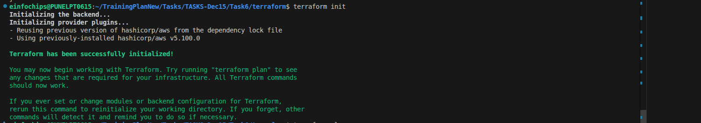

### Step 4: Review Terraform Plan

Review the infrastructure to be created:

```bash
terraform plan
```

**Resources to be created:**
- 1 DynamoDB table
- 2 Lambda functions
- 2 IAM roles with policies
- 2 EventBridge rules
- 1 SNS topic with subscription

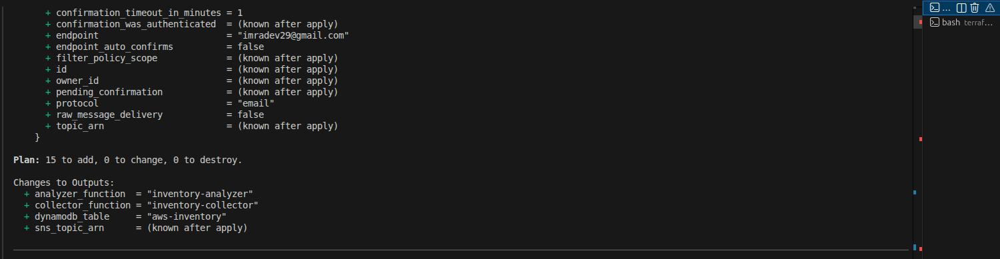

### Step 5: Deploy Infrastructure

Deploy all resources:

```bash
terraform apply
```

Type `yes` when prompted.

**Expected Output:**
```
Apply complete! Resources: 15 added, 0 changed, 0 destroyed.

Outputs:
analyzer_function = "inventory-analyzer"
collector_function = "inventory-collector"
dynamodb_table = "aws-inventory"
sns_topic_arn = "arn:aws:sns:us-east-1:860839673297:inventory-alerts"
```

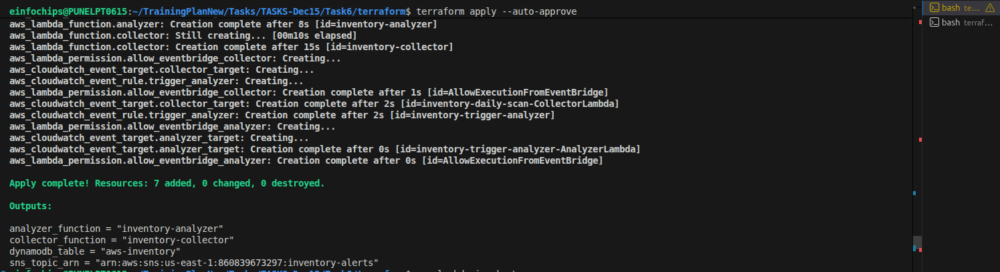

### Step 6: Confirm SNS Email Subscription

1. Check your email inbox (imradev29@gmail.com)
2. Look for "AWS Notification - Subscription Confirmation"
3. Click "Confirm subscription" link

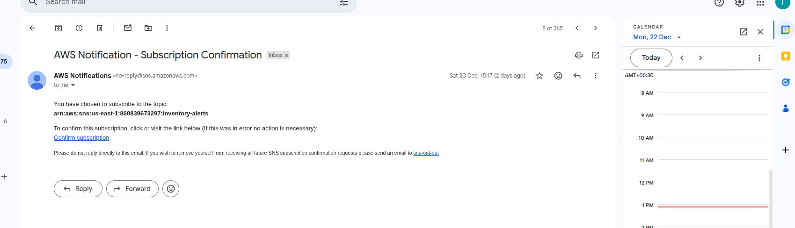

**Verify in AWS Console:**
- Navigate to: SNS → Topics → inventory-alerts
- Check subscription status: **Confirmed**

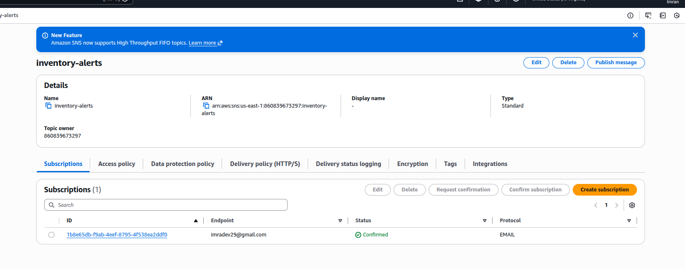

### Step 6: Enable Amazon Bedrock Access

**IMPORTANT:** Enable Bedrock model access for AI-powered analysis.

**AWS Console Steps:**
1. Navigate to: AWS Console → Amazon Bedrock
2. In the left sidebar, click **"Model access"** (under Foundation models)
3. Click **"Enable specific models"** or **"Manage model access"** button
4. Scroll down to find **"Anthropic"** section
5. Find **"Claude 3 Sonnet"** model
6. Check the box next to **"Claude 3 Sonnet"**
7. Click **"Request model access"** or **"Save changes"** button
8. Wait for approval (usually instant - status changes to "Access granted")
9. Optionally, test in **"Chat"** or **"Text playground"** to verify access

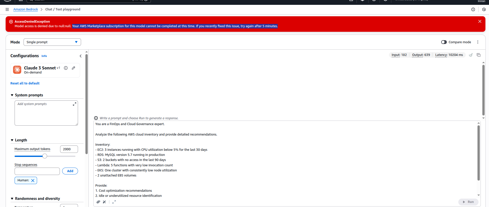

**Alternative: Test Bedrock Access**
- Go to Bedrock → **"Chat"** or **"Text playground"**
- Select **"Claude 3 Sonnet"** from model dropdown
- Type a test message to verify model is accessible


**Note:** Without Bedrock access, the analyzer will use fallback rule-based analysis.

### Step 7: Verify Lambda Functions

Check Lambda functions in AWS Console:
- Navigate to: Lambda → Functions
- Verify both functions exist:
  - `inventory-collector` (Python 3.12, 512 MB, 5 min timeout)
  - `inventory-analyzer` (Python 3.12, 256 MB, 1 min timeout)

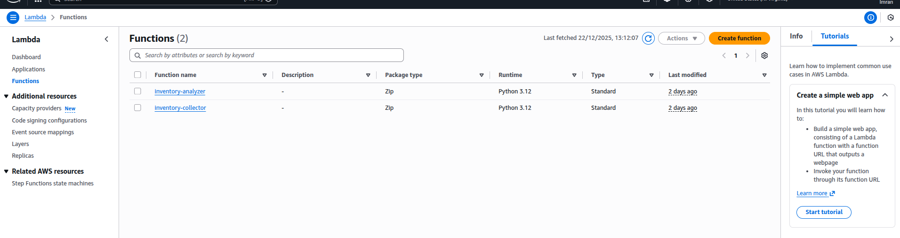

**Collector Function Details:**

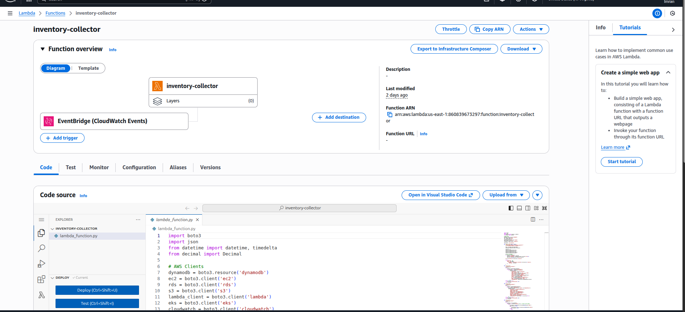

**Analyzer Function Details:**

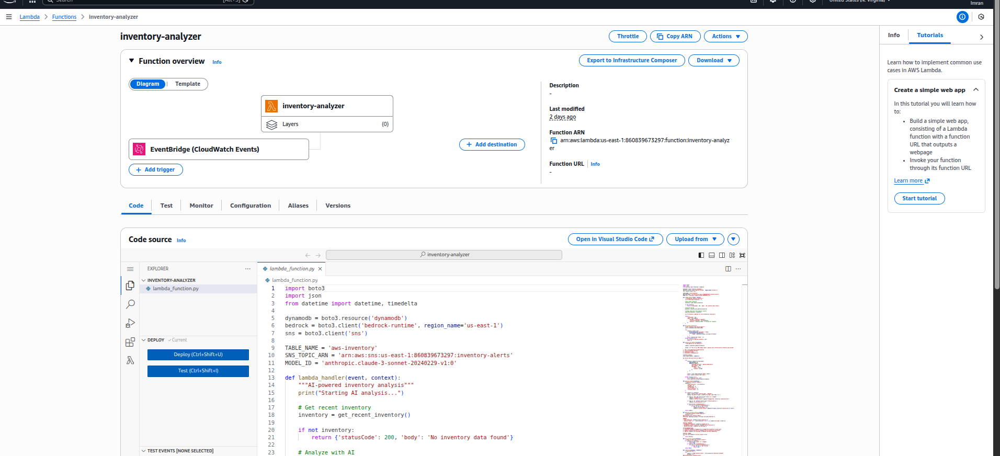

### Step 8: Verify DynamoDB Table

Check DynamoDB table:
- Navigate to: DynamoDB → Tables → aws-inventory
- Verify table configuration:
  - Hash key: `resource_id`
  - Range key: `timestamp`
  - Billing mode: PAY_PER_REQUEST

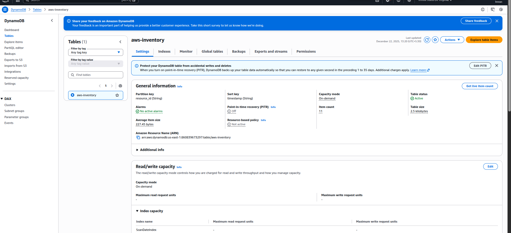


### Step 9: Verify EventBridge Rules

Check scheduled rules:
- Navigate to: EventBridge → Rules
- Verify rule: `inventory-daily-scan`
- Schedule: `cron(0 2 * * ? *)` (Daily at 2 AM UTC)
- Target: inventory-collector Lambda

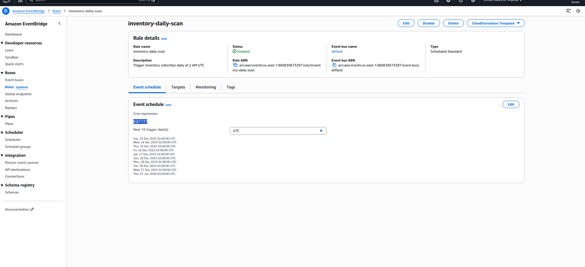


### Step 10: Verify IAM Roles

Check IAM roles created:
- Navigate to: IAM → Roles
- Verify 2 roles exist:
  - `inventory-collector-role`
  - `inventory-analyzer-role`

**Collector Role:**

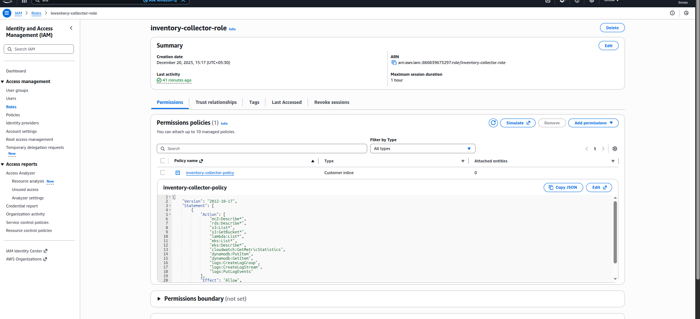

**Analyzer Role:**

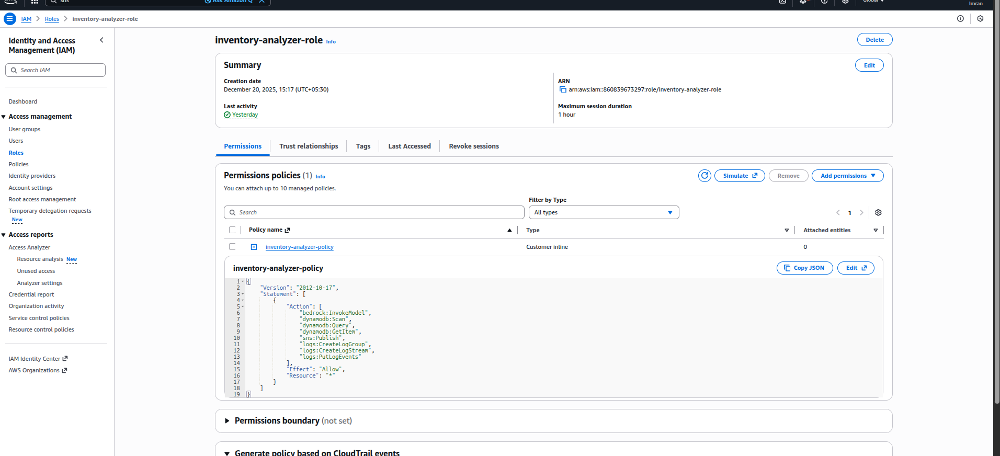

### Step 11: Test Collector Lambda

Manually invoke the collector:

```bash
cd /home/einfochips/TrainingPlanNew/Tasks/TASKS-Dec15/Task6
aws lambda invoke \
  --function-name inventory-collector \
  --payload '{}' \
  response.json

cat response.json
```

**Expected Response:**
```json
{
  "statusCode": 200,
  "body": "{\"message\": \"Successfully collected 2 resources\", \"timestamp\": \"2025-12-20T10:10:00\"}"
}
```

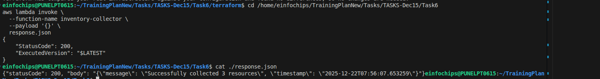

### Step 12: Verify Data in DynamoDB

Check that resources were stored:

```bash
aws dynamodb scan \
  --table-name aws-inventory \
  --max-items 5
```

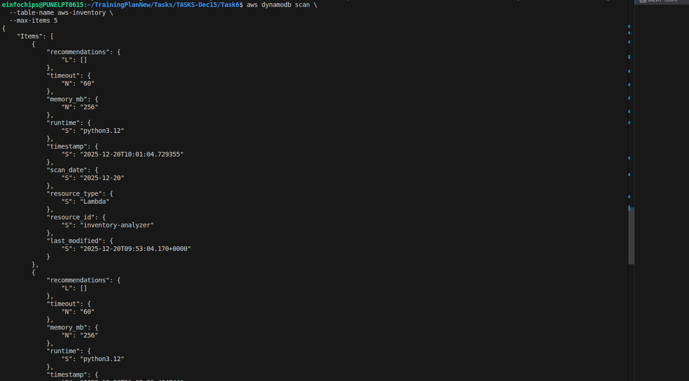

**AWS Console View:**


### Step 13: Test Analyzer Lambda

Manually invoke the analyzer:

```bash
aws lambda invoke \
  --function-name inventory-analyzer \
  --payload '{}' \
  response.json

cat response.json
```

**Expected Response:**
```json
{
  "statusCode": 200,
  "body": "{\"message\": \"Analysis complete\", \"resources_analyzed\": 2}"
}
```

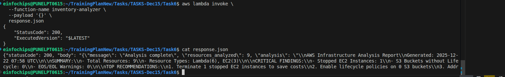

### Step 14: Check Email Alert

Within 1-2 minutes, check your email for the analysis report.

**Subject:** AWS Inventory Alert - 2 Resources Scanned

**Body:**
```
AWS Infrastructure Inventory Alert


AWS Infrastructure Analysis Report
Generated: 2025-12-22 07:58 UTC

SUMMARY:
- Total Resources: 9
- Resource Types: Lambda(6), EC2(3)

CRITICAL FINDINGS:
- Stopped EC2 Instances: 1
- S3 Buckets without Lifecycle: 0
- EOS/EOL Warnings: 0

TOP RECOMMENDATIONS:
1. Terminate 1 stopped EC2 instances to save costs
2. Enable lifecycle policies on 0 S3 buckets
3. Address 0 EOS/EOL warnings immediately

CRITICAL ISSUES:
Stopped EC2: i-03984cd644eaca06d


View full details in DynamoDB table: aws-inventory
Scan Date: 2025-12-22 07:58 UTC
```

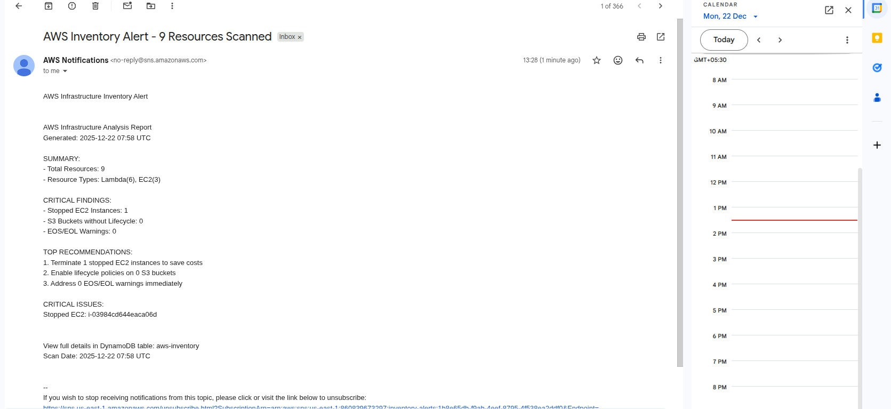

### Step 15: View CloudWatch Logs

Check execution logs:

**Collector Logs:**
```bash
aws logs tail /aws/lambda/inventory-collector --since 1h
```

**Analyzer Logs:**
```bash
aws logs tail /aws/lambda/inventory-analyzer --since 1h
```

**AWS Console:**
- Navigate to: CloudWatch → Log groups
- View logs:
  - `/aws/lambda/inventory-collector`
  - `/aws/lambda/inventory-analyzer`

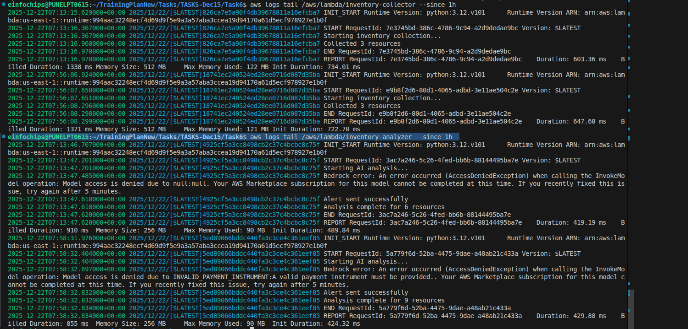

### Step 16: Monitor CloudWatch Metrics

View Lambda invocation metrics:

```bash
aws cloudwatch get-metric-statistics \
  --namespace AWS/Lambda \
  --metric-name Invocations \
  --dimensions Name=FunctionName,Value=inventory-collector \
  --start-time 2025-12-20T00:00:00Z \
  --end-time 2025-12-20T23:59:59Z \
  --period 3600 \
  --statistics Sum
```

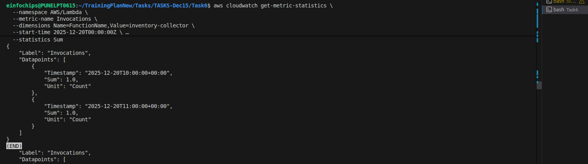

---

## Key Components

### 1. Lambda Collector Function

**Purpose:** Scans AWS resources and stores in DynamoDB

**Resources Scanned:**
- EC2 Instances
- RDS Databases
- S3 Buckets
- Lambda Functions
- EKS Clusters

**Execution:** Triggered daily at 2 AM UTC by EventBridge

### 2. Lambda Analyzer Function

**Purpose:** Analyzes inventory with AI and sends alerts

**Features:**
- Amazon Bedrock integration (Claude 3 Sonnet)
- FinOps analysis
- EOS/EOL tracking
- Email notifications via SNS

**Execution:** Triggered after collector completes

### 3. DynamoDB Table

**Purpose:** Persistent storage for inventory data

**Schema:**
- Hash Key: `resource_id`
- Range Key: `timestamp`
- GSI: `scan_date`

### 4. EventBridge Rules

**Purpose:** Automated scheduling

**Rules:**
- `inventory-daily-scan`: Triggers collector daily
- `inventory-trigger-analyzer`: Triggers analyzer after collector

### 5. SNS Topic

**Purpose:** Email notifications

**Configuration:**
- Topic: `inventory-alerts`
- Protocol: Email
- Endpoint: imradev29@gmail.com

---

## FinOps Scenarios Covered

### 1. Idle Resource Detection
- Stopped EC2 instances
- Unused EBS volumes
- Old snapshots

### 2. Cost Optimization
- S3 lifecycle policies
- Right-sizing recommendations
- Reserved Instance opportunities

### 3. EOS/EOL Tracking
- AMI deprecation warnings
- RDS engine version EOL
- Lambda runtime deprecation
- Kubernetes version EOL

### 4. Compliance
- Missing tags
- Backup retention
- Versioning status
- Multi-AZ configuration

---

## AI-Powered Analysis

### Amazon Bedrock Integration

**Model:** Claude 3 Sonnet (anthropic.claude-3-sonnet-20240229-v1:0)

**Analysis Capabilities:**
- Cost optimization opportunities
- Security recommendations
- Compliance validation
- Predictive insights

**Fallback:** Rule-based analysis if Bedrock unavailable

---

## Scheduled Execution

### Daily Automation

**Schedule:** Every day at 2:00 AM UTC

**Flow:**
1. EventBridge triggers collector Lambda
2. Collector scans AWS resources
3. Data stored in DynamoDB
4. Analyzer Lambda triggered
5. Bedrock analyzes inventory
6. Email sent via SNS

**Manage Schedule:**
```bash
# Disable
aws events disable-rule --name inventory-daily-scan

# Enable
aws events enable-rule --name inventory-daily-scan

# View status
aws events describe-rule --name inventory-daily-scan
```

---

## Cost Breakdown

| Service | Usage | Monthly Cost |
|---------|-------|--------------|
| Lambda (Collector) | 30 invocations × 5 min | $2-3 |
| Lambda (Analyzer) | 30 invocations × 1 min | $1 |
| DynamoDB | 1000 items | $5-8 |
| EventBridge | 30 rules | $0 (free) |
| SNS | 30 emails | $0 (free) |
| CloudWatch Logs | 1 GB | $0.50 |
| **Total** | | **$8-13/month** |

---

## Troubleshooting

### No Email Received

**Check subscription:**
```bash
aws sns list-subscriptions-by-topic \
  --topic-arn arn:aws:sns:us-east-1:860839673297:inventory-alerts
```

**Resend confirmation:**
```bash
aws sns subscribe \
  --topic-arn arn:aws:sns:us-east-1:860839673297:inventory-alerts \
  --protocol email \
  --notification-endpoint your-email@example.com
```

### Lambda Timeout

**Increase timeout:**
```bash
aws lambda update-function-configuration \
  --function-name inventory-collector \
  --timeout 600
```

### Bedrock Access Denied

1. Go to AWS Console → Bedrock
2. Click "Model access"
3. Request access to "Claude 3 Sonnet"
4. Wait for approval (instant)

---

## Cleanup

### Remove All Resources

```bash
cd terraform
terraform destroy -auto-approve
```

This will delete:
- 2 Lambda functions
- 1 DynamoDB table
- 2 IAM roles
- 2 EventBridge rules
- 1 SNS topic

---

## Key Achievements

 **Automated Discovery** - Daily scans of AWS infrastructure  
 **AI-Powered Analysis** - Bedrock integration for intelligent insights  
 **FinOps Intelligence** - Cost optimization recommendations  
 **EOS/EOL Tracking** - Proactive compliance management  
 **Email Alerts** - Automated notifications  
 **Serverless Architecture** - No infrastructure to manage  
 **Cost Effective** - $8-13/month operational cost  

---

## Summary

| Component | Count | Purpose |
|-----------|-------|---------|
| Lambda Functions | 2 | Collector + Analyzer |
| DynamoDB Tables | 1 | Inventory storage |
| IAM Roles | 2 | Lambda execution roles |
| EventBridge Rules | 2 | Scheduled automation |
| SNS Topics | 1 | Email notifications |
| CloudWatch Log Groups | 2 | Execution logs |

---

**Deployment Status:** ✅ Production Ready  
**Maintenance:** Minimal - Fully Serverless  
**Scalability:** Handles 1000+ resources  
**AI Integration:** Amazon Bedrock (Claude 3 Sonnet)
